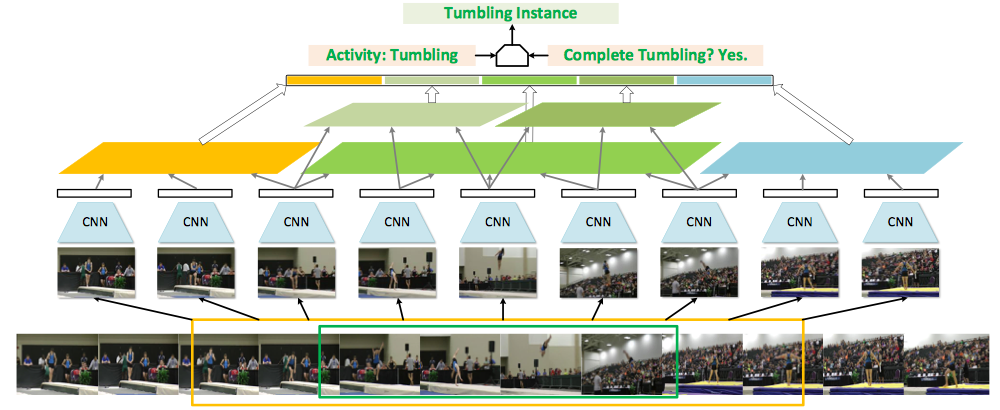

SSN(Structured Segment Network)是一种在非裁剪视频中检测行为的框架，它：

- 通过结构时间金字塔(Structured Temporal Pyramid)来对每个行为实例的时间结构建模；
- 在此之上又引入一个分解判别(Decomposed Discriminative)模型，由两个分别分类行为和确定完整度的分类器组成，这样就能同时实现精确的识别和定位，这些组件都集成到一个能高效端到端训练的统一网络中；
- 另外，还配备了一个简单而有效的时间行为提议(Temporal Action Proposal)方案，并配有时间行为聚合(Temporal Actionness Grouping, TAG)。

##### 模型概览

模型框架如下图所示：

它输入一个视频和一系列事件行为提议，输出一系列带分类标记和时间范围（由开始点和结束点限定）的行为实例。从输入到输出采取了三个关键步骤：

1. 首先，框架依赖于一个提议方法来产生一系列不同时长的时间提议，每个提议都有一个开始和结束时间，框架将每个提议视为三个连续阶段，开始、过程、结束，的组合；

2. 然后，在每个提议上，通过：

   - 将提议分为三个阶段，
   - 为每个阶段构建时间金字塔表示，
   - 将阶段级的表示拼接起来形成整个提议的全局表示

   来执行结构时间金字塔池化(Structured Temporal Pyramid Pooling, STPP)；

3. 最终，在STTP表示上应用分别用于识别行为类别和评估完整度的两个分类器，并将获得的预测结合起来获得一个附有分类标记的完整实例的子集。

为便于训练，采取了稀疏片段(snippet)采样策略来在密集样本上近似时间金字塔。

##### 三阶段结构

在输入层次（视频+提议集合）：

- 视频可以表示为$T$片段序列，记为$(S_t)_{t=1}^T$：
  - 一个片段包含一些连续帧，
  - 整体片段描述为一RGB图像和一光流栈的组合；
- $N$个提议的集合$P={p_i=[s_i,e_i]}_{i=1}^N$：
  - 每个提议$p_i$由一开始时间$s_i$和结束时间$e_i$组成，时长$d_i=e_i-s_i$，
  - 为进行结构分析并确定是否获取完整实例，需将提议置于语境中，因此每个提议增强为$p_i'=[s_i',e_i']$，其中$s_i'=s_i-d_i/2$，$e_i'=e_i+d_i/2$；
  - 将增强提议$p_i'$分为三个连续的间隔：$p_i^s=[s_i',s_i]$，$p_i^c=[s_i, e_i]$，$p_i^e=[e_i,e_i']$；分别代表开始、过程、结束阶段。

##### 结构时间金字塔池化(STPP)

SSN经由STPP获得每个提议的全局表示，其过程是对增强提议的三个阶段$p_i^s,p_i^c,p_i^e$：

- 首先用STPP逐阶段计算特征向量$\mathbf f_i^s, \mathbf f_i^c, \mathbf f_i^e$，一个区间为$[s,e]$的阶段会包含一些列片段，记为$\{S_t |s\le t\le e\}$：

  - 每个片段可以用任意特征提取方法获得一个特征向量$\mathbf v_t$，这里使用了双流(two-stream)特征表示；

  - 基于这些特征构建$L$层时间金字塔，每一层都将区间平等地分为$B_l$部分，区间为$[s_{li}, e_{li}]$的第$l$层第$i$部分，可以获得池化特征为：
    $$
    \mathbf u_i^{(l)} = \frac1{|e_{li}-s_{li}+1|} \sum_{t=s_{li}}^{e_{li}} \mathbf v_t
    $$

  - 将所有层所有部分的池化特征拼接起来获得这个阶段整体表示$\mathbf f_i^c=\left( \mathbf u_i^{(l)} \middle| l=1,\cdots,L, i=1,\cdots,B_l \right)$；

  对三阶段区别对待，通常过程包含更丰富结构，因此使用2层金字塔；二开始和结束则使用1层金字塔。经验上发现这种设定在表达能力和复杂性之间取得了很好的平衡。

- 最后，将逐阶段特征拼接起来组合。

整体上这种构造明确使用了活动实例的特征和上下文呢，因此称为结构时间金字塔池化。

##### 活动和完整性分类器

在金字塔之上，又引入了两种金字塔：

- 活动分类器，输入提议到$K+1$类，$K$活动类（标记为$1,\cdots,K$）和一个背景类（标记0），并将视野限定在过程阶段，仅基于$\mathbf f_i^c$做预测；
- 完整性分类器，$\{C_k\}_{k=1}^K$是一系列二分类器，每个对应一种活动，基于全局表示$\left\{ \mathbf f_i^s, \mathbf f_i^c, \mathbf f_i^e \right\}$，因此完整性不仅与过程还与语境有关；

两种分类器都用线性分类器实现，对给定的提议$p_i$：

- 活动分类器会用softmax层产生一个正规化向量，可以看成条件分布$P(c_i\mid p_i)$，其中$c_i$为类标签；
- 对每个活动类$k$，每个对应完整性分类器$C_k$会产生一个条件概率$P(b_i\mid c_i,p_i)$，$b_i$表示$p_i$是否完整；

两者一起形成一个联合分布，即当$c_i\ge1$时，$P(c_i,b_i\mid p_i) = P(c_i\mid p_i)P(b_i\mid, c_i,p_i)$，因此可以定义一个统一分类损失，对一个提议$p_i$及其标签$c_i$：
$$
\mathcal L_{\text{cls}} = -\log P(c_i\mid p_i) - 1_{(c_i\ge1)}\log P(b_i\mid c_i,p_i)
$$
这里仅当$c_i\ge1$时才使用完整项$P(b_i\mid c_i,p_i)$。训练过程收集3类提议样本：

- 正性提议，与最接近的真实实例的重叠至少有0.7的IOU，因此有$c_i>0, b_i=1$；
- 背景提议，与任意真实实例都没有重叠，即$c_i=0$；
- 片段提议，自身有80%包含在一个真实实例中，但与其IOU小于0.3，因此$c_i>0, b_i=0$；

每个训练的小批次都应包含这三类提议。

##### 位置回归和对任务损失

应用全局特征编码的结构信息，也可以通过位置回归提取自身时间间隔。设计一系列位置回归器$\{ R_k \}_{k=1}^K$，每个对应一个活动类，对一个正性提议$p_i$，使用最接近真实实例为目标，对区间中心$\mu_i$和范围$\phi_i$（在log尺度）都回归相对变化。对分类器和位置回归器，就可以在样本$p_i$上定义多任务损失：
$$
\mathcal L_{\text{cls}}(c_i,b_i;p_i) + \lambda\bullet1_{(c_i\ge1 \&b_i=1)}\mathcal L_{\text{reg}}(\mu_i,\phi_i;p_i)
$$
这里$\mathcal L_{\text{reg}}$使用平滑$L_1$损失函数。

##### 用SSN高效训练与推断

**用稀疏采样来训练**：SSN框架通常无需密集采样，特别是池化操作是在某一区域收集特征统计的本质，由于片段之间很高的冗余，这种统计能通过其子集很好地估计，因此采用稀疏片段采样模式。即将一个给定强化提议$p_i'$等分为$L=9$的分割，每个分割仅随机抽取一个片段，STPP在每个池化区域对应的分割执行。这样无论提议多长都固定了所需计算的特征数，也使得整个网络能在长提议上进行端到端的训练。

**用重排序计算推断**：测试时以固定6帧的间隔抽取视频片段，然后基于此构建时间金字塔。原始的时间金字塔公式会先计算提议的池化特征然后再应用分类和回归。但这些提议会很大一部分是相互重叠的，为此采取位置敏感池化的思想来改善效率。因为这里的分类器和回归器都是线性的，因此分类或回归的关键步骤是全局特征$\mathbf f$乘上一个系数矩阵，而$\mathbf f$本身是多个特征的拼接，每个都是某一间隔的池化。因此计算可以写为
$$
\mathbf {Wf}=\sum_j\mathbf W_j\mathbf f_j
$$
其中$j$为金字塔不同区域的索引。这里$\mathbf f_j$为区域$r_j$内所有片段级特征的平均池化。因此有：
$$
\mathbf W_j\mathbf f_j = \mathbf W_j\bullet \mathbb E_{t\sim r_j}[\mathbf v_t] = \mathbb E_{t\sim r_j}[\mathbf W_j\mathbf v_t]
$$
其中$\mathbb E_{t\sim r_j}$表示$r_j$上的平均池化。上式表明分类器/回归器的线性响应可以在池化前计算。这样，每个视频所有片段繁重的矩阵乘法就能在CNN中完成，而每个提议仅需池化网络的输出。这项技术使提取网络输出后的处理效率平均有20倍的提升。

##### 时间区域提议(Temporal Region Proposals)

大体而言SSN接受任意提议，本文设计了一个有效的时间行为性聚类(Temporal Actionness Grouping, TAG)方法，它使用一个行为性(actionness)分类器来评估，其基本思想是找到有最高行为性片段的连续时间区域作为提议。为此，将经典的分水岭算法应用到由一序列补余行为性值形成的1D信号，如下图所示：

将信号看成1D有高地和盆地的地势，算法以不同的“水位($\gamma$)”在将水泛滥到此处，淹没一些盆地，它们的集合记为$G(\gamma)$。直觉上，每个盆地对应一个高行为性的时间区域。而水面上的山岭则形成盆地间的空白区域。给定一个盆地集合，设计一种尝试将小盆地连接成提议区域的方案，其步骤如下：

- 以一个种子盆地开始，连续地吸收跟随的盆地，直到盆地时长除以总时长（从第一个盆地开始到最后一个结束）低于一个阈值；吸收的盆地和其间的空白区域聚在一起形成单个提议；
- 将每个盆地都视为种子并执行聚类过程以获得一个提议集合，记为$G'(\tau, \gamma')$，这里并不选择特定的$\tau$和$\gamma$组合，而是从$\in(0,1)$以0.05等步长一致抽取。这两个阈值的不同组合会形成多个区域的集合，去其并集；
- 最后以0.95的IoU应用非最大限制到此并集，并将所获得的提议输入SSN。