#### 行为识别(Action Recognition)

**目标**：给一个视频片段进行分类，类别通常是各类人的动作。

**特点**：简化了问题，一般使用的数据库都先将动作分割好了，一个视频片断中包含一段明确的动作，时间较短（几秒钟）且有唯一确定的label。所以也可以看作是输入为视频，输出为动作标签的多分类问题。此外，动作识别数据库中的动作一般都比较明确，周围的干扰也相对较少（不那么real-world）。有点像图像分析中的Image Classification任务。

##### 难点/关键点

- 强有力的特征：即如何在视频中提取出能更好的描述视频判断的特征。特征越强，模型的效果通常较好。
- 特征的编码（encode）/融合（fusion）：这一部分包括两个方面：
  - 第一个方面是非时序的，在使用多种特征的时候如何编码/融合这些特征以获得更好的效果；
  - 另外一个方面是时序上的，视频很重要的一个特性就是时序信息，一些动作看单帧图像是无法判断的，只能通过时序上的变化判断，所以需要将时序上的特征进行编码或者融合，获得对于视频整体的描述。
- 算法速度：虽然在发论文刷数据库的时候算法的速度并不重要，但高效的算法更有可能应用到实际场景中。

##### 常用数据库

行为识别的数据库比较多，主要介绍两个最常用的数据库，也是近年这个方向的论文必做的数据库

- UCF101:来源为YouTube视频，共计101类动作，13320段视频。共有5个大类的动作：1)人-物交互；2)肢体运动；3)人-人交互；4)弹奏乐器；5)运动。数据库主页为：[Center for Research in Computer Vision at the University of Central Florida](http://crcv.ucf.edu/data/UCF101.php)。文章的题图为UCF各类视频的示意图。
- HMDB51:来源为YouTube视频，共计51类动作，约7000段视频。数据库主页为：[HMDB: a large human motion database](http://serre-lab.clps.brown.edu/resource/hmdb-a-large-human-motion-database/%23Downloads)

此外还有一类骨架数据库，比如MSR Action 3D，HDM05，SBU Kinect Interaction Dataset等。这些数据库已经提取了每帧视频中人的骨架信息，基于骨架信息判断运动类型。

##### 研究进展

1. **Two Stream Networks及衍生方法**

   **Two-Stream Convolutional Networks for Action Recognition in Videos** (NIPS2014)

   - 提出了Two Stream方法，基本原理为对视频序列中每两帧计算密集光流，得到密集光流的序列（即temporal信息）。然后分别对视频图像（spatial）和密集光流（temporal）训练CNN模型，分别判断动作类别，最后直接对两个网络的class score进行fusion（平均或svm），得到最终的分类结果。注意，两个分支使用了相同的2D CNN网络结构，其网络结构见下图。

     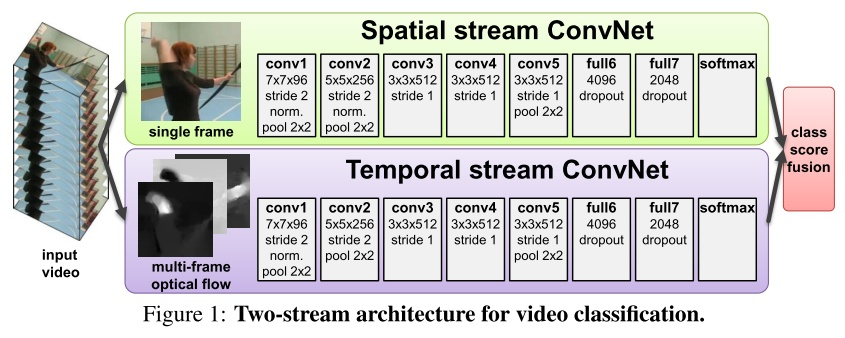

   - 实验效果：UCF101-88.0%，HMDB51-59.4%

   **Convolutional Two-Stream Network Fusion for Video Action Recognition** (CVPR2016)

   - 主要工作为在two stream network基础上，利用CNN网络进行了spatial和temporal的融合，从而进一步提高了效果。此外，该文章还将基础的spatial和temporal网络都换成了VGG-16 network。

     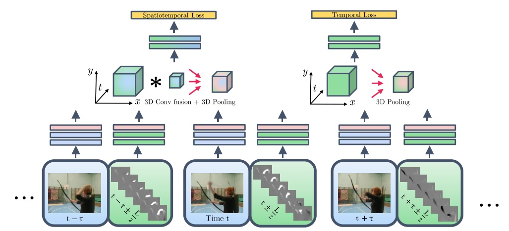

   - 实验效果：UCF101-92.5%，HMDB51-65.4%

   **Temporal Segment Networks: Towards Good Practices for Deep Action Recognition**

   港中文Limin Wang大神的工作，他在这方面有很多很棒的工作，可以followt他的主页：[Limin Wang](https://wanglimin.github.io/) 。这篇文章提出的TSN网络也算是spaital+temporal fusion，结构图见下图：

   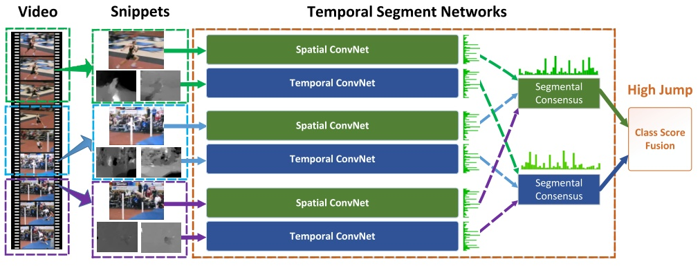

   并对如何进一步提高two stream方法进行了详尽的讨论，主要包括几个方面：

   -  输入数据类型：除去two stream原本的RGB image和 optical flow field这两种输入外，这篇文章中还尝试了RGB difference及 warped optical flow field两种输入。最终结果是 RGB+optical flow+warped optical flow的组合效果最好。

   -  网络结构：尝试了GoogLeNet、VGGNet-16及BN-Inception三种网络结构，其中第三个的效果最好。

   -  训练策略：包括跨模态预训练、正则化、数据增强等。

   -  实验效果：UCF101-94.2%，HMDB51-69.4%

2. **C3D网络**

   **Learning spatiotemporal features with 3d convolutional networks**

   - C3D是facebook的一个工作，采用3D卷积和3D Pooling构建了网络。通过3D卷积，C3D可以直接处理视频（或者说是视频帧的volume）；

   - 实验效果：UCF101-85.2%，可以看出其在UCF101上效果距two stream方法还有不小差距，这主要是网络结构造成的，C3D中的网络结构为自己设计的简单结构，如下图所示。

     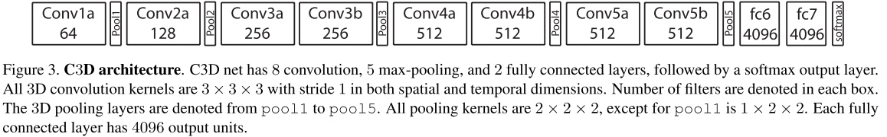

   - 速度：C3D的最大优势在于其速度，用Nvidia 1080显卡可以达到600fps以上。所以C3D的效率是要远远高于其他方法的，这使得C3D有着很好的应用前景。新版本的Res-C3D网络，模型大小是之前的一半，速度比C3D快了很多，效果也比之前提高了几个百分点（UCF上）。

3. **其他方法**

   **A Key Volume Mining Deep Framework for Action Recognition**

   - 主要做的是key volume的自动识别；通常都是将一整段动作视频进行学习，而事实上视频中一些帧与动作的关系并不大，因此进行关键帧学习，再在关键帧上建立CNN模型以提高模型效果。

     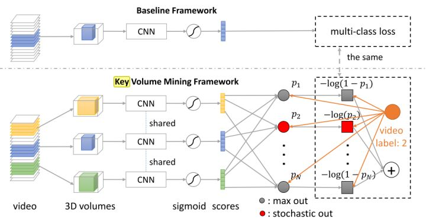

   - 实验效果：UCF101-93.1%，HMDB51-63.3%。

   **Deep Temporal Linear Encoding Networks**

   - 主要提出了“Temporal Linear Encoding Layer” 时序线性编码层，主要对视频中不同位置的特征进行融合编码。至于特征提取则可以使用各种方法，文中实验了two stream以及C3D两种网络来提取特征。

     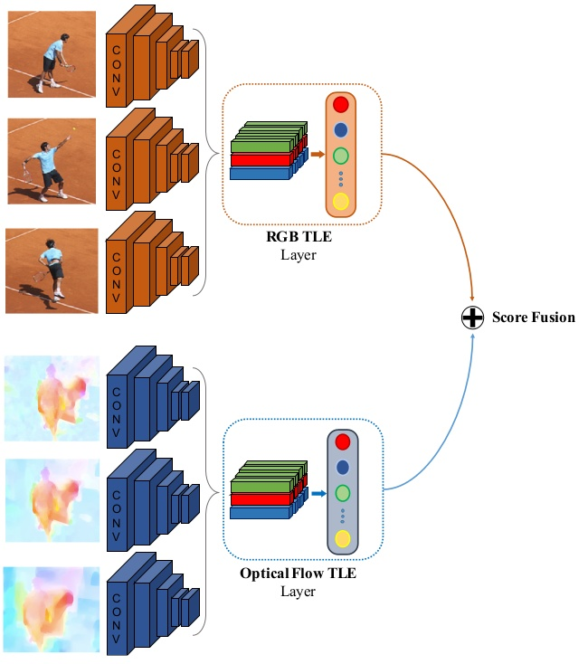

   - 实验效果：UCF101-95.6%，HMDB51-71.1% （特征用two stream提取）。

#### 行为检测

**目标**：给定一段未分割的长视频，检测视频中的行为片段（action instance），包括其开始时间、结束时间以及类别。一段视频中可能包含多个行为片段。

##### 特点：

- action recognition与temporal action detection的关系十分类似image classfication与object detection的关系。基于image classification问题，发展出了许多强大的网络模型，这些模型在object detection的方法中起到了很大的作用。同样，action recognition的相关模型（如2stream，C3D，iDT等)也被广泛用在temporal action detection方法中。
- 由于temporal action detection和object detection存在一定相似性，所以前者很多方法都采用了类似于一些后者方法的框架（最常见的就是参考R-CNN系列方法）。

##### 难点：

- 在目标检测中，物体目标的边界通常都是非常明确的，所以可以标注出较为明确的边界框。但时序行为的边界很多时候并不是很明确，一个行为什么时候算开始，什么时候算结束，也常常无法给出一个准确的边界。
- 在行为识别中可以只使用静态图像信息，但时序行为检测则必须结合时序的信息，比如使用RNN读入每帧图像上用CNN提取的特征，或是用时序卷积等。
- 时序行为片段的时间跨度变化可能非常大。比如在ActivityNet中，最短的行为片段大概1s左右，最长的行为片段则超过了200s。巨大的时长跨度，也使得检测时序动作非常难。

##### 关键点：

设计一个好的时序行为检测方法的关键主要在于以下两点：

- 高质量的时序片段（行为的时序边界）：很多方法都使用Proposal + classification框架。这类方法重要的是较高的proposal质量（即在保证平均召回率的情况下尽可能减少proposal的数量）。此外，对于所有方法，获取准确的时序行为边界都是非常重要的。
- 准确的分类（行为的类别）：即能准确的得到时序行为片段的类别信息。这里通常都会使用行为识别中的一些方法与模型。

##### 数据库：

时序行为检测的数据库也有很多，下面是几个常用的主流数据库：

- THUMOS 2014：该数据集即为THUMOS Challenge 2014，[地址](http://crcv.ucf.edu/THUMOS14/)。该数据集包括行为识别和时序行为检测两个任务。它的训练集为UCF101数据集，包括101类动作，共计13320段分割好的视频片段。THUMOS2014的验证集和测试集则分别包括1010和1574个未分割过的视频。在时序行为检测任务中，只有20类动作的未分割视频是有时序行为片段标注的，包括200个验证集视频（包含3007个行为片段）和213个测试集视频（包含3358个行为片段）。这些经过标注的未分割视频可以被用于训练和测试时序行为检测模型。实际上之后还有THUMOS Challenge 2015,包括更多的动作类别和视频数，但由于上面可以比较的方法不是很多，所以目前看到的文章基本上还是在THUMOS14上进行实验。
- MEXaction2：MEXaction2数据集中包含两类动作：骑马和斗牛。该数据集由三个部分组成：YouTube视频，UCF101中的骑马视频以及INA视频，数据集[地址](http://mexculture.cnam.fr/xwiki/bin/view/Datasets/Mex+action+dataset) 。其中YouTube视频片段和UCF101中的骑马视频是分割好的短视频片段，被用于训练集。而INA视频为多段长的未分割的视频，时长共计77小时，且被分为训练，验证和测试集三部分。训练集中共有1336个行为片段，验证集中有310个行为片段，测试集中有329个行为片断。且MEXaction2数据集的特点是其中的未分割视频长度都非常长，被标注的行为片段仅占视频总长的很低比例
- ActivityNet: 目前最大的数据库，同样包含分类和检测两个任务。数据集地址为[Activity Net](http://activity-net.org/index.html) ，这个数据集仅提供视频的youtube链接，而不能直接下载视频，所以还需要用python中的youtube下载工具来自动下载。该数据集包含200个动作类别，20000（训练+验证+测试集）左右的视频，视频时长共计约700小时。由于这个数据集实在太大了，我的实验条件下很难完成对其的实验，所以我之前主要还是在THUMOS14和MEXaction2上进行实验。

##### 研究进展：

temporal action detection近年的文章很多，这里只简单介绍比较有代表性的几个工作。为了方便对比，下面的数据库均只介绍其在THUMOS14数据库上的结果。

**End-to-end learning of action detection from frame glimpses in videos (CVPR2016)**

- 李飞飞实验室的工作，使用强化学习的方法训练一个基于RNN的代理，这个代理不断观察视频帧并不断决定接下来要看哪里以及何时要生成一个动作预测。与后面很多基于proposal的方法不同，该方法为end-to-end且直接生成行为预测。

  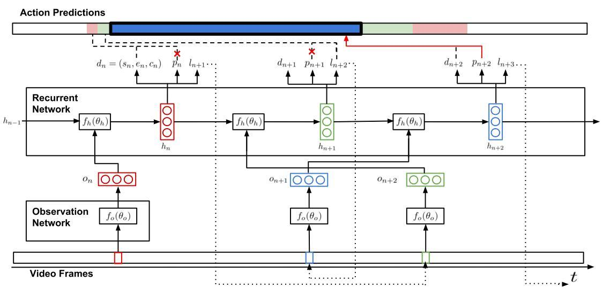

- 该方法在THUMOS14上的mAP为17.1%（重叠度阈值取0.5）。

**Temporal Action Localization with Pyramid of Score Distribution Features (CVPR2016)**

- 基于iDT特征对视频提取了一种分数分布金字塔特征(Pyramid of Score Distribution Feature, PSDF)，之后使用了LSTM网络对PSDF特征序列进行处理，并根据输出的frame-level的行为类别置信度分数处理得到行为片段的预测；

- PSDF方法效果不错，表明传统特征也还有一战之力。但iDT特征提取实在太耗时/耗储存空间了(特征大小要比原始视频都要大很多)。个人认为用iDT特征做行为检测前景不大；

  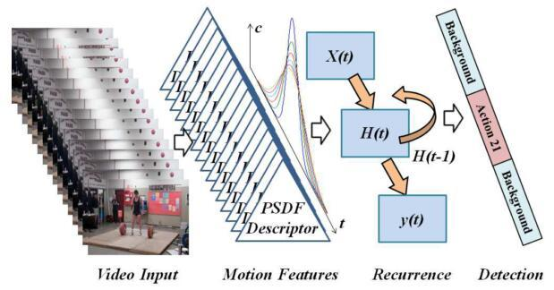

- 该方法在THUMOS14上的mAP为18.8%（重叠度阈值取0.5）。

**Temporal action localization in untrimmed videos via multi-stage cnns (CVPR2016)**

- 该方法首先使用滑窗方法生成多种尺寸的视频片段(segment)，再使用多阶段网络（Segment-CNN)处理，代码见[zhengshou/scnn](https://github.com/zhengshou/scnn/)。SCNN主要包括三个子网络，均使用了C3D network：

  - 第一个是proposal network，用来判断当前输入视频片段是一个动作的概率；
  - 第二个为classification network，用于给视频片段分类，但不用于测试环节，只是用作初始化localization network；
  - 第三个为localization network，该网络输出形式依旧为类别概率，但在训练时加入重叠度相关的损失函数，使得网络能更好的估计一个视频片段的类别和重叠度。最后采用了非极大化抑制（NMS）来去除重叠的片段，完成预测。

  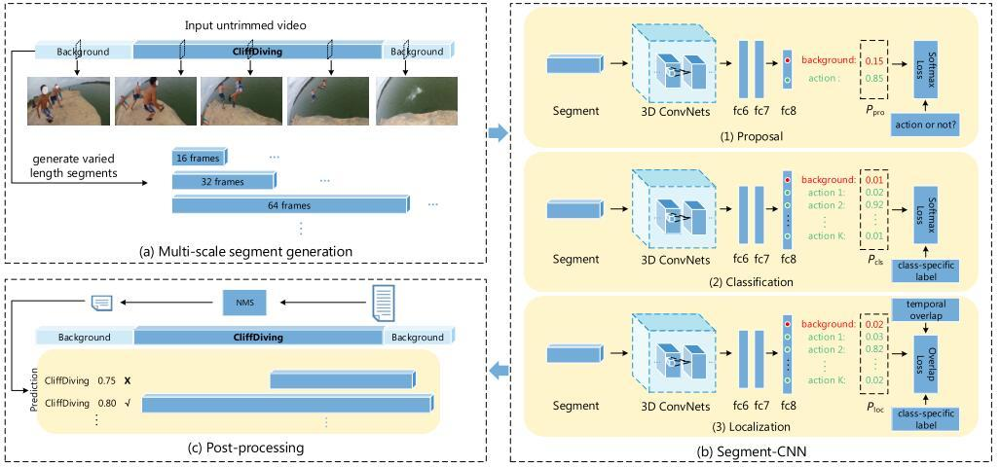

- 该方法实际上采用了类似于R-CNN的思路，后面有不少文章也采用了类似的思想，即先提proposal，再分类。这篇文章的封面图为该paper最后的效果展示图。

- 该方法在THUMOS14上的mAP为19.0%（重叠度阈值取0.5）

**Efficient Action Detection in Untrimmed Videos via Multi-Task Learning (WACV2016)**

- 这篇文章实际上是将SCNN的多阶段网络放到了一个网络里面去，通过共享前面的卷积层，加快了算法的速度。但从效果上看，基本与SCNN完全相同。感觉算是SCNN的完善版本。

  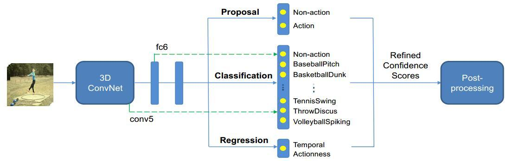

- 该方法在THUMOS14上的mAP为19.0%（重叠度阈值取0.5），其余重叠度阈值下表现也与SCNN基本一致。

**CDC: Convolutional-De-Convolutional Networks for Precise Temporal Action Localization in Untrimmed Videos (CVPR2017)**

- Shou Z.新的工作。基于C3D（3D CNN网络）设计了一个卷积逆卷积网络，输入一小段视频，输出frame-level的动作类别概率。该网络主要是用来对temporal action detection中的动作边界进行微调，使得动作边界更加准确，从而提高mAP。
- 该方法在THUMOS2014数据库上的mAP@0.5 为**23.3%**。在THUMOS2014数据库上。该方法的速度非常快，可以达到500FPS。

**A Pursuit of Temporal Accuracy in General Activity Detection**

- 港中文汤晓鸥大神实验室的工作。这个方法的pipeline很复杂，大致上是用TSN(Temporal Segment Network, 用于Action Recognition的state-of-the-art方法,也是他们组的工作)在视频序列上每隔几帧判断该时刻属于动作的概率（是动作/不是动作），基于这个概率的曲线提出了一种叫Temporal Actionness Grouping(TAG)的proposal方法。之后再进行类别的判断。该方法在THUMOS2014数据库上的mAP@0.5 为**28.2%。**
- 这篇文章对temporal action detection这个问题进行了非常细致的讨论，非常值得一读。这个方法的主要缺陷我认为是速度，主要由于使用的TSN网络速度本身比较慢（而且其中使用的光流还需要预先提取一遍）。

**Temporal Unit Regression Network for Temporal Action Proposals**

- 这篇文章采用了类似Faster-RCNN的思路，主要是作为proposal的方法。pipeline比较简单。
- 该方法在THUMOS2014数据库上的mAP@0.5 为**25.6%。**

**UntrimmedNets for Weakly Supervised Action Recognition and Detection**

- 还是港中文CV实验室的工作。这篇文章主要提出了一种可以用于 Action Recognition和Action Detection的弱监督方法。

#### 视频描述(Video Caption)

video captioning的任务是给视频生成文字描述，和image captioning（图片生成文字描述）有点像，区别主要在于视频还包含了时序的信息。

##### 数据集

- MSR-VTT dataset: 该数据集为ACM Multimedia 2016 的 Microsoft Research - Video to Text (MSR-VTT) Challenge。地址为 [Microsoft Multimedia Challenge](http://2016.ms-multimedia-challenge.com/challenge) 。该数据集包含10000个视频片段（video clip），被分为训练，验证和测试集三部分。每个视频片段都被标注了大概20条英文句子。此外，MSR-VTT还提供了每个视频的类别信息（共计20类），这个类别信息算是先验的，在测试集中也是已知的。同时，视频都是包含音频信息的。该数据库共计使用了四种机器翻译的评价指标，分别为：METEOR, BLEU@1-4,ROUGE-L,CIDEr。
- YouTube2Text dataset(or called MSVD dataset):该数据集同样由Microsoft Research提供，地址为 [Microsoft Research Video Description Corpus](https://www.microsoft.com/en-us/download/details.aspx%3Fid%3D52422%26from%3Dhttp%253A%252F%252Fresearch.microsoft.com%252Fen-us%252Fdownloads%252F38cf15fd-b8df-477e-a4e4-a4680caa75af%252Fdefault.aspx) 。该数据集包含1970段YouTube视频片段（时长在10-25s之间），每段视频被标注了大概40条英文句子。

这两个数据库都是trimmed video clip 到 sentences的翻译。而这两年的论文基本上使用这两个数据库为主，说明目前的研究还主要集中在trimmed video clip 到 sentences的翻译。

##### 关键点

video captioning任务可以理解为视频图像序列到文本序列的seq2seq任务。近年的方法大都使用LSTM来构造encoder-decoder结构，即使用lstm encoder编码视频图像序列的特征，再用lstm decoder解码文本信息。这种模型结构最早在ICCV2015的”Sequence to Sequence – Video to Text”一文中提出，如下图所示：

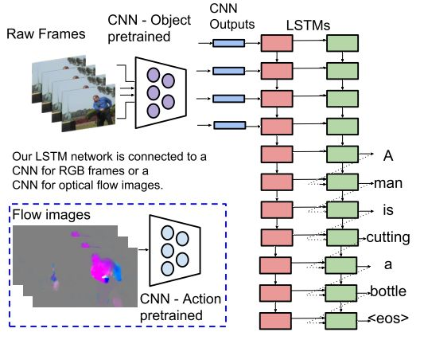

基于上图中的结构，构造一个encoder-decoder结构的模型主要包括几个关键点：

1. 输入特征：即如何提取视频中的特征信息，很多文章都使用了多模态的特征。主要包括如下几种：
   - 基于视频图像的信息：包括简单的用CNN（VGGNet, ResNet等）提取图像(spatial)特征，用action recognition的模型(如C3D)提取视频动态(spatial+temporal)特征；
   - 基于声音的特征：对声音进行编码，包括BOAW（Bag-of-Audio-Words)和FV(Fisher Vector)等；
   - 先验特征：比如视频的类别，这种特征能提供很强的先验信息；
   - 基于文本的特征：先从视频中提取一些文本描述，再將这些描述作为特征来进行video captioning。这类特征有两类：一类是先对单帧视频进行image captioning，将结果作为输入特征；另外一类是做video tagging，将得到的标签作为特征。

2. encoder-decoder构造：虽然大部分工作都是用lstm，但各个方法的具体配置还是存在着一定的差异。
3. 输出词汇的表达：主要包括两类，一类是Word2Vec这种词向量表示，另外就是直接使用词袋表示。
4. 其它部分：比如训练策略，多任务训练之类的。

##### 研究进展
