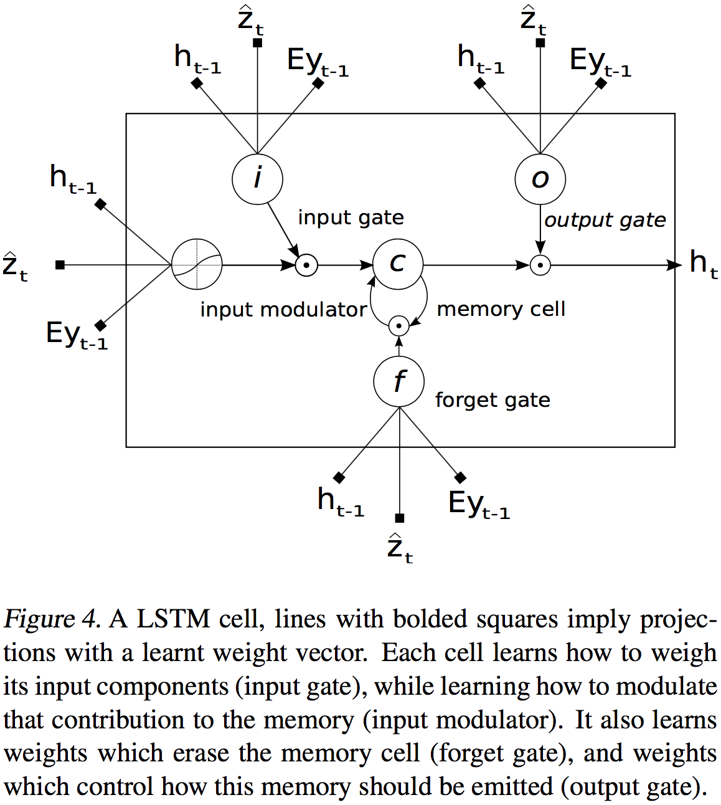

#### Show and Tell

自动描述图片内容是人工智能中连接计算机视觉与自然语言处理的基础问题。本文提出一个基于深度循环结构、结合最新机器视觉与机器翻译进展、能用于生成自然语句来描述图像的生成式模型。在给定训练图片情况下，模型被训练来最大化目标描述语句的似然。在多个数据集上的试验展示了模型的精度和仅从图片描述学得的语言的流畅度。也提供了TensorFlow的开源实现。

##### 1.简介

受近来机器翻译中使用RNN的seq2seq进展的启发，模型将编码器替换为一个CNN，是接受图片$I$作为输入、训练来最大化产生目标词语序列$S=\{S_1,S_2,\dots\}$似然$p(S|I)$的单个联合模型，其中每个词语$S_t$来自一个给定字典。我们称之为NIC。模型的贡献在于：首先，它展示了这个问题的一个端到端系统，是一个完全可用SGD训练的神经网络；其次，它结合了视觉和自然语言的最先进水平的子网络；最后，与最新的方法相比产生了显著更好的结果。

#### Show, Attend and Tell

受近来机器翻译和物体检测工作的启发，本文介绍一个基于注意的自动学习图片内容描述的模型，并描述如何用标准反向传播技巧以确定性的行为和最大化可变下界随机地训练这个模型。也会通过可视化展示模型在产生输出序列的词语时如何自动学习注视相应的静止物体，并在Flickr8k、Flickr30k和MS COCO三个基准数据集上验证了使用注意的表现。

##### 1.简介

##### 2.相关工作

##### 3.使用注意机制的图像标注生成

先描述两种基于注意模型变体的共同框架。两者主要的区别是$\phi$函数的定义。在下面的讲述中，省略偏差项以方便阅读。

##### **编码器：卷积特征**

模型接收原始图片，产生标注序列$\mathbf y$：
$$
y=\left\{ \mathbf y_1,\dots, \mathbf y_C \right\},\ \mathbf y_i \in \mathbb R^K
$$
其中$K$为字典的大小，$C$是标注的长度。使用CNN来提取一系列特征向量，并称之为标记向量。抽取器产生$L$个向量，每个都是对应于图像一部分的$D$维表示：
$$
a = \left\{ \mathbf a_1, \dots, \mathbf a_L \right\},\ \mathbf a_i \in \mathbb R^D
$$
为获得特征向量和2维图像之间的对应关系，这里从更低的卷积层提取特征，而不像前面的工作那样使用全连接层。这使得解码器能从所有特征向量中选取子集来选择性地关注图像的特定部分。

**解码器：长短项记忆网络**

使用LSTM在每一步已知上下文向量，即前一个隐状态和前面生成的词语，情况下生成一个词语，最终生成标注。这里LSTM的实现如图所示：

使用$T_{s,t}\ :\ \mathbb R^s \rightarrow \mathbb R^t$标记学得参数的仿射变换。
$$
\begin{aligned}
\begin{pmatrix} \mathbf i_t \\ \mathbf f_t \\ \mathbf o_t \\ \mathbf g_t \end{pmatrix}
&= \begin{pmatrix} \sigma \\ \sigma \\ \sigma \\ \tanh \end{pmatrix} T_{D+m+n,n}
\begin{pmatrix} \mathbf {Ey}_{t-1} \\ \mathbf h_{t-1} \\ \hat{\mathbf z_t} \end{pmatrix}
\\
\mathbf c_t &= \mathbf f_t \odot \mathbf c_{t-1} + \mathbf i_t \odot \mathbf g_t
\\
\mathbf h_t &= \mathbf o_t \odot \tanh(\mathbf c_t)
\end{aligned}
$$

其中，$\mathbf i_t, \mathbf f_t, \mathbf c_t, \mathbf o_t, \mathbf h_t$分别是LSTM的输入、遗忘、记忆、输出和隐状态。向量$\hat{\mathbf z_t} \in \mathbb R^D$是上下文向量，获取与特定输入位置有关的视觉信息。$\mathbf E \in \mathbb R^{m \times K}$是嵌入矩阵。令$m$和$n$分别表示嵌入和LSTM的维数，$\sigma$和$\odot$分别表示logistic的sigmoid激活函数和基于元素的乘法。

上下文向量$\hat{\mathbf z_t}$是时间$t$时输入图像相关部分的动态表示。定义一个$\phi$机制从对应在图片不同位置提取特征的标记向量$\mathbf a_i,i=1,\dots,L$计算$\hat{\mathbf z_t}$。对每个位置$i$，此机制产生一个正权重$\alpha_i$，它既可以解释为位置$i$是产生下一个单词正确关注位置的概率（“硬”但随机的注意机制），也可以是在调和$a_i$时给予位置$i$的相对重要性。每个标记向量$a_i$的权重$\alpha_i$使用以前个隐状态为条件的多层感知器的注意模型$f_{\text{att}}$来计算。注意机制的“软”版由[Bahdanau et al. (2014)](https://arxiv.org/pdf/1409.0473.pdf)介绍。注意到隐状态随着输出RNN在输出序列前进而改变：网络下一个观察的地点依赖于已产生的序列词语：
$$
\begin{aligned}
e_{ti} &= f_{\text{att}}(\mathbf a_i, \mathbf h_{t-1}) \\
\alpha_{ti} &= \frac{\exp(e_{ti})}{\sum_{k=1}^L \exp(e_{tk})}
\end{aligned}
$$
一旦权重（和为1）计算出来，上下文向量$\hat z_t$就可以计算出来：
$$
\hat{\mathbf z}_t = \phi\left( \{\mathbf a_i\}, \{\alpha_i\} \right)
$$
其中$\phi$是给定标记向量和其对应权重返回单个向量的函数。LSTM的初始记忆状态和隐状态由标记向量平均值通过两个独立的MLP预测：
$$
\begin{aligned}
\mathbf c_0 &= f_{\text{init,c}} \left( \frac{1}{L} \sum_i^L \mathbf a_i \right) \\
\mathbf h_0 &= f_{\text{init,h}} \left( \frac{1}{L} \sum_i^L \mathbf a_i \right)
\end{aligned}
$$
这里使用深度输出层在给定LSTM状态、上下文向量和前个词语的条件下计算输出词语的概率：
$$
p\left( \mathbf y_t | \mathbf a, \mathbf y_1^{t-1} \right) \propto \exp\left( \mathbf L_o\left( \mathbf {Ey}_{t-1} + \mathbf L_h \mathbf h_t + \mathbf L_z \hat{\mathbf z}_t \right) \right)
$$
其中$\mathbf L_o \in \mathbb R^{K \times m}$，$\mathbf L_h \in \mathbb R^{m\times n}$，$\mathbf L_z \in \mathbb R^{m\times D}$，而$\mathbf E$是随机初始学习到的参数。

##### 4.学习随机性“硬”vs确定性“软”的注意

下面讨论注意模型$f_{\text{att}}$的两种可选机制：随机注意和确定注意。

**随机性“硬”的注意**

用位置变量$s_t$表示产生第$i$个词语时模型决定关注的地方。$s_{t,i}$是独热的指示变量，若（由$L$）第$i$个位置是用于提取视觉特征的则设为1。将关注位置视为中间隐变量，可以赋予参数为$\{\alpha_i\}$的多元伯努利分布，并将$\hat z_t$视为随机变量：
$$
\begin{aligned}
p(s_{t,i}=1 | s_{j<t},\mathbf a) &= \alpha_{t,i} \\
\hat{\mathbf z}_t &= \sum_i s_{t,i} \mathbf a_i
\end{aligned}
$$
定义新的目标函数$L_s$是给定特征$\mathbf a$观察到单词序列$\mathbf y$的边缘$\log$似然$\log p(\mathbf y | \mathbf a)$的可变下界。参数$W$的学习算法可以直接通过优化$L_s$获得：
$$
\begin{aligned}
L_s
&= \sum_s p(s|\mathbf a) \log p(\mathbf y|s,\mathbf a) \\
&\leq \log \sum_s p(s|\mathbf a) \log p(\mathbf y|s,\mathbf a) \\
&= \log p(\mathbf y | \mathbf a) \\
\frac{\partial L}{\partial W} &= \sum_s p(s|\mathbf a) \left[ \frac{\partial \log p(\mathbf y |s, \mathbf a)}{\partial W} + \log p(\mathbf y | s,\mathbf a)\frac{\partial \log p(\mathbf y |s, \mathbf a)}{\partial W} \right]
\end{aligned}
$$
上式需要使用基于蒙特卡洛的模型参数梯度的抽样近似。这可从multinoulli分布中抽取位置实现：
$$
\begin{aligned}
\tilde s &\sim \text{Multinoulli}_L\left( \{\alpha_i\} \right) \\
\frac{\partial L}{\partial W} &\approx \frac{1}{N} \sum_{n=1}^N \left[ \frac{\partial \log p(\mathbf y |\tilde s^n, \mathbf a)}{\partial W} + \log p(\mathbf y | \tilde s^n,\mathbf a)\frac{\partial \log p(\mathbf y |\tilde s^n, \mathbf a)}{\partial W} \right]
\end{aligned}
$$

使用一个移动的均值基线来减少梯度蒙特卡洛估算子的方差。当看到第$k$个批次时，用前面附带指数衰减的$\log$似然累积和来估计移动均值基线：
$$
b_k = 0.9\times b_{k-1} + 0.1\times\log p(\mathbf y | \hat s_k, \mathbf a)
$$
为进一步减少估算子的方差，添加一个关于multinoulli分布$H[s]$的熵项。同样，对给定的图像，以$0.5$的概率设定抽取的关注位置$\hat s$到期望的值$\alpha$。两种技巧都改进了随机注意学习算法的鲁棒性。模型最终的学习规则为：
$$
\frac{\partial L_s}{\partial W} \approx \frac{1}{N} \sum_{n=1}^N \left[ \frac{\partial\log p(\mathbf y|\hat s^n,\mathbf a)}{\partial W} +\lambda_r(\log p(\mathbf y|\hat s^n,\mathbf a)-b)\frac{\partial \log p(\hat s^n|\mathbf a)}{\partial W} + \lambda_e \frac{\partial H[\hat s^n]}{\partial W} \right]
$$
其中$\lambda_r$和$\lambda_e$是由交叉验证设定的超参。这个公式等价于强化学习规则，其中注意选择行为序列的奖励正比于在抽取注意策略下目标句子的$\log$似然。在每个点做硬选择中，$\phi(\{\mathbf a_i\},\{\alpha_i\})$是一个返回基于参数为$\alpha$的multinoulli分布在每一点及时抽样的$\mathbf a_i$。

**确定性“软”的注意**

学习随机注意需要每次抽取关注位置$s_t$，相反，可以直接取上下文向量$\hat{\mathbf z}_t$的期望：
$$
\mathbb E_{p(s_t|a)}[\hat{\mathbf z}_t] = \sum_{i=1}^L \alpha_{t,i}\mathbf a_i
$$
并通过计算软的注意权重标注向量$\phi(\{\mathbf a_i\},\{\alpha_i\})=\sum_i^L\alpha_i \mathbf a_i$来形成一个确定性的关注模型。