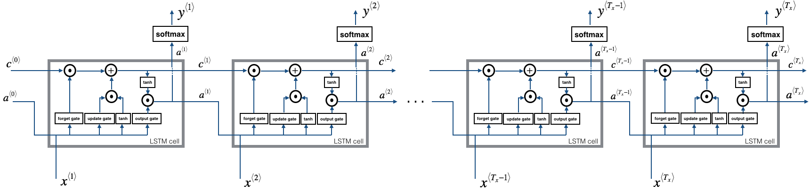

##### 1.基本RNN的前向传播

下面是基本$T_x=T_y$的RNN展开图：


代码实现的基本步骤就是：

- 实现每个时间步需要的计算；
- 实现$T_x$步循环处理输入；

**RNN单元**：下面是RNN单元的结构图和单步的运算：


实现指南：

1. 用tanh激活函数计算隐状态：$a^{\langle t \rangle} = \tanh(W_{aa} a^{\langle t-1 \rangle} + W_{ax} x^{\langle t \rangle} + b_a)$；
2. 使用新的状态计算$a^{\langle t \rangle}$计算预测$\hat{y}^{\langle t \rangle} = softmax(W_{ya} a^{\langle t \rangle} + b_y)$；
3. 在cache中存储 $(a^{\langle t \rangle}, a^{\langle t-1 \rangle}, x^{\langle t \rangle}, parameters)$；
4. 返回$a^{\langle t \rangle}$ , $y^{\langle t \rangle}$和cache。

```python
def rnn_cell_forward(xt, a_prev, parameters):
    # Retrieve parameters from "parameters"
    Wax = parameters["Wax"]
    Waa = parameters["Waa"]
    Wya = parameters["Wya"]
    ba = parameters["ba"]
    by = parameters["by"]
    # compute next activation state using the formula given above
    a_next = np.tanh(np.matmul(Wax,xt) + np.matmul(Waa,a_prev) + ba)
    # compute output of the current cell using the formula given above
    yt_pred = softmax(np.matmul(Wya,a_next) + by)
    # store values you need for backward propagation in cache
    cache = (a_next, a_prev, xt, parameters)
    return a_next, yt_pred, cache
```

**前向传递**：RNN是基本单元的循环，每个时间步将前个时间的隐状态$a^{\langle t-1 \rangle}$和当前时刻数据$x^{\langle t \rangle}$作为输入，输出此刻的隐状态$a^{\langle t \rangle}$和预测$y^{\langle t \rangle}$：


实现指南：

1. 创建0向量$a$，存储所有计算的隐状态；
2. 初始化“下个”隐状态为$a_0$（初始隐状态）；
3. 开始在$t$上循环：
   - 运行`rnn_cell_forward`更新隐状态和cache；
   - 存储“下个”隐状态在$a$中；
   - 存储预测$y$；
   - 将cache添加到cache列表中；
4. 返回$a$、$y$、和cachees。

```python
def rnn_forward(x, a0, parameters):
    # Initialize "caches" which will contain the list of all caches
    caches = []
     # Retrieve dimensions from shapes of x and parameters["Wya"]
    n_x, m, T_x = x.shape
    n_y, n_a = parameters["Wya"].shape
    # initialize "a" and "y" with zeros (≈2 lines)
    a = np.zeros((n_a, m, T_x))
    y_pred = np.zeros((n_y, m, T_x))
    # Initialize a_next (≈1 line)
    a_next = np.zeros((n_a, m))
    # loop over all time-steps
    for t in range(T_x):
        # Update next hidden state, compute the prediction, get the cache (≈1 line)
        a_next, yt_pred, cache = rnn_cell_forward(x[:,:,t], a_next, parameters)
        # Save the value of the new "next" hidden state in a (≈1 line)
        a[:,:,t] = a_next
        # Save the value of the prediction in y (≈1 line)
        y_pred[:,:,t] = yt_pred
        # Append "cache" to "caches" (≈1 line)
        caches.append(cache)
    # store values needed for backward propagation in cache
    caches = (caches, x)
    return a, y_pred, caches
```


##### 2.长短项记忆网络

下图展示了LSTM单元的操作：


关于门，也许之前对RNN中的隐状态理解不到位，其实它是一个很大的向量，向量的不同元素控制不同文本的不同状态，因此能存储很多个影响语言的因素，比如单复数、人称状态等，当有对应的事物影响某个因素改变时，隐状态向量相应位置的值也发生变化：

- 遗忘门：假定正在阅读一段文本，并希望使用LSTM追踪其语法结构，比如主语是单数或复数。当主语从单数变为复数时，需要找到一种方法来除去原先存储的单/复数状态。LSTM中使用遗忘门来做这样的事，其结果$\Gamma_f^{\langle t \rangle} = \sigma(W_f[a^{\langle t-1 \rangle}, x^{\langle t \rangle}] + b_f)$是一个值在0-1之间的向量；之后会与前个记忆单元状态$c^{\langle t-1 \rangle}$基于元素相乘。因此若$\Gamma^{\langle t\rangle}_f$的某个值为或接近于0，就表示需要删除$c^{\langle t-1 \rangle}$对应部分的信息。
- 更新门：一旦忘记主语是单数，需要找到新的方法来反映主语现在是复数。这是更新门的作用，其结果$\Gamma_u^{\langle t \rangle} = \sigma(W_u[a^{\langle t-1 \rangle}, x^{\{t\}}] + b_u)$也是值为0-1之间的向量；
- 更新单元：要更新主语，需要创建一个新数值向量添加到记忆单元中：$\tilde{c}^{\langle t \rangle} = \tanh(W_c[a^{\langle t-1 \rangle}, x^{\langle t \rangle}] + b_c)$，最终的新记忆状态就是：$c^{\langle t \rangle} = \Gamma_f^{\langle t \rangle}* c^{\langle t-1 \rangle} + \Gamma_u^{\langle t \rangle} *\tilde{c}^{\langle t \rangle}$；
- 输出门：输出门控制输出哪个结果：$\Gamma_o^{\langle t \rangle}=  \sigma(W_o[a^{\langle t-1 \rangle}, x^{\langle t \rangle}] + b_o)$，最后输出就是：$a^{\langle t \rangle} = \Gamma_o^{\langle t \rangle}* \tanh(c^{\langle t \rangle})$。

**LSTM单元**：实现上图中的LSTM单元，需要：

1. 将$a^{\langle t-1 \rangle}$和$x^{\langle t \rangle}$拼接成单个矩阵：$concat = \begin{bmatrix} a^{\langle t-1 \rangle} \\ x^{\langle t \rangle} \end{bmatrix}$；
2. 计算上面6个公式；
3. 计算预测$\hat{y}^{\langle t \rangle} = softmax(W_y a^{\langle t \rangle} + b_y)$；

```python
def lstm_cell_forward(xt, a_prev, c_prev, parameters):
    # Retrieve parameters from "parameters"
    Wf = parameters["Wf"]
    bf = parameters["bf"]
    Wi = parameters["Wi"]
    bi = parameters["bi"]
    Wc = parameters["Wc"]
    bc = parameters["bc"]
    Wo = parameters["Wo"]
    bo = parameters["bo"]
    Wy = parameters["Wy"]
    by = parameters["by"]
    # Retrieve dimensions from shapes of xt and Wy
    n_x, m = xt.shape
    n_y, n_a = Wy.shape
    # Concatenate a_prev and xt (≈3 lines)
    concat = np.concatenate((a_prev, xt), axis=0)
    concat[: n_a, :] = a_prev
    concat[n_a :, :] = xt
    # Compute values for ft, it, cct, c_next, ot, a_next
    ft = sigmoid(np.matmul(Wf,concat) + bf)
    it = sigmoid(np.matmul(Wi,concat) + bi)
    cct = np.tanh(np.matmul(Wc,concat) + bc)
    c_next = ft*c_prev + it*cct
    ot = sigmoid(np.matmul(Wo,concat) + bo)
    a_next = ot*np.tanh(c_next)
    # Compute prediction of the LSTM cell
    yt_pred = softmax(np.matmul(Wy,a_next) + by)
    # store values needed for backward propagation in cache
    cache = (a_next, c_next, a_prev, c_prev, ft, it, cct, ot, xt, parameters)
    return a_next, c_next, yt_pred, cache
```

**LSTM前向传递**：实现单步的LSTM单元之后，就可以在输入序列上迭代$T_x$次：



这里总结一下各个参数唯独之间的关系：

|                    参数                    |       维度       |
| :--------------------------------------: | :------------: |
|                   $a$                    |    $n_a, m$    |
|                   $x$                    |    $n_x, m$    |
|                  $W_f$                   | $n_a ,n_a+n_x$ |
|                  $b_f$                   |    $n_a ,m$    |
|                $\Gamma_f$                |    $n_a, m$    |
|                  $W_u$                   | $n_a, n_a+n_x$ |
|                  $b_u$                   |    $n_a, m$    |
|                $\Gamma_u$                |    $n_a, m$    |
|                $\tilde c$                |    $n_a, m$    |
|                  $W_c$                   | $n_a, n_a+n_x$ |
|                  $b_c$                   |    $n_a, m$    |
|                   $c$                    |    $n_a, m$    |
|                  $W_o$                   | $n_a ,n_a+n_x$ |
|                  $b_o$                   |    $n_a, m$    |
|                $\Gamma_o$                |     $na,m$     |
|                  $W_y$                   |   $n_y, n_a$   |
|                  $b_y$                   |    $n_y, m$    |
|                   $y$                    |    $n_y, m$    |
| $\left[ a^{\langle t-1 \rangle}, x^{\langle t \rangle} \right]$ |  $n_a+n_x, m$  |

注意，其中$c^{\langle0\rangle}$初始化为0向量：

```python
def lstm_forward(x, a0, parameters):
    # Initialize "caches", which will track the list of all the caches
    caches = []
    # Retrieve dimensions from shapes of x and parameters['Wy'] (≈2 lines)
    n_x, m, T_x = x.shape
    n_y, n_a = parameters['Wy'].shape
    # initialize "a", "c" and "y" with zeros (≈3 lines)
    a = np.zeros((n_a, m, T_x))
    c = np.zeros((n_a, m, T_x))
    y = np.zeros((n_y, m, T_x))
    # Initialize a_next and c_next (≈2 lines)
    a_next = np.zeros((n_a, m))
    c_next = np.zeros((n_a, m))
    # loop over all time-steps
    for t in range(T_x):
        # Update next hidden state, next memory state, compute the prediction, get cache
        a_next, c_next, yt, cache = lstm_cell_forward(
            x[:,:,t], a_next, c_next, parameters)
        # Save the value of the new "next" hidden state in a
        a[:,:,t] = a_next
        # Save the value of the prediction in y
        y[:,:,t] = yt
        # Save the value of the next cell state
        c[:,:,t]  = c_next
        # Append the cache into caches
        caches.append(cache)
    # store values needed for backward propagation in cache
    caches = (caches, x)
    return a, y, c, caches
```


##### 3.RNN中的反向传播

现代深度学习框架仅需实现前向传递，框架会自动执行反向传播。与前面的全连接网络一样，RNN中也能遵循链式法则计算关于代价$J$的导数来更新参数。

**基本RNN的反向传递**：其公式如下图，链式规则同样适用于计算$\left( \frac{\partial J}{\partial W_{ax}},\frac{\partial J}{\partial W_{aa}},\frac{\partial J}{\partial b} \right)$来更新$\left(W_{ax},W_{aa},b_a\right)$：


先推导单步反向函数。注意$\tanh(x)$的导数为$1-\tanh^2(x)$。
