##### 1. 训练/发展(dev)/测试集

应用机器学习是一个高度迭代的过程。从一个领域或应用范围的直觉(intuition)通常并不能到另一个。最好的选择可能是基于数据量、输入特征数、是在CPU还是在GPU训练以及很多其他因素做出的。需要运行下图右边的循环多次来得到好的网络选择。决定能多快去的进展的一个主要因素就是能如何有效地运行这个循环。而有效地准备数据能使其更有效。

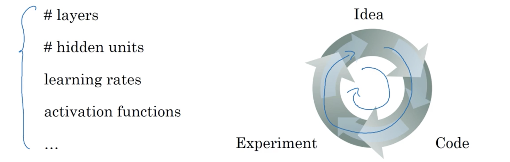

对于一个数据集，传统分法是训练、发展和测试三部分。工作流程就是持续在训练集上训练算法，使用发展集查看多个模型中的哪一个表现最好，选出最终的模型后在测试集上评估算法的性能。通常而言，若只分为训练/测试集，则比例为70%/30%；若果分为训练/发展/测试集，则比例分别是60%/20%/20%。但在现在的大数据时代，数据的组织呈现出几个趋势：

- 一个趋势是发展和测试所占的比例越来越小。验证集只需能快速从几个算法中选出最好的。比如有1000000个数据，则发展集可能只有10000个；同样，测试集只需能给出算法性能的可靠估计，此时也只需10000个，因此比例就是98%/1%/1%。若有更多的数据，还有可能是99.5%/0.25%/0.25%或99.5%/0.4%/0.1%；
- 另一个是越来越多的人在不匹配的训练和测试分布上训练。比如对一个手机识别猫的应用，训练数据集可能是来自网页的猫的图片，而测试数据则可能是来自应用的图片，这两个数据集的分布很可能是不同的。这里的一个经验原则是：**确保发展集和测试集处于同一分布**；
- 最后，可能不需测试集、只用发展集也可行。测试集的作用就是给出最终网络性能的一个无偏估计。但若不需要，也可以没有。因此若只有发展集，在训练集上训练，尝试不同的模型架构，然后在发展集上测试它们，如此迭代知道找到一个最优模型。因为已经将数据适配了发展集，因此也就无需一个无偏估计。在机器学习中，若只有训练和发展集，很多人也会称这个发展集为测试集。但实际上就是像使用发展集一样来使用，因为他们过拟合了训练集。


##### 2. 偏差(bias)与方差(variance)

似乎大多数DL从业者对偏差和方差的理解趋于非常复杂(sophisticated)。这两者属于那种学习容易掌握难的概念。在DL时代，另一个趋势是对偏差-方差权衡(trade-off)的讨论变少了。虽然也解决偏差，也解决方差，但对两者权衡的讨论越来越少了。

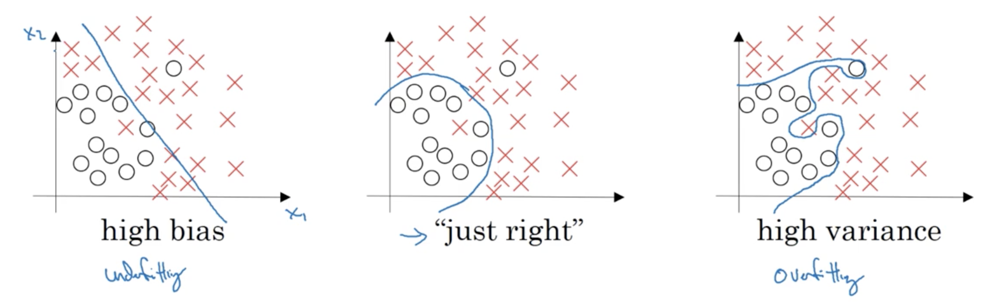

下面是偏差和方差的几种情况，假定对猫的识别错误率，人眼水平接近0%，或更通用的，最优（或贝叶斯）误差接近0%，于是：

| 训练集误差     | 1%      | 15%     | 15%         | 0.5%        |
| --------- | ------- | ------- | ----------- | ----------- |
| **测试集误差** | **11%** | **16%** | **30%**     | **1%**      |
| **问题诊断**  | **高偏差** | **高方差** | **高偏差和高方差** | **低偏差，低方差** |

但若人类水平为15%，则上面的就不成立了。所有上面的都是基于基础误差很小且训练和发展(development)集都来自同一分布。上面的高偏差和高方差的例子，出现在算法对数据的一部分过拟合的情况，比如：

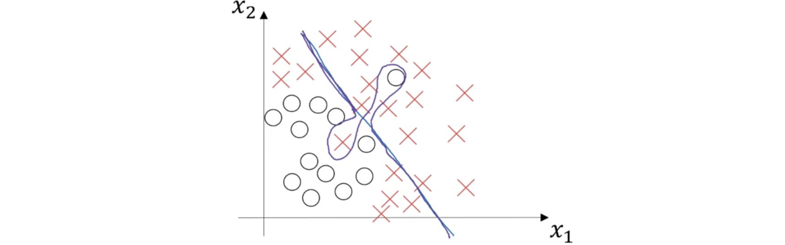

图中紫色线画的就是这样分类器，说其高偏差是因为它接近线性直线，但可能需要的是一条曲线或二次函数；说高方差是因为它增加了太多复杂性来匹配那两个误标识。这种情况在二维情形下可能不太会发生，但在高位情况下，就有可能在一些区域高方差而在一些高偏差。


##### 3. 机器学习的基本处方(recipe)

这是作者在训练数据网络时会用的基本处方：

1. 首先在训练集上评估算法是否有高偏差问题。若是，则可以尝试：

   - 选择更大的网络，这个总是会有效果

   - 加长训练时间，可能不总是有用，但不会降低性能；

   - 或者尝试其他的网络结构，这个可能会有效果。

   尝试这些方法直到解决高偏差的问题。若网络足够大，通常可以使网络在训练集上的表现得像人类一样。

2. 然后在发展集上评估网络是否有高方差问题。若是，则：
   - 最好的方法是获得更多的训练数据；
   - 也可以尝试规则化；
   - 或者尝试其他的网络结构，可能会有效果。

   尝试这些方法直到解决高方差的问题。然后再回到1看是否有高偏差的问题。如此循环尝试，直到找到一个偏差和方差都比较低的模型。

在机器学习的早期，会有很多关于偏差-方差权衡的讨论，因为那时并没有很多方法来仅仅降低其中一项而不伤害另一项。但在现代的深度学习、大数据时代，只要能持续训练更大的网络，就总是能减小偏差而不必影响方差（比如适当的规则化）；而获得更多的数据能很好地减少方差而不影响偏差。因此通过这两步，训练更多的网络或获得更多的数据，就能仅仅减小一项而不大影响另一项。这也是深度学习在有监督学习上如此有效的主要原因之一。只要规则化，训练更大的网络通常不会有害，而训练一个太大网络的主要代价就是计算时间。


##### 4. 规则化(Regularization)

数据的过拟合会产生高方差问题，可能尝试的解决方法是增加训练数据和规则化。增加训练数据通常可行，但并不总能获得更多训练数据，但添加规则化通常能帮助解决过拟合或减小网络误差。

对于逻辑回归，其$L2$规则化为：
$$
\begin{aligned}
&\min_{\mathbf w,b} J(\mathbf w, b)\quad\mathbf w\in\mathbb R^{n_x},b\in\mathbb R\\
J(\mathbf w,b) &= \frac1m\sum_{i=1}^m\mathcal L\left(\hat y^{(i)}, y^{(i)}\right) + \frac{\lambda}{2m}\Vert \mathbf w \Vert_2^2\\
\Vert \mathbf w \Vert_2^2 &= \sum_{i=1}^m w_j^2 = \mathbf w^T\mathbf w
\end{aligned}
$$
那为何不将$b$也加入到正则化项呢？加入当然也没问题，但模型几乎所有的系数都在$\mathbf w$上，因此将$b$加入可能并不会有太大的改变。$L2$规则化是最常用的正则化，有时会提到$L1$规则化，就是将添加的规则项变为：
$$
\frac\lambda{2m}\sum_{i=1}^m\vert w_j \vert = \frac\lambda{2m}\Vert \mathbf w \Vert_1
$$
若使用$L1$规则化，则$\mathbf w$最后会变得稀疏(sparse)，也就是说$\mathbf w$中会有很多的0。这有助于压缩模型，因为参数中有很多0，因此要存储的数据就少。虽然在实际中$L1$会使得模型稀疏，但作用有限，至少对压缩模型而言作用不是那么大。因此现在越来越多的人都使用$L2$规则化。

其中的$\lambda$为规则化参数，通常使用发展集来设定，尝试一些值，选择在训练集表现好和参数二范数小权衡最好的值，是另一个需要调整的超参。

而对于神经网络，其规则化为：
$$
\begin{aligned}
J(\mathbf W^{[1]}, b^{[1]},\cdots,\mathbf W^{[L]},b^{[L]}) &= \frac1m\sum_{i=1}^m\mathcal L\left( \hat y^{(i)},y^{(i)} \right) + \frac\lambda{2m}\sum_{l=1}^L\left\Vert \mathbf W^{[l]} \right\Vert_F^2\\
\left\Vert \mathbf W^{[l]} \right\Vert_F^2 &= \sum_{i=1}^{n^{[l-1]}}\sum_{j=1}^{n^{[l]}}\left( w_{ij}^{[l]} \right)^2
\end{aligned}
$$
其中的$\Vert\Vert_F$被称为Frobenius范数。此时的梯度下降为：
$$
\begin{aligned}
d\mathbf W^{[l]} &= (\text{gradients from BP}) + \frac\lambda m\mathbf W^{[l]}\\
\mathbf W^{[l]} &= \mathbf W^{[l]} - \alpha d\mathbf W
\end{aligned}
$$
$L2$规则化有时又称为"weight decay"，因
$$
\begin{aligned}
\mathbf W^{[l]} &= \mathbf W^{[l]} - \alpha d\mathbf W\\
&= \mathbf W^{[l]} -\alpha (\text{gradients from BP}) -\alpha \frac\lambda m\mathbf W^{[l]}\\
&= \left(1-\frac{\alpha\lambda}m\right)\mathbf W^{[l]} - \alpha(\text{gradients from BP})
\end{aligned}
$$
其中$0<1-\frac{\alpha\lambda}m<1$，因此有这个名字。


##### 5. 为何规则化能减小方差

神经网络的规则最优化公式为：
$$
J(\mathbf W^{[1]}, b^{[1]},\cdots,\mathbf W^{[L]},b^{[L]}) = \frac1m\sum_{i=1}^m\mathcal L\left( \hat y^{(i)},y^{(i)} \right) + \frac\lambda{2m}\sum_{l=1}^L\left\Vert \mathbf W^{[l]} \right\Vert_F^2\\
$$
若将$\lambda$设得很大，则$\mathbf W^{[l]}$就会趋近于0。就相当于将跟多的隐单元的影响减为0，这种情况下就相当于简化神经网络为更简单的网络，就近似一个逻辑回归。这就将过拟合的情况变得欠拟合。当然是希望有适中的$\lambda$使得网络接近刚好的情况。

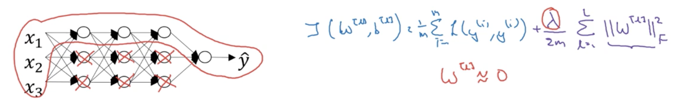

其实说将隐单元影响减为0并不太精确，真实的情况是仍然使用它们，但影响非常小，因此就相当于得到一个更简单的小网络，也就不易于过拟合。另一种理解的方法是，假设激活函数是tanh，则当$z$很小的时候，则$g(z)$就近似一个线性函数。

当$\lambda$变大时，$\mathbf W^{[l]}$就会变得很小，则$z$的值就在那很小的范围之间，则这个神经单元就接近一个线性函数；因所有的$\mathbf W^{[l]}$都很小，则每一层都接近一个线性函数。前面已经提到，若所有的单元都是线性的，则网络无论多深，依然是线性的，就不太可能过拟合了。

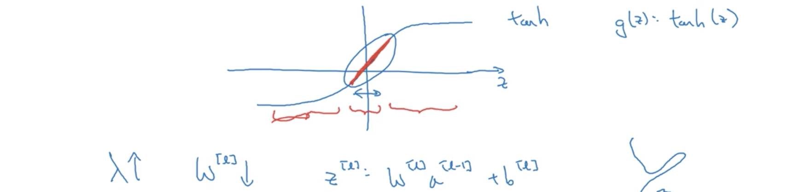

在实现的时候要注意的一个问题是在描绘代价函数$J$随迭代次数下降时不能忘记在$J$中添加规则项，否则可能无法看到$J$在每一次评估后的下降。


##### 6. Dropout规则化

Dropout是一种非常有效的规则化方法。它的基本操作就是在训练神经网络时，设定一个概率来决定是否清除一个神经单元。对于要清除的单元，去除其所有输入和输出边，因此都就会得到一个小得多的网络，然后在这个简化的网络上执行BP训练这个样本。然后在不同的样本上，再次获得要清除的单元，然后做同样的操作。对每个训练样本，可能使用这些神经网络来训练。这样在每个样本上训练一个更小的神经网络，最终就是规则化这个网络。

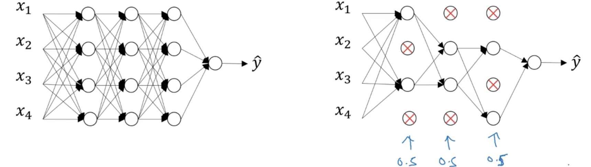

有一些不同的方法实现dropout，这里展示一个最普遍的、被称为反转(inverted)dropout的技术。

```python
# Illustrate with layer 3

keep_prob = 0.8
d3 = np.andom.rand(a3.shape[0], a3.shape[1]) < keep_prob
a3 = np.multiply(a3, d3)
a3 /= keep_prob
```

变量d3是每个样本在每个隐单元是否dropout的布尔值矩阵。np.multiply是元素相乘，a3中d3中为false对应的值都为0。第6行的意义是：这层平均会有20%的单元被丢弃，$\mathbf a^{[3]}$值平均会减少20%，这会影响到后面的计算；为使$\mathbf a^{[3]}$的期望保持不变，故除以keep_prob。这一行就被称为“反转dropout技巧”，用来保证$\mathbf a^{[l]}$的期望保持不变。而在测试时，这种反转dropout技巧会使得测试更简单，因为没有放缩(scaling)的问题。就目前所知而言，反转dropout是最常用的dropout实现方法。有些早期的dropout没有这除以keep_prob的一行，因此在测试时均值变得越来越复杂。

每个样本在不同迭代时所丢弃的单元并不相同。在测试时不应使用dropout，因为在测试预测时并不希望输出是随机的，若增加dropout，只是增加噪声。


##### 7. 为何dropout有效

直觉：不能依赖于任何一个特征，因此必须铺开权重。

先从一个神经元的视角来看，对于输入，要产生一些有意义的输出。而使用dropout后，某些输入可能会随机地清除。这种情况下，这个单元就不能依赖于任何一个特征，因为它可能会随机消失，因此神经元就会积极铺开，给每个输入都给予一些权重。通过扩散权重，这就倾向于缩小权重的平方范数。因此与$L2$规则化的效果就相同，实施dropout的效果就是缩小权重并做一些外部(outer)规则化来帮助避免过拟合。Dropout能不用规则化形式化地展示为可调节的形式，而不同权重的$L2$惩罚则是不同的，依赖于要乘的激活值。但总结起来，dropout能展示为和$L2$有相同的效果。

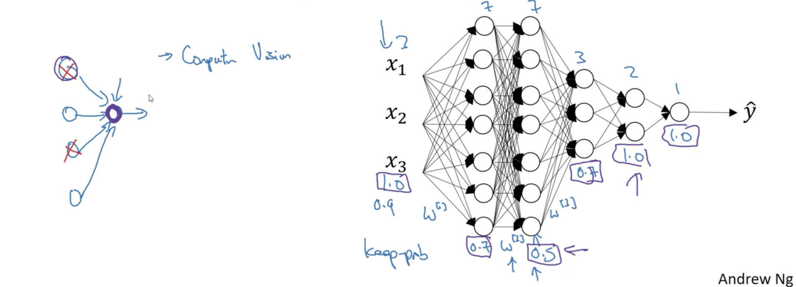

而对于一个神经网络，keep_prob是要决定的超参，通常会为每一层选一个keep_prob的值。参数较多的层比较有可能导致过拟合，可以使keep_prob较小，就像在$L2$中增大$\lambda$；而参数不多的层，则使用较大的参数；若不希望对某层做dropout，则设为1。也可以对输入做dropout，但实际中通常并不用，因此通常是1或者非常接近1。

许多dropout的实现都是在计算机视觉上的。在计算机视觉中，输入的是所有像素，其维度非常大，因此几乎总是没有足够的数据，因此经常使用dropout。但要记住的是dropout是一种防止过拟合的正则化技巧，可能在其他学科中不那么通用。Dropout的一个缺点是代价函数$J$就不能很好地定义，很难看每一个迭代下山来双验证，因此就失去了绘制$J$-迭代次数的工具。因此通常会先设置keep_prob为1来关闭dropout，运行代码保证$J$是单调下降的；然后再打开dropout。


##### 8. 其他规则化方法

**数据增强**：在计算机视觉领域，如果需要获得更多的数据但又无法获得，就能通过增强来获得更多的数据，比如水平翻转，获取数据的随机修剪，随机旋转和平移，虽然无法像全新的样本那样增加那样多的信息，这是一种便宜的获得更多数据的方法。

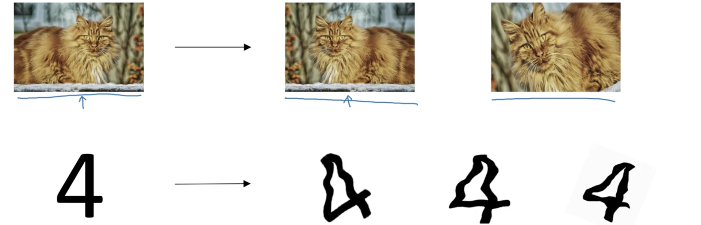

**早停机**：同时描绘$J$/训练错误和发展集错误。发展集误差通常会先下降，然后增加，早停机做的就是在发展集误差做得最好的那一步迭代停止。为何会这样呢？因为在迭代前，$\mathbf W \approx 0$，因会用很小的随机值初始化；随着训练，$\mathbf W$的值会越来越大，早停机的原理就是通过在半路停止，获得一个中间值的$\Vert \mathbf W_F^2 \Vert$，因此与用$L2$选择一个$\Vert \mathbf W_F^2 \Vert$较小神经网络类似。

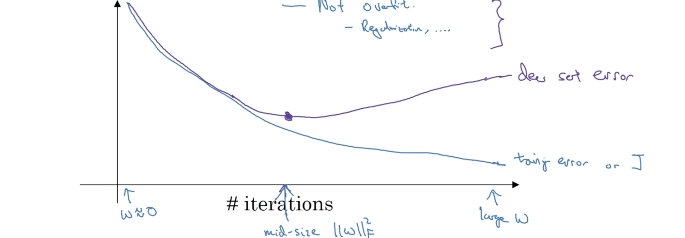

但早停机有一个缺点。机器学习过程由几个不同的步骤组成，一是希望一个算法来优化代价函数$J$，而有多个不同的工具，比如梯度下降。之后也不希望过拟合，有一些工具比如正则化、获得更多数据。现在的机器学习已有很多超参，从可能的算法空间中选择一个算法已是非常复杂。因此将机器学习看成独立的两步更容易理解：优化$J$，用一个工具集仅仅关注找到$\mathbf W$和$\mathbf b$来使得$J\left(\mathbf W, \mathbf b\right)$尽可能地小；然后，一个完全独立的任务，来避免过拟合，做这个时有一个分开的工具集来完成。这个原则有时被称为**正交化(orthogonalization)**，就是一次只考虑一个任务。而早停机的主要缺点是将这两个任务耦合了起来，因此就无法独立地解决这两个问题。因为通过早停机，就是打破优化价值函数$J$，然后同时尝试不过拟合。因此就是使用了混合这两个任务的工具集而非两个，这就是尝试考虑更复杂的事情。

一个替代就是只使用$L2$规则化，然后就可以训练神经网络尽可能的长，这会使得超参的搜索空间更容易分解和遍历。但缺点是可能需要尝试很多规则化参数$\lambda$，这就使得计算代价更昂贵。早停机的优势就是仅运行梯度下降一次，就尝试了小、中间、大的$\mathbf W$值，而无需尝试$L2$规则化的许多超参值。


##### 9. 正规化(normalizing)输入

在训练神经网络时，正规化输入能加速训练，由两步组成：

1. 是减去均值，即$\mathbf x = \mathbf x - \mu = \mathbf x - \frac1m\sum_{i=1}^mx^{(i)}$，这样数据的均值就为0；
2. 是正规化方差，即$x = x / \sigma^2 = x / $ 。此时数据的方差就为1。

需要注意要用同样的$\mu$和$\sigma^2$来正规化测试集，因为希望训练和测试集通过相同的变形。

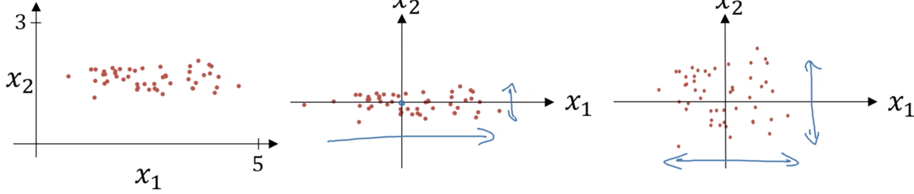

事实证明若使用未正规化的输入特征，如果特征的尺度区别很大，比如$x_1\in[1,1000]$，而$x_2\in[0,1]$，代价函数就更可能是下图左上边的样子，一个压扁的碗，非常拉长的代价函数；如果绘出函数的等高线，就会得到一个拉长的函数如下图左下边。而如果对输入特征正规化，代价函数平均就更对称，如果用下图左边的代价函数运行梯度下降，然后使用一个很小的学习率，否则在最终找到最小值路径前需要很多步来回振荡；而如果有更球形的等高图，则无论从哪里开始，都会更直接向最小值移动，就可以使用比较大的学习率。

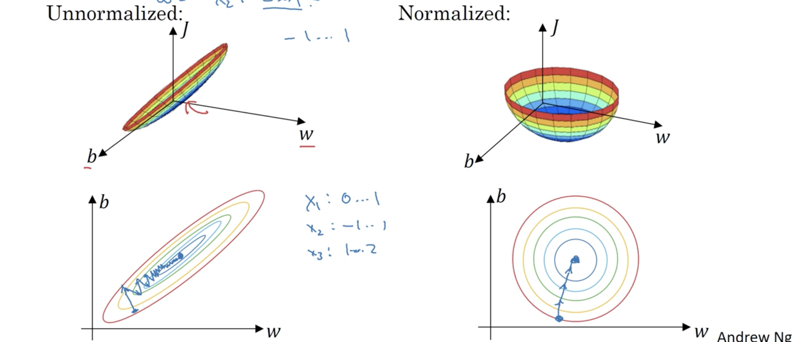

当然实际输入$\mathbf x$是高维向量，但在正规化后，代价函数都会变得更容易更快地优化。


##### 10. 梯度消失/爆炸

训练神经网络、尤其是非常深的网络时的一个难题时梯度消失/爆炸，即在训练时导数或斜率变得非常小/大，使得训练变得困难。比如下面这样一个神经网络：

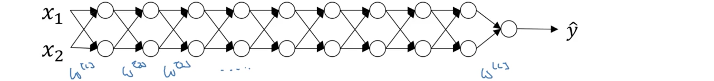

假定$g(z)=z$，$b^{(l)}=0$，因此就有$\hat y = \mathbf W^{[L]}\mathbf W^{[L-1]}\cdots\mathbf W^{[1]}x$，令$\mathbf W^{[l]}=\begin{bmatrix}1.5 & 0\\ 0 & 1.5\end{bmatrix}$，因此就有
$$
\hat y = \mathbf W^{[L]}
\begin{bmatrix}
1.5 & 0\\
0 & 1.5
\end{bmatrix}^{L-1}x
$$
$\hat y$随着网络深度指数增长，当神经网络非常深，也就是$L$很大时，$\hat y$就会爆炸。相反，令$\mathbf W^{[l]}=\begin{bmatrix}0.5 & 0\\ 0 & 0.5\end{bmatrix}$，此时
$$
\hat y = \mathbf W^{[L]}
\begin{bmatrix}
0.5 & 0\\
0 & 0.5
\end{bmatrix}^{L-1}x
$$
$\hat y$随着网络深度指数减小，当网络很深时，$\hat y$趋于0。所以当$\mathbf W^{[l]}>I$时，$\hat y$就会随网络深度指数变大；而$\mathbf W^{[l]}<I$时，就随深度指数减小。虽然这里用$\mathbf a^{[l]}$项来展示，但同样的结论也能在导数或梯度获得，也随着深度$L$指数变大或减小。当梯度随$L$指数减小时，梯度下降就会采取很小的步骤， 这样学习任何东西都需要很长的时间。


##### 11. 深度网络的权值初始化

深度网络的训练可能会有梯度爆炸/消失的问题，一个部分的解决的方法，虽然不能完全解决但也作用很大，是网络更好的初始化。

先看单个神经元的情况，假设$b=0$，则$z=w_1x_1+\cdots+w_nx_n$，为使$z$不太大也不太小，则$n$越大希望$w_i$越小，一种合理的做法是使得$w_i$的方差为$\frac1n$，即$\text{Var}(w_i)=\frac1n$，因此就可以设置：
$$
W^{[l]} = \text{np.random.randn(shape)}*\text{np.sqrt}\left(\frac1{n^{[l-1]}}\right)
$$
以上结论可以由$\text{Var}(aX)=a^2\text{Var}(X)$获得。而若使用ReLU激活函数，则需设置$\text{Var}(w_i)=\frac2n$更好，代码也做一下相应的调整。这时，若输入特征的激活值大略均值为0标准差为1，则会使得$z$也在同样的范围，这虽然不能解决、但也毫无疑问有助于减小梯度爆炸和消失的问题，因为它尝试使得权值矩阵$W$既不太大于1，也不太小于1，这样就不会太快地爆炸或消失。

在使用ReLU时设置的$\text{Var}(w_i)$为$\frac2{n^{[l-1]}}$，而对于激活函数tanh，则使用常数1，即方差为$\frac1{n^{[l-1]}}$，这种被称为**Xavier初始化**；还有一种是Bengio引入的$\frac2{n^{[l]}+n^{[l-1]}}$。实际中，所有这些公式都是给定一个出发点，给定一个权重的默认方差值。若希望这里的方差可以是其他值，则可以将这个乘子作为超参调节，然后用其他的值代入上面的公式。但相对于其他的超参，这个相对没那么重要。


##### 12. 梯度的数值近似

在实现反向传播时，梯度验证(gradient checking)有助于确保实现的反向传播是正确的。但首先要讨论梯度数值近似计算。如图函数$f(\theta)=\theta^3$的图像，对于其定义域上的任意一点$\theta$，可以选取其周围的两点，$\theta-\varepsilon$和$\theta+\varepsilon$；可以证明对于$f'(\theta)$，估计值$\frac{f(\theta+\varepsilon)-f(\theta-\varepsilon)}{2\varepsilon}$是比$\frac{f(\theta+\varepsilon)-f(\theta)}\varepsilon$更好的近似。因为前者考虑了$\theta$两边的情况，而后者仅考虑了一边。

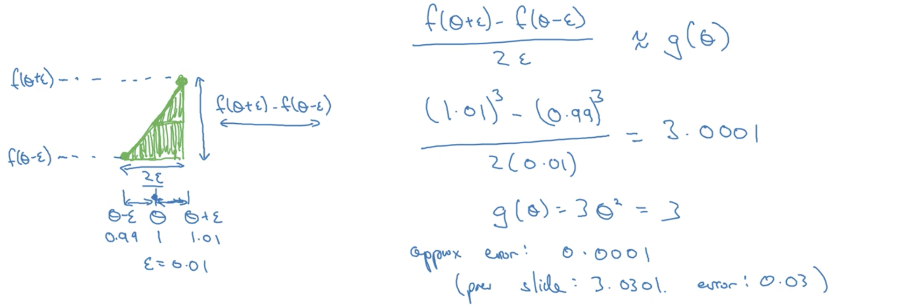

上图的例子中单边的误差为0.03，双边的误差为0.0001。虽然计算双边的可能需要更多的时间，但所获得的精度的提升也是值得的。根据导数的定义，两种方式的近似：
$$
\begin{aligned}
f'(\theta)&=\lim_{\varepsilon\to0}\frac{f(\theta+\varepsilon)-f(\theta-\varepsilon)}{2\varepsilon},\quad err\sim O(\varepsilon^2)\\
f'(\theta)&=\lim_{\varepsilon\to0}\frac{f(\theta+\varepsilon)-f(\theta)}{\varepsilon},\quad err\sim O(\varepsilon)
\end{aligned}
$$


##### 13. 梯度验证(gradient checking)

梯度验证有助于节省很多时间来找到反向传播实现中的问题。

- 梯度验证的第一步就是将权值$W^{[1]},b^{[1]},\dots,W^{[L]}, b^{[L]}$重塑、连接为一个大的向量$\theta$，此时有$J\left(W^{[1]},b^{[1]},\dots,W^{[L]},b^{[L]}\right)=J(\theta)=J\left(\theta_1,\theta_2,\dots\right)$；
- 然后将$dW^{[1]},db^{[1]},\dots,dW^{[L]},db^{[L]}$也重塑、连接为一个与$\theta$维度相同的大向量$d\theta$；

这样问题就变为$d\theta$是否是$J(\theta)$的梯度。接下来实现梯度验证（简写为Grad Check）：
$$
\begin{aligned}
&\text{for each i in }J(\theta_1,\theta_2,\dots):\\
&\qquad d\theta_{\text{approx}}[i] = \frac{J(\theta_1,\dots,\theta_i+\varepsilon,\dots)-J(\theta_1,\dots,\theta_i-\varepsilon,\dots)}{2\varepsilon}\quad\varepsilon=10^{-7}\\
&\qquad \text{Check: }\begin{aligned}
\frac{\lVert d\theta_{\text{approx}}-d\theta \rVert_2}{\lVert d\theta_{\text{approx}} \rVert_2 + \lVert d\theta \rVert_2} &\approx 10^{-7} \to \text{Great!}\\
&\approx 10^{-5} \to \text{Careful}\\
&\approx 10^{-3} \to \text{Worried}
\end{aligned}
\end{aligned}
$$


##### 14. 梯度验证实现贴士

这里分享一些使用的实际中实现梯度验证的贴士：

- 不在训练中使用梯度验证，只是调试的时候使用；因$d\theta_{\text{approx}}[i]$的计算很慢，一旦调试结束，就应关闭；
- 如果算法没有通过梯度验证，查看权重成分来找到问题，也就是找到在哪个$d\theta_{\text{approx}}[i]$上失败了；
- 若用到了规则化，记得在做梯度验证前规则化；
- 不能与dropout同时工作；通常先用没有dropout的梯度验证调试；然后在训练的时候再打开dropout。
- 在随机初始化上运行，可能在一些训练后再试一次。