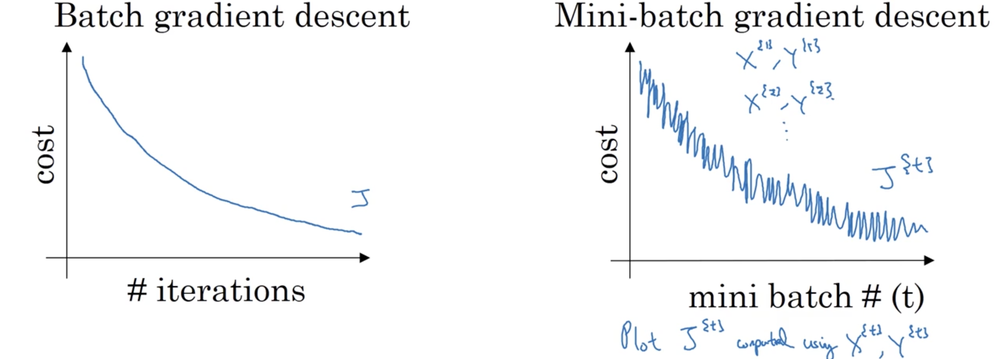
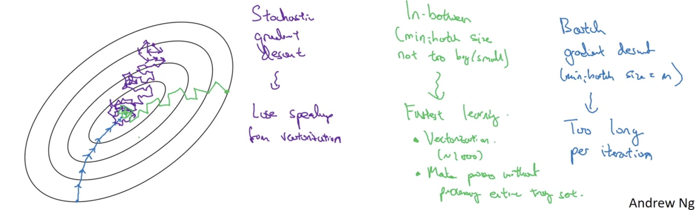
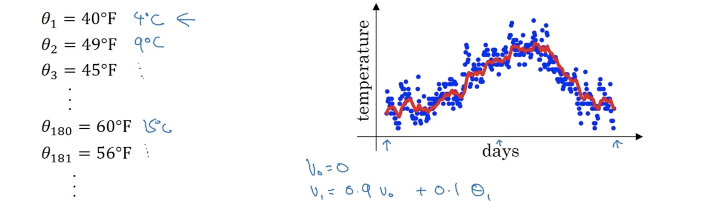
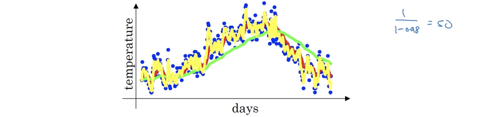
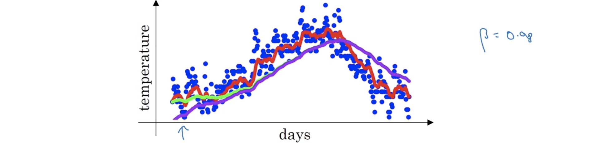
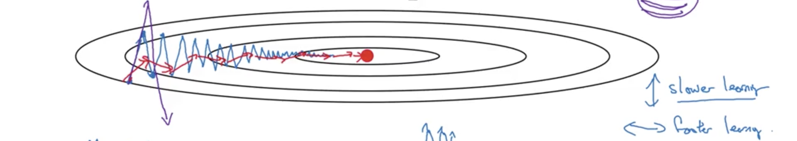
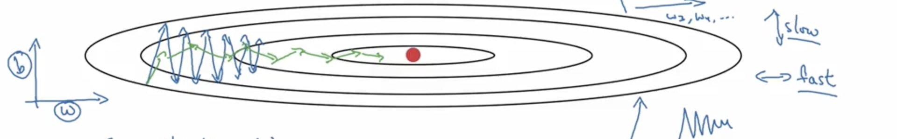
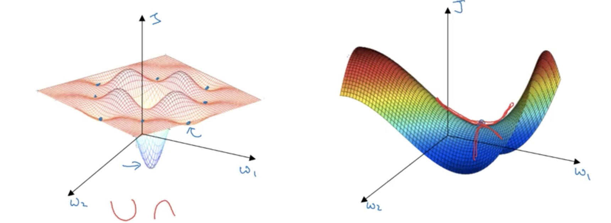
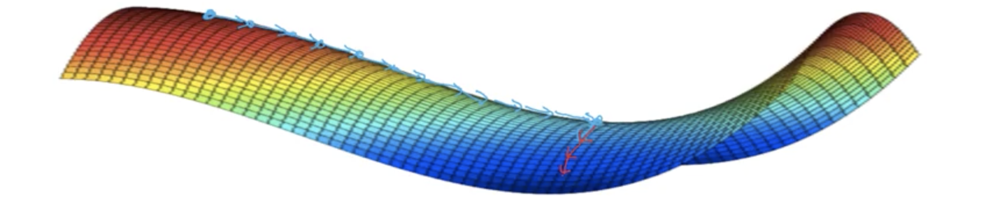

##### 1. 小批次(mini-batch)梯度下降

应用机器学习是一个高度经验、迭代的过程，需要训练多个模型并找到最优的。而深度学习在大数据领域效果最好，因为能在海量数据上训练神经网络，但在大数据集上的训练很慢。而快速的最优化算法可以真正地加速这个过程。

前面已学到向量化能高效的计算所有$m$个样本，但当$m$非常大时，运行依然十分缓慢。比如若有50000000个数据，当在整个训练集上实现梯度下降时，在取得梯度下降的一小步进展前必须处理整个数据集。事实证明在结束处理整个训练集前让梯度下降开始做有一些进展，能够得到一个更快的算法。

可以这样操作：将训练集$X$分裂成一些更小的子训练集，而这些子训练集就被称为小批次(mini-batches)。假定每个批次有1000个样本。其中第$t$个批次，可能是$\left[x^{(1000(t-1)+1)},\cdots,x^{(1000(t-1)+1000)}\right]$，记为$X^{\{i\}}$，因此$X=\left[ X^{\{1\}},\cdots,X^{\{5000\}} \right]$。对$Y$也进行同样的操作，$Y=\left[ Y^{\{1\}},\cdots,Y^{\{5000\}} \right]$。而小批次$t$就是$X^{\{t\}},Y^{\{t\}}$。在小批次梯度下降中，一次同时训练整个小批次的训练样本。因此执行过程就是：
$$
\begin{aligned}
&\text{for t=1},\cdots,\text{5000:}\\
&\qquad \text{# use }X^{\{t\}},Y^{\{t\}}\text{ do 1 step of gradient descend}\\
&\qquad \text{Forwardprop on }X^{\{t\}}\text{ with vectorization}\\
&\qquad\qquad Z^{[1]} = W^{[1]}X^{\{t\}} + b^{[1]}\\
&\qquad\qquad A^{[1]} = g^{[1]}\left(Z^{[1]}\right)\\
&\qquad\qquad\vdots\\
&\qquad\qquad Z^{[L]} = W^{[L]}X^{\{t\}} + b^{[L]}\\
&\qquad\qquad A^{[L]} = g^{[L]}\left(Z^{[L]}\right)\\
&\qquad \text{Compute cost function }J^{\{t\}}=\frac1{1000}\sum_{i=1}^{1000}\mathcal L\left(\hat y^{(i)},y^{(i)}\right) + \frac{\lambda}{2\times1000}\sum_{l}\left\Vert W^{[l]} \right\Vert_F^2\\
&\qquad \text{Backprop to compute gradients w.r.t }J^{\{t\}}\\
&\qquad W^{[l]} = W^{[l]} - \alpha dW^{[L]},\quad b^{[l]} = b^{[l]} - \alpha db^{[l]}
\end{aligned}
$$
上面的代码也被称为**"one epoch"**的训练，也就是将整个数据集、即5000个小批次都训练一次。其中epoch表示单词通过训练集的单词。在批梯度下降中，单次通过整个训练集仅采取了一步的梯度下降，而在小批次梯度下降中，单词通过整个训练集，也就是一个epoch中，可以采取5000步的梯度下降。当拥有很多训练数据时，小批次梯度下降比批梯度下降快很多，大多数人在训练大数据集时都会使用。

##### 2. 理解小批次梯度下降

在批梯度下降中，每一步通过整个数据集的迭代都被希望代价函数（设为$J$）下降（下图左侧），因此$J$应该在每一次迭代中欧下降。若在某次迭代中上升了，则必定发生了错误，可能学习率太大了。而在小批次梯度下降中，可能并不会在每次迭代后都下降。尤其是在每次迭代中会处理某个$X^{\{t\}},Y^{\{t\}}$计算$J^{\{t\}}$，就像每一次迭代都在不同的训练集上训练，所以绘出的$J$图像就会以更多的噪声下降。因此在每一步未下降都可以，但总的趋势必须是下降的（下图右侧）。会有噪声是因为，$X^{\{1\}},X^{\{1\}}$可能是相对简单的小批次，因此代价就会低一点，而$X^{\{2\}},X^{\{2\}}$有可能是比较难的小批次，因此在描绘$J$的函数图像时就得到了这种振荡。

现在要选择的一个参数是小批次的尺寸。有下面两种极端情况：

- 一种是，若$\text{mini-batch size}=m$，则就是批梯度下降(batch gradient descend)，此时$\left(X^{\{1\}},Y^{\{1\}}\right)=(X,Y)$；
- 另种是$\text{mini-batch size}=1$，则就是随机梯度下降(stochastic gradient descend)，每个样本就是一个小批次，即$\left(X^{\{t\}},Y^{\{t\}}\right)=\left(x^{(t)},y^{(t)}\right)$；

现在看一下这两种在极端情况在最优化代价函数所做的事情。假设下图左侧是代价函数的等高线，最小值在中心；批梯度下降可能从某个位置开始，能以某个相对低噪声、大步骤持续向最小点行进；相反，随机梯度下降从某个点开始，然后每步迭代都只是单个样本的梯度下降，所以大多数时间撞到全局最小，但有时撞到一个错误的方向，因此随机梯度下降会极端地有噪声，平均而言会采取正确的方向，但有时会是错误的方向。因为随机梯度下降不会收敛，总是会振荡并在最小点的区域游荡，但不会朝向最小值并停留在那里。

实践中，小批次的尺寸在1和$m$之间。若使用批梯度下降，则每次迭代都是处理一个巨大的训练集，所以主要的缺点是要花费太多的时间；相反，若使用随机梯度下降，好处是每处理一个样本后都能取得进展，而噪声仅通过使用更小的学习率就能获得改善。但最主要的缺点是失去了向量化的加速，因每次都处理单个样本，这种处理每个样本的方法是非常低效的。因此最好的是两者之间，一个不大不小的小批次尺寸最有效，这样算法就能更快地学习，一方面是使用向量化，另一方面不用等太久；虽然不能保证每步都朝向最小值，但总的趋势是在最小值的方向上。它可能不总会正好收敛或者在很小的区域振荡，这个问题总是可以通过慢慢减小学习率解决。

那具体该如何选择小批次的尺寸呢？下面是一些直到原则：

- 若数据集比较小，则使用批梯度下降就好，$m\le2000$的数据集可能是最适于的；
- 否则，通常使用小批次的梯度下降，批次的大小大多数都在从64到512之间；根据电脑存储和获取数据的设计，使用2的指数大小的小批次可能运行地更快；
- 确保小批次$X^{\{t\}},Y^{\{t\}}$适配CPU/GPU的存储器。这实际取决于应用以及单个训练样本的大小；但若处理实际并不适配CPU/GPU存储的小批次，则性能可能会突然断崖式下跌变得极糟。

实际中小批次的大小是有一个超参，需要做一个快速搜索来找到最充分减小代价函数$J$的值。作者的常用做法是尝试一些值，即一些2的幂次，找到使梯度下降最优化算法下降尽可能高效的值。

##### 3. 指数加权均值(exponentially weighted averages)

有一些快于梯度下降的最优化算法，而为了理解这些算法，就必须能使用指数式加权均值，在统计中也被称为指数加权移动均值。下图是一个气温数据的散点图，看起来似乎有一点噪声，而希望计算趋势，温度的局部均值或移动均值(moving average)。可以这样操作：初始化$v_0=0$，然后：
$$
\begin{aligned}
v_0 &= 0,\\
v_1 &= 0.9v_0 + 0.1\theta_1,\\
v_2 &= 0.9v_1 + 0.1\theta_2,\\
v_3 &= 0.9v_2 + 0.1\theta_3,\\
&\vdots\\
v_t &= 0.9v_{t-1} + 0.1\theta_t,\\
&\vdots
\end{aligned}
$$
若计算这些值并描绘出来，所得到就是图中的红线部分，也就是移动均值或指数加权均值。

回看刚才的公式，$v_t = \beta v_{t-1} + (1-\beta)\theta_t$，后面会证明，在计算这些值的时候，可以将$v_t$近似视为前面$\frac1{1-\beta}$个$\theta$上的均值。例如上面的$\beta=0.9$，就可以看成是前10天气温的均值，也就是下图红线部分；若令$\beta=0.98$，就是前50天气温均值的近似，描绘出来就是图中绿线部分。注意这个很高的$\beta$值的一些特性，描绘出来的曲线起伏较少更加平滑，因为平均了更多天的气温；但另一方面，曲线也向右更深地偏移了，因为平均了更大窗口的气温。通过对更大窗口气温的平均，这个公式、指数加权均值在温度改变时就调整地更慢。因此，有更多一点的潜伏。原因是当$\theta=0.98$时，就给前面的值很大的权重，而给当前的观测值$\theta_t$像0.2这样很小的权重。因此当气温改变时，当$\beta$如此大时，指数加权均值调整很慢。

另一方面，当$\theta$相对较小，比如0.5时，就平均两天的气温，描绘出的曲线就是下图的黄线部分。对这样一个小得多的气温窗口就均值，噪声就很大，对更容易受异常值影响，但当温度改变时调整得很快。因此，公式$v_t = \beta v_{t-1} + (1-\beta)\theta_t$就是实现指数加权均值的方法。

##### 4. 理解指数加权均值

指数加权均值几种训练神经网络优化算法的关键部分。实现指数加权均值的关键公式是$v_t=\beta v_{t-1} + (1-\beta)\theta_t$，假定$\beta=0.9$，可以有：
$$
\begin{aligned}
v_{100} &= 0.9v_{99}+0.1\theta_{100}\\
v_{99} &= 0.9v_{98}+0.1\theta_{99}\\
&\cdots
\end{aligned}
$$
展开$v_100$，可以得到：
$$
\begin{aligned}
v_{100} &= 0.1\theta_{100} + 0.9v_{99}(0.1\theta_{99}+0.9(0.1\theta_{98}+0.9(\cdots)))\\
&= 0.1\theta_{100} + 0.1\times0.9\theta_{99}+0.1\times(0.9)^2\theta_{98}+0.1\times(0.9)^3\theta_{97}+0.1\times(0.9)^4\theta_{96}+\cdots
\end{aligned}
$$
这就是在过去100天计算$v_{100}$的指数加权均值的实际方法，权重系数$0.1\times(0.9)^t$是一个指数衰减函数(exponentially decay function)，可以证明所有这些权值加起来为或非常接近一个称为偏差纠正(bias correction)的值，这里为1。那究竟平均了多少天的温度呢？$0.9^{10}\approx\frac1e$，或者更一般的$(1-\varepsilon)^{\frac1\varepsilon}\approx \frac1e$，其中$\varepsilon$是很小的正数。因此当$\beta=0.9$时，经过10天，权值衰减为$\frac13$左右，之后权值就衰减得很快，这样指数加权均值就集中在过去10天。但这只是用经验规则来考虑它，并非正式的数学陈述。它的实现方法为：
$$
\begin{aligned}
&v_\theta = 0\\
&\text{Repeat:}\\
&\qquad\text{Get the next }\theta_t\\
&\qquad v_\theta = \beta v_\theta + (1-\beta)\theta_t
\end{aligned}
$$
指数加权均值的一个优势是所需的存储很少，只需在内存中存储一个实数，然后根据最新的值不断将其重写。事实上就是这个原因，高效—计算指数加权均值基本只需一行代码和一个实数存储，虽然不是最好最精确计算均值的方法，比如用一个10或50的窗口去计算均值会给出一个更好的估计，但需要保存所有窗口大小的值，需要更多的存储，更复杂的实现，和更多的计算消耗。对于需要计算很多变量均值的任务，这是在计算和存储上都十分高效的方法，也是在机器学习中被广泛使用的原因。更不必提只需一行代码。

##### 5. 指数加权均值中的偏差纠正(bias correction)

偏差纠正能使指数加权均值的计算更精确。前面已经讲过，下图中，$\beta=0.9$时是红色曲线，$\beta=0.98$时是绿色曲线。但事实上当$\theta=0.98$时，若像所写地那样执行公式$v_t=\beta v_{t-1}+(1-\beta)\theta_t$，实际上并不会得到绿色曲线，而是紫色的这条。可以看到紫色的曲线开始时的值很低，后面则与绿色的重合。

为何会这样呢。观察实现$v_t$的步骤：
$$
\begin{aligned}
v_0 &= 0\\
v_1 &= 0.98v_0 +0.02\theta_1 = 0.02\theta_1\\
v_2 &= 0.98v_1 +0.02\theta_2 = 0.0196\theta_1+0.02\theta_2\\
\end{aligned}
$$
因此这样刚开始计算时的值会比预期的要小很多。一种改进这个估计更精确、尤其是在初始阶段更精确的方法是不取直接计算的$v_t$，而取$\frac1{1-\beta^t}$作为估计，**但依然用原来的公式计算$v_t$**；因此当$t=2$时，估计就变为$\frac{0.0196\theta_1+0.02\theta_2}{0.0396}$，这样就去除了误差；而当$t$变得很大时，$\beta^t$就变得很小，因此偏差纠正对这时的值就没有太大的影响，与直接取$v_t$的值没什么差别。这也是当$t$很大时，绿色与紫色曲线重合的原因，但$v_t$在初始阶段，仍需要一个热身。因此偏差纠正就有助于曲线从紫色到绿色的修正。在机器学习中，有些人愿意等到指数加权均值变得正确，就不做偏差纠正；但若死亡早期的估计更精确，就可以尝试偏差纠正。

##### 6. 基于动量(momentum)的梯度下降

算法动量或基于动量的梯度下降几乎总是快于标准梯度下降算法。一句话概括，基本想法就是计算梯度的指数加权均值，然后用这个梯度来更新权值。假设要优化下图等高线所示的价值函数，从一个位置开始梯度下降，采取一次梯度下降的迭代，然后到另一个位置，但相对于原来的椭圆，现在到了小椭圆的另一边，在采取一步梯度下降后，可能就到小椭圆与初始同一边的位置，然后这样一步步迭代；梯度下降会采取很多步，慢慢地朝向最优点振荡过去。这种上下振荡会减慢梯度下降，并阻碍使用更大的学习率。当使用太大的学习率时，就有可能迈过头而发散。因此为阻止使振荡过大就不能使用太大的学习率。

另一种看待这个问题的方式是在垂直方向上，希望学习慢一点，因为不想要那些振荡；但在水平方向上，又希望更快的学习，因为希望更快地从左向右移动到最小点。而基于动量的梯度下降的做法是：
$$
\begin{aligned}
&\text{Momentum: }\\
&v_{dW}=0,v_{db}=0\\
&\text{On each iteration }t:\\
&\qquad\text{Compute }dW,db\text{ on current mini-batch/batch}\\
&\qquad v_{dW} = \beta v_{dW} + (1-\beta)dW\\
&\qquad v_{db} = \beta v_{db} + (1-\beta)db\\
&\qquad W = W - \alpha v_{dW}, b = b - \alpha v_{db}\\
\end{aligned}
$$
指数加权均值所做的就是平滑梯度。假设刚刚计算了一些导数，将这些梯度平均就会发现垂直方向的振荡就会倾向于更接近0；因此希望减慢速度的垂直方向，就会将正负值平均，均值就会接近于0。而在水平方向，所有的导数都指向正确，因此水平方向的均值依然会比较大。这也是为什么这个算法，通过一些迭代，可以发现基于动量的梯度下降采取的是在垂直方向小得多的振荡、而在水平方向则是更直接的快速移动。这就使得算法以更直接的路径，在这个路径上振荡渐次减弱地到最优点的原因。

动量的一个直觉是，若想最小化碗状函数，可以将$dW$，$db$这些导数项提供从上滚落下来的加速度。而动量项$v_{dW}$、$v_{db}$表示速度。想象一个球在碗的边缘要滚落下来，导数给这个小球加速度，小球就会越来越快；而$\beta<1$，扮演摩擦力的角色，防止球无限加速。因此不像梯度下降将每个单步都独立于前面的所有步，现在球能滚落加速向下因此获得动量。

最后来看看一些实现这个算法的细节。现在就有了两个超参：学习率$\alpha$和参数$\beta$。$\beta$最常用的值是0.90，平均前10个迭代的梯度。当然也可以尝试其他做一些参数搜索，但0.9表现得十分鲁棒。而对于偏差纠正，实践中并不常使用，因为经过10步迭代以后，移动均值已经热过身而不再是一个有偏估计。

另外提一下，在动量文献中，经常会看到省略$(1-\beta)$项，这时就是$v_{dW} = \beta v_{dW} + dW,v_{db} = \beta v_{db} + db$，而使用这个版本的$v_{dW}$和$v_{db}$的净影响是$v_{dW}$被一个$1-\beta$或实际$\frac1{1-\beta}$的因子缩放，所以在执行参数更新时，$\alpha$也需要相应地通过$1-\beta$改变。实际中，这两种都有效， 仅仅影响学习率的最优值。但这个公式会不那么直观，因为一个影响是对$\beta$调参后，也会影响$v_{dW}$和$v_{db}$的尺度，这样就可能需要重新调整$\alpha$，所以个人而言更喜欢用前面的版本。 这两个版本的常用值都是0.9，只是$\alpha$需要做不同的调参。

##### 7. RMSprop

除了动量，RMSprop，也就是根均方(root mean square)传播，也能加速梯度下降。回忆前面提到的例子，梯度下降又可能在垂直方向巨幅振荡，即便只是想在水平方向取得进展。假定垂直坐标记为$b$，水平方向记为$w$，希望减慢在$b$上的学习，加速或至少不减慢水平方向的学习。这就是RMSprop要实现的。具体的做法是：
$$
\begin{aligned}
&\text{RMSprop: }\\
&s_{dW}=0,s_{db}=0\\
&\text{On each iteration }t:\\
&\qquad\text{Compute }dW,db\text{ on current mini-batch/batch}\\
&\qquad s_{dW} = \beta s_{dW} + (1-\beta)dW^2\\
&\qquad s_{db} = \beta s_{db} + (1-\beta)db^2\\
&\qquad W = W - \alpha\frac{dW}{\sqrt{s_{dW}}}, b = b - \alpha\frac{db}{\sqrt{s_{db}}}\\
\end{aligned}
$$
其中$dW^2$是元素的相乘。所以实际做的就是计算一个导数平方的指数加权均值。上面的例子中，希望在水平方向即$w$轴能快速学习；而在垂直方向即$b$轴减慢以降低振荡。因此就$s_{dW}$和$s_{db}$两项而言，希望$s_{dW}$相对较小，这样更新时就除以一个较小的值；而希望$S_{db}$相对较大，因此更新时除以相对较大的数，这样就能减慢垂直方向的速度。事实上观察导数，这些导数在垂直方向远大于水平方向，导数就是很大的$db$和相对较小的$dW$，$dW^2$也相对较小，这样$s_{db}$就相对较大，$s_{dW}$就想对较小。效果就是垂直方向的更新除以一个较大的数，因此有助于渐次减弱振荡；同时水平方向的更新除以一个较小的值。因此使用RMSprop的效果就是更新看起来是下图中绿线的路径：垂直方向变小，水平方向保持前进；另一个效果是可以使用更大的学习率来加快学习。这里为了展示清晰使用了$b$和	$w$坐标轴，实际中都是非常高维的向量，但直观的感觉都是在振荡的维度，计算一个更大的和，导数平方的指数加权均值，因此就渐次减弱了这些振荡。这就是RMSprop，均方根传播，因为$dW^2$平方了导数，最后又除以了它的方根。

最后提一下，下个视频会讲解将RMSprop和动量组合起来，所以这里使用$\beta_2$来标记参数以免与动量中的$\beta$冲突。另外，为了确保在除以$\sqrt{s_{dW}}$时没有除以一个零，即确保数值的稳定性，会在分母上加上一个非常小的$\varepsilon$ ，$10^-8$就是一个不错的默认值。这就是RMSprop，与动量一样渐次减弱梯度下降时的振荡，使得算法可以使用更大的学习率$\alpha$，从而加速算法的学习。

##### 8. Adam优化算法

RMSprop和Adam已经在广泛的深度学习架构表现出了良好的工作性能，而Adam优化算法基本上是将动量和RMSprop结合起来。它的实现是：
$$
\begin{aligned}
&\text{Adam: }\\
&V_{dW}=0,S_{dW}=0,V_{db}=0,S_{db}=0\\
&\text{On each iteration }t:\\
&\qquad\text{Compute }dW,db\text{ on current mini-batch/batch}\\
&\qquad V_{dW} = \beta_1 V_{dW} + (1-\beta_1)dW, \quad V_{db} = \beta_1 V_{db} + (1-\beta_1)db\\
&\qquad S_{dW} = \beta_2 S_{dW} + (1-\beta_2)dW^2,\quad S_{db} = \beta_2 S_{db} + (1-\beta_2)db^2\\
&\qquad\text{# Typically adam implememt bias correction}\\
&\qquad V_{dW}^{\text{corrected}} = \frac{V_{dW}}{1-\beta_1^t},\quad V_{db}^{\text{corrected}} = \frac{V_{db}}{1-\beta_1^t}\\
&\qquad S_{dW}^{\text{corrected}} = \frac{S_{dW}}{1-\beta_2^t},\quad S_{db}^{\text{corrected}} = \frac{S_{db}}{1-\beta_2^t}\\
&\qquad W = W - \alpha\frac{V_{dW}^\text{corrected}}{\sqrt{S_{dW}^{\text{corrected}}}+\varepsilon}, \quad b = b - \alpha\frac{V_{db}^{\text{corrected}}}{\sqrt{S_{db}^{\text{corrected}}}+\varepsilon}\\
\end{aligned}
$$
因此这个算法就是结合了动量和RMSprop的效果。这是一个已证明在大量不同的神经网络架构上非常有效并广泛应用的算法。这个算法有多个超参：

- 学习率$\alpha$依然重要，需要做调参；
- 常用的$\beta_1$默认选择是0.9，计算$dW$和$db$的移动均值；
- 而参数$\beta_2$，Adam算法的发明人推介为0.999，计算$dW^2$和$db^2$的移动均值；
- 对于参数$\varepsilon$，Adam的作者推介$10^-8$，但实际上不设置对性能的影响也不大。

因此在实现Adam算法时，通常都使用$\beta_1,\beta_2$以及$\varepsilon$的默认值，调试$\alpha$值。Adam这个称呼来自Adaptive Momentum Estimation，$\beta_1$计算导数的指数加权均值，被称为第一动量；$\beta_2$计算导数平方的指数加权均值，被称为第二动量，因此给出了这个名字。

##### 9. 学习率衰减(decay)

加快学习算法的方法之一是随时间缓慢地减小学习率，即学习率衰减。假定实现小批次梯度下降，当迭代时，梯度下降的步子可能会有些噪声，会趋向于向最优值移动，但可能不会正好收敛而是在附近游荡，因为在小批次中有一些噪声而学习率又是固定的。但若缓慢地减少学习率，在学习的初始阶段，学习率还是比较大，依然还是有比较快的学习；但随着$\alpha$逐渐减小，采取的步子就会逐渐变小，因此就在最优值周围更紧密的区域振荡，而非游荡到很远的地方。因此逐渐减小$\alpha$背后的直觉，就是在学习的初始步骤，可以承担更大的步骤，但随着学习接近收敛，更小的学习率会采取更小的步子。

一个epoch就是对数据集的一次训练，因此可以将$\alpha$设置为$\alpha=\frac{\alpha_0}{1+{\text{decay-rate}}*\text{epoch-num}}$，这里$\text{decay-rate}$又是一个需要调整的参数。因此要使用学习率衰减，就要尝试很多超参$\alpha_0$和$\text{decay-rate}$的值，找到效果良好的值。除了这个公式，还有其他一些使用学习率衰减的方法：

- $\alpha=0.95^{\text{epoch-num}}\alpha_0$，这是指数式衰减；
- $\alpha = \frac{K}{\sqrt{\text{Epoch-num}}}\alpha_0$或$\alpha = \frac{K}{\sqrt t}\alpha_0$；
- $\alpha=\frac{\alpha_0}{2^{\text{epoch-num}}}$，离散阶梯；
- 或者训练过程中手工调整。

现在有很多控制学习率$\alpha$的选项，对于讲师而言，指数衰减处于他会尝试的清单的下层；设定$\alpha$，固定的$\alpha$，有巨大的影响，指数衰减会有帮助，但可能处在选项的后部。

##### 10. 局部最优值问题

在深度学习的早期，很多人都担心优化算法会现在差的局部最优值中。 但随着深度学习理论的发展，对于局部最优值的理解也在发生变化。下图的左侧曾是人们在担心局部最值内心的画面。图中有很多的局部最值，都很容易使优化算法陷入其中。其实若像这样描绘一幅二维的图，很容易产生像这样有很多局部极值的图像。而这些低维的图像层用于引导这种直觉。但这种直觉可能并不正确， 事实证明在训练神经网络时，大多数的0梯度点并非如左侧那样，而是右侧那样的鞍点。通俗地说，一个非常高维空间的函数，若梯度为0，则在每个方向上，可能是类凸的也可能是类凹的。则比如对一个2000维空间，若是像左边那样的局部最值点，需要所有的2000个方向上都是同凹或同凸，因此这个发生的概率很小。相反有很大的可能是一些方向的曲线向上弯曲，而一些则向下，这就是在非常高维的空间，实际更有可能遇到的是右边那样的鞍点。

在深度学习历史中我们学到的教训之一就是很多像上图左边那样的在低维空间的直觉并不能迁移到非常高维度的空间中。若局部最值并不是问题，那问题是什么呢？事实是高原(plateau)实际会减慢学习。而所谓的高原就是导数长期接近0的区域。若处在这个区域，表面非常平缓，可能需要很长的时间去找到低点（下图中蓝色箭头线部分），然后可能一个或左或右的随机摄动(perturbation)，最终算法找到离开平缓区域的途径（下图中红色尖箭头线部分）。算法花费了很长时间才找到离开平缓区域的途径。

因此总结这些的内容就是：

- 实际并不太可能会陷入局部最值，只要训练一个合理大小的神经网络，存储许多参数，而代价函数$J$也定义在相对很高维的空间中；
- 但高原可能会使得学习的速率变得相当慢，这就是动量、RMSprop或Adam能帮助学习算法的地方。而这些就是更复杂的优化算法能实际离开高原加快速率的场景。
