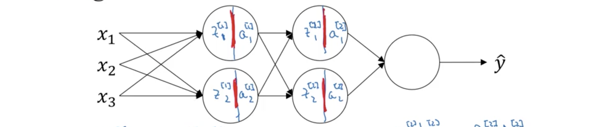
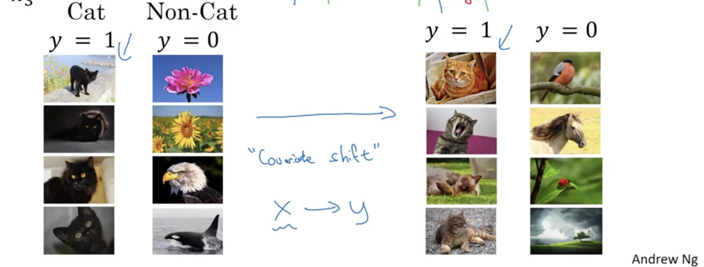
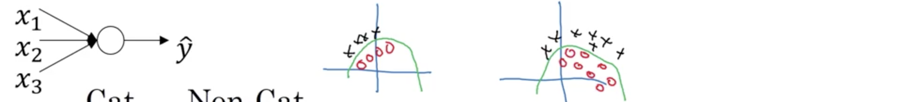
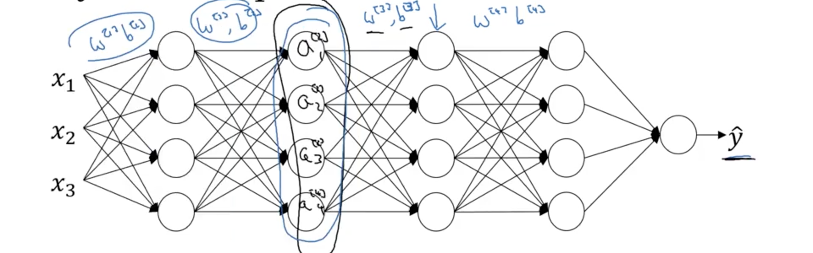
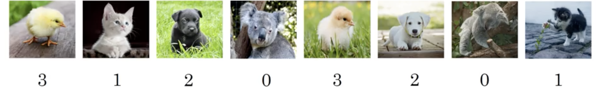
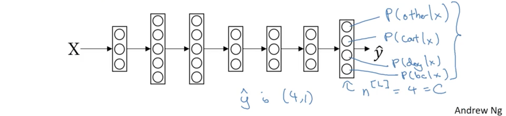
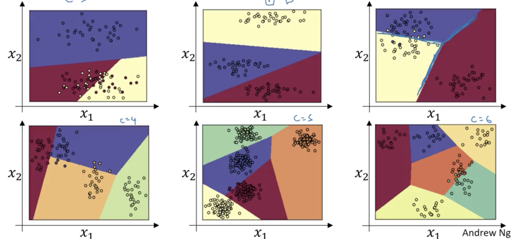

##### 1.调试过程

训练深度网络最艰难的事之一便是需要调节大量的参数。对于讲师而言，其中最重要的参数便是学习率$\alpha$；除此之外，还有动量项$\beta$、小批次尺寸$\text{minibatch-size}$、隐单元数量是第二重要的参数；第三重要的才是层数、学习率衰减的衰减参数。当使用Adam算法时，实际很少调整$\beta_1,\beta_2,\varepsilon$。但这并非固定规则，不同的深度学习从业者可能有不同的直觉。

在机器学习的早期，若果有两个超参需要调节，常用的实践是在两个参数的一些选项张成的网格中采样，然后系统地探索这些值，然后选择效果最好的值。这种方法在超参相对较少时没有问题，但在深度学习中，推介的方式是随机选择参数空间一些点，然后尝试这些随机选择的值。这样做的原因是很难提前知道哪个参数在所解决的问题中是最重要的。举个极端的例子，假若一个参数是学习率$\alpha$，另一个是Adam中的$\varepsilon$，各取它们的五个值张成一个$5\times5$的网格。然后在这个网格上系统采样，然后发现同一个$\alpha$的五个$\varepsilon$值给出几乎相同的答案。这样训练25个模型，仅获得了5个真正重要的$\alpha$值。而相反，若在参数空间随机采样，就会尝试25个不同$\alpha$的值，更有可能找到实际表现良好的值。实践中超参可能会非常多，有时很难提前知道哪一个是真正重要的，因此随机地采样而非使用网格确保对最重要的参数能更丰富地探索可能的值。

当对超参采样时，另一个常用的实践是使用粗糙到细腻(coarse to fine)的采样模式。比如在参数空间中采样了一些点，然后发现其中一个点表现最好，其周围的一些点也表现良好，则在coarse to fine模式中就会聚焦这个小区域然后在这个空间内更密集地随机采样。也就是在对整个空间进行粗略采样后，聚焦一个小的区域。在尝试这些不同的值后，就可以选择一个爱训练集或发展集上最好的参数集。

所以参数调试过程中最重要的两点就是随机采样而非网格搜索，（可选地）考虑实施coarse to fine搜索过程。


##### 2. 使用合适的比例来选择超参

在超参范围的随机采样能高效地搜索超参空间，但随机采样并不意味着在所有有效值范围上一致(uniformly)随机采样， 相反，选择合适的范围在此之上探索超参，假设要挑选给定网络层$l$隐单元的个数$n^{[l]}$，不妨说良好的范围是从50到100。这种情况下，查看50到100的数轴，可能在这个数轴内随机选一些值是很直观的搜索这个超参的方法。这是在参数有效值范围内一致随机采样合理的例子。 但并

非对所有的超参都成立。假定要搜寻超参$\alpha$，假定怀疑0.0001可能在最小端，并可以大到1。此时画0.0001到1的数轴，一致随机地采样，有90%的可能所挑选的值在0.1到1之间。也就是用90%的资源在0.1到1之间搜索，只用了10%在0.0001到0.1。这似乎并不正确，在对数比例上搜索似乎才更合理，此时在对数比例上一致采样，这样就有更多的资源投入0.0001到0.001、0.001到0.01。在python中的实现方法是：

```python
r = -4 * np.random.rand()
alpha = np.exp(alpha, r)
```

对于一般的值$[a,b]$，对数比例的两端是$[\log a, \log b]$，然后在$\log 𝑎$和$\log b$之间一致采样$r$，然后将$\alpha$设置为$10^\alpha$。

最后，另一种情况是对用来计算指数加权均值的超参$\beta$采样。假定怀疑$\beta$在0.9和0.999之间。当$\beta$为0.9时，相当于平均过去10天的值，而$\beta$为$0.999$时是平均过去1000天，因此在0.9和0.999之间一致采样并不合理，最好的方法是搜索$1-\beta$的值，因此范围就是0.001到0.1。使用前面的对数刻度，在[-3,-1]之间一致随机采样$r$，然后设$\beta$为$1-10^r$。因此就投入了相同的资源来探索[0.9,0.99]和[0.99,0.999]。至于为什么在[0.9,0.999]之间一致采样是糟糕的想法，是因为当$\beta$接近于1时，即便是对$\beta$很小的改变，结果的改变也非常敏感。比如$\beta$从0.9变到0.9005，对结果的影响并不大，差不多都是平均前面10个值；但若$\beta$从9.999变为0.9995，对结果的影响非常巨大，从平均前面1000个值变为平均前面2000个值。因此整个过程所做的就是在$\beta$接近1的区域更密集地采样。

不过假如在某些超参的选择上并没有使用正确的刻度，也不必过于担心，即使是一致采样，也会得到可行的结果。尤其是使用coarse to fine搜索，在后面的搜索中就会在最重要的区域关注地更多。


##### 3. 超参调节实践

深度学习现在已应用在了许多领域；一个应用领域超参设置的直觉可能无法迁移到另一个。在不同应用领域中有很多交殖， 比如视觉社区发展出来的卷积网络和残差网络在语音中也得到了成功的应用。因此深度学习一个良性发展是来自不同应用领域的人日益阅读来自其他应用领域的文章来寻找灵感。但就超参的设置而言，这种直觉就显得过时。即便只是解决一个问题，可能找到了一个好的超参集，并用来持续优化算法，或者几个月后数据集逐渐变了，或仅仅是数据中心更新了服务器，因为这些变化，超参的设置就可能变得过时。因此建议至少几个月重测试或重评估超参，以确保对所有的值依然满意。

最后，可能有两种主要的方法人们用来搜索超参。一种方法是精心照看一个模型，通常这样做是因为有大量的数据但没有很多计算资源，所以基本只能一次训练一个或少量的模型。这种情况下，每天照看那个模型，即便它正在训练。比如，在第0天，可能是随机初始化参数然后开始训练；然后紧盯着学习曲线，可能是代价函数$J$或数据集误差，或其他事物，第一天后逐渐减小，在第一天结束时，可能会觉得学得很好，希望尝试将学习率提高一点来观察其情况；可能在第二天效果更好，然后觉得学得很好，可能可以将动量深入一个或者减小一点学习率；然后是第三天，每天都查看训练的模型并尝试着轻微地上下调整参数。所以就是每天照看模型一次即便处是在几天甚至几周的训练中。这就是第一种方法，人们精心照看一个模型、观察效果并耐心地微微上下调整超参。这发生在没有足够计算资源来同时训练多个模型时。

另一种方法就是并行训练多个模型。可能已经有了一些超参的设定，让模型自己运行一个或几天，然后就得到了学习曲线，同时可能用不同的超参设定开始一个不同的模型，因此第二个模型可能生成不同的学习曲线，同时可能训练第三个模型，也产生一个学习曲线；可能训练更多的模型，这样同时并行训练多个模型，尝试许多不同的超参设定，然后最后快速选择一个效果最好的。

做一个类比，第一个方法被称为熊猫方法，因为熊猫生孩子时，只会生产很少的孩子，通常是一次一个，他们实际会投入相当大的努力来确保小孩存活，这就是照看方法，一次一个模型；而第二种则更像是鱼的行为，被称为鱼子酱策略，一些鱼会在一个交配季节生产超过一亿个卵，但并不对任何一个花太多的注意，仅希望它们中的一些可以表现良好。这也是哺乳动物生产后代和鱼类或爬行动物生产后代之间的区别。而这两种方法的选择是基于所有的计算资源。


##### 4. 网络中的正规化激活值

在深度学习出现时，**批正规化(batch normalization)**是最重要的算法之一。批正规化能极大简化超参搜索问题，使得神经网络更加稳健(robust)、网络能在更大范围的超参上能运行良好，也使得非常深的神经网络的训练更简单。

前面讲到过对输入特征的正规化能加快神经网络的训练；那对一个深度模型呢？对于网络中的某个隐层，不妨设为$l=2$，可以正规化其前一层的激活值（也就是这一层的输入），来加快$W^{3}$和$b^{[3]}$的学习吗？这就是批正规化所做的，尽管技巧上正规化的是$z^{[2]}$而非$a^{[2]}$。在深度学习文献中有一些到底在激活函数前，也就是$z^{[2]}$，还是激活函数后，即$a^{[2]}$应用正规化的争论。实践中，正规化$z^{[2]}$应用得更多，这也是将展示并建议为默认选择的版本。下面是批正规化的实现：
$$
\begin{aligned}
&\text{Given some intermediate value in NN: }z^{(1)},\dots,z^{(m)}\\
&\qquad\mu = \frac1m\sum_i^m z^{(i)}\\
&\qquad\sigma^2 = \frac1m\sum_{i=1}^m\left(z^{(i)}-\mu\right)^2\\
&\qquad z_{\text{norm}}^{(i)} = \frac{z^{(i)}-\mu}{\sqrt{\sigma^2+\varepsilon}}\\
&\qquad \tilde z^{(i)} = \gamma z_{\text{norm}}^{(i)} + \beta
\end{aligned}
$$
其中的$\varepsilon$只是为了防止除以0确保数值稳定性而加的一个很小的正数。前三步以后$z^{(i)}$的每个部分均值都为0方差都为1。但并不总是希望隐单元总是均值为0方差为1，可能隐单元有不同的分布更合理，因此有了最后一步，其中的$\gamma$和$\beta$都是模型的可学习参数，就像更新其他参数一样用梯度下降或动量或R或Adam来更新$\gamma$和$\beta$。$\gamma$和$\beta$的作用就是能将$\tilde z^{(i)}$的均值和方差设为任意希望的值；假若$\gamma=\sqrt{\sigma^2+\varepsilon},\beta=\mu$，则就是前三部的逆转，即$\tilde z^{(i)} = z^{(i)}$。之后，就是用$\tilde z^{[l](i)}$代替原来的$z^{[l](i)}$在后面的神经网络的计算中。

因此，正规化不仅在输入层能使网络的训练更加高效，在深度网络的隐层中也能应用。区别在于可能在隐层中并不一定希望隐层的单元均值为0方差为1。比如激活函数为sigmoid，这时可能并不希望大多数值都聚集在0周围的一小块区域内，而是希望方差更大或均值有别于0，以更好地利用激活函数的非线性，通过$\gamma,\beta$就能确保$\tilde z^{(i)}$值在希望的范围。所以实际做的就是将这些隐单元的均值和方差正规化到固定值。


##### 5. 将批正规化装配到神经网络

批正规化发生在$z^{[l]}$和$a^{[l]}$的计算之间。如下图所示：



此时的计算流程就变为
$$
\begin{CD}
X @>W^{[1]},b^{[1]}>> z^{[1]} @>\beta^{[1]},\gamma^{[1]}>\text{BatchNorm(BN)}> \tilde z^{[i]} @>g^{[1]}\left(\tilde z^{[1]}\right)>> a^{[1]} @>W^{[2]},b^{[2]}>> z^{[2]} @>\beta^{[2]},\gamma^{[2]}>\text{BN}> \tilde z^{[2]} @>g^{[2]}\left(\tilde z^{[2]}\right)>> a^{[2]} @>W^{[3]},b^{[3]}>>\cdots
\end{CD}
$$

而系数就是：
$$
\left.
\begin{array}{l}
W^{[1]},b^{[1]},W^{[2]},b^{[2]},\dots,W^{[L]},b^{[L]}\\
\beta^{[1]},\gamma^{[1]},\beta^{[2]},\gamma^{[2]},\dots,\beta^{[L]},\gamma^{[L]}
\end{array}
\right\}
\begin{array}{r}
\beta^{[l]} = \beta^{[l]} - \alpha d\beta^{[l]}\\
\gamma^{[l]} = \gamma^{[l]} - \alpha d\gamma^{[l]}
\end{array}
$$
然后就可以用喜欢的优化算法，比如梯度下降来实现它，$\beta^{[l]},\gamma^{[l]}$的学习与其他参数一样，也可以用动量、RMSprop、Adam来更新$\beta^{[l]},\gamma^{[l]}$。虽然这里讲了批正规化的实现，但若使用深度学习框架的话，并不用自己实现批正规化步或批正规化层。一些框架可以用一行代码实现，比如tensorflow中就是tf.nn.batch_normalization()函数，但应该知道它的运行原理。

目前将的批正规化似乎都是在整个数据集上进行，就像使用的是批梯度下降一样。实际中，批正规化通常与小批次一起应用，它的运行一般这样：
$$
\begin{aligned}
&\begin{CD}
X^{\{1\}} @>W^{[1]},b^{[1]}>> z^{[1]} @>\beta^{[1]},\gamma^{[1]}>\text{BN}> \tilde z^{[1]} @>g^{[1]}\left(\tilde z^{[1]}\right)>> a^{[1]} @>W^{[2]},b^{[2]}>> z^{[2]} @>\beta^{[2]},\gamma^{[2]}>\text{BN}> \tilde z^{[2]} @>g^{[2]}\left(\tilde z^{[2]}\right)>> a^{[2]} @>W^{[3]},b^{[3]}>>\cdots
\end{CD}\\
&\begin{CD}
X^{\{2\}} @>W^{[1]},b^{[1]}>> z^{[1]} @>\beta^{[1]},\gamma^{[1]}>\text{BN}> \tilde z^{[1]} @>g^{[1]}\left(\tilde z^{[1]}\right)>> a^{[1]} @>W^{[2]},b^{[2]}>> z^{[2]} @>\beta^{[2]},\gamma^{[2]}>\text{BN}> \tilde z^{[2]} @>g^{[2]}\left(\tilde z^{[2]}\right)>> a^{[2]} @>W^{[3]},b^{[3]}>>\cdots
\end{CD}\\
&\begin{CD}
X^{\{3\}} @>W^{[1]},b^{[1]}>> z^{[1]} @>\beta^{[1]},\gamma^{[1]}>\text{BN}> \tilde z^{[1]} @>g^{[1]}\left(\tilde z^{[1]}\right)>> a^{[1]} @>W^{[2]},b^{[2]}>> \cdots
\end{CD}\\
&\cdots
\end{aligned}
$$
在运行每一个小批次时，批正规化都是基于当前小批次数据集。有一个参数化的细节需要讲清，就是前面讲每层的参数是$W^{[l]},b^{[l]},\beta^{[l]}.\gamma^{[l]}$，而$z^{[l]} = W^{[l]}a^{[l-1]}+b^{[l]}$，但批正规化做的是查看小批次并先将$z^{[l]}$正规化为均值0方差1，然后再由$\beta,\gamma$重平移放缩。那就意味着无论$b^{[l]}$是什么值，都会在批正规化那一步被减掉；因此给小批次的任何样本加上一个常数最后都会消除，因此若使用批正规化，可以取消参数$b^{[l]}$或者设置为恒0。这时$z^{[l]}$的计算公式就是$z^{[l]} = W^{[l]}a^{[l-1]}$。最后，$z^{[l]}$的维度是$\left(n^{[l]},1\right)$，因此$\beta^{[l]},\gamma^{[l]}$的维度也是$\left(n^{[l]},1\right)$。总结起来，执行基于批正规化的梯度下降就是：
$$
\begin{aligned}
&\text{For }t=1,\dots,\text{numMiniBatches:}\\
&\qquad \text{Compute forward prop for }X^{\{t\}}\\
&\qquad\qquad \text{In each hidden layer, use BN to replace }z^{[l]}\text{ with }\tilde z^{[l]}\\
&\qquad \text{Use backprop to compute }dW^{[l]},d\beta^{[l]},d\gamma^{[l]}\\
&\qquad \text{Update params }
\left\{
\begin{array}{update}
W^{[l]} = W^{[l]}-\alpha dW^{[l]}\\
\beta^{[l]} = \beta^{[l]}-\alpha d\beta^{[l]}\\
\gamma^{[l]} = \gamma^{[l]}-\alpha d\gamma^{[l]}
\end{array}
\right. \text{or with momentum, RMSprop, Adam}
\end{aligned}
$$


##### 6. 为何批正规化有效

前面已经看到通过对输入特征的正规化，使得输入特征呈现出相似范围的值能加快学习。批正规化有效背后的一个解释是它也做类似的事，只不过深入到了有隐层而非仅仅输入层。但这只是批正规化所做事情的一部分，还有一些进一步的解释。

批正规化有效的第二个原因是它使得神经网络后面或深层的权值，比如第10层，对前面网络前面层权值的改变，比如第一层，更加稳健。比如前面识别猫的网络，假定在所有猫都是黑猫的数据集上训练，现在将这个网络应用到彩色的猫上面，则可能效果不是很好。



当你用下图右部左边的数据训练网络时，不能指望它找出绿色的边界来识别，即便是同样的函数。



这种数据分布发生变化的问题，被称为**协变量偏移(covariate shift)**。思想是如果学习了$X$到$Y$的映射，若$X$的分布发生了变化，可能需要重新训练算法。即便在$X$到$Y$的映射函数保持不变，依然成立，就像这个例子中的一样，需要重训练函数变得更敏锐或变得更糟因函数也变了。

那这种协变量偏移的问题在神经网络中是什么情况呢？ 考虑像下图的神经网络，从某一层、不妨是第三层的视角来观察学习过程。网络已经学习了参数$W^{[3]},b^{[3]}$，并从前面的层获得一些值，假定为$a^{[2]}_1,a^{[2]}_2,a^{[2]}_3,a^{[2]}_4$，然后做一些事希望使得输出$\hat y$接近于真实值$y$，因此要学习参数$W^{[3]},b^{[3]}$和$W^{[4]},b^{[4]}$，甚至是$W^{[5]},b^{[5]}$，使网络表现良好。 而对于前面的层，网络也要调整$W^{[2]},b^{[2]},W^{[1]},b^{[1]}$，当这些参数值发生变化时，$a^{[2]}$的值也会发生变化，因此从第三层的角度看，前面隐层的值一直都在变化，因此就受困于前面讨论的协变量偏移。而批正规化做的就是减小这些隐单元值分布的偏移量。



若描绘出这些隐单元值的分布，以$z^{[2]}_1,z^{[2]}_2$为例，它们的值在更新前面的参数时会改变，而批正规化做的就是无论它们如何变化， $z^{[2]}_1,z^{[2]}_2$的均值和方差保持不变，都由$\beta^{[2]},\gamma^{[2]}$控制。它限制了前面层参数参数更新对第三层看到的值分布影响的量， 减少了输入值变化的问题，使得这些值更加稳定，这样后面的网络就有更加稳固的基础。 这样做可以说弱化了前面层参数所做的与后面层参数所做的耦合，允许每一层都更独立地通过自己学习，这样就有加速整个网络学习的效果。总之要记住的就是批正规化意味着、尤其是从网络后面层的视角，前面层不会变化太大，因为限定了它们的均值和方差，这样就使得后面层的学习更简单。

批正规化还有一个作用，有一些规则化的效果：

- 每个小批次$X^{\{t\}}$都由只在那个小批次上计算的均值/方差放缩。因为均值和方差都只在那个小批次上计算而非整个数据集，则均值和方差中会有一些噪声；
- 这就给值$z^{[l]}$增加了那个小批次的噪声，因此与dropout类似，它增加了一些噪声到每层的激活值，有多种噪声因被标准差放缩了，和假发噪声因减去了均值。而这里均值和方差的估计都是有噪的。
- 因此与dropout类似，批正规化有一些规则化的作用，因为给隐单元添加噪声就迫使下游的隐单元不过多依赖某个隐单元。因为添加的噪声很小，因此并没有巨大的规则化作用。可以将批正规化和dropout一起使用来获得更大的规则化效果。
- 使用较大的小批次，比如512而非64，就减小了噪声，因此也就减小了规则化的作用。不过虽然这样说，实际上并不会将批正规化作为一个规则器来使用，这并非批正规化的目的，只是对学习算法有这样有意或无意的效果，但别将规则化诉诸于批正规化。将它作为一种正规化隐层因此加速学习的方法。


##### 7. 测试时的批正规化

 BatchNorm一次处理一个批次的数据，但测试时可能一次处理一个样本，取单个样本的均值和方差并不合理，这时就需要有不同的方法来获得$\mu,\sigma^2$。为使在测试时使用神经网络，必须有一些额外的$\mu,\sigma^2$的估计。在典型的BatchNorm实现种，使用小批次间的指数加权均值来估计它们。比如选择某个层$l$并处理$X^{\{1\}},X^{\{2\}},X^{\{3\}},\dots$，在这些小批次上训练层$l$时，得到$\mu^{\{1\}[l]},\mu^{\{2\}[l]},\mu^{\{3\}[l]},\dots$，将它们作为前面计算中的$\theta_1,\theta_2,\theta_3,\dots$那样得到指数加权均值，然后这些均值就成为$z^{[l]}$的均值$\mu$。类似可得到这层的$\sigma^2$。 然后在测试做批正规化时就将这两个值代入公式中。所以要记住的就是在测试时一次处理单个样本，有很多方法获得批正规化中的$\mu$和$\sigma$，可以在最终的网络上运行整个训练集上获得，但实践中人们通常追踪在训练时遇到的$\mu$和$\sigma^2$，然后计算其指数加权均值作为粗略估计，然后在测试时使用这些值。实践中，这个过程对使用估计$\mu$和$\sigma^2$方法相当稳健，因此不必过于担心。而使用深度学习框架时，通常会有默认的估计方法。


##### 8. Softmax回归

Softmax是Logistic回归用于多分类任务的推广。假设要区分猫（类别1）、狗（类别2）、小鸡（类别3）和其他（类别0），如下图所示：



用$C$标记类别数目，这里$C=4$，下标为$1,\dots,3$。在这种情况下，就要训练输出层有$C$个，即这里是4个单元的神经网络。如下图所示：



因此$N^{[L]}=C=4$。这里所希望的是输出层单元输出的数字表示属于每种类别的概率。这时输出$\hat y$就是$C\times1$的矩阵，所有值的和应该是1。让网络这样工作的标准模型是使用一个softmax层作为输出层来产生这些输出。在神经网络的最后一层，通常先计算$z^{[L]}$，之后用softmax激活函数，其定义为：
$$
a^{[L]} = \frac{e^{z^{[L]}}}{\sum_{i=1}^C e^{z^{L}_i}}=\hat y
$$
这就是softmax层的激活函数，与其他激活函数不同的是它的输入为$C\times1$向量，输出也为$C\times1$向量，而其他的激活函数，比如ReLU，都是实数。下面的示例都是用单层的softmax层训练的分类器，输入$X=(x_1,x_2)$坐标，经过一个softmax层处理，即$z^{[1]}=W^{[1]}X+b^{[1]}$，$a^{[1]}=g^{[1]}\left(z^{[1]}\right)=\hat y$，输出分别属于多个类别的概率。



可以看出任何两类之间的决策边界都是线性的。这些都现实了一个没有隐层的softmax分类器能做的事。在有一些隐层的更深的神经网络中，就能学习更复杂的非线性决策边界来分辨多种物体。


##### 9. 训练一个softmax分类器

当$z^{[L]}=\begin{bmatrix}5\\2\\-1\\3\end{bmatrix}$时，输出$\hat y=a^{[L]}=g^{[L]}\left(z^{[L]}\right)=\begin{bmatrix}e^5/\left(e^5+e^2+e^{-1}+e^3\right)\\e^2/\left(e^5+e^2+e^{-1}+e^3\right)\\e^{-1}/\left(e^5+e^2+e^{-1}+e^3\right)\\e^3/\left(e^5+e^2+e^{-1}+e^3\right)\end{bmatrix}=\begin{bmatrix}0.842\\0.042\\0.002\\0.114\end{bmatrix}$。

名称softmax来自与hardmax的对比。Hardmax会将向量中最大元素设为1，其余都为0。而softmax则是更温和地将向量转换为概率。它是logistic回归到多($C$)分类问题的推广，当$C=2$时，就变为logistic回归。现在来看如何训练一个输出层为softmax的神经网络。先看其损失函数。还看前面的猫狗小鸡的四分类问题，若某个训练样本的$y=\begin{bmatrix}0\\1\\0\\0\end{bmatrix}$，网络计算得到的$\hat y=\begin{bmatrix}0.2\\0.3\\0.1\\0.4\end{bmatrix}$，损失函数的定义为：
$$
\mathcal L(\hat y, y) = -\sum_{j=1}^C y_j \log\hat y_j
$$
注意到$y$中有三个数都是0，一个为1，因此$\mathcal L(\hat y,y)=-y_2\log\hat y_2$。因此要让损失函数最小，就要使$\hat y_2$尽可能地大，而$\hat y_2$是概率，不可能大于1。因此更一般地说，这个损失函数所做的就是看真正的类别时哪个，然后将相应的概率变得尽可能地大，也是一种形式的**最大似然估计**。这是单个样本上的损失函数，整个数据集的代价函数就是：
$$
J\left(W^{[1]},b^{[1]},\dots\right) = \frac1m \sum_{i=1}^m \mathcal L\left(\hat y^{(i)},y^{(i)}\right)
$$
而需要做的就是用梯度下降将其优化。要注意的一个细节是$y,\hat y$都是$C\times1$向量，因此在向量化时，$Y=\left[y^{(1)},\dots,y^{(m)}\right]$是水平堆叠，最终$Y$的维度是$C\times m$，$\hat Y$类似。而在训练中执行反向传播时，$dz^{[L]}=\hat y-y$，然后就能像原来那样反向传播，只是这里的$dz^{[L]}$是$C\times1$向量。但若使用深度学习框架的话，只需关注前向传播，框架会明白如何执行反向传播。 


##### 10. 深度学习框架

深度学习框架能提供高层次的抽象， 在选择深度学习框架时推介的准则：

- 易于编程，包括开发神经网络、在上面迭代和部署到生产中； 
- 运行速度，尤其是在大数据集上的训练；
- 真正开放，不仅开源，而且还有良好的管理。


##### 11. Tensorflow(tf)

这里展示用tf解决一个简单的最优化问题：$J(w)=w^2-10w+25$。

```python
import numpy as np
import tensorflow as tf

coefficients = np.array([[1.],[-20.],[100.]])
w = tf.Variable(0, dtype=tf.float32)
cost = x[0][0]*w**2 + x[1][0]*w + x[2][0]
train = tf.train.GradientDescentOptimizer(0.01).minimize(cost)

init = tf.global_variables_initializer()
session = tf.Seeesion()
session.run(init)

for i in range(1000):
    session.run(train, feed_dict={x:coefficients})
print(session.run(w))
```

