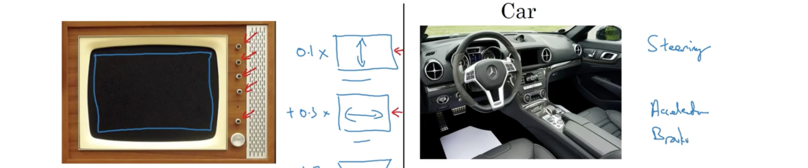
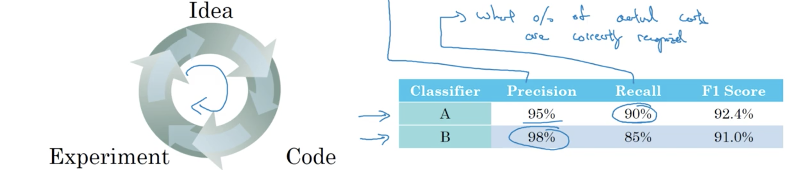
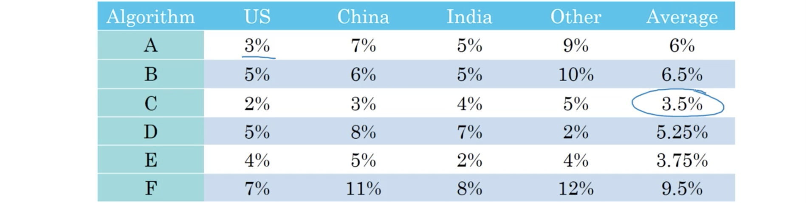
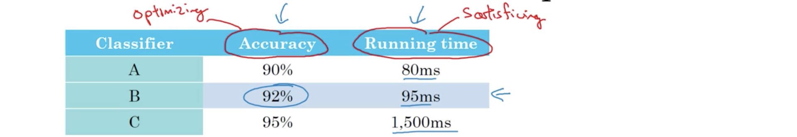
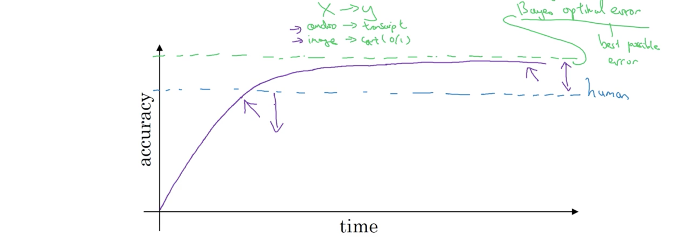
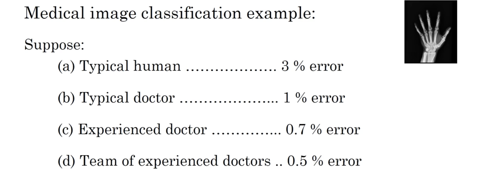
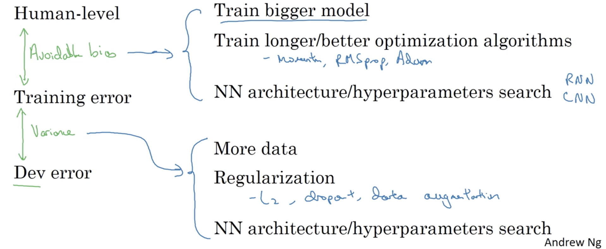

##### 1. 为什么是ML策略

假如正在解决猫分类器的问题，已经有了90%的正确略，但对某个应用而言还不够，则可能会有很多改善的想法：

- 收集更多的数据，更多的训练数据；
- 可能训练集的发散程度还不够，因此要收集更离散的猫姿势图像，或者更离散的负样本集；
- 用梯度下降训练算法更久一些；
- 换一种优化算法，比如Adam而非梯度下降；
- 尝试更大的网络；
- 尝试更小的网络；
- 尝试dropout；
- 添加$L_2$规则项；
- 改变网络的一些结构：
  - 改变激活函数；
  - 改变隐单元个数；
  - $\cdots$

因此当尝试改善深度学习系统时，会有很多方法可以尝试，问题在于若不能很好地进行选择，可能会浪费很多的时间，因此找到快速而有效辨别那些方法更值得尝试、哪些方法可以放弃的方法十分重要。

##### 2. 正交化(orthogonalization)

建立机器学习系统的一个困难是有很多的东西可以尝试和改变，比如有大量的超参可调。最高效的机器去学习人员非常善于辨别为了到达某个效果需要调整的内容。这是一个被称为正交化的过程。所谓正交化，为调整下图左边电视的画面，每个旋钮都需要有独立的功能，可能分别是调整画面高度、宽度、上下位置、左右位置等。若一个旋钮设置多个功能，根本就无法调整画面。这时的正交化指让一个旋钮只做一件事。车也是类似，方向盘、引擎、刹车分别只控制方向、加速和减速。

一个监督学习系统良好的性能，通常需要满足下面四个原则来保证，处理不同的问题需不同的解决方案：

1. 首先确保至少在训练集上表现良好。在训练集的性能必须通过某些可接受性测评。对于一些应用而言，可能意味着要与人类的水平相当。若在训练集上出问题，可能需要训练更大的网络或转向更好的优化算法。
2. 其次，要确保在发展集上表现良好。若算法在训练集上表现不错但发展集上令人担忧，则可能需要规则化或更大训练集。
3. 然后，希望它在测试集上表现良好；若满足了前两条但在测试集上表现感人，可能需要更大的发展集，因为这时可能过拟合了发展集，因此需要发展集有更多的数据。
4. 最后，在真实世界应用中性能良好。若这条不满足，则需要改变发展集或代价函数。因为依据代价函数算法在测试集上表现良好却没有与真实世界需求对应起来，意味着可能发展集分布设置并不正确，或者代价函数没有衡量正确的量。

在讲者训练神经网络时倾向于不使用早停机，这是一个优秀的技巧，但会同时影响训练集上表现和发展集性能，就像电视的一个旋钮要同时控制长度和宽度，因此并不正交。而正交化控制会使网络调试的过程更加简单。

##### 3. 单个数值评估度量

无论为学习算法调试超参或尝试新想法，还是为构建机器学习系统尝试不同选项，单个数值评估度量能快速显示尝试的新选择比原有的好还是糟，这样过程会快很多。前面已经看到应用机器学习是一个非常经验的过程。假如已有了一个猫分类器A，在改变一些超参和训练集后，又获得了分类器B，他们的性能如下图右侧。其中精确率$P$(precision)表示算法识别为猫的图片中确实为猫的比例；而召回率$R$(recall)表示数据集中猫的图片被算法识别出的比例。学习算法中都有精确略和召回率的权衡。

使用两个量的问题在于当A的召回率高于B，精确率却低于B时，就无法确定到底哪个比较好。当尝试不同的超参、想法时，得到的可能就是一打的算法，用多个准则就很难快速判断哪个算法最好。因此建议用$F1$分数。其定义为$F1=\frac{2}{\frac1P+\frac1R}$，是精确率和召回率的调和均值。通过计算发现A的$F1$值高于B，因此很快就能选出A。

许多ML团队会有一个定义良好、用于衡量精确率和召回率的发展集，附加单个实值距离度量评估，能很快表明分类器之间的优劣。假定要在四个主要地理区域构建一个应用，而两个算法在来自四个不同区域的数据上的错误率如下图。追踪分类器在这四个不同市场的表现很合理，但就很难快速找出最优算法。因此建议追踪算法在不同地理区域性能的同时，也计算其均值，这样继续迭代时就能快速选择最优。

##### 4. 最低和最优度量

并不总能将所有关注的标准结合成单个实数的度量，这时设置最低和最优度量就很有用。比如下图的分类器关注正确率(accuracy)和运行时间(runing time)两个量。

这时就可以这样设置，选择一个分类器，使其：
$$
\begin{aligned}
\text{maximize}&\quad accuracy\\
\text{subject to}&\quad running\_time \le 100\text{ms}
\end{aligned}
$$
这时称正确率为最优度量(optimizing metric)，要求其最好；运行时间为最低度量(satisficing metric)，只要其足够好。更一般而言，若关注$N$个度量，有时就可以选择其中一个作为最优，其余$N-1$个只需满足某些阈值。

##### 5. 训练/发展/测试分布

设置训练、发展、分布集的方式可能会很大影响构建ML应用的的速度。ML的工作流程是在训练集上尝试很多方法训练很多模型，用发展集评估这些方法然后选择一个，持续迭代到对发展集上表现满意，最后用测试集评估。发展集和测试集的分布应该相同，因为这样发展集和单实数评估度量就像瞄准的靶心，能够快速迭代，尝试不同方法、运行试验、使用发展集和评估度量来选择最佳。而若发展集和测试集数据分不同，则验证发展集后测试时却发现优化了不同的靶心。

因此原则就是：选择能够反映未来期待和认为重要的数据，并使得它们的分布相同。设置发展集和评估度量，意味着定义要瞄准的目标；设置发展集与测试集分布相同意味着始终保持目标一致；选择训练集会影响实际能多好地击中目标。

##### 6. 发展集和测试集大小

曾经的70/30或60/20/20适用于样本数1000、10000这样数据较少的情况；但在大数据时代已不适用， 假如有$10^6$个样本，则可能是98/1/1。设置测试集大小时，记住测试集的作用是在开发出一个系统后评估其性能，因此准则就是使测试集大到足够给出系统整体性能的高度置信。

一些应用可能并不需要最终系统的整体性能，此时就无需测试集；而若发展集很大而不希望过拟合它，此时就不推介不用测试集。实际中有人会在测试集上迭代调整，此时所称的测试集实际是发展集。

##### 7. 当改变发展/测试集和度量时

当评估度量不能准确度量算法间的偏好时，则需要改变评估度量或者发展/测试集。比如猫爱好者应用的猫分类器，若A的错误率为3%，但会误识别一些淫秽图片，这对用户而言显然不可接受；而分类器B错误率为5%，但没有误识别问题，这时B显然更合适。此时仅以错误率$\frac1{m_{dev}}=\sum_{i=1}^{m_{dev}}\mathbf 1\left\{ y_{\text{pred}}^{(i)}\neq y^{(i)} \right\}$为度量显然不再合适，因为它将淫秽和非淫秽图片同等对待，一种改变方法可以是：
$$
\begin{aligned}
\text{Error} &= \frac1{\sum_iw^{(i)}} \sum_{i=1}^{m_{dev}} w^{(i)}\mathbf 1\left\{ y_{\text{pred}}^{(i)}\neq y^{(i)} \right\}\\
w^{(i)} &= \left\{
\begin{array}{w}
1 \qquad \text{if }x^{(i)}\text{ is non-pornographic}\\
10 \qquad \text{if }x^{(i)}\text{ is pornographic}
\end{array}
\right.
\end{aligned}
$$
不过需要标注数据集中的淫秽图片。这也是正交化的一个例子，将ML问题分为两个不同的步骤：第一步是如何定义一个度量捕获想要的内容，就像设置靶心目标；第二步是考虑如何在这个度量上优化算法，即如何准确地射中目标。

##### 8. 为何是人类水平性能

当尝试做一些人类也能做的事情时，设计和构建机器学习系统的工作就会更高效，这时很自然就会讨论比较或模仿人类水平。很多机器学习问题的进展可能相对很快，当它接近人类水平时；但当超过人类表现后，依然能变得更好，但速率会减慢，然后会一直接近但无法超越理论的极限，也就是贝叶斯最优误差(Bayes optimal error)。它是能达到的最好误差，从$X$到$Y$的最佳理论函数，除非过拟合不可能超过。比如有的语音十分嘈杂以致任何方法都无法准确转录；有些图片十分模糊以致不可能正确识别，因此最完美也不可能达到100%。

有两个原因使得进展在达到人类水平后变慢，一个是对于很多任务来说人类水平离贝叶斯最优误差并不太远，因此达到之后可能就没有那么多进步的空间。；另一个是只要性能低于人类水平，实际会有工具来改善，而超过之后就会难很多。因此与人类水平对比的原因就是：人类擅长很多任务，只要ML比人类差，就有这些策略来改善算法：

- 从人类获得标记数据，这样就有更多的数据来训练；
- 从手工误差分析中获得洞悉：为何人类能做正确？
- 更好的偏差/方差分析；

而一旦超过人类水平之后，这些策略就难以应用。这也是与人类水平对比有益的一个原因。

##### 9. 可避免误差

有时并不希望算法在训练集上表现过好，而直到人类水平表现就能精确知道希望算法在训练集表现得多好，又不过好。假定猫分类器当前训练误差8%，发展误差10%，显然与人类1%的水平还有差距，因此算法并没有很好地匹配训练集，因此就偏差和方差而言，这时关注的就是减少偏差，尝试的方法就是训练更大模型、训练更久时间；若在另一个任务中，训练和发展误差依然是8%和10%，非常接近于人类的7.5%，这时关注的就是减少方差，因此可以尝试规则化等。

在前面课程的偏差和方差讨论中，主要假定了有任务的贝叶斯误差接近于0。对猫分类任务，就可以视人类误差为贝叶斯最优误差的代理或估计。对于计算机视觉任务，这十分合理因人类十分擅长视觉，必然不会比贝叶斯误差差多少。基于能实现的水平，前面的例子中同样的训练误差和发展误差就分别关注偏差和方差。可以称贝叶斯误差和训练误差之间的差别为可避免偏差。而训练误差和发展误差之间的差异则是算法仍有方差问题的衡量。属于可避免偏差承认了有无法降低的误差。上例中训练误差为8%，发展误差为10，贝叶斯误差为7.5，可避免误差就0.5%，而方差衡量就是2%，有更大的改善空间。

##### 10. 理解人类水平表现

这里会展示人类水平表现的定义，并用这个定义来驱动机器学习项目。前面讲到人类水平表现的一个作用是贝叶斯误差的一个估计。看下面的图片，其中哪个数值能作为“人类水平表现”呢？

因为人类水平表现是贝叶斯误差的一个代理或估计，有方法能达到0.5%，则知贝叶斯误差为0.5或更低，即$\text{Bayes err}\le0.5$，因此用0.5%作为贝叶斯误差的估计，根据定义人类水平表现就是0.5%。而在发表论文或部署系统时，可能会有不同的定义。因此人类水平表现依据不同目的定义也不尽相同。

假定有一个X片分类器训练误差为5%，发展误差为6%；此时的可避免偏差就是4%～4.5%（依据人类水平表现的不同定义），方差衡量就是1%，此时采取的策略就应该是偏差减小；而另一个分类器训练误差为1%，发展误差为5%，此时可避免偏差就是%0~0.5%，方差衡量就是4%，策略就应为方差减小；而若训练误差为0.7%，发展误差为0.8%，这时就应选择0.5%为人类水平表现，此时可避免偏差为0.2%，方差衡量就为0.1%，应该使训练集匹配更好，否则就会错失。

##### 11. 超越人类水平表现

假定人类团队错误率为0.5%，单个人错误率为1%；若分类器训练误差为0.6%，发展误差为0.8，则可避免偏差为0.1%，方差度量为2%，要减少方差；若分类器训练误差为0.3%，发展误差为0.4%，则这时就很难回答可避免偏差是多少，可能是训练误差过拟合了2%，也可能是贝叶斯错误实际是0.1%、0.2%或0.3%，基于给定信息并没有办法分别，也就无法判断要减少的是偏差还是方差，因此也就减慢了取得进展的效率。更糟的是，若分类器的水平已经超过了人类的专家团队，那么也就更难依靠人类直觉来改进算法。因此一旦超过人类最好水平，改进算法的选择和方法就不那么清楚了，虽然并不意味着无法再取得进展，但一些指引方向的工具就不再适用了。

已经有一些ML应用显著超越了人类水平表现，比如：1.在线广告；2.产品推介；3.物流(logistics)；4.放款核准。所有这些应用学习的来源都是结构化数据，而非计算机视觉或语音识别那样的自然感知问题，人类十分善于自然感知的任务；另一点是所有这些应用都需要海量的数据，而这些都超出了人类能处理的范围，也是计算机容易超越人类水平的原因。现在计算机已经能在语音识别、一些计算机视觉任务、一些医疗诊断方面超越人类水平表现，但依然还有很长的路要走。

##### 12. 改进模型的性能

目前已经讲解了正交化、设置发展/测试集、人类水平表现作为贝叶斯误差近似、估计可避免偏差和方差，现在将这些结合起来形成改善学习算法性能的指导方针。要使监督学习算法表现良好意味着满足了它的两个基本假设：

1. 首先是能够相当好地匹配训练集，也大致意味着能够获得很低的可避免偏差；
2. 训练集上的表现能在测试和发展集上相当好地泛化，也就意味着方差不是太差。

按正交化的观点就是有单独的工具集来解决可避免偏差问题，比如更大的神经网络和更久的训练时间；也有单独的工具集来处理方差问题，比如规则化或更多的训练数据。下图展示了不同情况可采用的不同手段。

