##### 1. 进行误差分析

若算法的表现不尽如人意，则手动算法错误测试能指明下一步的方向，这个过程就是误差分析。假定猫分类器在发展集上的错误率为10%，这与所期望的相去甚远。在查看被误分图片时发现一些狗被识别为了猫，比如下图中的两只狗第一眼看确实有点像猫。此时有人提出针对狗来改进算法，比如收集更多狗的图片或设计针对狗的特征，那么是否应该做使猫分类器对狗表现更好的尝试呢？

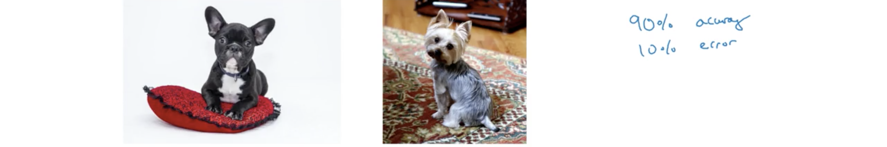

下面的**误差分析(error analysis)**过程能快速表明那是否值得你的努力：

1. 首先，获得一些误分/未分的发展集样本；
2. 然后手动检验并统计其中狗图片比例。

假定结果是5%，这表明即便改进算法使其不再误认狗为猫，错误率也不过降为9.5%，这并不值得所付出的时间；若结果是50%，此时解决狗的问题有潜力使错误率降为5%，因此就很值得一试。这种分析给出了改善某个方向的上界，在ML中有时称为性能天花板；在实践中，这种简单的统计过程能节省很多时间并指出最有希望的方向。

有时需要同时评估多个想法，比如上例中可能会有这些提议：

- 修正将狗图片识别为猫；
- 修正大猫（狮子、老虎、美洲豹等）被误识别的问题；
- 改善在模糊图片上的性能；

这时可以用类似下图的表格来统计，其第一列为样本的编号，后面每一列都是每种问题的统计，最后一列为备注：

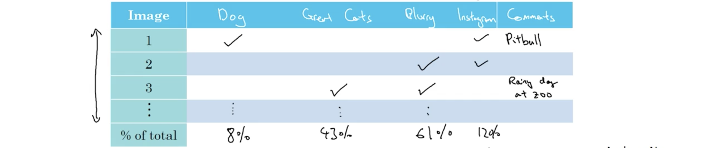

若在这个过程中还发现了其他问题，比如也误识别了很多来自Instagram的花哨图片，在表格中添加相应的列即可。最后表格会给出每个方向有多值得努力的估计。

##### 2. 清理误标注数据

这里用术语误标记(mislabeled)样本表示算法输出错误结果的样本；错标注(incorrectly labeled)样本来表示人类标注为错误的样本，如下图：

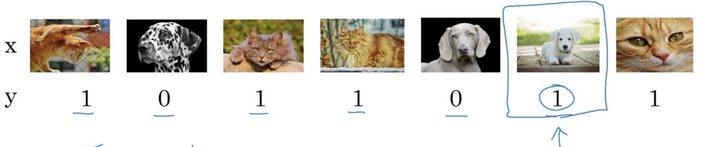

如果错标注数据出现在训练集中：则只要这些错误接近随机，比如标注者没注意或偶然敲错了键，深度学习算法对训练集中的随机错误相当稳健，因此只要样本够多且频率不高则无需关注；但若这些是系统错误，比如标注者一直将白色狗标为猫，DL算法对训练集中的系统错误比较敏感，分类器会将白色狗学习为猫，这时就必须修正错误。

如果错标注数据出现在发展集或测试集中，则建议在进行误差分析时为错标记添加上一列，如下图：

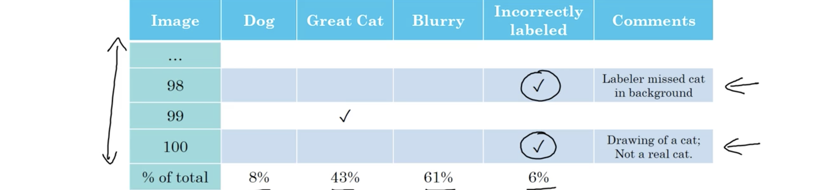

统计出错标注所占比例，若解决错标注能显著改善算法能力评估，则有必要修正错标注样本；否则就无需改正，比如上面的例子，错误率为10%，由错标注引起的为0.6%，其他原因引起的是9.4%，因此修正样本并非当前最重要的事；但若错误率为2%，错标注引起的依然为0.6%，此时错标注引起错误占总错误的比例就接近1/3了，此时修正样本就十分必要。在决定要修正发展/测试集错标注样本后，下面是一些需要考虑的指南：

- 在发展和测试集上应用同样的过程以确保它们依然来自同一个分布；
- 被正确识别的样本可能存在错标记，它们可能会给分类器带来偏差，因此也许检验。这一条做起来并不容易，因此并不总是执行；
- 修正训练集错标注样本并不那么重要，这时训练集和发展/测试集可能来自不同分布。

##### 3. 快速构建首个系统，然后迭代

当着手新机器学习项目时，一个建议是快速构建首个系统，然后迭代。比如要构建一个新语音识别系统，有很多方向和优先事项，可能有50个不同选项都能改善系统并且都显得非常合理，如下图左侧，问题在于如何从中选择：

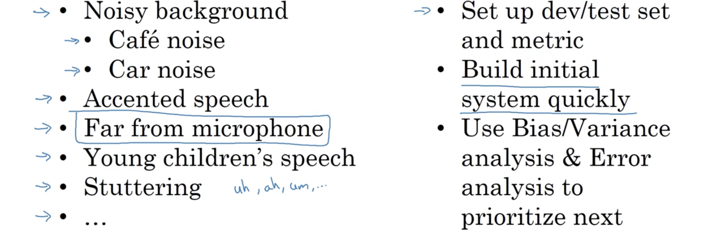

此时应快速构建首个系统：

- 首先快速构建发展/测试集和评估度量，相当于快速设置一个目标；
- 然后快速构建初始系统，可以是一个非常粗糙的实现，找到训练数据训练；
- 之后使用偏差/方差分析和误差分析来确定下一步的优先次序。

但若从事的领域有大量优先经验，或者有海量学术文献可以参考，这个建议就不那么适用。比如构建一个人脸识别器，一开始就基于这些文献构建复杂的系统并无不妥。但若是全新的问题，则不建议过度思考并使得初始系统太过复杂。区别在于要使系统有效运行还是发明新算法。

##### 4. 在不同分布上训练和测试 

在深度学习时代，越来越多算法在分布与发展和测试集不同的数据上训练，有一些技巧和实践来处理这种情况。假如要训练一个识别猫的手机应用，能获得两种数据源，一种是下图右侧真正关注的来自手机应用的数据分布，大多是业余拍摄、比较模糊；另一种数据源是下图左侧从网络爬取并下载的专业拍摄、高分辨率的图片。

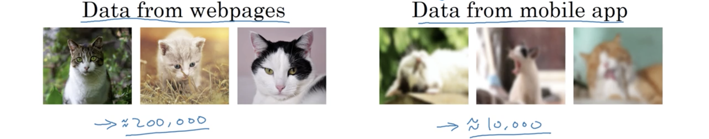

当前右侧的数据较少，左侧的却足够多，但问题是两者的分布并不相同。一种方法是将两种数据打散混合后设定训练/发展/测试集，但此时测试集中仅很少比例来自右侧，设定测试集就相当于设定目标，但这与真正的目标相悖。因此，推介的做法是将一部分右侧的图片作为发展集和测试集，另一部分与全部左侧图片一起作为训练集，这样的好处是瞄准了真正的目标，不过训练集和发展/测试集的分布也不再相同，但长期来看会获得更好的性能。

再看一个构建汽车语音激活后视镜的例子，这是一个真实的中国产品，若要投入其他国家市场，假定有很多来自其他语音识别应用的数据。可以将所有这些数据划入训练集中或添加一部分来自语音激活后视镜数据，而发展/测试集则需要来自语音激活后视镜的数据。

##### 5. 不同分布数据的偏差和方差

学习算法偏差和方差的估计有助于确定接下来的优先方向，但随着训练集和发展/测试集分布的不同，分析方式也有些不同。假定上节猫分类器例子中，贝叶斯误差接近0%，训练误差为1%，发展误差为10%，因数据源不同，此时就无法肯定地说算法泛化得很差。因为同时改变两件事：一是算法没见过开发集的数据，二是训练集与发展集分布不同；这样就很难说清这增加的9%误差多少是由于泛化能力，多少是因为数据分布不同。

为梳理这两种效果，可以定义一个新的训练-发展集，这是一个与训练集分布相同但并不用于训练神经网络的数据子集。然后仅用训练集训练网络，误差分析时查看训练误差、训练-发展误差和发展误差。见下表：

|   人类水平误差    | 训练误差 | 训练-发展误差 | 发展误差 |     结论     |
| :---------: | :--: | :-----: | :--: | :--------: |
| $\approx$0% |  %1  |   9%    | 10%  |    方差过大    |
| $\approx$0% |  1%  |  1.5%   | 10%  |   数据不匹配    |
| $\approx$0% | 10%  |   11%   | 12%  |    偏差过大    |
| $\approx$0% | 10%  |   11%   | 10%  | 偏差过大&数据不匹配 |

误差之间差值的意义参考下图左侧：

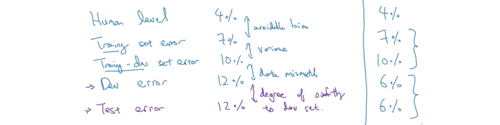

若发展/测试集的分布比训练集易于辨识，则会出现发展/测试误差优于训练误差的情况，如上图右侧和下图：

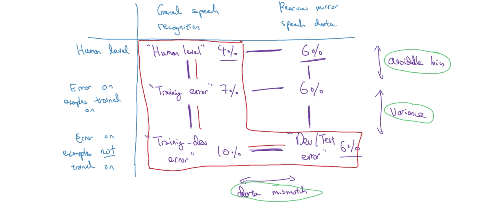

大多数时候比较红框中的内容就能得到很好确定下一步的方向，但有时通过整个表格的内容能获得额外的洞察。

##### 6. 处理数据不匹配

训练集与发展/测试集数据来源不同会带来除偏差和方差外的第三个潜在问题—数据不匹配。若误差分析显示算法有这样的问题，并没有完全系统的方法来解决，不过可以尝试一些事情。

- 实施手动误差分析以理解训练集和发展/测试集之间的区别。为避免过拟合测试集，应查看发展集而非测试集。以语音激活后视镜为例，应倾听发展集样本以搞清与训练集区别在哪里。
- 之后要使训练集与发展集尽可能相似，或收集更多类似于发展/测试集的数据；比如上例中发现发展集语音更嘈杂，则可以在汽车数据中模拟更多的噪声。

这些并非系统方法，并不保证一定有效，但在很多问题上的效果都很好。若要使训练集与发展集的数据类似，可以应用的一个技巧是手工数据合成。比如上面的后视镜例子中，并没有汽车噪声为背景的的数据，可以录一段汽车噪声，然后合成到其他清晰的语音中。

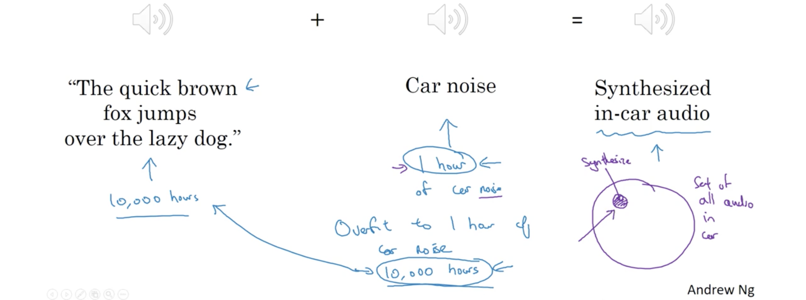

这样就能快速获得更多的数据，因此若分析表明要使训练集更相似于发展集，这是一个合理的方法。但又一点要注意的是，虽然对于人耳可能没区别，但那一段录音只是汽车噪声背景集的很小子集，这样就有可能使得算法对那段汽车噪声过拟合。因此挑战在于人耳无法区分这些背景音乐，最终有可能穷尽了很小子集中无数次。（一个不成熟的想法是是否可以从发展集中提取出所有的汽车背景噪声作为合成的来源呢）

另一个例子是，可以用CG生成海量的汽车图片，每张看起来都很漂亮，通过这些合成的图片也能训练一个不错的汽车检测算法，但因人眼无法区分，同样有过拟合一个小汽车子集的风险。

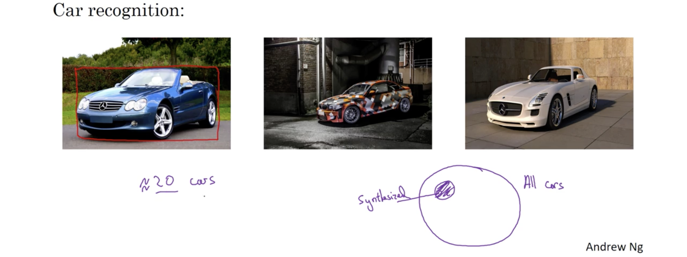

 因此要留意这样的仿真数据可能使算法在一个小样本集上过拟合。

##### 7. 迁移学习

DL中最有效的一个思想是有时可以用从一个任务中学到的知识应用在另一个独立任务上。比如可以将识别猫学到的知识部分或全部应用在X-线扫描上，见下图：

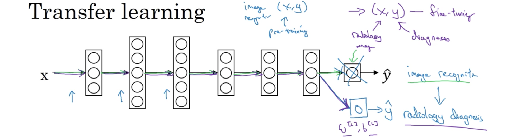

做法是将最后输出层的权值删除并随机初始化$W^{[L]},b^{[L]}$，然后用放射数据集训练重新训练这个网络。如果数据集较小，可以只重训练最后一或两层，这被称为**调优(fine-tuning)**；若数据足够，则可以重训练整个网络，此时前面物体识别的训练被称为**预训练(pre-training)**。背后的原理是许多从大数据集训练得到的低级特征如边缘、曲线检测，可能有助于学习算法在放射诊断中的表现——它已经学习了许多图片的结构和本质，已经学习了足够关于点、线、曲线等图片知识，这些都可能使放射诊断网络需要较少数据集或学得更快。在去除原网络的最后一层后，可以新增多层网络，如下图将语音转录系统迁移到唤醒词检测的系统：

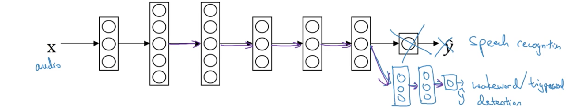

因此要使从A获得的知识应用到B上有效的迁移学习需满足：

- 任务A和B的输入相同；
- 任务A有更多的数据而任务B则较少，此时对于任务B其本身的样本就更有价值；
- 任务A的底层特征会有助于任务B的学习。

##### 8. 多任务学习

多任务学习尝试使用一个神经网络来同时完成多个任务，并希望其中每个任务都有助于所有其他任务。比如自动驾驶汽车需要同时检测多种不同物体：行人、其他车辆、停止标识、交通信号灯等。这时对于一个输入图片$x^{(i)}$就有四个标记而非一个，$y^{(i)}$是$(4,1)$的向量，而$Y=\begin{bmatrix}|&|& &|\\y^{(1)}&y^{(2)}&\cdots&y^{(m)}\\|&|& &|\end{bmatrix}$是$(4,m)$的矩阵。用下面的网络训练：

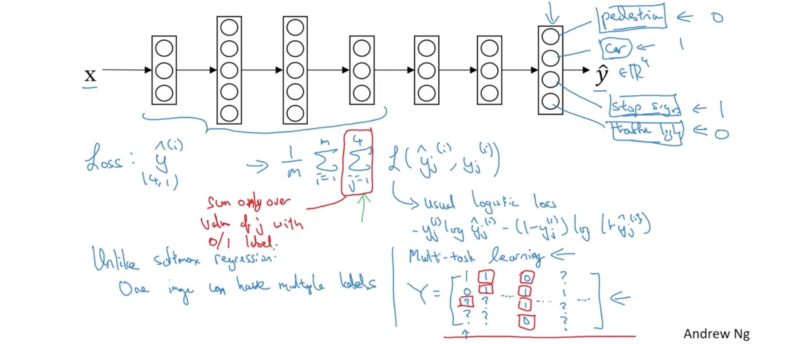

输出层有4个单元，每个都分别判断图片中是否有所检测的目标。损失函数依然为对数损失：$\mathcal L= -y_j^{(i)}\log\hat y_j^{(i)}-\left(1-y_j^{(i)}\right)\log\left(1-\hat y_j^{(i)}\right)$，而代价函数则为：
$$
\frac1m \sum_{i=1}^{m}\sum_{j=1}^4 \mathcal L\left( y_j^{(i)},\hat y_j^{(i)} \right)
$$
与前面分类不同的是这里对每个类别都进行了求和；与softmax回归每个样本只有一个标记也不同，它有多个标记。训练神经网络最小化这个代价函数就是实施多任务学习，因为是构建一个网络来解决四个问题；而若神经网络较早的特征能在这些任务中共享，则训练一个神经网络做多件事比训练多个神经网络分别做这些事的效果更好；而且即便一些图片的多个类别只标记了一部分也能有效工作，比如上图的$Y$中有多个地方为标记留为问号，只要在循环$j$时仅统计标为0或1的即可。要使多任务学习合理，应符合下面的条件：

- 在一些能从共享一系列底层特征受益的任务上训练；
- 通常，每个任务的数据量都比较相似；回忆迁移学习，从某个任务A学习然后迁移到另一个任务B，假如A有$10^6$的样本，B有$10^3$的样本，则所有从A学习到的都能实际增强任务B拥有的小数据集；通常多任务学习的任务很多，比如有100个，每个任务都有$10^3$的数据，若单独执行某个任务，则只有$10^3$的样本来训练一个任务；而若同时训练100个任务，则有$10^6$的训练样本，则对每个任务都能提供很多的知识增强，对每个任务都有很大的提升，每个任务对其他任务都能提供一些数据或知识；这并不是固定规定，所以并不总是正确；讲师比较看重的是若关注任一任务，要从多任务学习得到提升，则其余任务总计的数据量应远大于那一任务；一种能够得到这种益处的方法就是有很多任务，每个任务的数据量类似；但实际的关键是若某个任务已有了$10^3$的样本，则所有其他的任务需要有远大于$10^3$的样本，这样其他的样本才对这个最终的任务有助。
- 能够训练一个足够大的网络来将这些任务都做好。曾有研究者发现相对于每个任务分别训练一个网络，仅当神经网络不够大才会影响性能。

实践中多任务学习的使用远少于迁移学习，在计算机视觉多物体检测可能会用到。也有一些迁移多任务学习。

##### 9. 端到端学习

端到端学习就是将需要多个阶段的学习系统用一个神经网络来代替。以语音识别为例，输入音频片段$X$，输出文字转录$Y$，如下图所示。传统方法会分为多个步骤，首先用一些算法（比如MFCC）提取手动设计的低级特征；然后应用机器学习算法找到音素，音素是声音的基本单元；然后将音素串接起来形成单独的单词；然后将单词串接起来形成转录文本。与这个多阶段的流水线相反，端到端的学习训练一个巨大神经网络直接输入音频输出转录。端到端学习的一个问题是数据需求量很大。比如3000h的声音片段，传统方法就能效果不错；仅当有10000h和更多时，端到端学习的优势才真正开始表现出来。因此若数据量较少，传统方法比较适用；若数据量中等，也有中间的方法，比如输入音频片段，跳过特征直接得到因素，之后按传统方法继续。

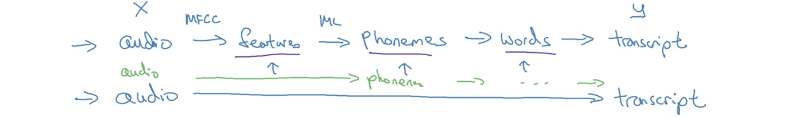

另一个例子是人脸识别门闸，有一个摄像头观察靠近门的人，若识别出了这个人，则让其进入。一种构建的方法是输入摄像头捕获的照片，尝试学习一个直接从图片$X$到人身份$Y$的映射，但已证明这并不是最好的方法，因为人会从不同方向靠近门，与镜头之间也远近有别。因此实际中并非直接输入原始图像然后尝试输出人的身份，最好的方法似乎是一种多阶段的方法。首先检测人脸，然后放大人脸剪裁照片使人脸位于中心，然后再输入网络识别身份。研究者发现将这个问题分解成两个更简步骤的效果全面优于一步学习所有事情。有两个理由解释：一个是每个试图解决的问题更简单；第二是每个子任务都有大量数据。而从原始照片到身份识别的数据则较贫乏。

而上一个例子，以及语言翻译任务，现在都有大量一种语言橘句子到另一种语言对应意思的数据，就可以使用端到端的学习的效果就很好。而基于手掌放射线图估计年龄的应用中，由于没有大量直接从X射线到年龄的数据，因此先识别骨骼，再由骨骼估计年龄的效果就好很多。

##### 10. 是否使用端到端学习

先看一些端到端学习的优缺点， 获得是否应该在自己应用中使用端到端学习的指南。

端到端学习的优点是：

- **让数据说话**；当有足够$(X,Y)$数据，无论是否是合适的从$X$到$Y$映射，训练足够大的网络都能指明；通过纯粹的机器学习方法，输入$X,Y$的神经网络更能捕获数据中的统计。
- 更少的手工设计成分需求；这也简化了工作流程的设计，不必设计特征和中间表达。

端到端学习的缺点是：

- 需要大量数据，而有时直接整个$(X,Y)$这样的数据并不多，而子任务的数据可能较多；
- 排除了可能有用的潜在手工设计成分；若数据不足，手工设计成分是一种将手工知识注入算法的方式。学习算法有两种知识来源，一种是数据，另一种是手工设计。数据充足时手工设计成分就不重要，数据不足时手工设计成分就会使算法受益良多。

因此决定是否应用端到端学习的关键是：**是否有分足的数据来学习一个满足映射$X$到$Y$复杂度需求的函数**。

要构建一辆自动驾驶汽车，一种是非端到端的方法，输入汽车前方图像、雷达和激光雷达(lidar)感应到的周围的场景；然后需要识别其他车辆和行人，这里深度学习的效果十分好；之后需要规划路径，这里需要用到机器人学中的移动规划(motion planning)；最后是执行决策，这里需要控制论中的知识。这个案例展示了当需要用DL学习某些任务的独立成分时，应用监督学习需要小心地选择要学习什么样的$(X,Y)$映射，这取决于能够获得什么样任务的数据。而纯粹端到端学习就是输入当前场景图片，输出驾驶行为。但受限于能获得的数据，当前这并非最有希望的方法。
