##### 1. 计算机视觉

计算机视觉的一个难题是输入太大。一张$1000\times1000$像素的图片需要3M($10^6$)的输入单元，而第一个隐层单元数为1000的话，权值矩阵参数就是$3\times10^9$的数量级，这样就很难获得足够多的数据来防止网络的过拟合，而计算和存储需求也变得不可行，这时就需要执行卷积操作。


##### 2. 边缘检测示例

卷积操作是卷积神经网络的基础构件。给定一张图片（如下图），要让计算机指出图中包含的物体，首先做的可能是检测图片中的垂直边缘，然后可能是检测图像中的水平边缘。

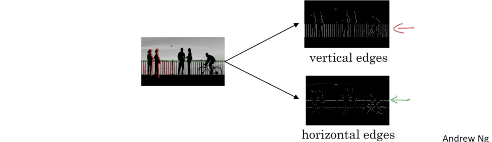

图像的卷积操作如下图所示，中间的$3\times 3$卷积核（滤波器）所做的即是垂直边缘检测。

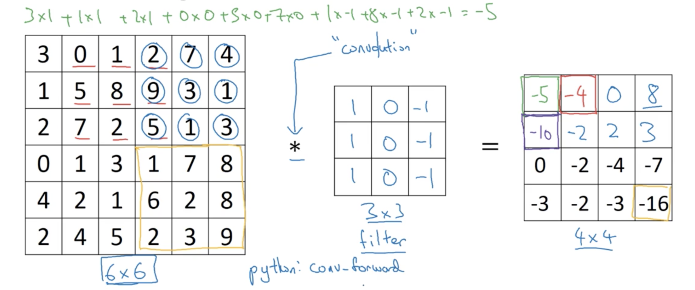

至于为何中间滤波器做的是垂直边缘检测，见下图：

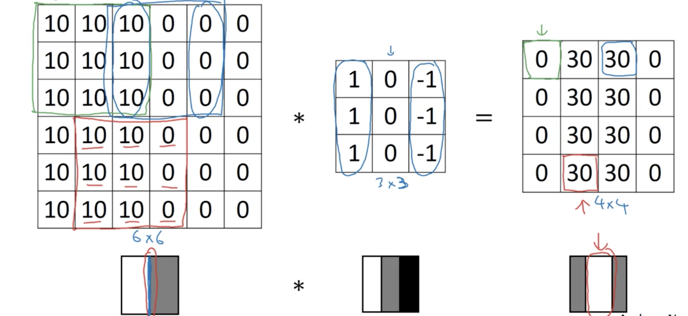

垂直边缘检测就相当于有亮色像素在左侧，中间可能不太关心，右侧是暗色像素。


##### 3. 更多边缘检测

下图下侧是当图片颜色反转为左暗右亮用相同的卷积核得到的不同结果，结果的黑色表明这是一个与卷积核（左明右暗）明暗方向相反的图片，即为负边。若不在意的话，取绝对值即可。

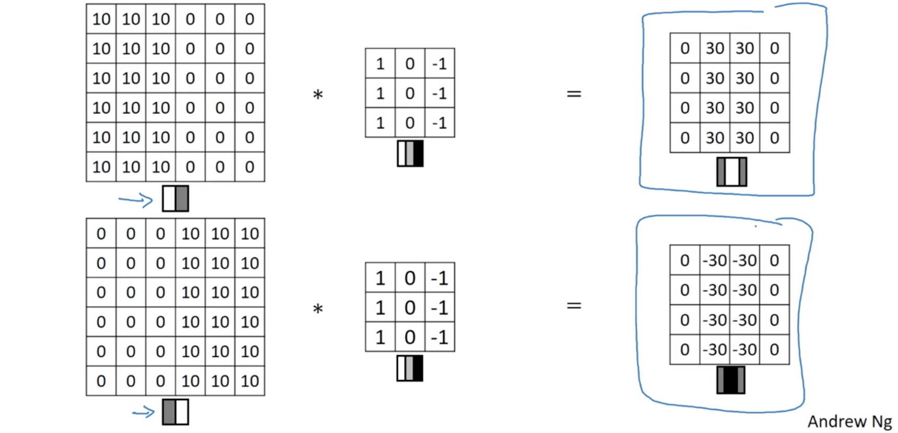

不难猜测，下图右侧即为上明下暗的水平边缘检测算子。

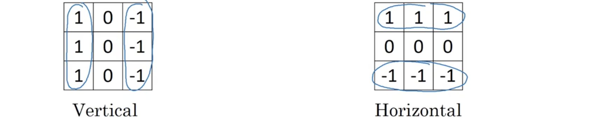

它与一幅图片的卷积结果为：

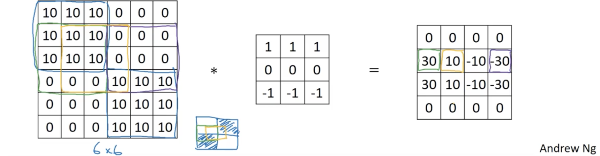

事实上不止上面那一种垂直边缘检测算子，给中间像素的增大权值以使其更稳健，就得到了下图中间的Sobel滤波器；还有右侧的Scharr滤波器。这些都是垂直边缘检测算子，将它们翻转90度即变为水平边缘检测算子。

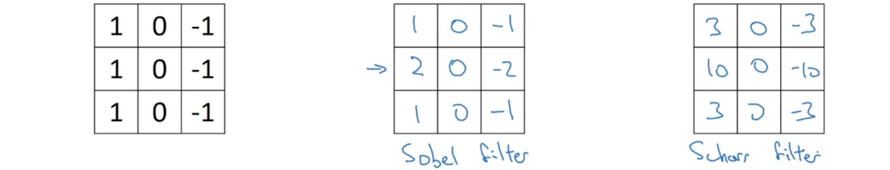

而随着深度学习的兴起， 在一些复杂图像中检测边缘时不再需要研究者手工挑选这些数字，可以将滤波器矩阵中的数字作为参数，然后用反向传播来学习得到，还能选择学习得到哪种滤波器。除了垂直边缘，还能学习检测30度、45度、60度等各种朝向的边缘检测，并且比手工编码的滤波器更稳健。但计算的底层依然是卷积操作。


##### 4. Padding

为构建深度神经网络，一种实际需要的基本卷积操作的修正是padding。假定图片大小是$n\times n$，卷积核为$f\times f$，则卷积后的图片的大小为$(n-f+1)\times(n-f+1)$。这有两个负面作用，一是每次应用卷积操作图像都会减小，这样就只能进行有限次的卷积；二是图像边缘的像素在输出中使用的次数远少于中间部分的像素抛弃了，这就很多边缘附近的信息。为解决这两个问题，在应用卷积操作前，可以在图像周围填充附加的边，惯例是填0。如下图，这样卷积后的图像大小就与原图相同。

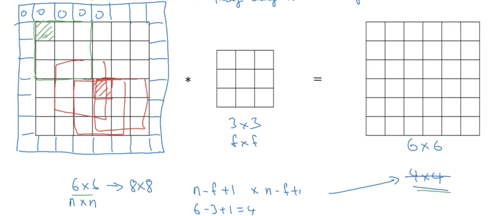

设$p$是每个边缘像素外部填充的数量，显然上面例子中$p=1$。Padding后卷积输出的图像大小就为$(n+2p-f+1)\times(n+2p-f+1)$。就填充量而言可分为两种卷积，一种是有效(valid)卷积，无填充；另一种是等价(same)卷积，填充使得输出大小与输入大小相同，因此有$n+2p-f+1=n$，从而得到$p=\frac{f-1}2$，此时要选择$f$为奇数以确保大小不变，而视觉中$f$为奇数是个惯例，除了刚才的原因，还因为奇数的卷积核会有一个中心位置，这样就能谈论滤波器的位置。


##### 5. 步幅(stride)

每次卷积越过的单元数为卷积的步幅，假设步幅为$s$，则输出图像大小变为$\left\lfloor\frac{n+2p-f}s\right\rfloor\times\left\lfloor\frac{n+2p-f}s\right\rfloor$，$\lfloor*\rfloor$表示去掉小数部分下取整，比如下面$7\times7$的图片用$3\times3$卷积核步幅为2时的输出为$3\times3$。

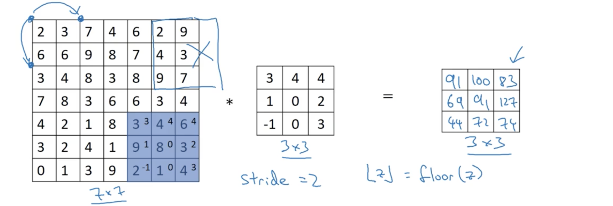

依照惯例滤波器需全部位于图像加填充才进行卷积操作，不能有部分悬空则。要注意在数学或信号处理课本中会先进行卷积核在横轴和纵轴翻转的收缩操作，之后再进行求积累加（见下图）。之前使用的操作有时被称为互相关，但按照DL文献中惯例就是卷积。而信号处理卷积定义中的翻转是使卷积满足结合性$(A*B)*C=A*(B*C)$。

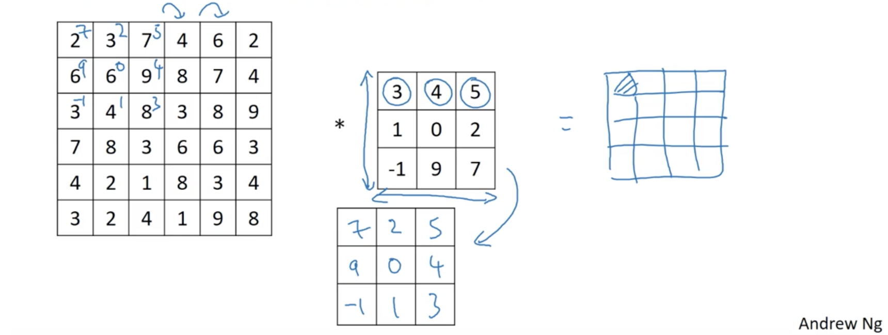


##### 6. 空间卷积

除了二维图像，还可以在三维进行卷积。比如下图例子中，输入为$6\times6\times3$图片，最后数字为通道数；卷积核为$3\times3\times3$，**通道数必须与输入图片通道数相同**；每次卷积时把卷积核覆盖的部分求和并累加，最后得到一个$4\times4$的输出。此时每个设置每个通道的滤波器，就能得到不同的特征检测算子。

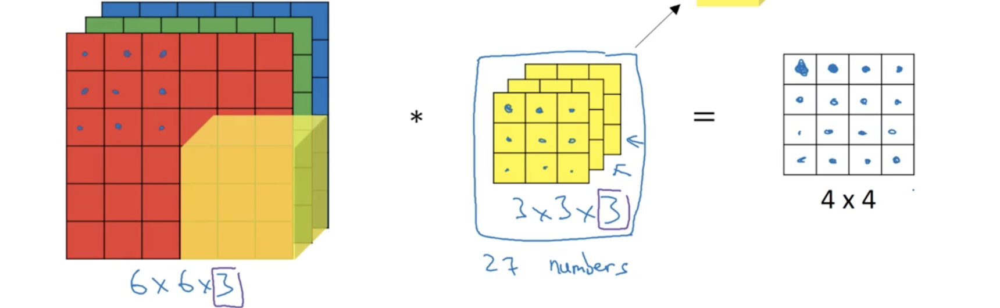

若希望同时使用多个滤波器，比如垂直边缘检测和水平边缘检测，可以分别使用一个水平边缘检测算子和一个垂直边缘检测算子然后堆叠起来得到$4\times4\times2$的输出，如下图：

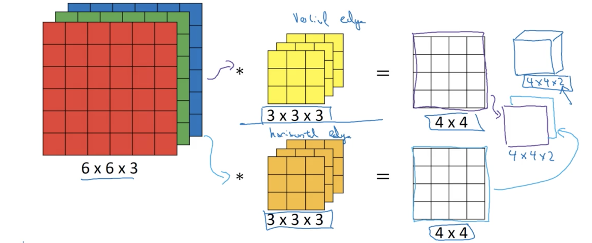

因此总结起来就是$n\times n\times n_c\ *\ f\times f\times n_c \to (n-f+1)\times(n-f+1)\times n_{c'}$，其中$n_{c'}$为卷积核的数目，也称为三维卷积的深度，但为避免与网络深度造成混淆，这里称为通道数。


##### 7. 一层卷积网络

下图的3维卷积将$6\times6\times3$的图片用两个$3\times3\times3$滤波器卷积，得到的$4\times4$输出分别加上偏置(bias)，然后应用非线性操作ReLU，然后将两个结果堆叠起来形成输出，这就是一层卷积神经网络。将此对应回前面的标准神经网络：$z^{[1]}=W^{[1]}a^{[0]}+b^{[1]}, a^{[1]}=g^{[1]}\left(z^{[1]}\right)$。输入图片就是$a^{[0]}$，两个卷积核就是$W^{[1]}$，卷积后的两个结果就是$W^{[1]}a^{[0]}$，加上偏置后为$z^{[1]}$，应用ReLU后堆叠起来形成输出$a^{[1]}$。

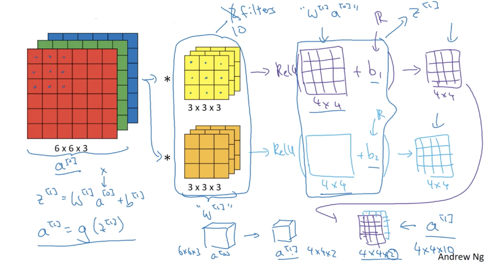

对于一个有10个$3\times3\times3$核的卷积层，每个核有27个参数加上1个偏差，所以这样的卷积层共有280个参数，它的好处是无论输入有多大，参数量不变。这是卷积网络的一个特征，就是较不容易过拟合。现总结一下卷积网络中的记号，假设层$l$是卷积层，则：

- $f^{[l]}$表示滤波器大小；
- $p^{[l]}$表示填充量；
- $s^{[l]}$表示步幅；
- $n_c^{[l]}$表示滤波器的数目；
- 输入$a^{[l-1]}$为$n_H^{[l-1]}\times n_W^{[l-1]}\times n_c^{[l-1]}$；
- 输出$a^{[l]}$为$n_H^{[l]}\times n_W^{[l]}\times n_c^{[l]}$，其中$n_{H/W}^{[l]}=\left\lfloor\frac{n_{H/W}^{[l-1]}+2p^{[l]}-f^{[l]}}{s^{[l]}}+1\right\rfloor$；
- 每个滤波器的维度为$f^{[l]}\times f^{[l]}\times n_c^{[l-1]}$；
- 若有$m$个样本进行向量化，则输出$A^{[l]}$为$m\times n_H^{[l]}\times n_W^{[l]}\times n_c^{[l]}$；
- 权重的个数为$f^{[l]}\times f^{[l]} \times n_c^{[l-1]}\times n_c^{[l]}$；
- 偏置个数为$n_c^{[l]}$。


##### 8. 简单卷积网络例子

这里看一个简单的卷积神经网络，如下图。假定要做图像分类或识别：

0. 输入图片为$39\times39\times3$，因此$n_H^{[0]}=n_W^{[0]}=39$，$n_c^{[0]}=3$；
1. 第一个卷积层核大小$f^{[1]}=3$，步幅$s^{[1]}=1$，不填充$p^{[0]}=0$，10个卷积核；则结果$a^{[1]}$大小为$37\times37\times10$，$n_H^{[1]}=n_W^{[1]}=37$，通道数$n_c^{[1]}=10$；
2. 第二个卷积层核大小$f^{[2]}=5$，步幅$s^{[2]}=2$，不填充$p^{[2]}=0$，20个卷积核；则结果$a^{[2]}$大小为$17\times17\times20$，$n_H^{[2]}=n_W^{[2]}=17$，通道数$n_c^{[2]}=20$，因为这里的步幅为2，因此维度收缩得很快；
3. 最后的卷积层核大小$f^{[2]}=5$，步幅$s^{[2]}=2$，不填充$p^{[2]}=0$，40个卷积核；则结果$a^{[3]}$大小为$7\times7\times40$，$n_H^{[3]}=n_W^{[3]}=7$，通道数$n_c^{[3]}=40$；
4. 然后将$a^{[3]}$展开成1960维的向量，然后输入到一个logistic或softmax单元，得到最终分类结果$\hat y$。

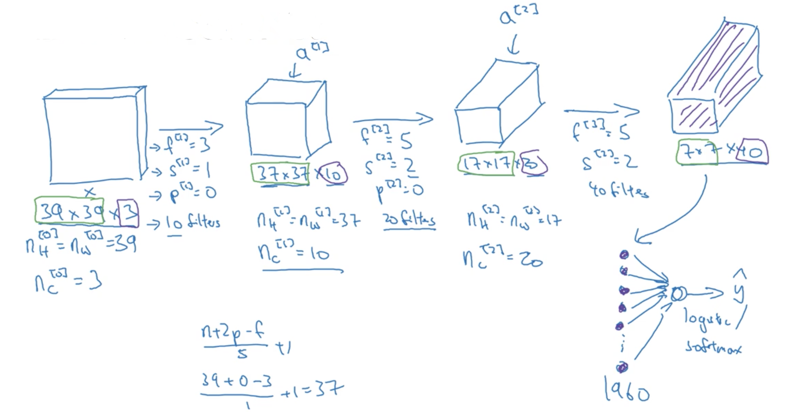

这是一个典型的卷积网络，在设计卷积网络时大量的工作用来选择超参，比如核大小，核数目，步幅，填充量等。随着卷积网络向深度发展，输入图片大小会逐渐减小，而通道数则逐渐上升。典型的卷积网络中通常有三种层，一种时卷积层，通常记为CONV；一种时池化层，通常记为POOL；还有一个是全连接层，通常记为FC。


##### 9. 池化层

卷积网络通常用池化层来减小表达大小以加快计算速度，同时使得特征检测更稳健。假定有一个$4\times4$得输入，实施一种被称为最大化的池化，大小$f=2$，步幅为$s=2$，得到$2\times2$的输出。具体操作就是将输入从左向右、从上往下按没次移动$s$单位，将$f\times f$区域的最大值输出。如下图：

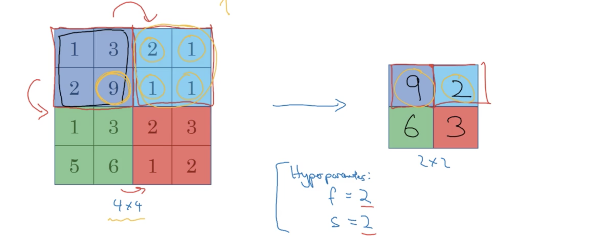

最大池化背后的原理是，试想从神经网络某层激活值的比如$2\times2$的区域寻找特征，则其中的最大值可能就是一个检测到的特征，因此最大操作就是任何检测到的特征都在池化输出中保留，不过这些解释都是事后诸葛，大多数人选择的原因是在大量实验中效果良好。最大池化的一个有趣特征是它有一些超参，却没有要学习的参数，一旦选定$f,s$，就是一个固定的计算。需注意的是前面卷积层输出大小的计算公式在池化层中依然成立。若输入是3维，则在每个通道都独立做相同的操作，因此输出的通道数保持不变。

还有一种常用的池化时平均池化，顾名思义就是将最大替换为均值，其余类似。最大池化的应用远多于平均池化，除了在非常深的网络中，使用平均池化来减小表达，比如将$7\times7\times1000$平均为$1\times1\times1000$。

常用的池化选择是$f=s=2$，而绝大多数池化都不使用填充$p=0$，若输入图像$n_H\times n_W\times n_c$，则输出结果是$\left\lfloor\frac{n_H-f}{s}+1\right\rfloor\times\left\lfloor\frac{n_W-f}{s}+1\right\rfloor\times n_c$。


##### 10. CNN示例

假设做手写数字识别如下图，输入为$32\times32\times3$图片；首先是$f=5,s=1,n_c=6$的卷积层CONV1；然后是$f=2,s=2$的最大池化层POOL1；DL文献中有两个惯例，一**卷积层和紧随的池化层被认为是一层**，因此这两层合称为Layer1，二是**在统计层数仅统计有权值有参数的层**，而池化层仅有超参；接着是$f=5,s=1,n_c=16$的CONV2，然后是$f=2,s=2$的最大POOL2，这两层合称Layer2；此时的输出为$5\times5\times16$，将其展开为大小为400的列向量，并输入到与标准网络层相同的120单元全连接层FC3；之后是84单元的FC3，最后是一个10单元的softmax层。这是一个典型的CNN，有很多的超参，选择的一个指南是查询文献找到效果良好的架构而非自己尝试很多参数集；随着网络的加深$n_H,n_W$都会逐渐减小而$n_c$则会上升；另一个常见模版是一个或多个卷集层面跟一个池化层，最后是一些全连接层紧随一个softmax层。

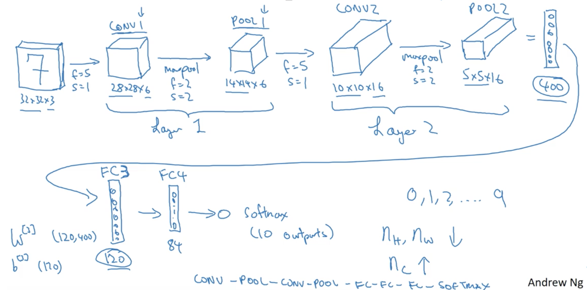

下面是这个网络每层的一些细节：

|       网络层        |   激活值形状    | 激活值大小 | 参数个数  |
| :--------------: | :--------: | :---: | :---: |
|        输入        | (32,32,3)  | 3072  |   0   |
| CONV1($f=5,s=1$) | (28,28,8)  | 6272  |  208  |
|      POOL1       | (14,14,8)  | 1568  | **0** |
| CONV2($f=5,s=1$) | (10,10,16) | 1600  |  416  |
|      POOL2       |  (5,5,16)  |  400  | **0** |
|       FC3        |  (120,1)   |  120  | 48001 |
|       FC4        |   (84,1)   |  84   | 10081 |
|     Softmax      |   (10,1)   |  10   |  841  |

可以看到几点：一个是最大池化层高没有任何参数；还有就是卷积层的参数相对较少，实际上大多数参数都在全连接层；然后是激活值的大小逐渐变小。


##### 11. 为何是卷积

相对于全连接网络，卷积有两个优点，一是参数共享，二是稀疏连接。比如前面的例子中，输入为$32\times32\times3$，大小为3072，经过CONV1后输出为$28\times28\times6$，大小为4704；而若使用标准网络的话，权值就是$3072\times4704$，参数个数大约14M，这还是很小的图片；相反这里卷积核是$25\times25+1(\text{one bias})$，参数个数156；有两个原因使得卷积层的参数较少：

- 一是参数共享，即所有输出都共享同样的滤波器参数；它由这个现象所启发，在图像一部分有效的特征检测算子在图像的其他部分也很有可能有效；比如得到一个$3\times3$滤波器能检测垂直边缘，则可以将这个滤波器应用在输入图片的各个位置；即使图像不同部分的分布不同，但都足够相似而能共享同样的特征检测算子；并且对低层特征比如形状边缘的和高层特征比如面部眼睛都成立；
- 另一个是稀疏连接，即每一层的输出值仅依赖于很小一部分的输入值；输出值的每个单元都仅依赖于输入对应位置的值，而不受任何其他的像素的影响。

因此，通过这两个机制，一个参数少很多的神经网络就能用更小的单元训练并且不易过拟合。有时可能会提到卷积网络十分善于获取转换不变性，比如将猫图片的一些像素向右平移后依然很明显是猫的现象。神经网络的卷积结构有助于编码将图像平移一些像素后依然产生高度相似的特征并且很可能应该被分配同样输出标记的事实。事实上应用的同样的滤波器，在前面层和后面层都知道图像的所有位置，有助于神经网络自动更稳健地学习而获得需要的转换不变特质。

这是一些卷积网络在计算机视觉中如此有效的原因，最后将这些组合起来看如何训练这些网络，比如训练一个猫检测器如下图，有一些标记好的训练数据，并选择好了卷积网络架构，从输入图片开始，之后是一些卷积和池化层，然后是一些全连接层，最后是一个softmax层输出$\hat y$。卷积层和池化层会有不同的权值$W$和偏置$b$。先定义一个代价函数：
$$
\text{Cost }J = \frac1m \sum_{i=1}^m \mathcal L\left( \hat y^{(i)},y^{(i)} \right)
$$
然后随机初始参数$W,b$，计算代价$J$；训练这个网络所要做的就是使用梯度下降或动量、Adam的等算法优化网络中的参数以减小代价函数。


##### 12. CNN中的反向传播

在CNN中也是计算代价的相应导数来更新参数，反向传播公式比较复杂，这里简单地展示它们。

**卷积层的后向传递**，先实现卷基层的后向传递：

- **计算$dA$**：下面是关于一个滤波器一个训练样本计算代价函数代价的$dA$计算公式：
  $$
  dA += \sum_{h=0}^{n_H}\sum _{w=0}^{n_W}W_c\times dZ_{hw} \tag{1}
  $$
  其中$W_c$是一个滤波器，$dZ_{hw}$对应代价关于卷积层$Z$第$h$行第$w$列（对应取第$i$步幅左边和第$j$步幅下边的点积）输出的标量梯度值。注意，在更新$dA$时每次用同样的$W_c$乘不同的$dZ$，这样做是因为在计算前向传播时，每个滤波器都用不同的a_slice点乘求和。因此在计算$dA$的反向传播时，只需将所有a_slice的梯度求和。在代码合适的**for**循环内，这个公式可以翻译为：

  ```python
  da_prev_pad[vert_start:vert_end,horiz_start:horiz_end,:] += W[:,:,:,c] * dZ[i,h,w,c]
  ```

- **计算$dW$**：下面是计算$dW_c$（$dW_c$是一个滤波器的导数）关于损失的公式：
  $$
  dW_c += \sum_{h=0}^{n_H}\sum _{w=0}^{n_W}a_{slice}\times dZ_{hw} \tag{1}
  $$
  其中$a_{slice}$对应用于产生激活值$Z_{ij}$的片段，因此这样就得到$W$关于那个片段的梯度，因为是同样的$W$，将所有这样的片段求和便得到$dW$。在代码合适的**for**循环内，这个公式的实现为：

  ``` python
  dW[:,:,:,c] += a_slice * dZ[i, h, w, c]
  ```

- **计算$db$**：下面是计算代价函数一个滤波器$W_c$的$db$的公式：
  $$
  db = \sum_h\sum_w dZ_{hw}
  $$
  类似基本神经网络，$db$由累积$dZ$获得。这时，只需将卷积输出$Z$关于代价所有的梯度求和即可。代码的实现就是在合适的**for**循环内：

  ```python
  db[:,:,:,c] += dZ[i, h, w, c]
  ```

**池化层的后向传递**：尽管池化层没有参数需要后向传播更新，依然要传递通过池化层的梯度以计算前面层的梯度：

- **最大池化的反向传递**：在进入池化层的反向传播前，需要先构建一个名为create_mask_from_window()的帮助(helper)函数来实现下面的功能：
  $$
  X = \begin{bmatrix}1 & 3 \\ 4 & 2\end{bmatrix} \to M = \begin{bmatrix}0 & 0 \\ 1 & 0\end{bmatrix}
  $$
  这个函数创建一个“掩模(mask)”矩阵来追踪原矩阵最大值的位置，这样做的原因是只有最大值最后才影响了输出，从而影响代价；而反向传播用代价计算，因此任意任何影响最终代价的值的梯度都不为0。代码中可以这样实现：

  ```python
  mask = (x == np.max(x))
  ```

- **平均池化的反向传递**：在平均池化中，输入窗口的每个元素对输出都有相同的影响，因此需要一个反映这种情况的帮助函数，比如前向传播中池化层使用了$2\times2$滤波器，则掩模矩阵就是：
  $$
  dZ=1 \qquad\to\qquad dZ=\begin{bmatrix}\frac14 & \frac14 \\ \frac14 & \frac14\end{bmatrix}
  $$
  ​
