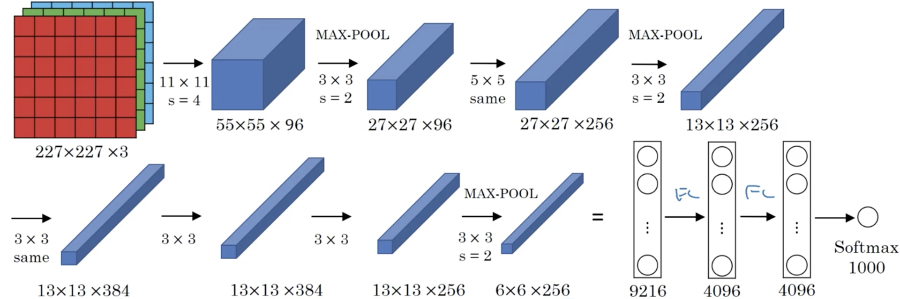
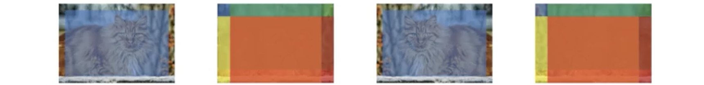

##### 1. 为何要案例研究

前面学习了一些CNN的基本构件，近些年CV的研究就是如何搭建这些构件来获得有效的CNN。而自身获得其理解的最好方法就是研究一些示例。事实上一个在一种任务上效果显著的网络结构在其他任务上也能取得成功。

##### 2. 经典网络

本节会讲解三个经典的网络：LeNet-5、AlexNet、VGGNet-16。

**LeNet-5**：下面是LeNet-5的结构图：

下面是一些细节：

- 它处理的是灰度图，因此输入的通道数为1；
- 参数个数为60k，是一个比较小的网络；
- 随着网络的深入，高度和宽度都在减小，通道数在增大；
- 另一个模式是有若干一个或多个卷积层后跟一个池化层组成的模块，最后时全连接层；
- 激活函数为sigmoid/tanh；
- 在池化层后面做了非线性变换；

**AlexNet**：下面是AlexNet的结构图：

它与LeNet-5很相似，但要大得多：

- 参数个数为60m，为LeNet-5的1000倍；
- 激活函数为ReLU；
- 在多个GPU上训练，很多层都分成多个在不同GPU上训练；
- 有一种局部回馈正规化(Local Response Normalization)层，现在已经很少使用；LRN做的就是将中间的结果，比如大小为$n_H\times n_W\times n_C$，在$n_H\times n_W$的每个位置上，最所有通道相同位置的值进行正规化；其思想是不希望太多的神经元有很高的激活值；但后来的研究发现效果并没有多好。

**VGG-16**：一个重要特点是使用很简单的网络，仅用$3\times3$步幅为1的滤波器，还有总使用等价填充，并且所有池化都是$2\times2$步幅为2的最大池化；它真正地简化了网络结构。它的网络结构为：

这是一个很大的网络，共有16个有参层，因此网络深度为16，共有138m个参数；但它的构成十分一致，都是一些卷积层后加一个最大池化，且卷积层的通道数在池化后大多都加倍，结构的简洁性和一致性使得其相当吸引人。

可能还会遇到的网络时VGG-19，是一个更大的VGG网络。

##### 3. 残差网络(ResNet)

因为梯度弥散和梯度爆炸的原因，很深的网络往往难以训练。本节会介绍跳跃连接(skip connection)使得某一层的激活值突然输入到网络非常深的地方。这样构建的残差网络能训练极其深的网络。残差网络由残差块(residual block)构建。在下图中，神经网络从$a^{[l]}$到$a^{[l+2]}$的标准路径（蓝色部分）称为“主路径(main path)”；在残差网络中会将$a^{[l]}$相加到到更深的地方（图中为$a^{[l+1]}$的非线性变换前），这个路径（紫色部分）为称为“捷径(shartcut)”或跳跃连接；

这时激活值$a^{[l+2]}$的计算公式就是：
$$
a^{[l+2]} = g^{[l+2]}\left( z^{[l+2]}+a^{[l]} \right)
$$
这里额外加上的$a^{[l]}$使其成为一个残差块。注意，**$a^{[l]}$插入到线性（即计算$z$的）部分之后，非线性(ReLU)部分之前**。残差网络就是将很多这样的残差块堆叠起来形成一个很深的网络。如下图：

未加捷径之前的网络称为“平坦网络(plain network)”，加上那些捷径之后就称为残差网络；研究表明用优化方法训练平坦网络时，经验上随着网络的加深训练误差会下降一段时间，但之后就会回升；而理论上随着网络加深应该在训练集上效果越来越好；但实际上网络深到一定程度后优化算法就很难训练，因此训练误差会回升。而在残差网络上，随着网络越来越深，训练误差能一直保持下降；残差结构确实有助于梯度弥散/爆炸问题的解决，因此能训练深得多的网络。

##### 4. 为何残差网络有效

如下图所示，将X输入到某个很大的神经网络中并产生输出$a^{[l]}$，现在给网络加上一个残差块；网络的激活函数为ReLU，因此除输入外的所有激活值都不小于0。

这时就有：
$$
\begin{aligned}
a^{[l+2]} &= g\left( z^{[l+2]}+a^{[l]} \right)\\
&= g\left( W^{[l+2]}a^{[l+1]}+b^{[l+2]}+a^{[l]} \right)
\end{aligned}
$$
注意若使用$L2$规则化，就会使参数$W^{[l+2]}$和$b^{[2]}$的值变小。若$W^{[l+2]}$和$b^{[l+2]}$都为0，则此时$a^{[l+2]}=g\left(a^{[l]}\right)=a^{[l]}$，因为$g$为ReLU，而$a^{[l]}\ge0$。这表明残差块很容易就能学到等价函数；这就意味着在网络中增加那两层并不会并不会伤害前面较简单网络的能力。当然这里的目标并非仅是不伤害性能，而是有助于性能，因此若这些隐单元能学习到一些有用的知识，则就能比等价函数表现得更好。而平坦网络的问题在于随着网络越来越深，就会连等价函数都很难选择参数来学习。而残差网络就很容易用额外层来学习等价函数，因此就能保证至少不会伤害网络性能；而很多时候都是有助于网络性能的。

要注意的是在$a^{[l+2]} = g\left( z^{[l+2]}+a^{[l]} \right)$中假定了$ z^{[l+2]},a^{[l]}$维度相同，因此在残差网络中广泛使用了等价卷积；为防两者维度不同，比如长度$z^{[l+2]}$是256，而$a^{[l]}$是128，则可以用$W_s$与$a^{[l]}$相乘，其中$W_s\in \mathbb R^{256\times128}$。其中$W_s$可以是设定的0填充，也可以是学习得到的。下面是处理图像的残差网络：

大多数都是$3\times3$的等价卷积，因此$ z^{[l+2]}+a^{[l]}$就说得通；在一些卷积层后面偶尔会有池化或类似池化的的层，这时就需要用$W_s$来改变维度；最后也是全连接层用softmax来做预测。

##### 5. 网络中的网络(Network in Network)与$1\times1$卷积

如下图上侧，将$6\times6$图片与值为2的$1\times1$滤波器卷积，其结果是将图片所有值乘以2，这似乎并没有什么用。

但这是在单通道上，若是$6\times6\times32$的输入，此时$1\times1$的滤波器就很有意义。它会将36个位置的32通道值与滤波器的32个值点乘得到单个值，然后应用ReLU非线性变换成为输出中的一个；事实上，可以将这个$1\times1\times32$滤波器看成是一个神经元，输入32个（同一位置不同通道）值，将其与权值相乘后输出到对应位置；更一般的情况是有多个滤波器，每个都进行类似的操作，最后在对应位置形成多通道的输出。因此一种思考$1\times1$卷积的方式是一个全连接的神经网络，输入32个数输出滤波器个数$n_c^{[l+1]}$的值。在36个位置都进行这样的操作，最后输出$6\times6\times n_c^{[l+1]}$的结果。这样就能对输入执行相当复杂的计算。这种思想被称为$1\times1$卷积或网络中的网络。假设有$28\times28\times192$的volume，若希望减小高度和宽度，可以使用池化；但若希望减小通道数，比如得到$28\times28\times32$的volume，则可以使用32个$1\times1\times192$的滤波器。若要保持通道数，则使用192个滤波器即可，而$1\times1$网络的作用就是增加非线性，这样就使得网络能够学习更复杂的函数；当然也可以增加通道数。

##### 6. Inception网络的动机

在设计卷积网络时需要选择使用$1\times1$、$3\times3$还是$5\times5$的网络，而inception网络的做法就是都做一遍，虽然使网络结构更加复杂，但效果也显著较好。假如有$28\times28\times192$的输入（见下图），则inception层做的就是与其选择卷积层滤波器的大小或者是否用池化，不如所有的都做一遍。比如使用$1\times1$滤波器得到$28\times28\times64$输出，使用$3\times3$滤波器等价卷积得到$28\times28\times128$的输出，使用使用$5\times5$滤波器等价卷积得到$28\times28\times32$的输出，使用最大池化（**很少见地**）等价填充步幅为1得到$28\times28\times32$输出，然后将所有输出拼接起来形成$28\times28\times256$的输出，这样就是一个输入$28\times28\times192$输出$28\times28\times256$的inception模块，这就是inception网络的核心，让网络学习要使用的参数和要使用的滤波器组合。

Inception网络的问题是计算代价。以前面例子的$5\times5$的滤波器为例（下图），32个滤波器形状都是$5\times5\times192$，输出为$28\times28\times32$的volume，每个输出需$5\times5\times192$次计算，则总计算量为$28\times28\times32\times5\times5\times192$，结果约为120M，即便是在现代计算机上依然是不小的计算代价。

现在使用$1\times1$滤波器使输入volume减小为$28\times28\times16$，然后在这个中间结果上使用$5\times5$滤波器得到原来形状的输出（见下图），与前面相比输入输出形状都相同，但是将左边巨大的volume收缩为中间较小的过渡volume。有时中间$1\times1$的层被称为“瓶颈层(bottleneck layer)”，只让网络最小部分通过。此时，网络左部的计算量为$192\times28\times28\times16$，约为2.4M，右边为$28\times28\times32\times5\times5\times16$，约为10M，总共为12.4M，约为原来的十分之一。并且这种将表达在中间过程减小的的方式并不会伤害到网络性能。

##### 7. Inception网络

前面分享了inception网络的组件，现在将它们组合成一个inception模块（见下图）：

可以看到：

- 为了减小计算量，$3\times3$和$5\times5$的卷积都使用了$1\times1$先得到中间的结果；
- 最大池化用到了等价填充，滤波器大小为$3\times3$步幅为1，池化后还用$1\times1$网络减小了通道数。

而inception网络所做的就是将这些inception模块组合起来，如下图：

它由若干个inception模块组成。值得一提的是在原论文中还有两个侧枝，它们用某些隐层的内容来做预测，这说明中间层计算的特征也已较好，这是inception中一种防止过拟合的规则化。它也被称为GoogLeNet。它的原论文中引用了下图中的含义：we need to go deeper。而这部电影的标题是inception，可能这就是网络名称的来源。

在这个基础上，作者又研究了几种这个网络的变体，分别称为inception v1, v3和v3。但都以此网络为基础。

##### 8. 使用开源实现

建议使用github上的开源实现，再用迁移学习适配自己的任务，这样效率会高很多。

##### 9. 迁移学习

许多网络都有开源实现，可以作为自己网络很好的初始化。假定要实现一个猫检测器来识别自己的宠物猫，有两只名字分别为Tigger和Misty，这样就有三个类别：Tigger、Misty和其他（如下图）。

若没有太多Tigger、Misty的数据，因此训练集很小，这时就可以下载一些神经网络的开源实现，包括代码和权值；然后去掉它的softmax层加上自己的softmax单元。建议冻结softamx之前所有网络层的参数，这时仅训练与自己softmax层相关的参数。这时很可能用很小的训练集就能获得很好的性能。很多深度学习框架都支持这种操作，根据框架可能设置`freeze=1`或`trainable_parameters=0`就能确定是否训练某个层。

另外，因为前面的层都已经冻结，这些层就相当于某个固定的函数，将输入图片映射到被冻结最后一层的输出，因此另一个加速训练的小技巧就是可以预先计算所有训练样本在那个层的激活值并保存，然后就是从这些特征向量训练一个浅层的softmax模型来训练。

但若有很多标记的数据，这样就能少冻结一些后面的网络，在改变输出之后训练为冻结之后的层。有几种方法实现，可以保留被冻结层后面的层，将它们现有的值作为初始，执行梯度下降；也可以将那些层去除然后使用自己的隐单元和最后的softmax输出。总之一个宗旨是数据越多，前面冻结的层就可以越少，后面训练的层就可以越多。

最后，若有足够的数据，可以开源的网络和权值作为初始，然后训练整个网络。

##### 10. 数据增强

数据增强是常用来改善计算机视觉系统性能的技巧。在实际计算机视觉任务中，数据越多效果越好，因此数据增强总是有助于性能的改善，无论是自己实现、用预训练好的模型开始还是迁移学习都成立。

- 最简单的数据增强方法可能是竖直镜像（下图），镜像操作保存了所有识别图片需要的信息，是一种完美的数据增强。

  

- 另一种常用的方法是随机裁剪（下图），但并非完美数据增强，可能会裁剪不到主要部分。但实践中十分有用，只要随机剪裁图片合理大小的子集。

  

- 另外，还可以使用旋转、修剪、局部弯曲等，但可能因为复杂性，在实际中用得并不那么多；

- 还有一种常用的数据增强方法是颜色改变，给颜色的每个通道不同的失真（下图），为了展示效果这里的失真都比较显著，在实践中，三通道的失真值应该从某个很小的分布中取值。通过这些训练数据算法就能对图像颜色的改变更稳健。有很多对R、G、B采样的方法，其中一种实现颜色失真的实现方法是使用PCA（主成分分析）算法，又称PCA颜色增强。其大概思想是，如果某个分量的值越大，则给他加/减的量就越大，以保持整体颜色色彩一致。比如图像颜色为紫色，则红和蓝占比就多，绿很少，因此给红和蓝加/减更大的值，绿则相对较小。

  

若训练数据极其庞大，则用一个CPU线程不断地从硬盘加载数据，使用一个CPU线程实现失真，可以是镜像、裁剪、色变等，然后得到它的失真版，这样不断执行就形成很多失真的小批次，然后这些数据就不断传递给另一个CPU线程去训练。因此，一种常用的实现数据增强的方式就是用一个或多个线程负责不断地加载数据并实现失真，然后传递给另一个线程训练。而通常这两个过程都是并行的。

数据增强的过程也有一些超参，比如实现多少的颜色变化、随机剪裁具体所使用的参数等。一种建议是使用其他人如何使用数据增强的开源实现。

##### 11. 计算机视觉现状

可以认为大多数的机器学习问题都落在少量数据到大量数据频谱内，比如就复杂性而言，已经有了相当多的语音识别数据，适当多的图像识别和分类数据，但相对较少的物体识别的数据，它需要框出物体位置，而得到物体边界框相对代价较大。因此当广泛观察机器学习问题时，可以看到平均而言，当数据较多的时候，简单算法和手工工程的需要就很少，只需使用很大神经网络（结构可以很简单）来学习任何希望学习的内容；相反，若数据量很少，手工工程就是获得良好性能的最佳方式。

机器学习应用有两个知识来源，一个是标注数据；另一个是手工工程，有许多表现方式，比如手工设计的特征、手工设计的网络结构等。因此在标注数据很少的情况下，就需要更多地求助手工工程。计算机视觉尝试学习非常复杂的函数，即便现在数据集越来越大，但依然无法满足需求。这就是计算机视觉无论历史还是今天都十分依赖手工工程的原因，也是计算机视觉开发了相当复杂网络结构的原因，因为数据的缺失，取得优良性能的方法就是花更多的时间构造。而当数据不足时，手工工程是十分困难和技巧的需要很多洞悉的任务。随着近些年数据量的巨大增长，手工工程量也有了显著下降，但依然很多比如相当复杂的超参选择。

因为物体检测的数据少于图像识别，可以看到算法变得更复杂并且有更多专门的成分。不过迁移学习是很好的帮助。在阅读计算机视觉文献时可以发现许多研究人员非常热衷参与标准化基准数据集并获得竞赛胜利。它的好处是有助于整个社区弄清目前最好的算法是什么，但也有一些只能用在这些基准集而无法在实践部署的技巧。下面是在基准集上取得成功的建议，不过在实际业务场景中可能很少用到：

- 总体化(ensembling)：分别独立训练若干（通常是3～15）神经网络并将其输出平均，重点是将输出$\hat y$平均而非权值；这会使得在基准集上获得1%或2%这样一些性能的提升；但因为要同时运行多个网络，会比较费时，因此在比赛中可能有效但实际中几乎不会使用；

- 多裁剪测试(multi-crop at test time)：将分类器在多版本的测试图像集运行并将结果平均；这是一种将数据增强用于测试数据的形式；比如下图将猫的两种或更多种图像复制成4个的10-裁剪技巧，取左边第一张的中心区域和第二张左上角、右上角、左下角、右下角，在分类器运行；然后在镜像图片执行同样的操作，然后将10个结果求平均；若计算预算充足，也可以运行更多的切片。虽然这种技巧在实践中也能改善系统性能，但还是在比赛中用的更多，因为会降低测试速度。

  

因为很多计算机视觉问题都在很小的数据动态(data regime)中，其他人已经做了很多网络结果的手工工程，因此要实际构建系统，通常可以使用开源的代码；

- 以其他人或在文献中发表的网络结构开始；
- 尽可能使用开源的实现，因为它们会指出一些繁琐的细节，比如学习率、样本调度以及其他的超参；
- 有些模型别人已使用数个显卡、在几百万张图片、花费了数周训练完成，因此使用预训练的模型，然后在自己数据集上调优。

##### 12. 作业-构建ResNet

ResNet“卷积块”是另一种残差块，如下图所示，这是为处理捷径前的$X$与所跳跃到的ReLU前的输入维度不匹配的额问题，与前面讨论的$W_s$的作用类似，且捷径上的卷积块没有不做非线性变换：

