##### 1. 目标定位

为构建物体检测，需先学习物体定位。前面已分享图像分类，而后面视频内容是基于定位的分类(classification with localization)，不仅要辨别物体类型，还要在物体周围画出边界框。本周后面会讲解检测问题，这时图片中会有多个目标，必须全部检测出并定位出来。分类和基于定位分类问题通常只有一个位于图像中间区域的大目标；而检测问题的单张图片中常有多个目标，甚至可能是多个不同类别的目标。

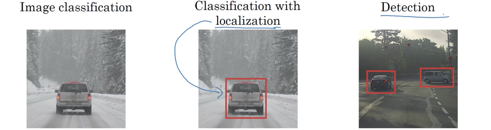

为检测得到图中目标的边界框，可以在图像分类网络结构最后一层加上更多的输出单元以输出边界框，比如四个分别代表边框中点x、边框中点y、边框高度、边框宽度的数值。这里标注图像左上角坐标为(0,0)，右下角为(1,1)。若此时的训练集不仅包含目标类别标注，还有4个给出边界框位置的数，则就可以用监督学习来预测类别标注和边界框参数。

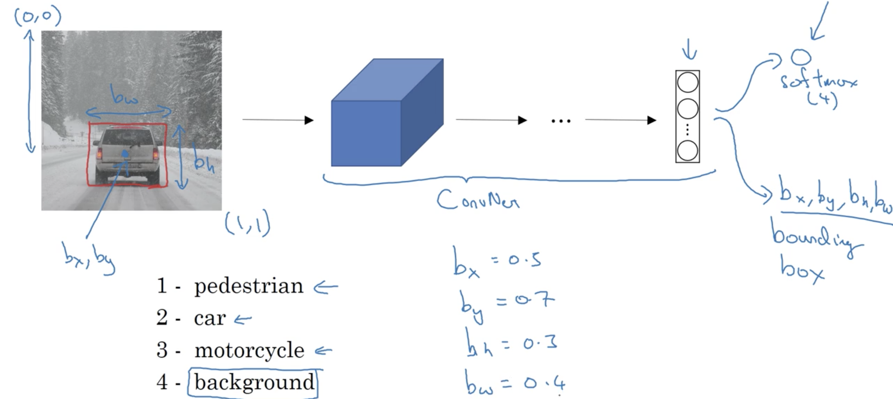
现在可以定义目标标注$y$，形式如下：
$$
y = \begin{bmatrix} 
p_c & \leftarrow & \text{Is there any object in the picture}\\
b_x & \leftarrow & \text{If so, the x coordinate the bounding box; else ?}\\
b_y & \leftarrow & \text{If so, the y coordinate the bounding box; else ?}\\
b_h & \leftarrow & \text{If so, the height of the bounding box; else ?}\\
b_w & \leftarrow & \text{If so, the width of the bounding box; else ?}\\
c_1 & \leftarrow & \text{If so, is it a pedestrian; else ?}\\
c_2 & \leftarrow & \text{If so, is it a car; else ?}\\
c_3 & \leftarrow & \text{If so, is it a motorcycle; else ?}\\
\end{bmatrix} \tag{1}
$$

其中的“?”表示不在意；因此下图右侧有车样本的标记为$y = \begin{bmatrix} 1\\b_x\\b_y\\b_h\\b_w\\0\\1\\0 \end{bmatrix}$，背景样本标记为$y = \begin{bmatrix} 0\\?\\?\\?\\?\\?\\?\\? \end{bmatrix}$。

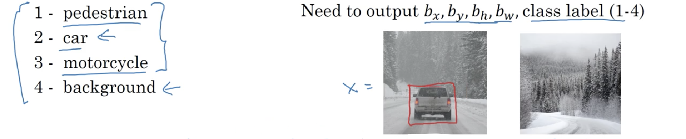

最后描述损失函数：
$$
\mathcal L\left( \hat y,y \right) =
\begin{cases}
\left(\hat y_1-y_1\right)^2+\cdots+\left(\hat y_8-y_8\right)^2 &\text{if }y_1=1\\[2ex]
\left(\hat y_1-y_1\right)^2 &\text{if }y_1=0
\end{cases}
$$
要说明的是这里使用平方误差仅为了方便，实际中可以为$c_1,c_2,c_3$使用对数似然损失，边界框$b_x,b_y,b_h,b_w$可以使用平方误差，而$p_c$则可以使用logistic回归误差。

##### 2. 界标(landmark)检测

神经网络可以输出$b_x,b_y,b_h,b_w$四个数字来定位目标，更一般的情况下，可以使用神经网络来输出被称为界标的重要点或图片的$(x,y)$坐标。

比如训练一个人脸识别应用时希望算法告知眼角的$(x,y)$坐标位置（下图）。这时可以使神经网络的最后一层多输出两个量：$l_x,l_y$。有时可能需要更多的点来提取更多，比如64个界标$l_{1x},l_{1y},\cdots,l_{64x},l_{64y}$，得到更对的特征。通过选择一些界标并产生包含所有这些界标的标记训练集，就能让神经网络告知一张脸上所有这些关键界标的位置，这是情感识别或CG给人物戴帽应用中的基础。另一个示例是人体姿势估计中，也可以定义一些关键位置如下颚中点、左肩、左肘、手腕等。需注意的是界标的id应该在图片间保持一致。

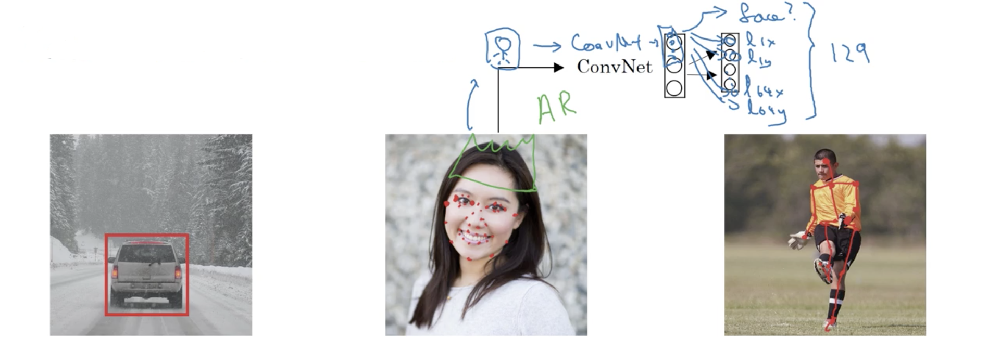

##### 3. 物体检测(object detection)

本节会分享使用**滑动窗口检测(sliding windows detection)算法**，比如要构建一个汽车检测算法，首先可以创建一个紧密剪切的标注训练集（下图），也就是说每张标记为1图片都以汽车为中心并且汽车占了绝大部分区域。这样就能训练一个输入汽车紧密剪切的图片输出是否为汽车的卷积网络，之后就可以用在滑动窗口检测中。

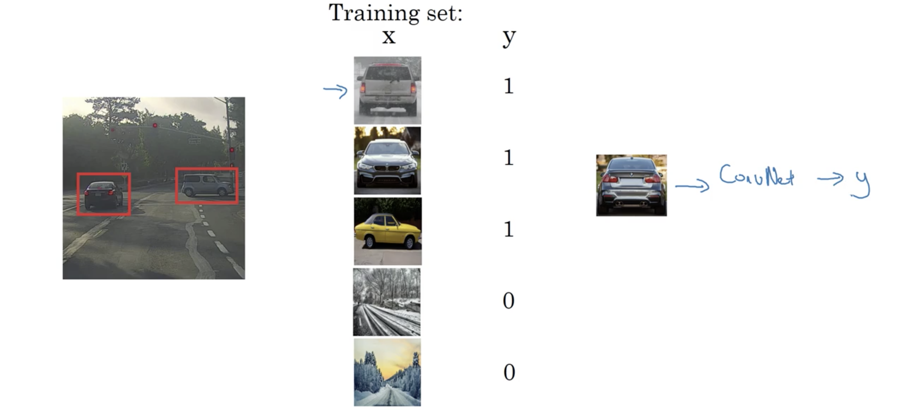

如下图，使用一个方框从图像的左上角开始以一定的步幅向右、向下滑动，每次将窗口内的图像输入卷积网络中判断是否为车；之后再用更大的方框尝试，这就是滑动窗口检测。它的一个缺点是计算代价太大。在深度学习兴起以前使用的算法简单得多，比如基于手工设计特征的线性分类，每个分类器所需计算也少得多，滑动窗口检测运行得没有问题。但在使用网络的今天，就慢得不可思议。

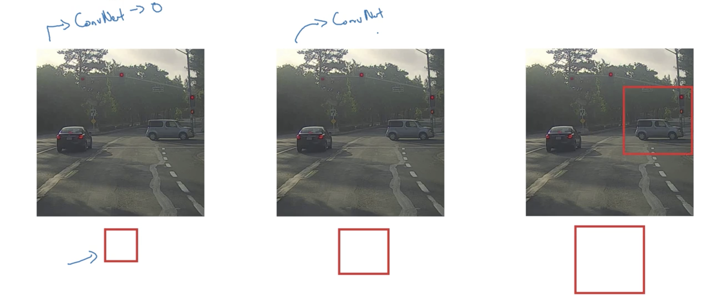

##### 4. 滑动窗口的卷积实现

要构建滑动窗口的卷积实现，首先看如何将全连接层转化为卷积层。视下图上部卷积网络的输出$y$为4个数，对应4个类别的概率；如下图下部前面的卷积层不变，根据最后一个卷积层的输出为$5\times5\times16$，第一个FC层有400个单元，用400个$5\times5\times16$卷积核，即可得到$1\times1\times400$的输出，与上面第一个FC层的结果相同；然后再用400个$1\times1\times400$的卷积核，即可得到与上面第二个FC层相同的结果；最后用4个$1\times1\times400$的卷积核，得到与上面相同的输出。这样，就将上面网络的FC层转换为了卷积层。其核心是用与前面输出等宽等高等通道数、与FC单元数相同的卷积核组成的卷积层。

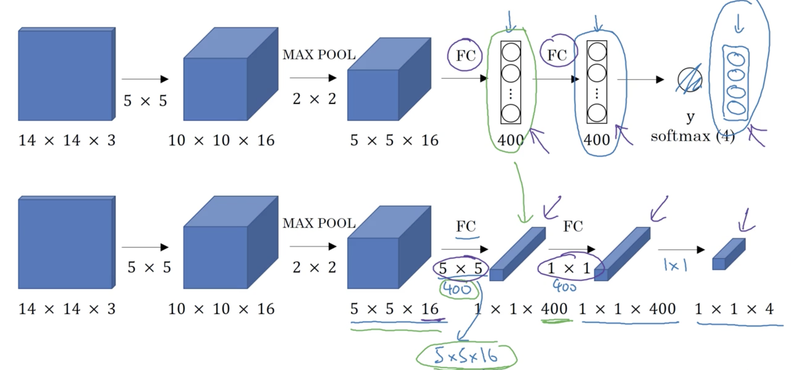

假定滑动窗口的输入为$14\times14\times3$，卷积网络如下图上部所示（已用卷积层替换FC层）；而测试图片大小为$16\times16\times3$，以2的步幅卷积网络运行4次得到4个标记，但这四个卷积网络的运算很多都是相同的，因此卷积实现滑动窗口就是让卷积网络的这4个间歇(pause)共享大量计算。方法如下图中部所示，将整幅图片做卷积运算，最后输出是$2\times2\times4$而非$1\times1\times4$。其中输出的左上角单元对应滑动窗口在图片左上角的结果，右上角对应滑动窗口在图片右上角的结果，其他两个单元也类似。这个卷积实现做是，与其在输入图片4个子集上做4次独立反向传播，不如将4次计算结合成一种计算形式并共享公共区域的大量计算。下图下部给出了一幅更大图片的例子。

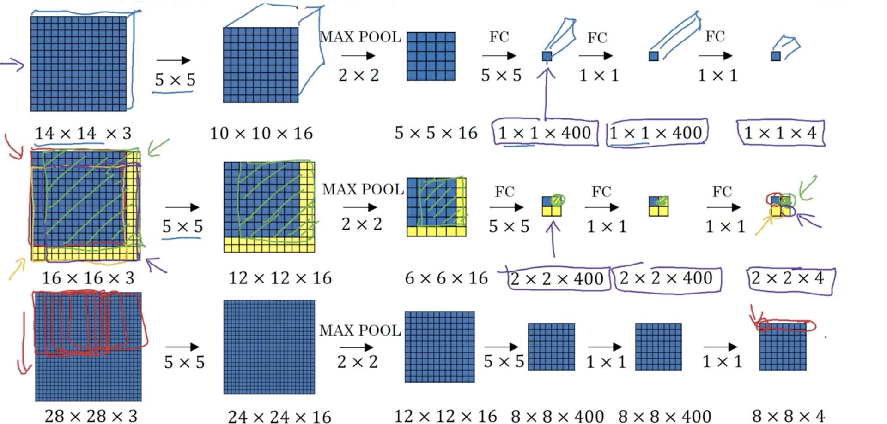

总结起来就是，先前所做的是剪出图像的一块区域比如$14\times14$，然后通过卷积网络运行，并对之后的区域同样如此。而现在不进行这样的序列操作，而是对所有区域同时进行这样的操作。

##### 5. 边界框预测

前面滑动窗口的卷积实现计算效率更高，但依然无法输出相当精确的边界框，一种解决这个问题的算法是YOLO，它表示You Only Look Once。假定输入图片是$100\times100$，在这个图片上放置一个网格，比如下图中的$3\times3$网格，对每个网格都应用前面的分类和定位算法，更具体地说，要定义用于训练的标记，对每一个网格确定一个标记$y$，每个标记都是前面(1)中定义的8维向量。这个图片中有两个目标物体，YOLO算法取每个目标物体的中点并将其赋予包含这个中点的网格。因此最终的输出就是$3\times3\times8$。因此所做的就是将输入图片，通过一系列的卷积层、池化层等，得到$3\times3\times8$的输出，使用反向传播算法将任何输入$X$映射为这种输出$Y$。这种算法的优点是能输出精确的边界框（$y$的$b_x,b_y,b_h,b_w$）。只要在每个网格内没有多个目标物体就能有效运行。实践中会用更好的网格，比如$19\times19$，输出就是$19\times19\times8$，会使网格结果更好，也减少了一个网格内包含多个物体的概率。要注意的是会将物体分配给其中点所在的网格，即便在多个网格内，也只分配给一个网格。

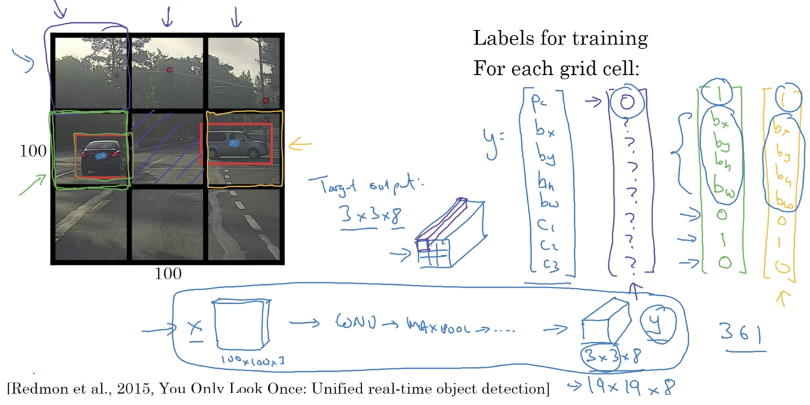

因此记住两件事，首先这很像前面讨论的图像分类和定位算法，很明显地输出边界框的坐标，这使得网络能输出任何纵横比的边界框，也输出更精确的坐标。其次这是一个卷积实现，是一个很高效的算法，运行非常快因此即便是实时物体检测依然有效。在YOLO算法确定$b_x,b_y,b_h,b_w$的编码时，参照目标物体中点所在网格，其左上角为(0,0)，右下角为(1,1)，$b_x,b_y$为物体中点在此网格的坐标，因此必然在[0,1]之间；而高度和宽度分别为占此网格高和宽的比例，因此有可能大于1。有多种确定边界框的方法，这是一种相当合理的约定。

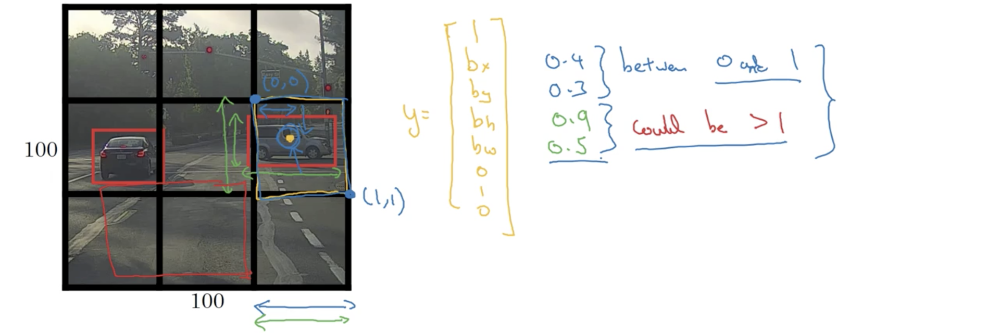

在YOLO原论文中，有一些其他参数能表现地更好，包括sigmoid函数来确保$b_x,b_y$在0到1之间，使用解释函数确保$b_h,b_w$非负。

##### 6. 交和并(Inrersection over Union, IoU)

如何辨别目标识别算法的性能呢？本节介绍算法IoU。比如下图的边界框是红色部分，但预测出来的是紫色部分，要评价其性能，将两个框交集的面积除以并集的面积，即
$$
\text{Intersection over Union} = \frac{\text{Size of intersection}}{\text{Size of union}}
$$
经过大量计算，惯例是若$\text{IoU}\ge0.5$，则可判定结果是正确的。IoU越高，则预测的边界框就越正确。0.5只是一个惯例选择，也可以选择更高的数来获得更严格的结果。

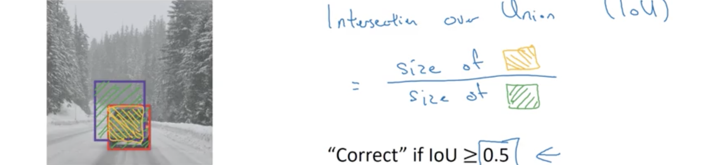

除了评估定位算法，IoU还可以用于评估更一般的边界框重叠的问题，也能评估两个框相似程度。

##### 7. 非最大限制(Non-max Suppression)

目前讨论的检测算法的问题是对同样的物体，算法可能会得到多个检测。非最大限制能确保算法每个物体检测一次。当运行算法时，每个物体可能获得多个检测，非最大限制会查看每个检测的概率，可能是$P_c\times C_2$不妨令其为$p_c$，首先取$p_c$中的最大值，然乎限制剩余的和高度重合的方框，即将其去除，最后每个物体就只有一个结果。非最大限制表示输出概率值最大的分类，抑制附近的非最大值。

如下图所示，假定只预测汽车，图片分为$19\times19$的网格。非最大限制首先做的是丢弃所有概率值$p_c$小于某个阈值的，比如0.6的边界框。然后，如果有剩余的边界框，就重复选择概率值$p_c$最高的边界框作为预测并丢弃剩余的与刚输出预测的$\text{IoU}\ge0.5$的任何边界框。这里讨论的是预测一种物体的算法，若是多种，则独立地重复非最大限制多次。

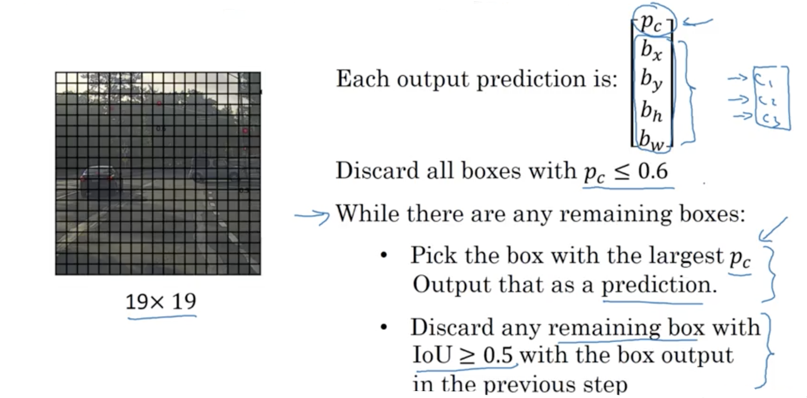

##### 8. 锚边框(Anchor Boxes)

目前所讨论的物体检测算法的问题是每个网格只能检测一个物体，若要检测多个，可以借助锚边框的思想。如下图，汽车和行人的中点都落在同一个网格内，前面方法得到的$y$并不能输出两个预测，锚边框的思想是预定义两个不同形状的锚边框，然后将两个预测与两个锚边框关联起来。这时就可以定义标记$y$为：
$$
y = \begin{bmatrix} 
p_c & \leftarrow & \text{Is there any object in the picture}\\
\vdots\\
c_3 & \leftarrow & \text{If so, is it a motorcycle; else ?}\\
p_c & \leftarrow & \text{Is there any object in the picture}\\
\vdots\\
c_3 & \leftarrow & \text{If so, is it a motorcycle; else ?}
\end{bmatrix} \tag{2}
$$

前面8个为锚边框1的相关量，因人的形状与锚边框1的更相似，因此可用这8个编码为行人的信息；后面8个为锚边框2的相关量，因汽车与锚边框2的形状相似，故可用其来编码为汽车的信息。

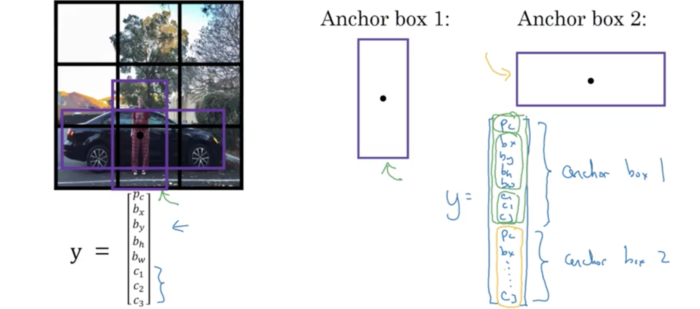

总结起来，通过两个锚边框，训练图片每个物体分配到包含其中点的边框，和与物体形状有最高IoU的锚边框。这里有两个锚边框，就比较物体形状与哪个的IoU更高。这时物体就分配到$(\text{grid cell, anchor box})$对中，这也是物体在标记中的编码方式。这时输出就是$3\times3\times16$。下图是完整的例子。但当两种物体的形状与同一锚边框相似时，这个算法就无法很好地解决。

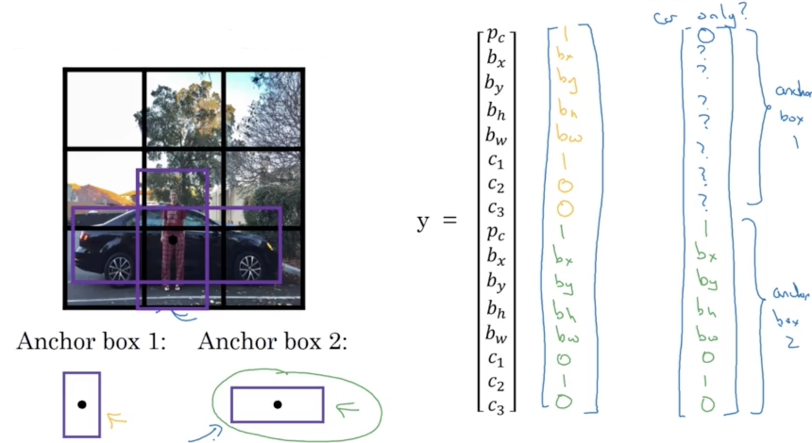

引入锚边框是为了解决一个网格内有多个物体的问题，但其实这并不经常发生。可能锚边框更好的动机是使得学习算法更好地专门化(specialize)，尤其是数据中含有一些类似行人的高瘦物体和像汽车一样的宽胖物体。这就能使学习算法的一些输出专门检测宽胖目标，一些输出专门检测高瘦目标。在选择锚边框形状时曾是手动选择5～10个覆盖多种形状，但后面的YOLO研究使用了更高级的k-means方法将物体形状成组，再从中选出一些锚边框。

##### 9. YOLO算法

目前为止已经讨论了很多检测算法的大部分组成，现在将这些组合起来形成YOLO目标检测算法。

首先是如何构造训练集。如下图假定要训练算法检测三种物体：行人、汽车、摩托。若使用两个锚点，则输出是$3\times3\times2\times8$，构造训练集时遍查这9个网格单元形成合适的目标向量$y$。训练一个神经网络输入一幅图片输出$3\times3\times16$的结果。

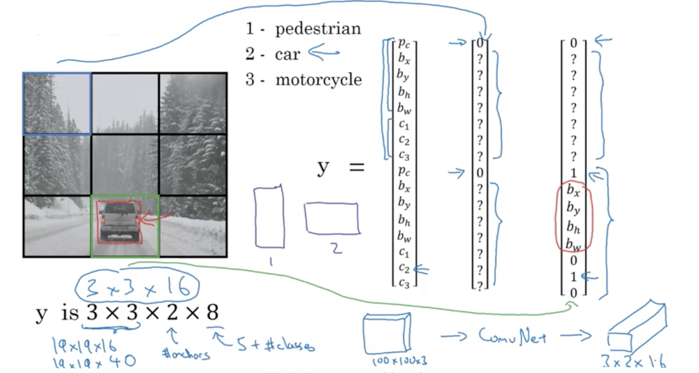

预测时就是输入图片输出$3\times3\times16$的结果。最后要做的是非最大限制。如下图，若使用了2个锚边框，则每个网格内会有两个预测的边界框；然后去除所有低概率的预测；之后，因为要预测三类，所以对每一类都独立地运行非最大限制以产生最终地预测。

##### 10. 区域提议（Region Proposal）

卷积滑动窗口的一个缺点是仅仅会判断很多明显没有目标的区域，因此Russ Girshik等人就提出了R-CNN(Regions with CNN)算法，它尝试挑选一些合理的区域来运行卷积分类器，而非运行每个滑动窗口。他们运行分割(segmentation)算法来执行区域提议，其结果如下图右部所示，以找出那些可能是目标。比如分割算法找到一些团块，然后挑出相应边界框运行分类器以判断边界框内是否存在目标。这也是一种特殊的在高瘦或宽胖区域而非仅仅方块区域运行解决网络的特殊情况。

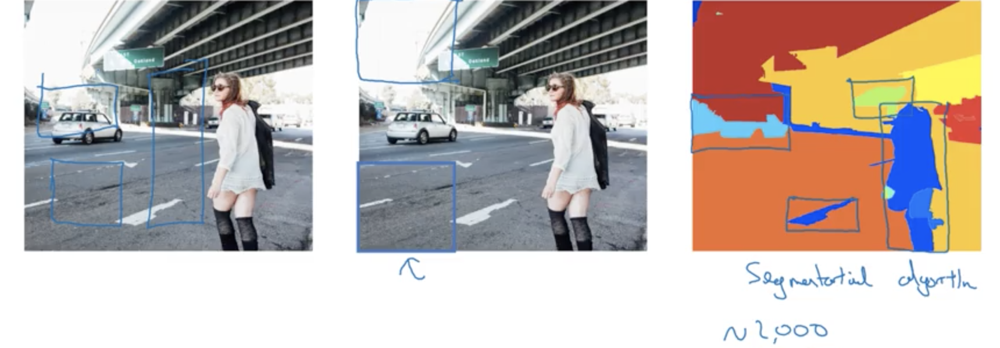

但R-CNN依然很慢，有一系列的工作来加速这个算法：

- 基础是R-CNN算法，用某个算法提出区域，然后分类这些区域。对每个区域都会输出标记和边界框。因此区域内真有目标，就能获得精确的边界框。它并不信赖给定的边界框，也输出边界框。
- Russ Girshik提出了Fast R-CNN来克服R-CNN运行效率的问题。基本上是带卷积实现滑动窗口的R-CNN。原始R-CNN会一次分类一个区域，而Fast R-CNN使用活动窗口的卷积实现，与前面所讨论的类似。但它的一个问题是串行的区域提议步依然相当慢。
- 因此Shaoqing Ren等人提出了Faster R-CNN，使用卷积网络而非传统分割算法来提出那些区域的团块。这使得运行速度相比Fast R-CNN有了比较大的提升。

讲师个人认为区域提议是好的思想，但将任务分成了先提出区域再分类的两步，而同时做所有事的算法比如YOLO可能前景更可观一些。
