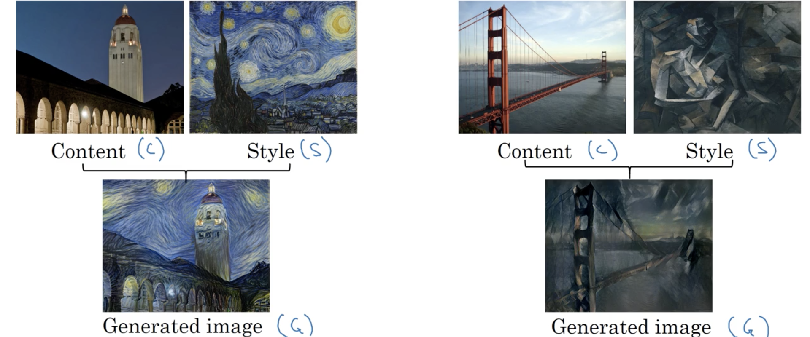

##### 1. 什么是人脸识别

在人脸识别文献中，人们经常谈论人脸验证。人脸验证是输入图片和姓名/ID，输出图片是否是所宣称的那个人，是1对1的问题。人脸识别则是有$K$人的数据库，输入一张图片，输出这$K$人中某个的姓名/ID，或者无法验证，是1对$K$的问题。

假定有一个正确率为99%的人脸验证系统；假定人脸识别系统中$K=100$，将这个验证系统应用到识别任务，则会比在每个人上1%的错误高100倍的可能犯错。

##### 2. 一次(One Shot)学习

人脸识别的一个难题是单焦学习，即在仅给出某人单张图片的情况下识别出此人。历史上仅有一个训练样本深度学习效果不佳。假定数据库中有4个人的4张照片，当有人靠近门闸时，尽管只看到一张照片，必须辨别出这个人的身份或不在数据库中。大多数的人脸识别应用都是如此因为数据库中仅有一张员工或同事的照片。将图片输入卷积网络最后用softmax输出ID的方法效果并不好因为训练数据并不充足；而一旦有信任加入就必须改变输出个数重新训练网络。

为实现单焦学习，这里学习一个“相似度”函数：
$$
d(\text{img1,img2}) = \text{degree of difference between mages}
$$
如果两张照片是一个人，则希望输出较小的数；不同则较大的数。在识别时，若$d(\text{img1,img2})\le\tau$，$\tau$为某个阈值，则可判定为同一个人；否则是不同的人。这样就解决了验证的问题。当有新人加入时，只要多做一次对比，因此也能运行良好。

##### 3. 孪生(Siamese)网络

一种很好的实现相似度函数$d$的方法是孪生网络。前面使用的卷积网络一般如下图所示，输入图片$x^{(1)}$，经过一系列的卷积层、池化层和FC层，最后得到一个特征向量。有时这些特征向量会输入softmax层以做分类；但这里关注这个特征向量，假定其维数为128并将其记为$f\left( x^{(1)} \right)$，它是输入图片的编码。要比较两张图片，可以将第二张图片$x^{(2)}$输入到相同的卷积网络中使用相同的参数得到不同的编码这张图片的特征向量$f\left( x^{(2)} \right)$。

若所得的是很好的特征向量，就可以定义相似度函数为：
$$
d\left( x^{(1)},x^{(2)} \right) = \left\Vert f\left(x^{(1)}\right) - f\left(x^{(2)}\right) \right\Vert_2^2
$$
这是在两个不同输入运行两个相同卷积网络然后进行对比的方法，有时称为孪生网络。训练孪生网络就是要使其计算的编码能产生相似度函数。即NN的参数定义编码$f\left(x^{(i)}\right)$，要学习参数，使得$x^{(i)},x^{(j)}$为同一个人时，$\left\Vert f\left(x^{(1)}\right) - f\left(x^{(2)}\right) \right\Vert_2^2$很小；$x^{(i)},x^{(j)}$为不同人时，$\left\Vert f\left(x^{(1)}\right) - f\left(x^{(2)}\right) \right\Vert_2^2$很大。因此网络中层的参数不同，就有不同的编码，要做的就是用反向传播使得上面的条件成立。

##### 4. 三元(triplet)损失函数

实现孪生网络的一个方法是在三元损失函数上使用梯度下降。要应用三元损失，会观察一张锚图片，并使它与正样本的距离较近，与负样本的距离很远。这就是术语三元损失的产生，因为总是一次查看三张图片，一张锚图片(A)，一张正样本(P)，一张负样本(N)，

然后希望：
$$
\begin{aligned}
d(A,P) &\le d(A,N)\\
\left\Vert f(A)-f(P) \right\Vert^2 &\le \left\Vert f(A)-f(N) \right\Vert^2\\
\left\Vert f(A)-f(P) \right\Vert^2 - \left\Vert f(A)-f(N) \right\Vert^2 &\le 0
\end{aligned}
$$
单这样有一个问题，若$\forall X$，$f(X)\equiv0$，则上式恒成立。为阻止神经网络的这种行为，定义
$$
\begin{aligned}
\left\Vert f(A)-f(P) \right\Vert^2 - \left\Vert f(A)-f(N) \right\Vert^2 &\le -\alpha\\
\left\Vert f(A)-f(P) \right\Vert^2 - \left\Vert f(A)-f(N) \right\Vert^2 + \alpha &\le 0\\
\left\Vert f(A)-f(P) \right\Vert^2 + \alpha &\le \left\Vert f(A)-f(N) \right\Vert^2
\end{aligned}
$$
其中$\alpha$是一个很小的正实数，也被称为边缘，它迫使锚-正样本对远离锚-负样本对。这样，就能定义三元损失函数，即给定三张图片$A,P,N$：
$$
\mathcal L(A,P,N) = \max\left(\Vert f(A)-f(P) \Vert^2-\Vert f(A)-f(N) \Vert^2+\alpha, 0\right)
$$
而数据集上的正个代价函数是：
$$
J = \frac1m \sum_{i=1}^m \mathcal L\left(A^{(i)},P^{(i)},N^{(i)}\right)
$$
在训练集中，可能就需要同一个人有多张照片；但训练完系统后，一个人就可以只有一张图片了。在构建训练集时，若随机选择$A,P$和$A,N$，则$d(A,P)+\alpha \le d(A,N)$就很容易满足，因为随机给出两个人的照片，则两个人差别大于其中一个人的两张照片的概率就很高，因此太多的三元组就学习起来很简单，梯度下降就无需做太多的事，而神经网络就无法从中学习很多。因此就需要选择“难以”训练的三元组，即$d(A,P) \approx d(A,N)$，这样神经网络就必须做一些工作来使得这两个数值互相远离。

##### 5. 人脸验证与二元分类

人脸识别也可以构造为二元分类问题。如下图所示，

用孪生网络学习输入两张图片各自的128维向量编码，然后通过sigmoid函数来判断是否为同一个人。具体为：
$$
\begin{eqnarray}
\hat y &=& \sigma\left( \sum_{k=1}^{128} w_i\left\vert f\left(x^{(i)}\right)_k -f\left(x^{(j)}\right)_k\right\vert + b \right)\\
&\text{or}&\\
\hat y &=& \sigma\left( \sum_{k=1}^{128} w_i\left( f\left(x^{(i)}\right)_k -f\left(x^{(j)}\right)_k\right)^2 + b \right)\quad\left(\chi^2 \text{ similarity}\right)
\end{eqnarray}
$$
在这个学习形式中，输入是图片对，输出是是否同一人的二元值，而两个网络是等价的。一个提高效率的技巧是，可以将数据库中所有的图片的向量编码预先计算好并存储起来。这样每次识别时只需计算一张图片的向量编码，然后与已计算的进行比对即可。

##### 6. 神经风格迁移

神经风格迁移如下图所示：

这里将内容图片简写为C，风格图片为S，生成的图片为G。实现神经风格迁移需要查看不同卷积层提取的特征。

##### 7. 深度卷积网络学习的内容

假定已经训练了下图类似AlexNet的网络。

希望可视化不同层隐单元计算的内容，可以从第一层的一个隐单元开始，扫视训练集并找出什么样的图片或图片剪片最大化了这个单元的激活值。换句话说就是将训练集传递给网络，然后找出最大化那个特定单元的图片。注意，层1的一个隐单元仅能看到神经网络的很小部分，因此描绘激活这个单元激活值的内容，仅画出一小块图片是很合理的。因为那是那个特定单元所能看到的所有内容。因此挑选一个隐单元并找出9张最大化其激活值的图片，可能看到的的是下图右下角左上角单元的内容，表明这个单元似乎是在寻找线或边。

然后选择第一层的一个不同单元，做相同的事，然后将其他的单元一次循环同样的事。如下图右下角，第一层的隐单元通常寻找简单的特征比如边缘或特定的颜色阴影。这是可视化的第一层的内容，**更深层的单元看到的图像区域也更大**。重复上面第一层的过程，可视化更深层，得到的结果为：

下面是第一层的聚焦：

下面是第二层，检测更复杂的形状和模式：

然后是第三层，检测更高层次的圆形、人、蜂巢这样的材质等：

然后第四层：

然后第五层：

从检测相对简单的东西，比如第一层的边缘，第二层的材质，到更深层非常复杂的目标。

##### 8. 代价函数

给定内容图像$C$和风格图像$S$，目标是生成神经风格迁移的图像$G$，为此定义一个代价函数$J(G)$来评估生成图像的优劣，并使用梯度下降最小化代价函数以生成图像。代价函数定义为两部分，一部分是内容代价$J_{\text{content}}(C,G)$，它衡量生成图片与内容图像的相似度；另一部分是风格代价$J_{\text{style}}(S,G)$，衡量生成图片与风格图片的相似度。然后使用$\alpha,\beta$加权求和这两个值。因此最终代价函数的形式为：
$$
J(G) = \alpha J_{\text{content}}(C,G) + \beta J_{\text{style}}(S,G)
$$
比如要将下面的图像进行风格迁移：

因此算法的运行过程就是：

1. 随机初始化$G:100\times100\times3$；

   

2. 使用梯度下降来最小化$J(G)$，更新$G$：
   $$
   G:=G-\frac{\partial}{\partial G}J(G)
   $$
   这个过程实际上就是更新图像$G$的像素值:

   

##### 9. 内容代价函数

为计算内容代价函数，可以：

1. 使用隐层$l$来计算内容代价，若所使用的$l$很小，比如$l=1$，这就迫使生成图像的像素值与内容图片十分相似；若使用很深的$l$，就会只在生成的图片中包含内容图片的一些元素。因此选择的层$l$在这两者之间，既不太浅也不太深。

2. 使用预训练好的卷积网络，比如VGG网络或其他的经典网络；令$a^{[l](C)},a^{[l](G)}$为层$l$在图像上的激活值；若两者十分相似，则两张图片有相似的内容；
   $$
   J_{\text{content}}(C,G) = \frac12 \left\Vert a^{[l](C)}-a^{[l](G)} \right\Vert^2
   $$

##### 10. 风格代价函数

那什么是所谓的图像风格呢？假定将下面的图片输入下面的神经网络中，并选择层$l$来定义图像的风格，可以将图像风格定义为层$l$激活值上不同通道之间激活值的相关性(correlation)。

假定$l$层的激活值如下，为$n_h\times n_w\times n_c$的块，将不同的通道用不同的颜色表示出来。要获得图像的风格，先看前两个通道所有相同位置的两个激活值的相关性。

为何这样就能获得图像的风格呢，下面是某层可视化的结果，假定红色通道对应第二格的神经元，黄色通道对应第四格。若这两个通道非常相关，就无论图像那个部分有第二格的内容，则那个部分必有第四格的内容；若这两个通道不相关就表示无论何时出现第二格的内容，则很有可能不出现第四格的内容。因此这里的相关性就表明图像某部分这些高层材质成分的哪些趋向于同时发生，或不趋向于同时发生。相关性的程度给出了这些不同高层特征在图像不同部分同时发生和不同时发生的频繁程度。

因此给定一张图片，要做的就是计算风格矩阵(style image)。令$a_{i,j,k}^{[l]}$为在$(i,j,k)$的激活值，其中$i,j,k$分别为$H,W,C$的索引；$G^{[l]}$是$n_c^{[l]}\times n^{[l]}$的矩阵，因此$G^{[l]}_{kk'}$就是评估通道$k$和$k'$激活值的相关性，它的计算方式为：
$$
\begin{aligned}
G^{[l](S)}_{kk'} &= \sum_{i=1}^{n_H^{[l]}} \sum_{j=1}^{n_W^{[l]}} a^{[l](S)}_{ijk}a^{[l](S)}_{ijk'},\quad k,k' \in {1,\cdots,n_C}\\
G^{[l](G)}_{kk'} &= \sum_{i=1}^{n_H^{[l]}} \sum_{j=1}^{n_W^{[l]}} a^{[l](G)}_{ijk}a^{[l](G)}_{ijk'},\quad k,k' \in {1,\cdots,n_C}
\end{aligned}
$$
若$a^{[l]}_{ijk},a^{[l]}_{ijk'}$都比较大，则结果就会比较大；若两者不相关，则结果就比较小。这样就能分别计算出风格图像和生成图像的风格，这样风格代价就为：
$$
\begin{aligned}
J_{\text{style}}^{[l]}(S,G) &= \frac1{\left( 2n_H^{[l]}n_W^{[l]}n_C^{[l]} \right)^2}\left\Vert G^{[l](S)}-G^{[l](G)} \right\Vert^2_F\\
&=\frac1{\left( 2n_H^{[l]}n_W^{[l]}n_C^{[l]} \right)^2}\sum_k\sum_{k'}\left( G_{kk'}^{[l](S)}-G_{kk'}^{[l](G)} \right)^2
\end{aligned}
$$
最后，事实证明若使用多个不同层的风格代价函数，能够获得更多的视觉愉悦。因此总的风格代价函数就是：
$$
J_{\text{style}} = \sum_l \lambda^{[l]} J_{\text{style}}^{[l]}(S,G)
$$
这样就能使用同一神经网络的不同层，就能将低层和高层的风格都考虑到。

##### 11. 1维和3维推广

卷积网络也可以应用在1维或3维数据中，下图是被称为心电图(electrocardiogram)的EKG信号，

以及下面的CT扫描图片，是在不同位置片段上的扫描，因此事天然的3维数据。同样电影数据也能作为3维数据，它是在不同时间片段的图片。

