##### 1.序列模型

##### 2.记号

- $x^{<t>}$，输入序列的第$t$个位置；$T_x$，输入序列的长度；
- $y^{<t>}$，输出序列的第$t$个位置；$T_y$，输出序列的长度；
- $x^{(i)<t>}$，第$i$个训练样本输入的第$t$个位置；$T^{(i)}_x$，第$i$个训练样本输入的长度；
- $y^{(i)<t>}$，第$i$个训练样本输出的第$t$个位置；$T^{(i)}_y$，第$i$个训练样本输出的长度。

##### 2.RNN

为何不用标准网络：

- 输入和输出都是不定长的；
- 标准网络并不能共享文本不同位置学得的特征。

下面是RNN按时间展开的图像：

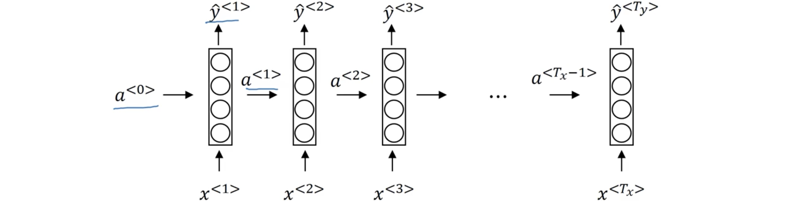

其计算过程为：
$$
\begin{eqnarray}
a^{<0>} &=& \vec{0}\\
a^{<t>} &=& g_1\left( W_{aa}a^{<t-1>} + W_{ax}x^{<t>} + b_a \right)\\
\hat y^{<t>} &=& g_2\left( W_{ya}a^{<t>} + b_y \right)
\end{eqnarray}
$$
在上面参数命名中，比如$W_{ax}$，第一个下标表示相乘所得到的量，第二个下标表示右边相乘的量；激活函数$g_1$通常是tanh，有时也会用ReLU；激活函数$g_2$则根据输出使用sigmoid或softmax。令：
$$
\begin{eqnarray}
W_a &=& \left[W_{aa}\vdots W_{ax} \right]\\
\left[ a^{<t-1>},x^{<t>} \right] &=& \begin{bmatrix} a^{<t-1>}\\x^{<t>} \end{bmatrix}\\
W_y &=& W_{ya}
\end{eqnarray}
$$
这样上面的计算公式就能简写为：
$$
\begin{eqnarray}
a^{<t>} &=& g_1\left( W_a\left[a^{<t-1>},x^{<t>}\right] + b_a \right)\\
\hat y^{<t>} &=& g_2\left( W_ya^{<t>} + b_y \right)
\end{eqnarray}
$$

##### 4.BPTT

令
$$
\begin{eqnarray}
\mathcal L^{<t>}\left( \hat y^{<t>},y^{<t>} \right) &=& -y^{<t>}\log\hat y^{<t>} - \left( 1-y^{<t>}\log\left( 1-\hat y^{<t>} \right) \right)\\
\mathcal L(\hat y, y) &=& \sum_{t=1}^{T_y} \mathcal L^{<t>}\left( \hat y^{<t>},y^{<t>} \right)
\end{eqnarray}
$$
由

##### 5.不同类的RNN

- **one-to-one**： 如下图左侧所示，就是一个普通的神经元；

- **many-to-one**：如下图右侧所示，比如情感分析等；
- **one-to-many**：生成模型，如音乐等序列的生成；

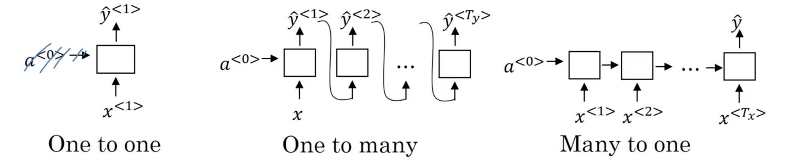

- **many-to-many**，又可分为两种：
  - $T_x = T_y$：下图左侧所示；
  - $T_x \neq T_y$：下图右侧所示，经典的encoder-decoder模型。

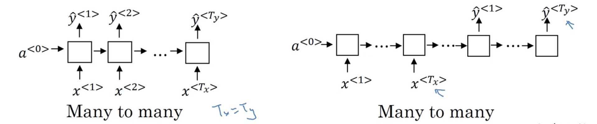

##### 6.语言模型和序列生成

语言模型就是评估一个句子的可能性：$P(y^{<1>},y^{<2>},\cdots,y^{<T_y>})$；建立语言模型需要训练大量语料库的文本；对一句话，需要将句子：

- 先标记化(tokenize)：将输入句子根据字典或其他方法将词表示为单个标记，如向量（如one-hot向量）等，然后在句子的结尾加上特殊的`<EOS>`标记标记句子结束，对于不在词典中的词则使用`<UNK>`标记；

- 然后建立RNN模型：从第一个时间开始，令$a^{<0>}=\vec0, x^{<1>}=\vec0$，由此计算$a^{<1>}$，进而用softmax计算表示词典中每个词为第一个词的概率向量$\hat y^{<1>}$；

- 之后的每一步，令$x^{<t>}=y^{<t-1>}$，即用实际的词来计算后面的值，用$x^{<t>},a^{<t-1>}$计算$a^{<t>}$，之后计算在前面世纪出现的词的条件下词典中每个词为下个的概率向量，即$p(* \mid y^{<1>},\cdots,y^{<t-1>})$，直到结束；

- 为训练RNN，定义损失函数
  $$
  \begin{eqnarray}
  \mathcal L\left( \hat y^{<t>},y^{<t>} \right) &=& -\sum_i y_i^{<t>}\log\hat y_i^{<t>}\\
  \mathcal L &=& \sum_t \mathcal L^{<t>}\left( \hat y^{<t>},y^{<t>} \right)
  \end{eqnarray}
  $$

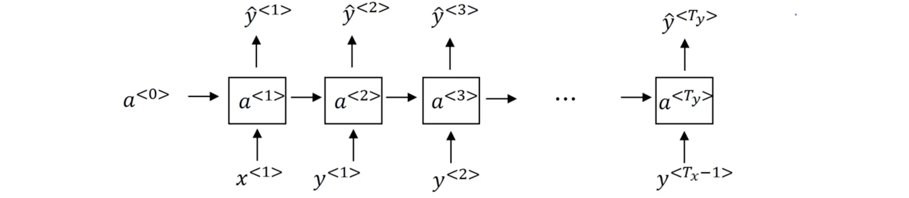

当经过大量训练后，RNN就能根据初始词语给出后面词语的概率；也能对一句话$y^{<1>},\cdots,y^{<T_y>}$根据：
$$
P\left( y^{<1>},\cdots,y^{<T_y>} \right) = \prod_{t=1}^{T_y}P\left( y^{<t>} \mid y^{<1>},\dots,y^{<t-1>} \right)
$$
也就是上面训练的内容，给出其概率。

##### 7.抽取新序列

基本过程与上面训练语言模型的过程类似，略有不同：

- 开始时也是令$a^{<0>}=\vec0, x^{<1>}=\vec0$，在产生词汇表中所有词的分布向量$\hat y^{<1>}$后可选择一个词；
- 令$x^{<t>}=\hat y^{<t-1>}$，也就是用前面生成的词作为输入，最后生成$\hat y^{<t>}$；
- 直到满足设定的句子长度或者出现`<EOS>`。

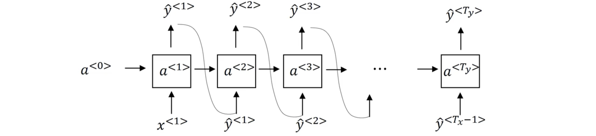

下面是单词级的RNN模型，即词汇表中的是单词；基于应用，有时也可以构建基于字符的RNN，这时词汇表中就是字母、数字、符号、空格等，这时$y^{<t>}$就是单个字符。其不需要`<UNK>`标记，在需要处理未知词时或特殊领域时很有用；但主要缺点是序列太长，在获取大范围依赖就没有基于单词的模型有效，在训练时的计算代价也更大。

##### 8.梯度消失

因梯度消失的原因，后面步骤的输出很难使用前面的信息，就像下面的例子中，后面RNN很难记住前面用的是单数还是复数，：

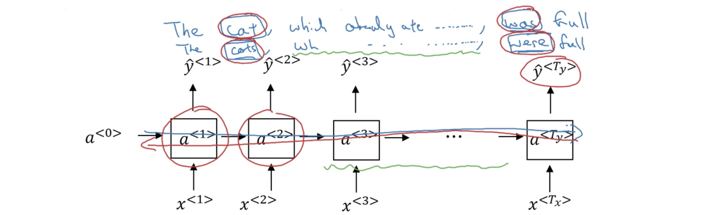

基本的RNN很大受局部影响，即某时刻的值受前面临近时刻的影响，这使其很难获取大范围的依赖关系。前面还谈到过梯度爆炸的问题，但实际在训练RNN时前者是主要问题；而后者则相对更容易发现因为发生时经常会出现`NaN`，这时一种解决方法是梯度修剪(clipping)，即当参数向量大于某个阈值时，将其按比例缩小。

##### 9.门控循环单元(Gated Recurrent Networks)

GRU时RNN隐层的一种改进，能更好地获取大范围的连结和解决梯度弥散问题。RNN中隐层的激活值为下图右侧的公式，它的计算过程如下图左侧所示：

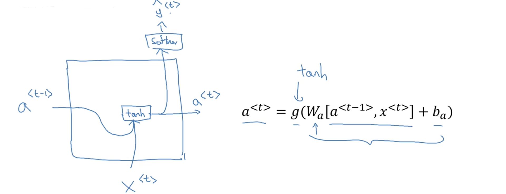

当从左向右接受一个序列时，GRU中定义了一个新单元$c$，表示记忆单元；在GRU中，$c^{<t>}=a^{<t>}$，每一步都会考虑是否覆盖记忆单元，为此计算一个$c^{<t>}$的候选$\tilde c^{<t>}$，并定义一个门控$\Gamma_u$，下标$u$表示update：
$$
\begin{eqnarray}
\tilde c^{<t>} &=& \tanh\left(W_c\left[\Gamma_r*c^{<t-1>},x^{<t>}\right]+b_c\right)\\
\Gamma_u &=& \sigma\left( W_u\left[c^{<t-1>},x^{<t>}\right] + b_u \right)\\
\Gamma_r &=& \sigma\left( W_r\left[c^{<t-1>},x^{<t>}\right] + b_r \right)\\
c^{<t>} &=& \Gamma_u*\tilde c^{<t>} + \left( 1-\Gamma_u \right)*c^{<t-1>}\\
a^{<t>} &=& c^{<t>}
\end{eqnarray}
$$
上面的$*$乘号表示基于对应元素的相乘；$\Gamma_u$大部分时间为0或1表示是否更新记忆单元中的值，$\Gamma_r$则表示$c^{<t-1>}$与$\tilde c^{<t>}$的相关程度。当序列从左向右通过门控时，当遇到真正需要的时候才更新。很容易设门控为0，因此善于维持单元内的值，且不会收到梯度消失问题的困扰。门控$\Gamma_u$是一个向量，每个元素都可以表示记忆单元对应位置的信息是否更新。

##### 10.长短项记忆

LSTM是比GRU更为强大和通用的工具。有更新、遗忘、输出三个门：
$$
\begin{eqnarray}
\tilde c^{<t>} &=& \tanh\left(W_c\left[a^{<t-1>},x^{<t>}\right]+b_c\right)\\
\Gamma_u &=& \sigma\left( W_u\left[a^{<t-1>},x^{<t>}\right] + b_u \right)\\
\Gamma_f &=& \sigma\left( W_f\left[a^{<t-1>},x^{<t>}\right] + b_f \right)\\
\Gamma_o &=& \sigma\left( W_o\left[a^{<t-1>},x^{<t>}\right] + b_o \right)\\
c^{<t>} &=& \Gamma_u*\tilde c^{<t>} + \Gamma_f*c^{<t-1>}\\
a^{<t>} &=& \Gamma_o*\tanh c^{<t>}
\end{eqnarray}
$$
用图形表示出来就是：

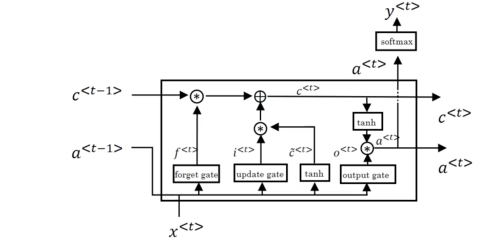

将其展开就有

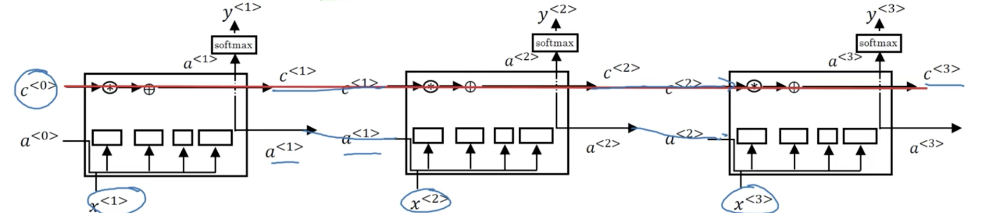

和上面一样，门的每个元素与其控制值对应位置的元素也是一对一的影响关系。LSTM的一种变体是peephole连接，每个门不仅考虑前一个激活值和当前输入值，还考虑前一个记忆单元的值，即：
$$
\begin{eqnarray}
\Gamma_u &=& \sigma\left( W_u\left[a^{<t-1>},x^{<t>},c^{<t-1>}\right] + b_u \right)\\
\Gamma_f &=& \sigma\left( W_f\left[a^{<t-1>},x^{<t>},c^{<t-1>}\right] + b_f \right)\\
\Gamma_o &=& \sigma\left( W_o\left[a^{<t-1>},x^{<t>},c^{<t-1>}\right] + b_o \right)
\end{eqnarray}
$$

##### 11.双向RNN

这是另一种加强RNN的思想，这时不仅从过去学习，还从未来学习。大致如下图所示：

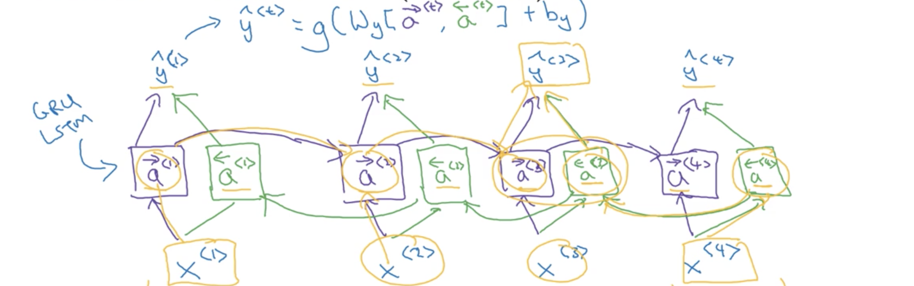

这样无论在哪个位置，都能使用整个序列的信息。上面更常使用的是GRU单元或LSTM单元。不过在做出预测时需要获得整个序列。

##### 12.深度RNN

与深度网络类似，将多个RNN堆叠起来，就组成了深度RNN，将其展开为：

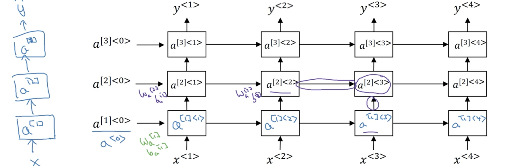

记$a^{[l]<t>}$表示第$l$层时间$t$的激活值，其计算公式为：
$$
a^{[l]<t>} = g \left( W^{[l]}_a\left[ a^{[l]<t-1>},a^{[l-1]<t>} \right]+b^{[l]}_a \right)
$$
 同样上面也可以是GRU和LSTM单元，也可以构建深度双向RNN。对于RNN而言，三层已经是很大的网络了。