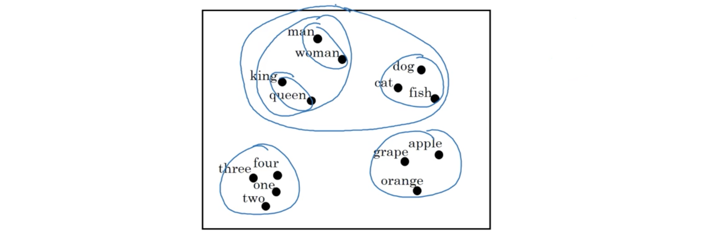
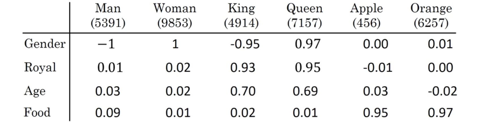
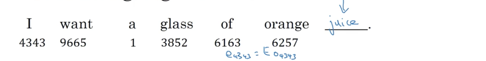
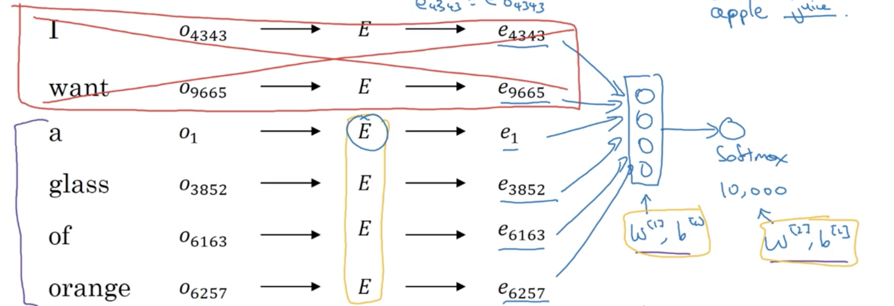
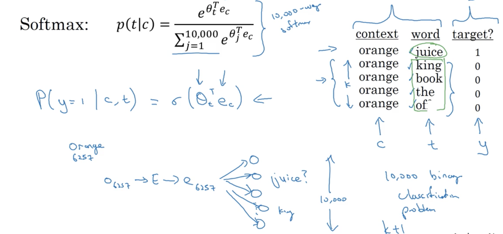
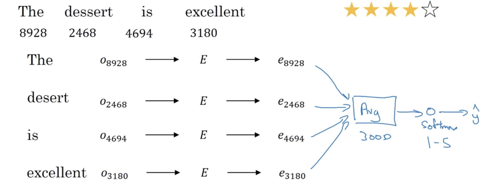
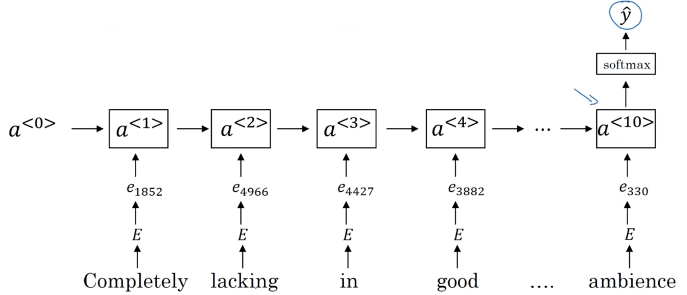
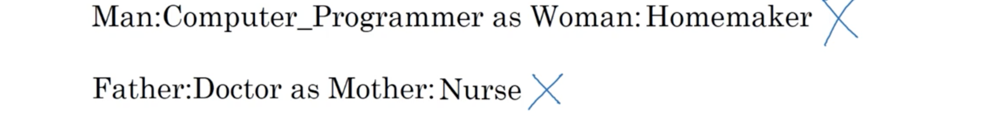

##### 1.词表示

One-hot向量表示方法的一个缺陷是只考虑每个词自身，并未考虑词之间的语义关系，任意两个不同one-hot向量的内积都是0，无法让算法很方便的推广到交叉词中。

一种改善是学习特征化的表示，比如给每个词赋一些特征系数，比如对于性别特征，"Man"为-1，"Woman"为1，"King"是-0.95，"Queen"是0.97，"Apple"是0，"Orange"是0.01等等，同样还可以为很多其他特征赋值；每个词的这些特征的赋值可以组成一个表示词本身的向量，这样相同类型或意义词之间的距离就会很近。

后面会介绍学习这样的词向量的方法，学习到的向量并不容易辨别每个维度代表的特征，但也能使算法很快得辨别出相似的词。在学习到高维词向量或词嵌入之后，可以用t-SNE方法将其进行可视化展示，

##### 2.使用词嵌入

使用词嵌入实施迁移学习的步骤：

1. 从一个很大的语料库中学习词嵌入或使用已训练的词嵌入；
2. 然后将词嵌入用较小的训练集前一到新任务中，这里的一个好处是可以使用相对低维的密集向量；
3. 可选地，若数据足够，用新数据继续调优词嵌入；

这在命名实体识别、文本总结、指代消解(coreference resolution)、解析上很有用，即若在一个任务A有充足的数据、而另一个的数据不那么充分时，迁移学习很有用，但语言模型、机器翻译则除外。

最后，词嵌入与面部编码有一些联系。

##### 3.词嵌入特征

词嵌入最吸引人的一个特征是有助于类比推理，这传达了词嵌入正在做以及能做的事情。假定用下图的四维向量$\vec e_{\text{word}}$表示词"word"，可以计算有$\vec e_{\text{man}}-\vec e_{\text{woman}}\approx\vec e_{\text{king}}-\vec e_{\text{queen}}$。而"man"和"woman"与"king"和"queen"的差别都只在特征"gender"上，因此算法就能使用这种类比推理。

在做类比推理的时候会用到相似性函数，其中比较常用的是cosine相似性，其定义为：
$$
\text{sim}\left(\vec u,\vec v\right) = \frac{\vec u^T\vec v}{\Vert \vec u \Vert \Vert \vec v \Vert}
$$
当$u,v$越相似，这个值就越大，其实就是计算两个向量夹角的余弦。

##### 4.嵌入矩阵

当要实现算法来学习词嵌入时，最终的学习都是嵌入矩阵，即大小为$\text{feature_num}\times\text{vocab_size}$的矩阵$E$，其每列都表示一个单词的嵌入。理论上每个词的one-hot向量$\vec o_j$有：$E\vec o_j = \vec e_j$，但实际中通畅直接取矩阵的对应列以提高效率。

##### 5.学习词嵌入

构建语言模型是学习嵌入的合理方法。假定要学习一个语言模型预测下一个词，

设$E$为词嵌入矩阵，其每列队迎一个词的嵌入；这样每个词都能得到向量，然后将所有这些词向量输入到一个神经网络中，其结果再输入到softmax中，其结果便是下个词在词汇表上的概率分布。设定固定的历史窗口，即每预测下个词时参考的前面词的个数，这样就能处理任意长的输入。这样就能用反响传播算法在训练集上学习嵌入矩阵$E$，事实证明这样能得到比较好的嵌入，只要训练语料库足够大。具体可见下图：

现在推广这个算法并推导出更简洁的算法。设句子中的某个词为目标词，有多种构建语境的方式，可以设为左右两侧各4个词，或者前个词，或者周围的一个词（跳元，skip-gram）等。这离想展示的是弱目标是构建语言模型，则很自然地用前几个单词作为语境；而若目标是学习词嵌入，则可以用多种上下文形式。

##### 6.Word2Vec

**跳元(skip-gram)模型**：给定一个句子，跳元模型会得到一些上下文-目标词对来构建监督学习问题。具体操作为，随机选择一个词作为上下文，然后在某个窗口（比如$\pm5$）内随机选择一个词为目标词。显然这不是个简单的学习问题，因为会有很多不同的词。但这个目标并非是很好地完成监督学习任务，而是希望此问题学到优质的词嵌入。

假定$\text{Vocab size}=10000k$，基本问题就是学习一个从上下文$c$，到某个目标词$t$的映射。具体操作是将嵌入矩阵$E$中$c$对应的向量输入softmax中，得到预测$\hat y$，然后与目标词$t$做比较，反向传播更新参数。即
$$
\text{Softmax: }\frac{e^{\theta_t^Te_c}}{\sum_{j=1}^{\text{vocab_size}}e^{\theta_j^Te_c}}
$$
其中$\theta_t$是与输出相关的参数，即某个词的可能性，而$t$是标记。损失函数定义为：
$$
\mathcal L\left( \hat y, y \right) = -\sum_{i=1}^{\text{vocab_size}} y_i\log\hat y_i
$$
嵌入矩阵$E$和softmax层都有参数，对所有参数最优化这个损失函数，就得到一个相当好的嵌入矩阵。但这个算法还有一些问题，主要的是计算速度。有几种解决方法，一种是层级softmax分类器，思想是与其一次性分类到所有词，不如先做二元分类告诉词在词汇表前个还是后个部分；如此一直下去直到获得精确结果，也即树的叶子结点。这样一个分类器树表示每个内部结点都是一个二元分类器，因此无需将所有词相加来做单个分类。它的计算代价为字典规模的对数相关。实践中层级树并未用严格的平衡二叉树，而是常用词在顶部、稀有词在下部的哈夫曼树。

在抽取上下文$c$时，若使用语料库上的一致抽样，就会出现大量"a"、"the"等这样的常用词，因此最好用一些启发式的方法。

##### 7.负采样

这也是为解决上面跳元模型计算速度太慢而提出的方法。它定义了一个新的学习问题：给定一对词，预测其是否为上下文-目标词对。比如"orange"-"juice"就是一个正样本，"orange"-"King"就是负样本。像前面介绍的那样抽取一个正样本，对同样的上下文$c$随机从字典中抽取$K$个词，即便出现在$c$的附近，也标记为0构成负样本。然后构建一个有监督学习问题，输入单词对，预测其标记，就是要辨别出它们是近邻，还是字典中的随机无关这两种分布。这就是训练集的生成。对于$K$，算法发明者建议小数据集上$K=5\sim20$，而大数据集则$K=2\sim5$。

定义一个logistic模型：$P(y=1\mid c,t)=\sigma\left( \theta^T_te_c \right)$，参数$\theta_t$类似前面内容；每个词对应的嵌入$e$输入到vocab_size个logistic回归中，每个回归表示目标$t$是否是其对应的词。对于每个$c$，只训练$K+1$个分类器。因此就是训练vocab_size个logistic回归，每次迭代只训练其中$K+1$个，因此就大大减少了计算代价：

注意在负采样时，对于某个$c$，若按照语料库中的词频抽取，会出现很多"the"、"a"这样的词，若在字典中随机选，有无法代表语料库，因此作者建议两者的折衷：
$$
P(w_i) = \frac{\text{frequency}(w_i)^{3/4}}{\sum_{j=1}^{\text{vocab_size}}\text{frequency}(w_j)^{3/4}}
$$

##### 8.Glove词向量

虽然没有word2vec那么常用，但因其简洁性，也有很多爱好者，Glove表示词表示的全局向量(Global Vectors for Word Representation)。它定义$X_{ij}$表示目标词$i$在上下文$j$中出现的次数，这样就表现出两个词的相关性；并且基于目标词和上下文的对称（即窗口关于目标词对称）定义可以有$X_{ij}=X_{ji}$。模型为：
$$
\text{minimize} \sum_{i=1}^{\text{vocab_size}}\sum_{j=1}^{\text{vocab_size}}f(X_{ij})\left( \theta^T_ie_j+b_i-b_j'-\log X_{ij} \right)
$$
其中$x_{ij}=0 \to f(x_{ij})=0$，即只对共现的词进行累加，并且给稀有词有计算意义的权值，给停止词高但并不正比的权值，有一些选择函数$f$的启发式方法。另外，$\theta_i$和$e_j$的作用是对称的。因此训练算法的一个方法就是随机初始化$\theta_i$和$e_j$，然后执行梯度下降来最小化目标。训练结束后，某个词的嵌入可取两者的平均：$e_w = \frac{e_w+\theta_w}2$。

最后需注意的是这些得到的词嵌入并不保证其每一维的意义都是可解释的，因若$A$是可逆矩阵，则$\theta^T_ie_j$可视为$\left(A\theta_i\right)^T\left(A^{-T}e_j\right)$，因此可以是做了一些坐标变换的，但其并行性的类比推理是保留的。

##### 9.情感分析

情感分析的一个问题是缺乏大量训练数据，但借助词嵌入就能通过适量训练数据构造优质情感分类器。比如下面的方法，将词向量求均值再用softmax分类：

但它的一个缺点是完全忽略了词的顺序，比如对于评论"Completely lacking in good taste, good service, and good ambience"，大量的"good"会占很大的比例，但表达的却是相反的意思。可以考虑使用RNN：

能更好地考虑到词序列，意识到"lacking good"是负面的意思。并且即便训练数据中未出现的例子，比如上面的"lacking in"变为"absent of"，只要在训练词嵌入的预料中出现，就会发现两者的相似性，因此能很好的推广。

##### 10词嵌入消偏(debiasing)

词嵌入会反映出训练文本中性别、种族、性取向以及其他的偏差，比如：

对于已有的词嵌入，可以做的有：

1. 辨别偏差方向：比如对性别消偏时，可以求$e_{\text{he}}-e_{\text{she}}$、$e_{\text{male}}-e_{\text{female}}$这样与性别有关词汇差值的均值作为偏差方向或坐标，其他为无偏坐标；偏差方向也会是高维的，但可用SVD等方法；
2. 第二步是中和(neutralize)：对任何非性别明确的，比如上面的"doctor"、"nurse"等，将其投影到偏差方向、减小偏差方向的分量，以避免偏差；
3. 最后一步是等价化，将性别中性的词到明确性别定义的词对的距离相等，即调整"male"和 "female"，使"doctor"到两者的距离都相等，可以通过调整"female"和"male"关于非偏差轴对乘来实现。

