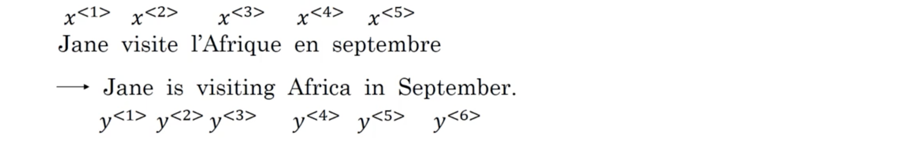
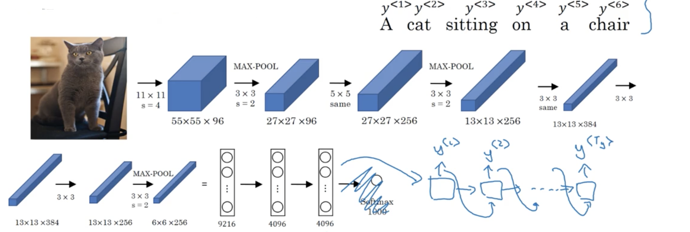
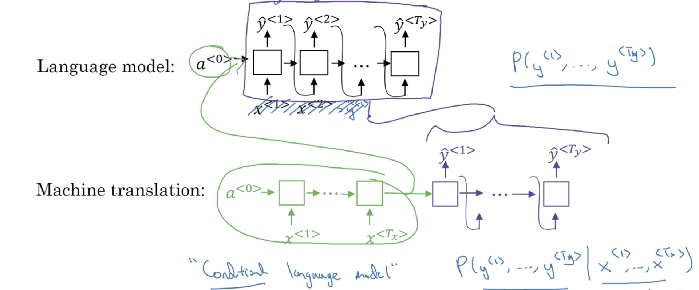
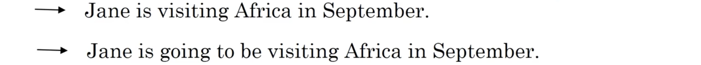
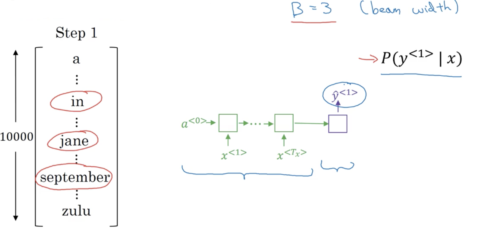
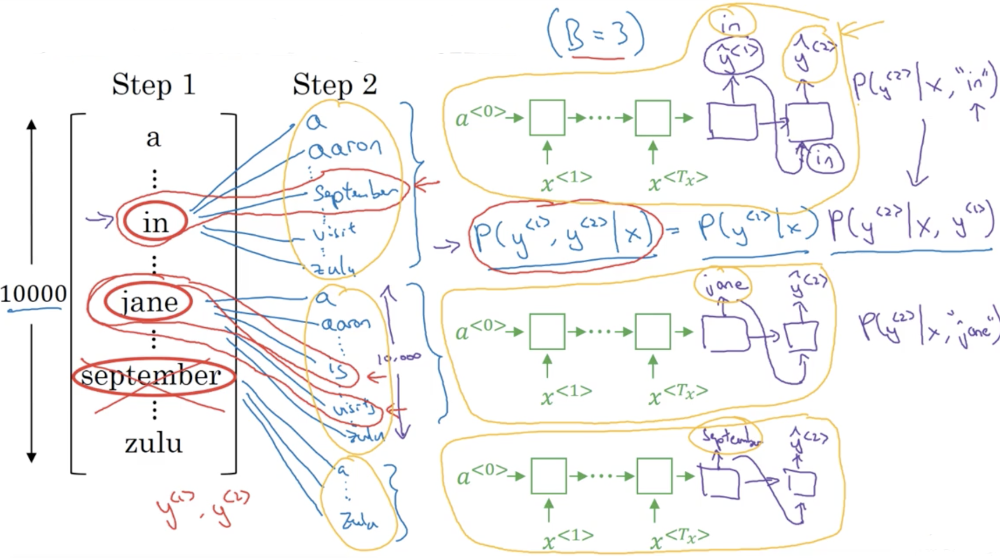
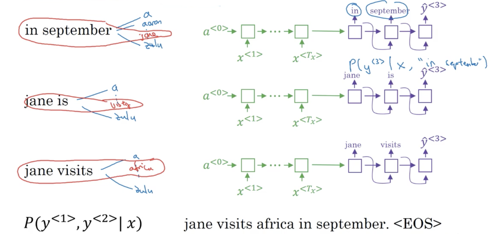
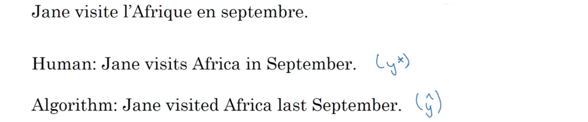
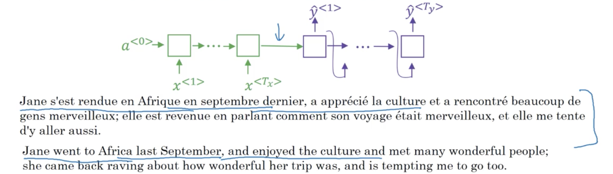
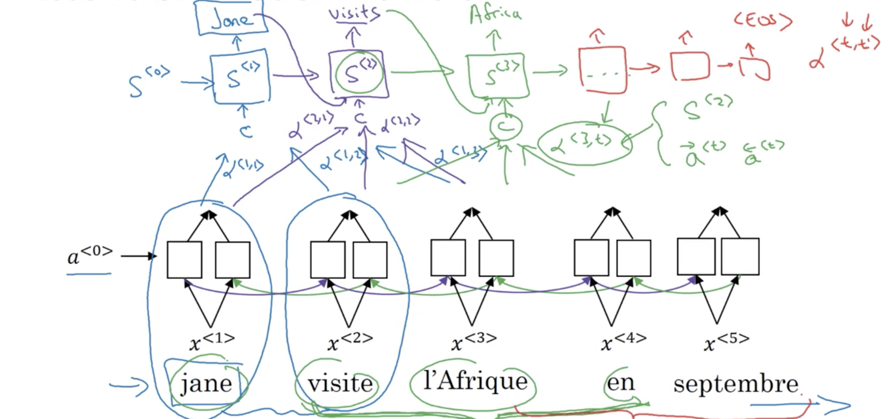

##### 1.基本seq2seq模型

序列到序列的模型应用十分广泛。比如下面的机器翻译问题：

Seq2seq模型首先使用一个被称为编码器(encoder)的RNN（或GRU、LSTM）神经网络，一次输入一个源语言词语，吸取整个输入序列后将其表示为一个向量；之后构建一个解码器，输入编码器的编码输出，被训练一次输出一个翻译的目标语言词语，直到句子结束，像前面合成文本那样。

另一个类似应用是图片描述，先用去掉softmax的CNN作为编码器对图像编码，然后用RNN作解码器生成描述：

##### 2.选择最可能的句子

虽然解码过程与用语言模型合成文本十分相似，但也有许多不同，其中关键是不会随机选择翻译或描述，而是最可能的。可以将机器翻译看成构建条件语言模型，如下图所示：

语言模型用于评估一个句子的可能性：$P\left( y^{\langle1\rangle}, y^{\langle2\rangle}, \cdots,y^{\langle T_y\rangle}\right)$，也可以用于合成文本；而机器翻译的解码器模型看起来与语言模型合成文本十分相似，除了初始状态$a^{\langle0\rangle}$不再是0，而是编码器生成的编码。可以将机器翻译看成是评估输入句子$x^{\langle1\rangle}, x^{\langle2\rangle},\cdots, x^{\langle T_x\rangle}$时输出一句翻译的概率：$P\left( y^{\langle1\rangle}, y^{\langle2\rangle}, \cdots,y^{\langle T_y\rangle} | x^{\langle1\rangle}, x^{\langle2\rangle},\cdots, x^{\langle T_x\rangle} \right)$。

不过不同的是在生成翻译时，解码器不会希望随机抽取输出，而是希望找到翻译的句子，使其最大化条件概率：
$$
\mathop{argmax}_{y^{\langle1\rangle},\cdots,y^{\langle T_y \rangle}} P\left( y^{\langle1\rangle}, y^{\langle2\rangle}, \cdots,y^{\langle T_y\rangle} | x^{\langle1\rangle}, x^{\langle2\rangle},\cdots, x^{\langle T_x\rangle} \right)
$$
最常用的算法是集束搜索(beam search)，那为何不用贪心搜索呢，也就是每生成一个词时，选择最优可能的那个词。但这个方法并不奏效，比如下面两个翻译，上面一句明显更好：

即$P(y|x)$更大。但若使用贪心搜索，在选择了前两个词"Jane is"之后，因"going"是比"visiting"更常用的词，因此很可能就有$P(\text{Jane is going} \mid x)>P(\text{Jane is visiting}\mid x)$，因此最终选择就是下面的翻译。而英语句子可能的组合空间也极其庞大，因此最常用的是使用近似搜索算法，它做的就是尝试挑选出最大话上面条件概率的句子$y$。虽然并不保证总能找到最大的句子，但通常已经是足够好。

##### 3.集束搜索(beam search)

在机器翻译或语音识别中，都希望找到最优的文本，集束搜索即用于此。比如前面要将法语"Jane visite l'Afrique en septembre"翻译成英语"Jane is visiting Africa in September"，并设英语字典为$V$。

集束搜索的第一步是挑选英语翻译首位的词，即使用下图的神经网络评估$P\left( y^{\langle1\rangle}| x \right)$，与贪心算法只选择一个可能性最大然后继续不同，集束搜索会考虑多个选项，它有一个参数$B$(beam width)，下图中设为3，表示它会考虑$B$个可能性，即选择最优可能的$B$个词存储起来然后尝试。

在第一步选择了$B$个最可能的词后，第二步为每个选择考虑第二个词。对考虑选择"in"的下个词，用下面神经网络评估$P\left( y^{\langle2\rangle}| x, \text{"in"} \right)$，获得字典中每个词的可能性；注意第二步其实关注的是$P\left( y^{\langle1\rangle},y^{\langle2\rangle}| x \right)$，因为根据条件概率有$P\left( y^{\langle1\rangle},y^{\langle2\rangle}| x \right)=P\left( y^{\langle1\rangle}| x \right)P\left( y^{\langle2\rangle}| x, y^{\langle1\rangle} \right)$，因此将神经网络得到的评估值与前面$P\left( y^{\langle1\rangle}| x \right)$相乘后就的到了$P\left( y^{\langle1\rangle},y^{\langle2\rangle}| x \right)$。对其余的选择也做同样的操作。这样实际就是做评估了$B\times\vert V \vert$个$P\left( y^{\langle1\rangle},y^{\langle2\rangle}| x \right)$的评估。在这些值中也挑选最可能的$B$个$\left( y^{\langle1\rangle}, y^{\langle2\rangle}\right)$。下图中第二步可以看出已经拒绝了 "September"为$y^{\langle1\rangle}$的候选，因此$y^{\langle1\rangle}$还剩2个可能，但$\left( y^{\langle1\rangle}, y^{\langle2\rangle}\right)$依然是三种可能。

另外要注意的是每一步都需实例化$B$个网络的副本来评估这些句子片段，因此也就有$B$个选择不同的网络副本。但这$B$个副本可以非常高效地用于评估所有下一步$B\times\vert V \vert$个选择。

第三步类似，也是评估$B\times\vert V \vert$个选项，选择最可能的$B$个$\left( y^{\langle1\rangle}, y^{\langle2\rangle},y^{\langle3\rangle} \right)$。

注意当设定$B=1$时，就是贪心算法。

##### 4.集束搜索提纯

长度正规化(length normalization)是集束搜索很小的变化单能得到更好的结果。集束搜索就是：
$$
\begin{eqnarray}
&&\mathop{argmax}_y P\left( y^{\langle1\rangle},\cdots,y^{\langle T_y\rangle} \middle| x\right)\\
=&&\mathop{argmax}_y \prod_{t=1}^{T_y} P\left( y^{\langle t\rangle} \middle| x,y^{\langle1\rangle},\cdots,y^{\langle t-1\rangle} \right)
\end{eqnarray}
$$
而在实现这个算法的时候，每个$P$都小于1或远小于1，这样就会所乘结果越来越小，有可能导致下溢出。因此实际中会最大化其$\log$值，就能得到数值更稳定的算法，即
$$
\mathop{argmax}_y \sum_{t=1}^{T_y} \log P\left( y^{\langle t\rangle} \middle| x,y^{\langle1\rangle},\cdots,y^{\langle t-1\rangle} \right)
$$
另外，这个目标函数还有一个缺点是会偏好短输出，因为长输出相乘的概率很多其概率值就会很小。因此可改为：
$$
\mathop{argmax}_y \frac1{T_y^\alpha} \sum_{t=1}^{T_y} \log P\left( y^{\langle t\rangle} \middle| x,y^{\langle1\rangle},\cdots,y^{\langle t-1\rangle} \right)
$$
这个称为正规对数似然的目标函数显著减小了对长度的惩罚，其中$\alpha\in[0,1]$，当$\alpha=0$时就表示不做正规化；当$\alpha=1$时表示完全正规化；可以设为$\alpha=0.7$，这也是一个需要调优的超参。

最后讨论参数$B​$的设定。前面的例子设为3，这是很小的设定；实际生产系统中，一般设为10左右，根据应用100会很大；而在研究系统中，设为1000或3000也很常见，但跟领域十分相关。在许多应用中，将$B​$从1提高到3到10，会得到很大的提升；但当从1000到3000时就不会那么可观。

##### 5.集束搜索的误差分析

误差分析可以帮助确定产生错误的原因和改进系统的方向。假定翻译系统出现了下面的错误：

系统主要由两部分组成，一个是seq2seq的RNN，另一个是集束搜索算法。如何确定是哪个出了问题。其中seq2seq的RNN，它计算$P(y\mid x)$，这里可以用这个模型计算$P\left( y^* \right)$和$P\left( \hat y \right)$。会有两种可能性（注意考虑长度正规化的影响）：

- 若$P\left( y^* \right)>P\left( \hat y \right)$，即$y^*$的概率值更高而集束搜索选择了$\hat y$，因此是集束搜索的问题；
- 若$P\left( y^* \right) \le P\left( \hat y \right)$，即$y^*$是比$\hat y$更好的翻译，但RNN预测的概率却更低，这是RNN的问题。

然后分析其他的一些错误，有时可能是集束搜索，有时可能是RNN模型；通过这个过程，就能明白什么派别(faction)的错误是因为集束搜索，什么样的是由于RNN模型。当发现很多错误是其中一个原因时，下力气解决。

##### 6.Bleu(Bilingual Evaluation Understudy)分数

在机器翻译中，同一句话可能会有很多等优的翻译句子。为评估这种情况下算法的表现，引入了Bleu分数。Bleu做的就是给定一个机器生成的翻译，它允许自动计算一个衡量这个翻译的分数。若机器翻译与人类提供的任一翻译十分像，就得到高分。

在机器翻译、图像描述方面都有广泛的应用。

##### 7.注意力模型原理

当面对长句时，即大约超过30个词后，seq2seq模型的表现就开始下降，而注意力模型能很好地改善其表现。

注意力模型借鉴人类翻译长句时，一次只关注一部分。如下图，在生成第一个词时，应该关注输入的哪一部分，为此注意力模型会计算一系列注意力权值，这里使用$\alpha^{\langle i,j \rangle}$表示在生成第$i$个词时需对$j$个输入的关注程度。每个生成词的所有注意力权值一起构成了其需要关注的上下文$c$，作为解码器RNN的一个输入。

##### 8.注意力模型

