#### 简介与综述

##### 1.欢迎

##### 2.概述与动机

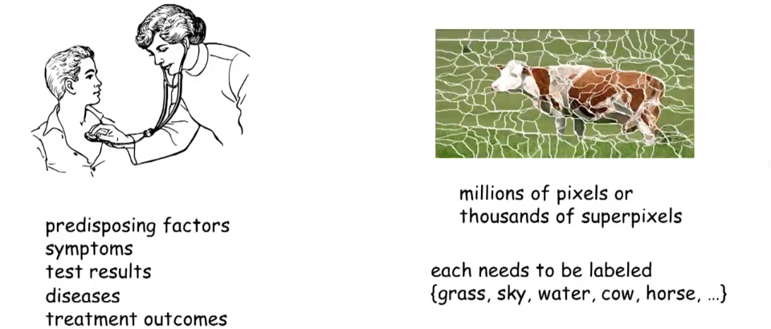

所解决问题的特征：

1. 有非常多的变量需要来推理；
2. 从根本上来说正确的答案具有很强的不确定性。

概率图模型是解决这类问题的框架；这个术语每个词的含义：

- 模型：指我们对世界理解的陈述性表达，是计算机内部获取我们对这些变量以及它们间相互作用理解的表达，其中“陈述性”意味着表达是独立的(stand on its own)，即可以离开算法调查并理解它，这之所以重要是因为：

  - 同样的表达或模型，可以被应用于一个解答任何某类问题的算法语境，或解决不同类型问题的其他算法；
  - 可以将模型结构从算法分离出来，这样就能构造从人类专家抽出这些模型的方法论，或用统计机器学习从历史数据中学习；

  再次，算法和模型的分离以及在模型中学习使得这些问题能被分开解决。

  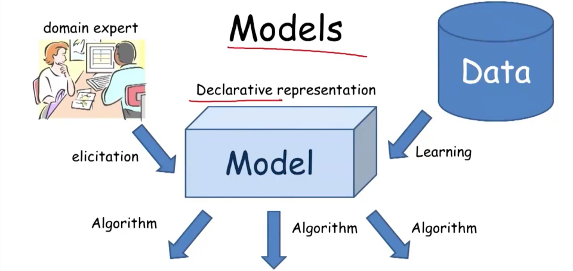

- 概率：表示这些模型被设计来帮助解决大量的不确定性。会有很多的原因造成不确定性：

  - 首先我们仅有世界状态的部分知识；
  - 其次是有噪声的观测；
  - 然后是模型没有覆盖到的现象；
  - 其后是内在的随机性；

  概率论是解决不确定性的框架。概率模型提供了：

  - 首先是语义清晰的陈述性/独立(stand alone)的表达，概率分布有清晰的表达不同世界状态下可能不确定性的语义；
  - 然后是强大推理模式的工具箱，比如以新形式证据为条件、不确定下的决策；
  - 其后是已确立的学习方法，它源自概率论与统计学之间错综复杂的联系，这样能高效地从历史数据中学习模型。

- 图：能表达包含大量变量的复杂系统。课程的焦点认为世界由一系列随机变量$X_1,\dots,X_n$表达，目标是获取世界可能状态概率分布的不确定性，或者说这些随机变量的联合分布$P(X_1,\dots,X_n)$，因此要处理的是指数级庞大的目标，唯一的方法就是使用计算机科学中使用的、挖掘并能高效表达和操作结构和分布的思想。

那什么是图模型呢：

- 下图左侧是贝叶斯网络，PGM中两个主要模型之一，使用有向图为本质表达，随机变量以节点表示；
- 下图右侧是马尔可夫网，PGM中另一个重要模型，使用无向图；

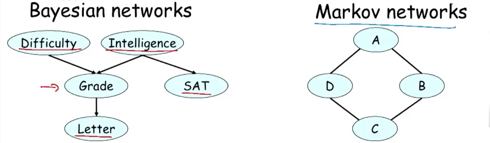

因此，图表达提供了：

- 直觉而又紧凑的数据结构来获取高维的概率分布；
- 使用通用用途算法的高效推理工具集来挖掘图结构；
- 稀疏的参数化，根据图结构编码概率分布的参数化，可以使用很少的参数来高效表示这些高维概率分布，可：
  - 通过可行的抽出；
  - 从数据中学习。

下面是一些应用的例子：

- 图像分割：

  

- 文本信息提取：

  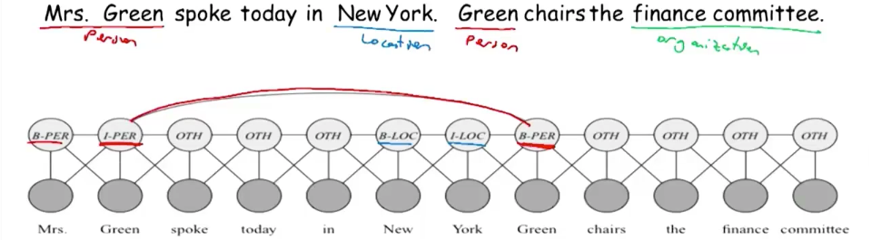

- 多传感器集成——交通：

  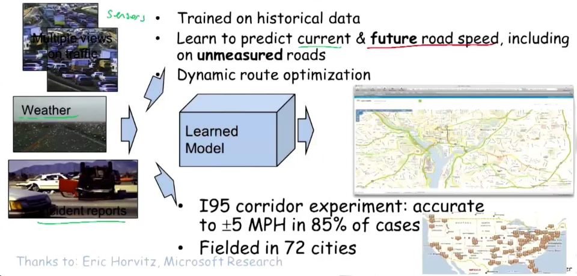

总结起来，包含3方面的内容：

- 表达：
  - 有向和无向；
  - 时间和平面模型；
- 推理：
  - 提取和近似；
  - 决策；
- 学习：
  - 参数和结构；
  - 有或无全部数据。

##### 3.分布

##### 4.因子

因子指一个函数或表格，取一些自变量(argument)$X_1.\dots,X_k$在叉积空间所有可能的赋值，给出一个值。变量集$\{X_1,\dots,X_k\}$被称为因子的分野(scope)，比如联合分布就是一个因子。另外会大量使用的因子是条件概率分布(CPD)。 

注意因子并不总是对应于概率，下面是一个一般因子的例子：

一些对因子的运算：

- 因子相乘：

  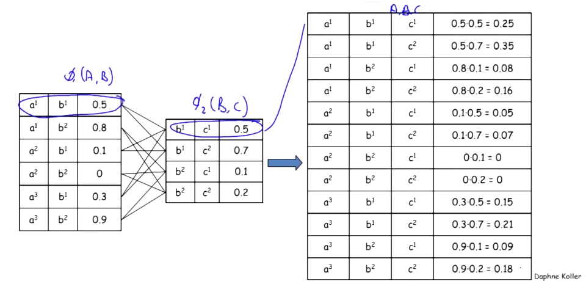

- 因子边缘化(Marginalization)：

  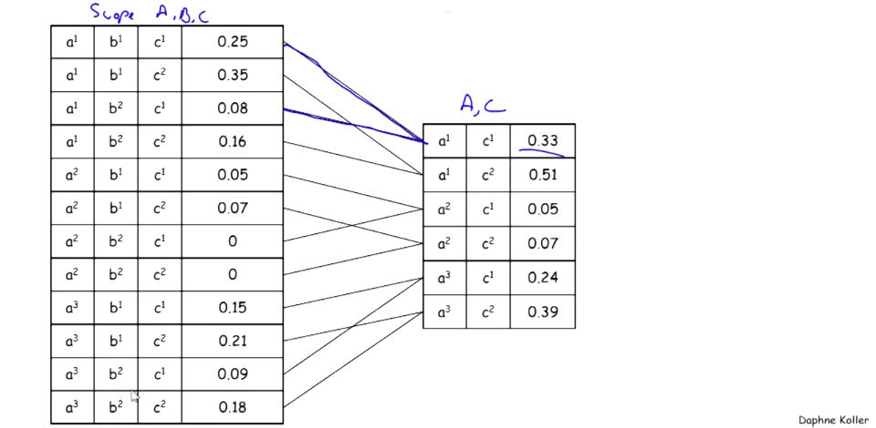

- 因子简化(Reduction)：

  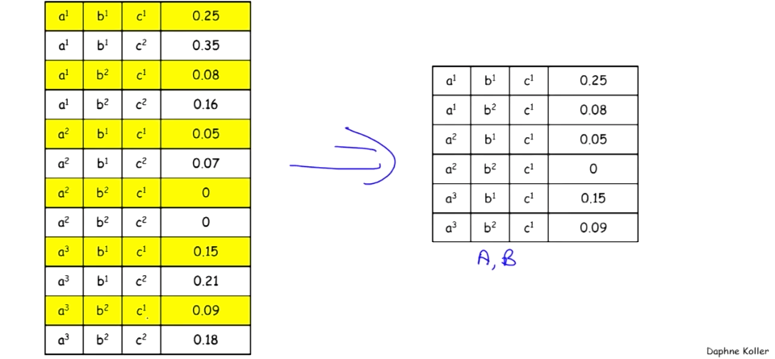

因子在概率图模型中十分重要，因为：

- 因子是定义高维空间分布的基本构件，定义$N$个随机变量上指数级大小分布的方法，就是取一些小片并通过诚意因子来将它们结合在一起；
- 有与操作概率分布同样的基本操作集，用于定义高维概率空间概率分布的基本操作集，也用于操作因子以获得一些基本的推理算法。

#### 贝叶斯网络(BN)：基础

##### 5.语义与因子分解

看下面的学生案例：

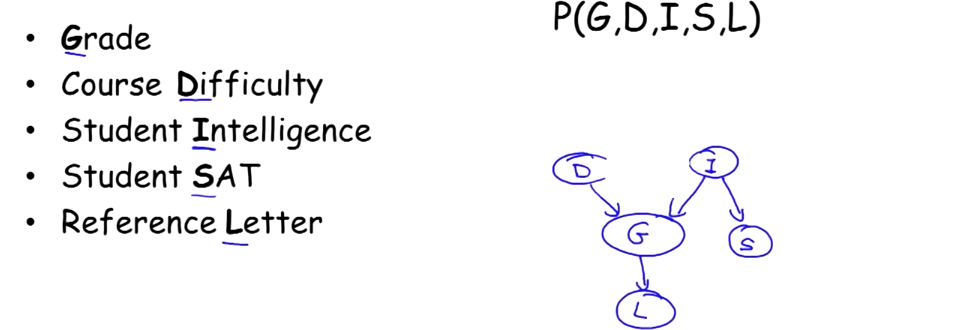

有向图的边代表了依赖关系。为将其表示为概率分布的表示，可以用条件概率(CPD)标记每个节点：

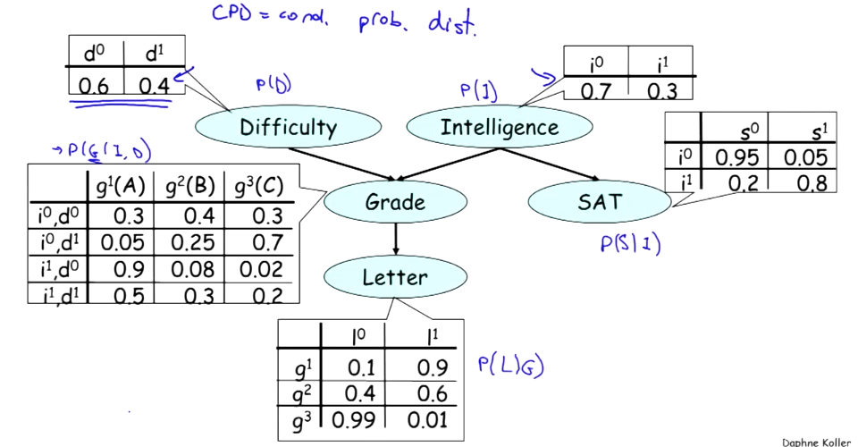

这就是一个全参数化的贝叶斯网络。

**贝叶斯网络链式规则**：取不同的CPD，将它们乘起来，如下图：

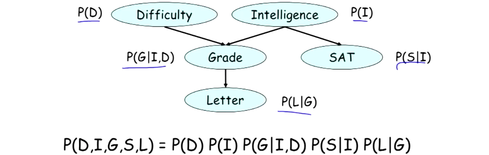

它实际就是一个因子乘积。这里有5个因子，有重叠的视野(scope)，因子乘积的最终结果就是以恶搞更大的因子，分布定义为因子乘积。

**贝叶斯网络定义**：

- 一个有向无环图(DAG)$G$，其节点表示随机向量$X_1,\dots,X_n$；
- 每个节点$X_i$都有一个依赖于其父节点的条件概率分布(CPD)$P(X_i\mid \text{Par}_G(X_i))$；
- 通过脸是规则表示一个联合分布$P(X_1,\dots,X_n)=\prod_i P(X_i \mid \text{Par}_G(X_i))$；

BN是一个概率分布，因：

- $P\ge0$，因$P$是一系列CPD的乘积，CPD都非负，因此乘积也非负；

- $\sum P=1$，由$\sum_XP(X\mid Y)=1$，有：
  $$
  \begin{eqnarray}
  \sum_{D,I,G,S,L}P(D,I,G,S,L) &=& \sum_{D,I,G,S,L}P(D)P(I)P(G\mid I,D)P(S\mid I)P(L\mid G) \\
  &=& \sum_{D,I,G,S}P(D)P(I)P(G\mid I,D)P(S\mid I)\sum_LP(L\mid G)\\
  &=& \sum_{D,I,G}P(D)P(I)P(G\mid I,D)\sum_SP(S\mid I)\\
  &\vdots&\\
  &=&1
  \end{eqnarray}
  $$

令$G$为$X_1,\dots,X_n$上的图，若$P(X_1,\dots,X_n)=\prod_iP(X_i\mid \text{Par}_G(X_i))$，则**$P$在$G$上分解**。

##### 6.推理模式

深挖前面的例子，查看若取此网络能得到的概率，对贝叶斯网络使用链式规则会产生的联合分布，现在计算不同边缘概率的值。比如获得一个好的信件(letter)的概率是多少，省略冗长的计算，结果是$P(l^1)\approx0.5$。可以做更有趣的查询，比如在$i$(intelligent)比较低情况下的概率$P(l^1\mid i^0)\approx0.39$，不出意外变低了；还可以再增加其他条件，如下图：

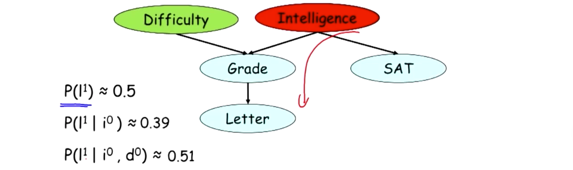

还可以做进一步自底向上的证据推理。这时以分数$g$(grade)为条件，询问其祖先的概率。如下图，若课程比较难的概率$P(d^1)=0.4$，则在$g=3$（成绩低）条件下课程比较难的概率$P(d^1\mid g^3)\approx0.63$，变高了。

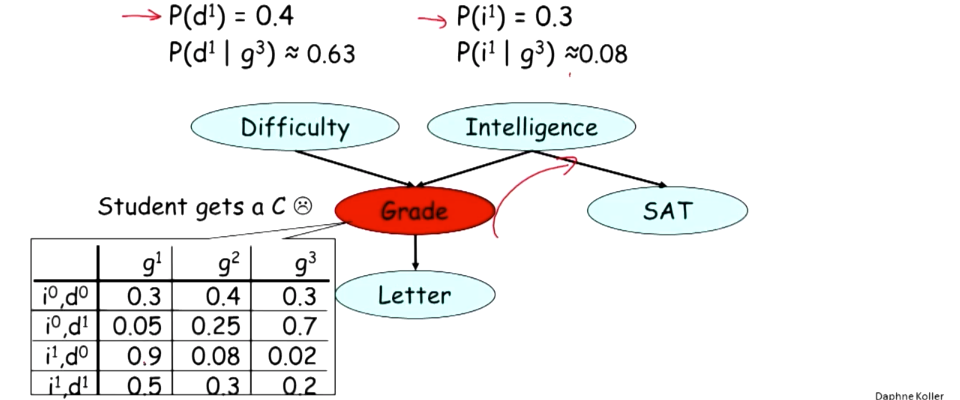

