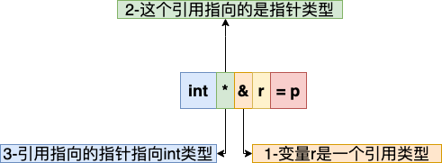
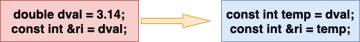
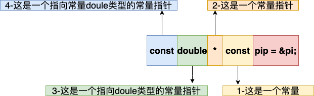

#### 1 基本内置类型

切勿混用带符号类型和无符号类型。


#### 2 变量

对象和变量一般可以互换使用，表示具有某种数据类型的内存空间。

##### 2.1 变量定义

当一次定义两个或多个变量时，对象的名字随着定义也就马上可以使用了，可以用先定义的变量值去初始化后定义的变量。

变量的初始化和赋值是两个完全不同的操作：

- 初始化的含义是创建变量时赋予其一个初始值；
- 赋值的含义则是把对象的当前值删除，用一个新的值来替代。

当把列表初始化应用于内置类型时，需要注意：当存在丢失信息的风险时，编译器会报错。如：

```cpp
long double ld = 3.1415926536;
int a{ld}, b = {ld};  // 错误，转换未执行，因为存在丢失信息的风险
int c(ld), d = ld;    // 正确，转换执行，且确实丢失了部分值
```


#### 3 复合类型

复合类型是指基于其他类型定义的类型。一条声明语句由一个基本数据类型和紧随其后的一个声明符列表组成，每个声明符命名了一个变量并指定该变量与与基本数据类型有关的某种关系。

##### 3.1 引用

引用是一种复合类型，是为一个已存在的对象创建的一个别名：

- 定义引用时，程序把引用和其初始值绑定在一起；
- 引用定义后，不能再绑定到另一个对象，因此**必须初始化**；
- 引用本身不是对象，不能定义引用的引用，也不能定义指向引用的指针；
- 除后面提到的两种特殊情况：
  - 引用只能绑定在某个对象上，不能与某个字面值或表达式计算结果绑定；
  - 引用的类型必须与绑定对象的类型严格匹配。

##### 3.2 指针

指针是指向另外一种类型的复合类型，与引用一样有很多类似的地方，比如：

- 都实现了对其他对象的间接访问；
- 除后面提到的两种特殊情况，指针的类型必须与它所指向的类型严格匹配。

但又有所不同：

- 指针本身就是一个对象；
- 无需在定义指针的时候就赋初值。

指针的值属于下面4种状态之一：

1. 指向一个对象；
2. 指向紧邻对象所占空间的下一位置；
3. 空指针，还未指向任何对象，可通过赋予`nullptr`、`NULL`和字面值0定义；
4. 无效指针，上述情况之外的其他值。

不能将`int`直接赋给指针变量，即便其值恰好为0。

任何非0指针对应的条件值都是`true`。

两个类型相同的指针可以用`==`和`!=`进行比较存放的地址是否相同，若地址相同有四种情况：

- 都指向同一对象；
- 都为空；
- 都指向了同一对象的下个地址；
- 一个指针指向某对象，另一个指针指向另外对象的下一地址。

因此要注意使用合法的指针。

`void *`是一种特殊类型的指针，可用于存放任意对象的地址；但因为不知道指向的到底是何种类型，因此不能直接操作其所指向的对象。它的作用一般有：

- 拿它和别的指针做比较；
- 作为函数的输入或输出；
- 给另一个`void*`赋值。

##### 3.3 理解复合类型声明

在同一条定义语句中，虽然基本数据类型只有一个，但是声明符的形式确可以不同，因此一条语句能够定义出不同类型的变量。如

```cpp
int i = 1024, *p = &i, &r = i;
```

涉及指针或引用，一般有两种写法：

- 一种是把修饰符和变量标识符写在一起，这种形式着重强调变量具有复合类型，如：`int *p, &r = i`；
- 另一种是把修饰符和类型名写在一起，并且每条语句只定义一个变量，这种形式着重强调本次声明定义了一个复合类型：`int* p1, int* p2`。

虽然不能定义指向引用的指针，但可以定义指向指针的引用：`int *p; int *&r = p`。要理解`r`到底是什么类型，可以从右向左阅读`r`的定义：

- 离变量名最近的符号对变量类型有着直接的影响，因此这里的`&`表示`r`是一个引用；
- 声明符中的其余部分用以确定`r`引用的类型是什么，因此中间的`*`表示这个引用指向一个指针；
- 最后，最左边的`int`表示引用`r`指向的是一个`int`型的指针。

整个过程如下图所示：




#### 4 const

const对象必须初始化，而初始值可以是任意复杂的表达式，它：

- 既可以在编译时初始化，如`const int j = 42`；
- 也可以在运行时初始化，如`const int i = get_size();`；
- 用于初始化const的对象不一定需要是const的。

默认情况下，const对象仅在文件内有效：

- 因为在编译器在编译过程中会将常量替换为对应的值，因此需要在用到它的文件中都有其编译器能访问到的初始值，故做此设定；
- 若需要只在一个文件中定义，在多个文件中声明并使用，则可对const变量，无论声明还是定义都添加`extern`关键字。

##### 4.1 const的引用

可以将引用绑定到const对象上，称之为对常量的引用或常量引用，对常量的引用不能用作修改它所绑定的对象。

因为引用在定义之后就不能改变所绑定的对象了，从这个意义上理解所有的引用本身也算事常量。

前面曾提到，引用类型必须与其所引用的对象一致，但有两个例外，第一种就是：

- 在初始化常量引用时允许使用任意表达式作为初始值，只要该表达式的结果能被转换为引用类型即可；
- 因此，允许为一个常量引用绑定到非常量对象、字面值、一般表达式。

常量引用仅对引用可参与的操作做了限定，对引用对象本身是否为常量并未做限定，因此非常量的对象可以通过其他方式改变其值。此外，需要注意的是：

- 常量引用可以绑定非常量对象，只要这个对象的类型能转换为常量类型，其原理如下，即编译器会做一步转换，`ri`绑定了一个临时量：

  

- 非常量引用则不可以绑定常量引用，即`const int i = 42;int &ri = i; `是错误的，原因是允许对`ri`进行赋值，从而改变`i`的值，故而非法。

| 引用和对象绑定矩阵 | 常量引用 | 非常量引用 |
| :----------------: | :------: | :--------: |
|    **常量对象**    | 可以绑定 | 不可以绑定 |
|   **非常量对象**   | 可以绑定 |  可以绑定  |

##### 4.2 指向const的指针

可以令指针指向const对象，称为指向常量的指针，不能用于改变其所指向对象的值；

要想指向常量对象，只能使用常量指针。

前面提到，除两种例外，指针的类型必须与其所指对象类型一致。第一个例外就是：

- 也可以令一个指向常量的指针指向一个非常量对象；
- 因此非常量的对象可以通过其他方式改变其值。

| 指针和对象指向矩阵 | 指向常量的指针 | 指向非常量的指针 |
| :----------------: | :------------: | :--------------: |
|    **常量对象**    |    可以指向    |    不可以指向    |
|   **非常量对象**   |    可以指向    |     可以指向     |

可以这样认为：**所谓指向常量的引用或指向常量的指针，只是用引用和指针的角度去看待，它们觉得自己指向了常量，因此自觉得不去改变所指对象的值**。

##### 4.3 const指针

允许把指针本身定义为常量，常量指针必须初始化。

```cpp
int i = 0;
const int j = 0;
const int *pi = &i;        // 指向常量的指针
const int *pj = &j;        // 指向常量的指针
int *const ci = &i;        // 常量指针
const int *const cj = &j;  // 指向常量的常量指针
```

要弄清楚最后一个定义的含义，依旧从左向右阅读，其过程如下：



##### 4.4 顶层const

用名词顶层表示指针本身是常量，底层表示指向的是一个常量：

- 顶层const可以表示任意的对象是常量，对任何数据类型都适用；

- 底层const则与指针个引用等复合类型的基本类型部分有关；

- 指针类型既可以是顶层const，也可以是底层const；

- 用于声明引用的const都是底层const；

- **若用const定义的值不可变，则是顶层const；可变则是底层const**：

  ```cpp
  int i = 0;
  int *const p1 = &i;         // 不能改变p1的值，顶层const
  const int ci = 42;          // 不能改变ci的值，顶层const
  const int *p2 = &ci;        // 可以改变c2的值，底层const
  const int *const p3 = &ci;  // 左侧const是底层，右边const是顶层
  const int &r = ci;          // 用于声明引用的const都是底层const
  ```

- 当执行对象的拷贝操作时，常量是顶层还是底层const区别明显：

  - 顶层const不受影响：

    ```cpp
    i = ci;   // 正确：被拷贝的ci是顶层const，对此操作无影响
    p2 = p3;  // 正确：p2和p3指向的类型相同，拷贝的p3顶层cosnt部分不影响
    ```

  - 而底层const时，拷入和拷出的对象必须具有相同的底层const资格，或者两个对象的数据类型必须能够转换，一般而言非常量可以转换为常量，反之则不行：

    ```cpp
    int *p = p3;        // 错误：p3包含底层const的定义，而p则没有
    p2 = p3;            // 正确：p2和p3都是底层const
    p2 = &i;            // 正确：int* 能转化成const int*
    int &r = ci;        // 错误：普通的int&不能绑定到int常量
    const int &r2 = i;  // 正确：const int&可以绑定到一个普通int上
    ```

##### 4.5 constexpr和常量表达式

常量表达式满足两个条件：

- 值不会改变；
- 在编译过程就能得到计算结果。

故而下面几种表达式是常量表达式：

- 字面值；
- 用常量表达式初始化的const对象；

比如：

```cpp
const int max_files = 20;         // 常量表达式
const int limit = max_files + 1;  // 常量表达式
int staff_size = 27;              // 不符合值不会改变的条件
const int sz = get_size();        // 不符合在编译时就能得到计算结果的条件
```

在一个复杂系统中，很难分辨一个初始值是否是常量表达式，即便将其初始值定义为所认为的常量表达式，但在使用中却常发现初始值并非常量表达式。因此，c++11中，允许将变量声明为`constexpr`类型，由编译器验证变量的值是否是一个常量表达式。声明为`constexpr`的变量一定是一个常量，且必须用常量表达式进行初始化：

```cpp
constexpr int mf = 20;         // 20是常量表达式
constexpr int limit = mf + 1;  // mf+1是常量表达式
constexpr int sz = size();     // 只有当size()是constexpr函数时才是正确的声明
```

可以定义一种`constexpr`函数，足够简单到编译时就能得到计算结果，可以用这种函数初始化`constexpr`变量。

在`constexpr`中声明的指针，限定符`constexpr`仅对指针有效，与指针所指的对象无关，因为`constexpr`将其所定义的对象置为了顶层const：

```cpp
const int *p = nullptr;      // 指向整数常量的指针
constexpr int *p = nullptr;  // 指向整数的常量指针
```

与其他常量指针类似，`constexpr`指针既可以指向常量，也可以指向非常量。


#### 5 处理类型

##### 5.1 类型别名

类型别名是一个名字，它是某种类型的别名。有两种方法可以定义类型别名：

- 传统关键字`typedef`，它**作为声明语句中的基本数据类型的一部分出现**，含有`typedef`语句定义的**不再是变量而是类型别名**，这里的声明符也能包含类型修饰，从而构造出复合类型出来：

  ```cpp
  typedef double wages;    // wages是double同义词
  typedef wages base, *p;  // base是double同义词，p是double*同义词
  ```

  这种定义方式与变量的定义十分类似，只是最前面有typedef关键字，而变量名则成了类型别名。

- 新标准中使用关键字`using`做别名声明，其作用是把等号左侧的名字规定称等号右侧类型的别名：`using SI = Sales_item`；

当类型别名指代复合类型或常量，特别需要注意其在声明语句中的实际作用：

```cpp
typedef char* pstring;
const pstring cstr = 0;  // ==> char* const cstr = 0; cstr是指向char的常量指针
const pstring* ps;       // ==> char* const *ps;      ps是一个指针，它的对象是指向char的常量指针
```

许多人会**错误地**尝试将类型别名替换成它本来的样子，这样`cstr`的定义就变成：

```cpp
const char *cstr = 0;  // 错误理解
```

声明语句中遇到`pstring`时，其**基本数据类型是指针**，而**const是对给定类型的修饰符**。应该将`pstring`看成一个整体，而不应该将其用`char*`改写后分别看待。

##### 5.2 auto类型说明符

auto能够让编译器去分析表达式所属的类型，它是通过初始值来推算变量的类型，因此auto定义的变量必须有初始值。

使用auto也能在一条语句中声明多个变量，但因为一条语句只有一个基本数据类型，因此所有变量的初始值基本数据类型都要一致。如：

```cpp
auto i = 0, *p = &i;
```

在一些情况下，编译器推断出来的auto类型和初始值类型并不完全一样：

- auto一般会忽略顶层const，而保留底层const：

  ```cpp
  const int ci = i, &cr = ci;
  auto b = ci;    // b是一个整数（ci的顶层const特性被忽略）
  auto c = cr;    // c是一个整数（cr是ci的别名，ci本身是一个顶层const）
  auto d = &i;    // d是一个整数指针
  auto e = &ci;   // e是一个指向整数常量的指针（对常量取地址是一种底层const）
  ```

  如果希望推断出auto类型是一个顶层const，需要明确指出：

  ```cpp
  const auto f = ci;
  ```

- 使用引用其实是使用绑定的对象，特别当引用作初始值时真正参与初始化的是引用对象的值，此时编译器以引用对象的类型作为auto的类型；

可以将引用的类型设为auto，此时原来的初始化规则仍然适用：

```cpp
auto& g = ci;        // 正确，g是一个整型常量，绑定到ci
auto& h = 42;        // 错误，不能为非常量引用绑定字面值
const auto& j = 42;  // 正确，可以为常量引用绑定字面值
```

设置一个类型为**auto的引用**时初始值中的顶层常量仍然保留。

要在一条语句中定义多个变量，切记符号`&`和`*`只从属于某个声明，而非基本数据类型的一部分，因此初始值必须是同一类型：

```cpp
auto k = ci, &l = i;     // k是整数，l是整数引用
auto &m = ci, *p = &ci;  // m是对整型常量的引用，p是指向整型常量的指针
auto &n = i, *p2 = &ci;  // 错误：i的类型是int而&ci的类型是const int
```

##### 5.3 decltype类型指示符

