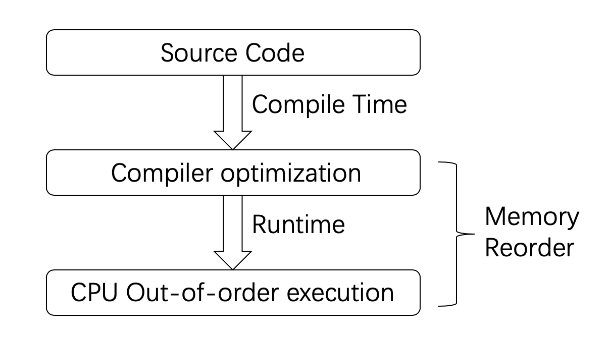
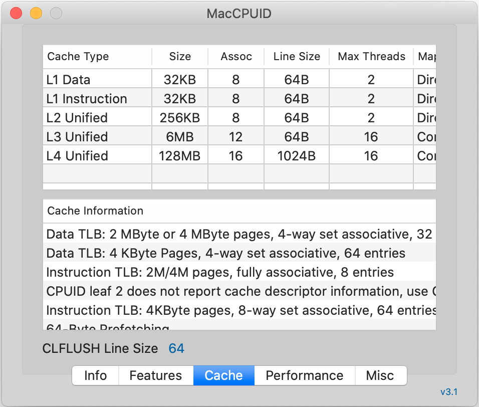
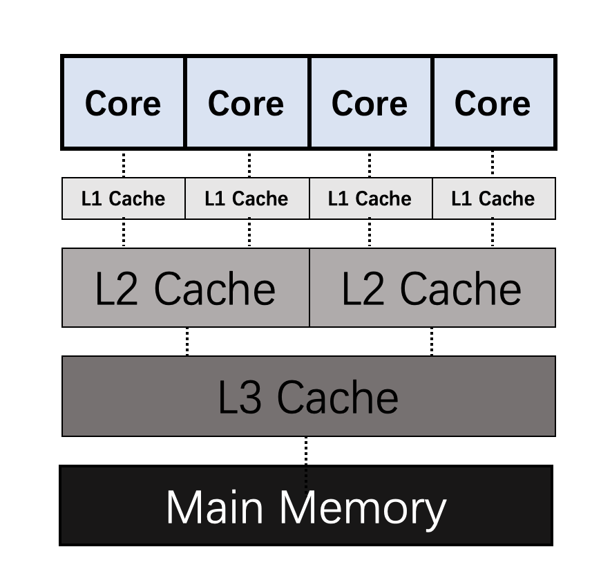
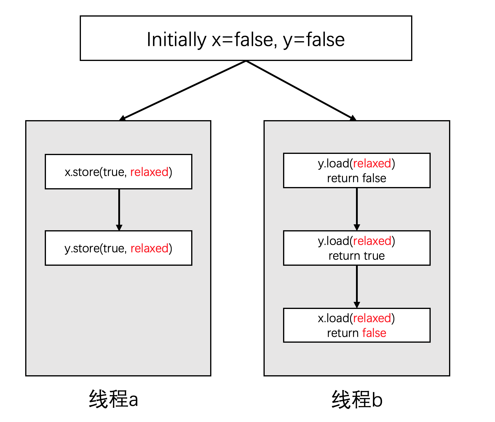
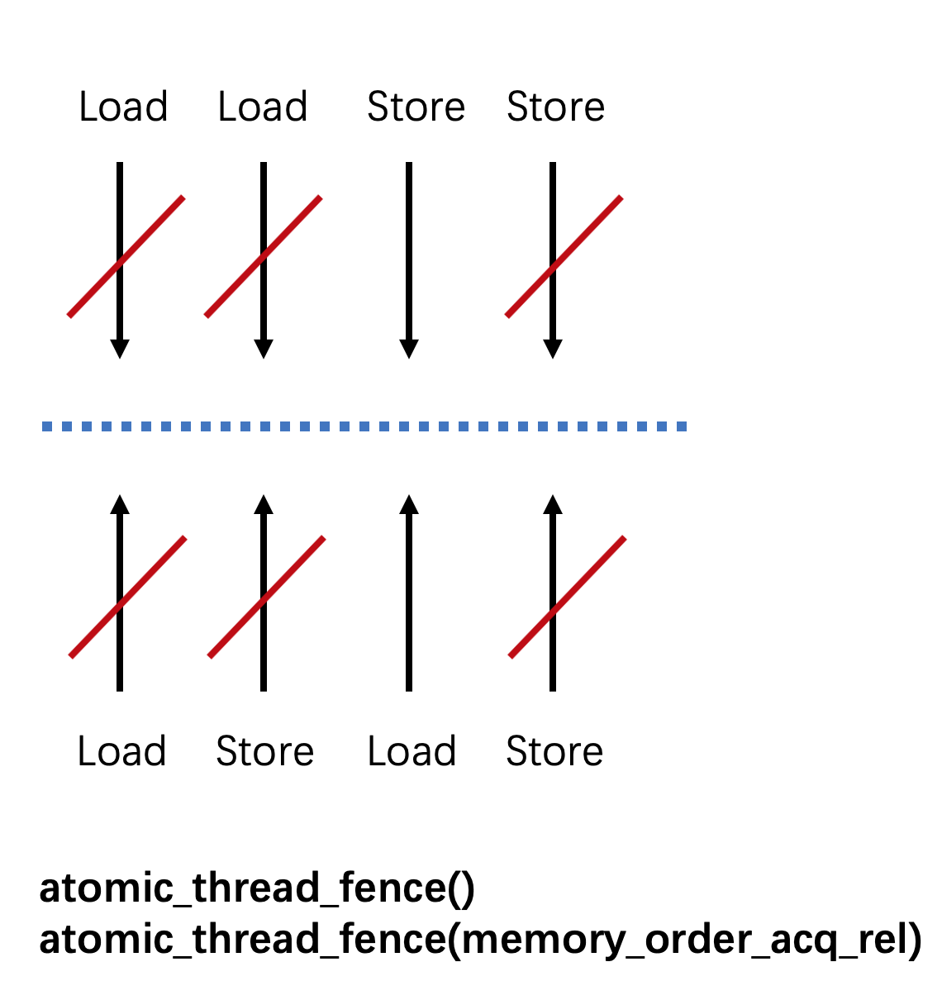
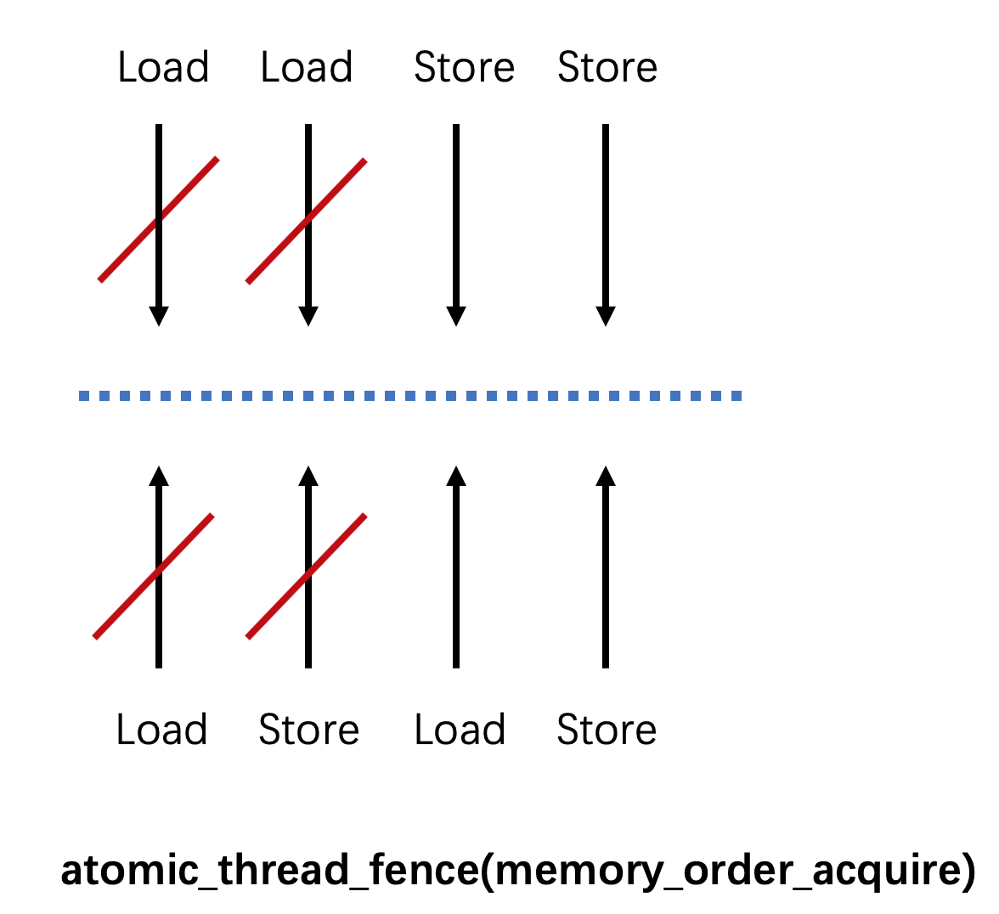
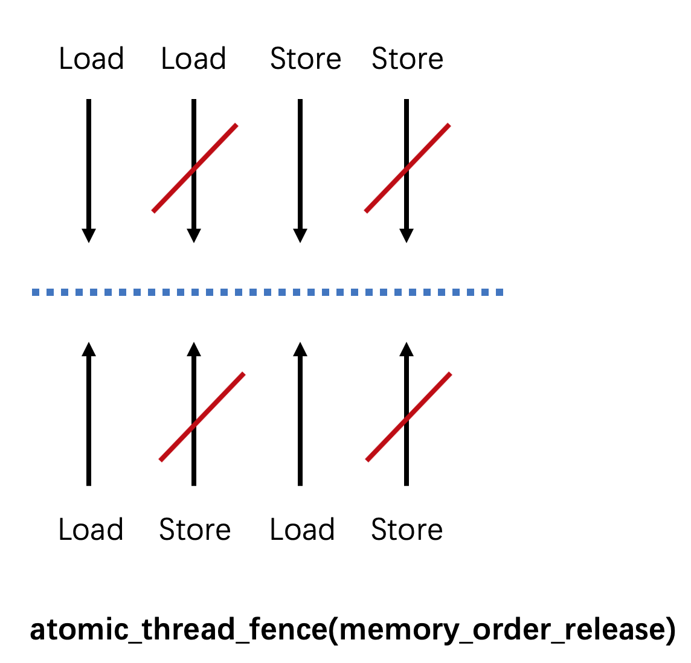
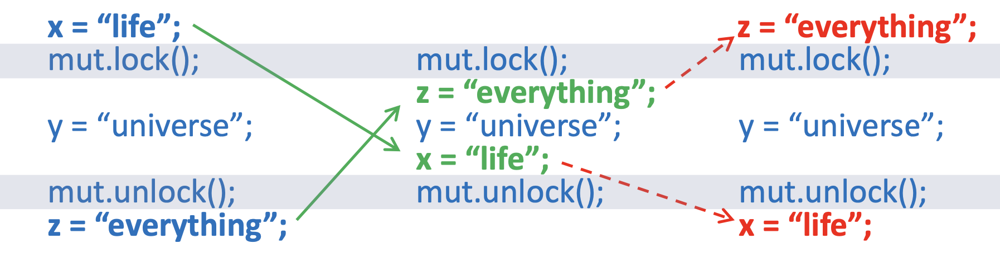
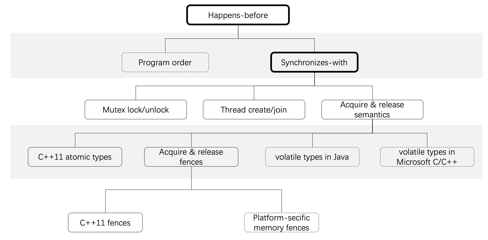

基于锁（lock-based）的并发策略效率不够高，因为一旦有一个线程进入临界区，其他线程只能等待。免锁（lock-free）策略是一种可以让其他线程不用等待的并发策略，不过实现这种策略要更麻烦一些，需要对C++内存模型有更深入的理解。


### 1 C++内存模型

C++内存模型允许开发者打破顺序一致性（Sequential Consistency），以获得更好的控制。内存模型是多线程环境能够可靠工作的基础，因为内存模型需要对多线程环境的运作细节进行完备的定义。可以认为内存模型是一种契约。它定义一套操作手法以及这些操作手法背后的详细含义。开发者利用这套操作完成数据的同步以避免竞争条件，而系统（包括：编译器，操作系统和处理器）保证执行的逻辑符合内存模型对于相关操作的定义 – 即实现契约。内存模型主要包含了下面三个部分：

- **元子操作**：这类操作一旦执行就不会被打断，无法看到它的中间状态，要么执行完成，要么没有执行；
- **操作的局部顺序**：一系列的操作不能被乱序；
- **操作的可见性**：定义了对于共享变量的操作如何对其他线程可见。


### 2 内存模型的重要性

在C++11标准出来之前，C++环境没有多线程的概念。编译器和处理器认为系统中只有一个执行流。引入了多线程之后，情况就会变得非常复杂。这是因为：现代计算机系统为了加快执行效率，自动的包含了很多的优化。这些优化虽然保证了在单线程环境下不破坏原来的逻辑。但是一旦到了多线程之后，情况就不一样了。事实上，开发者编写的代码和最终运行的程序往往会存在较大的差异，而运行结果与开发者预想一致，只是一种“假象”罢了。之所以会产生差异，原因主要来自下面三个方面：

- **编译器优化**
- **CPU out-of-order执行**
- **CPU Cache不一致性**

#### 2.1 memory reorder

以下面这段伪代码为例：

```cpp
X = 0, Y = 0;

Thread 1: 
X = 1; // ①
r1 = Y; // ②

Thread 2: 
Y = 1;
r2 = X;
```

你可能会觉得，在这个程序执行完成之后，`r1`和`r2`怎么都不可能同时为0。但事实[并非如此](https://preshing.com/20120515/memory-reordering-caught-in-the-act/)。这是因为“Memory Reorder”的存在，“Memory Reorder”包含了编译器和处理器两种类型的乱序。



这就导致：线程1中事件发生的顺序虽然是先①后②，但是对于线程2来说，它看到结果可能却是先②后①。当然，线程1看线程2也是一样的。甚至，**当今的所有硬件平台，没有任何一个会提供完全的顺序一致（sequentially consistent）内存模型**，因为这样做效率太低了。不同的编译器和处理器对于Memory Reorder有不同的偏好，但它们都遵循一定的原则，那就是：**不能修改单线程的行为**，在这个基础上，它们可以做各种类型的优化。

##### 2.1.1 编译器优化

以gcc为例，该编译器提供了`-o`参数来控制[非常多的优化选项](https://gcc.gnu.org/onlinedocs/gcc/Optimize-Options.html)。以下面这段代码为例：

```cpp
int A, B;

void foo()
{
    A = B + 1;
    B = 0;
}
```

在编译优化后，可能会变成下面这样：

```cpp
int A, B;

void foo()
{
    int temp = B;
    B = 0;
    A = temp + 1;
}
```

请注意，编译器只要保证：在单线程环境下，执行的结果和原先一样就可以了。所以，这样做是可以的。对于编译器来说，它知道的是：当前线程中，数据的读写以及数据之间的依赖关系。但是，**编译器并不知道哪些数据是在线程间共享，而且是有可能会被修改的**。这就需要开发者在软件层面做好控制。对于编译器的乱序优化来说，开发者并非完全不能控制。编译器会提供称之为[内存栅栏（Memory Barrier）](https://stackoverflow.com/questions/286629/what-is-a-memory-fence)的工具给开发者，让开发者告诉编译器：这部分代码编译的时候不能乱序。gcc的内存栅栏写法如下：

```cpp
int A, B;

void foo()
{
    A = B + 1;
    asm volatile("" ::: "memory");
    B = 0;
}
```

##### 2.1.2 out-of-reorder执行

不仅仅是编译器，处理器也可能会乱序执行指令。下面是维基上给出的一张表格，列出了不同类型的CPU可能会执行的乱序类别。


从这个表格中可以看出，不同架构的CPU会有不同类型的Memory Reorder偏好。我们使用的台式机和笔记本电脑基本上都是x86架构的CPU，而手机或者平板之类的移动设备一般用的是ARM架构的CPU。相较而言，前者的乱序类型要比后者少很多。x86的内存模型叫做x86-TSO（Total Store Order），这可能是目前处理器中最强的内存模型之一。由此我们可以推算，在多线程环境下，假设我们写的代码包含了未定义行为，那么这些问题在手机上将比在电脑上更容易暴露出来。关于硬件的的内存模型，有兴趣的可以继续看下面几个链接：

- [Weak vs. Strong Memory Models](https://preshing.com/20120930/weak-vs-strong-memory-models/)
- [This Is Why They Call It a Weakly-Ordered CPU](https://preshing.com/20121019/this-is-why-they-call-it-a-weakly-ordered-cpu/)
- [A Tutorial Introduction to the ARM and POWER Relaxed Memory Models](https://www.cl.cam.ac.uk/~pes20/ppc-supplemental/test7.pdf)
- [x86-TSO: A Rigorous and Usable Programmer’s Model for x86 Multiprocessors](https://www.cl.cam.ac.uk/~pes20/weakmemory/cacm.pdf)

类似的，处理器也会提供指令给开发者进行避免乱序的控制。例如，x86，x86-64上的`fence`指令：

```cpp
lfence (asm), void _mm_lfence(void)
sfence (asm), void _mm_sfence(void)
mfence (asm), void _mm_mfence(void)
```

由此提醒我们：如果我们只以单线程的思维来开发并发系统，一旦引入了Memory Reorder之后就可能会发生问题。例如：以上面的`A`，`B`两个变量为例，在编译器将其乱序后，虽然对于当前线程是没问题的。但是如果在此时刚好有另外一个线程使用这两个变量，并且依赖于它们的更新顺序，那么就会出现问题。

#### 2.2 Cache Coherency

事情还不只这么简单。现代的主流CPU几乎都会包含多个核以及多级Cache，下图是我的MacBook Pro上的CPU Cache信息。



如果画成结构图，结构大概会像下面这样：



每个CPU核在运行的时候，都会优先考虑离自己最近的Cache，一旦命中就直接使用Cache中的数据。这是因为Cache相较于主存（RAM）来说要快很多。但是每个核之间的Cache，每一层之间的Cache，数据常常是不一致的。而同步这些数据是需要消耗时间的。这就会造成一个问题，那就是：某个CPU核修改了一个数据，没有同步的让其他核知道，于是就存在了数据不一致的情况。综上这些原因让我们知道，CPU所运行的程序和我们编写的代码可能是不一致的。甚至，对于同一次执行，不同线程感知到其他线程的执行顺序可能都是不一样的。因此内存模型需要考虑到所有这些细节，以便让开发者可以精确控制。因为所有未定义的行为都可能产生问题。


### 3 对象和内存位置

C++内存模型中的基本存储单位是字节。一个字节至少足够大，能够包含基本执行字符集的任何成员以及Unicode UTF-8编码形式的八位代码单元，并且由连续的位序列组成。C++中所有数据都是由对象组成的。这里的对象包括了简单基本类型（如`int`和`double`），也包括了指针类型（如`my_class*`）。当然，也包括各种`class`定义的类的对象。无论是什么类型，一个对象均包含了一个或多个**内存位置**。无论是什么类型，一个对象均包含了一个或多个**内存位置**。每个内存位置一定是下面两种情况中的一种：

- 标量类型（Scalar Type）的对象，标量类型包括下面几种：
  - 数字类型：整数或者浮点数
  - `T *`指针类型
  - 枚举类型
  - 指向成员的指针
  - `nullptr_t`
- 相邻[位域（Bit field）](https://en.cppreference.com/w/cpp/language/bit_field)的最大序列

#### 3.1 位域

位域声明具有以“位”为单位的明确大小的类数据成员。相邻的位域成员可以打包成共享和跨过各个字节。例如这样：

```cpp
struct S
{
 // 三位的无符号位域，
 // 允许值为 0...7
 unsigned int b : 3;
};
```

位域的值必须大于等于0。值0比较特殊，它仅允许使用在无名位域上。并且它具有特殊含义：它指定类定义中的下个位域将始于分配单元的边界。由此，请看一下下面的例子：

```cpp
struct S
{
    char a;         // 内存位置 #1
    int  b : 5;     // 内存位置 #2
    int  c : 11,    // 内存位置 #2 （接续，相邻位域占用同一个内存位置）
           : 0,     // 无名位域，分隔了下一个位域
         d : 8;     // 内存位置 #3 （由于存在0值无名位域，这里是一个新的内存位置）
    struct
    {
        int ee : 8; // 内存位置 #4
    } e;
} obj;
```

可以看到，这个结构包含了4个内存位置。之所以介绍内存位置，是因为这与内存模型密切相关。如果多个线程各自访问的是不同的内存位置，那么就不会有什么问题。但是，如果它们同时访问了相同的内存位置，那就要小心了。**当多个线程访问同一个内存位置，并且其中只要有一个线程包含了写操作，如果这些访问没有一致的修改顺序，那么结果就是未定义的。**也就是说：可能会发生bug。


### 4 修改顺序

我们已经知道，C++中的数据都是由对象组成。一个对象包含了若干个内存位置。每个对象从初始化开始，直到最终销毁，在其生命周期的范围内，对它进行的访问必须有一个确定的修改顺序，这个顺序包含了所有线程的访问操作。虽然程序的每一次运行，这个顺序可能是不一样的（例如：CPU资源的变化，调度器的影响），但是针对其中具体的某一次来说，必须有一个“一致的顺序”，这个顺序要被所有的线程认可，并且可见。例如：一旦某个线程修改了一个数据，这个操作必须要让所有线程知道，在修改操作之后，所有线程都应该得到修改后的值。从数据类型的角度来说，有两种情况：

- 对于原子类型（见下文）：由编译器保证数据的同步。
- 对于非原子类型：由开发者保证。

并发编程的难点之一就在于：识别出系统中那些在线程共享且可能会被修改的数据，并对它们做“合理”的保护。之所以强调这一点，是因为对于共享数据的保护本质上是在对抗编译器和处理器的优化，所以保护不能过度（在讲解并发编程的时候我们提到了锁的粒度）。我们必须在保证正确性的基础上尽可能少的干扰编译器和处理器的优化：对于那些没有访问共享数据，或者对于所有线程来说都是只读的数据来说，这部分代码就任由编译器和处理器优化好了。

另外还有一点需要说明的是，这里说的是：对于**每一个**变量来说，要有明确的修改顺序。但是这并不要求所有的变量存在一个全局的一致顺序。这意味着，当将多个变量的访问顺序放在一起看的时候，不同线程看到的顺序可能是不一样的。你现在可能会觉得这很难理解，在随着下文的讲解，相信你会更明白其中的含义。


### 5 关系术语

下面先来介绍C++内存模型中的几个关系术语。

#### 5.1 sequenced-before

sequenced-before是一种单线程上的关系，这是一个非对称，可传递的成对关系。对于两个操作A和B，如果A sequenced-before B，则A的执行应当在B的前面，并且A执行后的结果B也能看到，它引入了一个局部有序性。同一个线程中的多个语句之间就是sequenced-before关系，例如：

```cpp
int i = 7; // ①
i++;       // ②
```

这里的 ① sequenced-before ② 。但是同一个语句中的多个子表达式上没有这个关系的。特别极端的，对于下面这个语句：

```cpp
i = i++ + i;
```

由于等号右边的两个子表达式无法确定先后关系，因此这个语句的行为是未定义的。这意味着，你永远不应该写这样的代码。

#### 5.2 happens-before

happens-before关系是sequenced-before关系的扩展，因为它还包含了不同线程之间的关系。如果A happens-before B，则A的内存状态将在B操作执行之前就可见，这就为线程间的数据访问提供了保证。同样的，这是一个非对称，可传递的关系。如果A happens-before B，B happens-before C。则可推导出A happens-before C。

#### 5.3 synchronizes-with

synchronizes-with描述的是一种状态传播（propagate）关系。如果A synchronizes-with B，则就是保证操作A的状态在操作B执行之前是可见的。下文中我们将看到，原子操作的acquire-release具有synchronized-with关系。除此之外，对于锁和互斥体的释放和获取可以达成synchronized-with关系，还有线程执行完成和join操作也能达成synchronized-with关系。最后，借助 synchronizes-with 可以达成 happens-before 关系。


### 6 原子类型与原子操纵

要理解内存模型，首先需要掌握C++11提供的原子类型（atomic types）和原子操作（atomic operation）。

原子类型不是一个类，而是一系列类，它们都位于`<atomic>`头文件中。原子类型中包含了原子操作。但也有一些原子类型之外的原子操作。下面是基本类型对应的原子类型。第一列是类型的别名（为了方便使用），第二列是类型的原始定义。

| 类型别名          | 类型定义                          |
| :---------------- | :-------------------------------- |
| `atomic_bool`     | `std::atomic<bool>`               |
| `atomic_char`     | `std::atomic<char>`               |
| `atomic_schar`    | `std::atomic<signed char>`        |
| `atomic_uchar`    | `std::atomic<unsigned char>`      |
| `atomic_int`      | `std::atomic<int>`                |
| `atomic_uint`     | `std::atomic<unsigned>`           |
| `atomic_short`    | `std::atomic<short>`              |
| `atomic_ushort`   | `std::atomic<unsigned short>`     |
| `atomic_long`     | `std::atomic<long>`               |
| `atomic_ulong`    | `std::atomic<unsigned long>`      |
| `atomic_llong`    | `std::atomic<long long>`          |
| `atomic_ullong`   | `std::atomic<unsigned long long>` |
| `atomic_char16_t` | `std::atomic<char16_t>`           |
| `atomic_char32_t` | `std::atomic<char32_t>`           |
| `atomic_wchar_t`  | `std::atomic<wchar_t>`            |

除了上面这些，还有更多关于整形类型的原子类型，详见：[cppreference std::atomic](https://en.cppreference.com/w/cpp/atomic/atomic)。请注意，[没有浮点类型的原子类型](https://stackoverflow.com/questions/20981007/atomic-operations-on-floats)。

“原子操作”正如其名称所示：该操作要么是执行完了，要么是没有执行，从任何一个线程中，都无法观察到中间状态。以原子读操作为例：如果有其他线程进行了原子写操作，那么原子读操作，要么获取到的是修改前的值，要么是修改后的，不会是修改了一半的值。而非原子类型就不一样了。如果尝试修改非原子类型对象，其他线程可能看到的既不是修改前的值，也不是修改后的值。关于这一点，在[上一篇文章](https://paul.pub/cpp-concurrency/#id-并发任务)中，我们就看到了非原子类型所引起的问题。需要注意的是，**所有原子类型都不支持拷贝和赋值**。因为该操作涉及了两个原子对象：要先从另外一个原子对象上读取值，然后再写入另外一个原子对象。而对于两个不同的原子对象上单一操作不可能是原子的。

不同的原子类型包含了不同的原子操作，下表将原子类型分为四类，并列出了它们所支持的操作（为了简洁，列名上类名中的`atomic`用`#`代替）。

| 函数                                          | #_flag | #_bool | 指针类型 | 整形类型 | 说明                                   |
| :-------------------------------------------- | :----- | :----- | :------- | :------- | :------------------------------------- |
| test_and_set                                  | Y      |        |          |          | 将flag设为true并返回原先的值           |
| clear                                         | Y      |        |          |          | 将flag设为false                        |
| is_lock_free                                  |        | Y      | Y        | Y        | 检查原子变量是否免锁                   |
| load                                          |        | Y      | Y        | Y        | 返回原子变量的值                       |
| store                                         |        | Y      | Y        | Y        | 通过一个非原子变量的值设置原子变量的值 |
| exchange                                      |        | Y      | Y        | Y        | 用新的值替换，并返回原先的值           |
| compare_exchange_weak compare_exchange_strong |        | Y      | Y        | Y        | 比较和改变值                           |
| fetch_add, +=                                 |        |        | Y        | Y        | 增加值                                 |
| fetch_sub, -=                                 |        |        | Y        | Y        | 减少值                                 |
| ++, --                                        |        |        | Y        | Y        | 自增和自减                             |
| fetch_or, \|=                                 |        |        |          | Y        | 求或并赋值                             |
| fetch_and, &=                                 |        |        |          | Y        | 求与并赋值                             |
| fetch_xor, ^=                                 |        |        |          | Y        | 求异或并赋值                           |

#### 6.1 atomic_flag

`atomic_flag`是最简单的原子类型，它代表一个布尔标志。它只包含两个状态：设置（值设为`true`）或者清除（值设为`false`）。`atomic_flag`必须通过`ATOMIC_FLAG_INIT`初始化，这会将其设置为清除状态（这是唯一的选择）。像下面这样：

```
std::atomic_flag f = ATOMIC_FLAG_INIT;
```

在初始化之后，`atomic_flag`只支持下面两个操作：

- `test_and_set`：将值设为`true`并返回原先的值。
- `clear`：清除，即：将值设为`false`。

`atomic_flag`过于原始以至于它很少被使用。通常情况下，`atomic_bool`是更好的选择。

#### 6.2 is_lock_free

除了`atomic_flag`之外，其他的原子类型都支持`is_lock_free`。可以通过这个接口来查询此类型的对象上的原子操作是否免锁。

规范要求`atomic_flag`的原子操作都是免锁的，但是其他类型是否免锁与具体的平台有关。

#### 6.3 load，store和exchange

虽然原子类型不支持拷贝和赋值操作，但是它们提供了原子操作来查询和设置值。具体如下：

- `load`：原子地获得原子对象的值。
- `store`：原子地以非原子对象替换原子对象的值。
- `exchange`：原子地替换原子对象的值并获得它先前持有的值。

请注意，这三个操作使用的和返回的都是非原子类型的值。

#### 6.4 比较和改变

`compare_exchange_weak` 和 `compare_exchange_strong`是两个类似的方法。它们都接受两个输入值：`T& expected`和`T desired`。这两个方法会比较原子变量实际值和所提供的预计值（`expected`），如果两者相等，则更新原子变量值为提供的期望值（`desired`）。否则，保持原子变量值不变。如果原子变量值发生了变化，则返回`true`，否则返回`false`。

以上是这两个方法一样的地方。而不一样的地方在于：在一些缺少单个[比较交换指令](https://en.wikipedia.org/wiki/Compare-and-swap)的机器上，即使原始值等于预计值（`expected`），`compare_exchange_weak`也可能失败并返回`false`，这称之为伪失败（spurious failure）。因此，调用`compare_exchange_weak`通常需要在一个循环中完成。

```cpp
bool expected = false;
extern atomic<bool> b; // set somewhere else 
while(!b.compare_exchange_weak(expected,true) && !expected);
```

另一方面，仅当实际值不等于`expected`时，`compare_exchange_strong`才会返回`false`。相较而言，`compare_exchange_strong`使用更方便。但在一些平台上，使用`compare_exchange_weak`可能更高效。

#### 6.5 指针原子类型

对于某种类型T的指针原子类型是`std::atomic<T*>`。指针类型在上面介绍的一些操作之外，还提供了通过偏移值调整指针位置的操作：

- `fetch_add` 或 `+=`：增加指定的值。
- `fetch_sub` 或 `-=`：减少指定的值。
- `++` 和 `--`：自增和自减。

上面这些操作与我们熟悉普通操作逻辑是一样的，只不过这里的都是原子操作。

#### 6.6 整形原子类型

指针原子类型的所有操作对于整形原子类型都是支持的。除此之外，整形原子类型还支持“或”，“与”以及“异或”（eXclusive OR）三种逻辑操作。

> 请注意，[没有原子操作的乘法和除法](https://stackoverflow.com/questions/9824951/why-dont-stdatomicintegral-specializations-provide-multiplication-and-divis)。

另外有一点需要说明的是，对于指针原子类型和整形原子类型支持的操作中，所有命名函数（例如：`fetch_add`, `fetch_or`）返回的是修改前的值。而复合赋值运算符（例如：`+=`, `|=`）返回的是修改后的值。前缀与后缀的自增自减跟普通运算一样：`++x` 返回新的值，`x++`返回旧的值。

#### 6.7 原子操作的自由函数

上面我们介绍的所有这些操作，都是位于原子类型中的。但还有一些原子操作是自由函数，它们不属于任何类。之所以存在这些函数，其主要目的是为了兼容C语言。这些自由函数只使用指针，而不是引用。这些自由函数包括下面这些：

- atomic_is_lock_free
- atomic_store
  - atomic_store_explicit
- atomic_load
  - atomic_load_explicit
- atomic_exchange
  - atomic_exchange_explicit
- atomic_compare_exchange_weak
  - atomic_compare_exchange_weak_explicit
- atomic_compare_exchange_strong
  - atomic_compare_exchange_strong_explicit
- atomic_fetch_add
  - atomic_fetch_add_explicit
- atomic_fetch_sub
  - atomic_fetch_sub_explicit
- atomic_fetch_and
  - atomic_fetch_and_explicit
- atomic_fetch_or
  - atomic_fetch_or_explicit
- atomic_fetch_xor
  - atomic_fetch_xor_explicit
- atomic_flag_test_and_set
  - atomic_flag_test_and_set_explicit
- atomic_flag_clear
  - atomic_flag_clear_explicit

这些函数的含义与前面介绍的原子操作是类似的，从名字上应该可以大体知道它们的对应关系。关于这些函数的详细说明请参见[这个链接](https://en.cppreference.com/w/cpp/header/atomic)，这里不再赘述。


### 7 memory_order

关于原子操作的内容，其实前面我们只说了一半。另外一半的内容就在这些操作支持的一个可选参数上。所有原子类型中包含的原子操作，以及自由函数中带有`_explicit`后缀的函数，这些操作都支持一个类型为 `std::memory_order` 的可选参数。这个参数是一个枚举类型，可能的取值如下：

```cpp
typedef enum memory_order
{
    memory_order_relaxed,
    memory_order_consume,
    memory_order_acquire,
    memory_order_release,
    memory_order_acq_rel,
    memory_order_seq_cst
} memory_order;
```

> `memory_order`的定义包含了6个值，但`memory_order_consume`比较特殊。它的语义在C++17中被修改过，标准现在不推荐使用它，因此目前没有编译器实现了它，在C++20标准发布之前，你可以暂时忽略它。

首先，并非每一种`memory_order`对于每一个原子操作都有意义。它们的使用需要有特定的配合。我们可以根据原子操作是否读写数据分为“Read”，“Write”以及“Read-Modify-Write”（读、修改、写）三类，下面是这些操作的分类。

| Operation               | Read | Write | Read-Modify-Write |
| :---------------------- | :--- | :---- | :---------------- |
| test_and_set            |      |       | Y                 |
| clear                   |      | Y     |                   |
| is_lock_free            | Y    |       |                   |
| load                    | Y    |       |                   |
| store                   |      | Y     |                   |
| exchange                |      |       | Y                 |
| compare_exchange_strong |      |       | Y                 |
| compare_exchange_weak   |      |       | Y                 |
| fetch_add, +=           |      |       | Y                 |
| fetch_sub, -=           |      |       | Y                 |
| fetch_or, \|=           |      |       | Y                 |
| ++,–                    |      |       | Y                 |
| fetch_and, &=           |      |       | Y                 |
| fetch_xor, ^=           |      |       | Y                 |

而对于每一个分类，有意义的`memory_order`参数如下。

|     Operation     |                            Order                             |
| :---------------: | :----------------------------------------------------------: |
|       Read        | memory_order_relaxed<br />memory_order_consume<br />memory_order_acquire<br />memory_order_seq_cst |
|       Write       | memory_order_relaxed<br />memory_order_release<br />memory_order_seq_cst |
| Read-modify-write | memory_order_relaxed<br />memory_order_acq_rel<br />memory_order_seq_cst |

举例来说，因为`store`是一个Write操作，当调用`store`时，指定`memory_order_relaxed`或者`memory_order_release`或者`memory_order_seq_cst`是有意义的。而指定`memory_order_acquire`是没有意义的。当多个线程中包含了多个原子操作，这些原子操作因为其`memory_order`的选择不一样，将导致运行时不同的内存模型强度。从强至弱，有三种情况：

- Sequential Consistency：顺序一致性，简称 seq-cst。
- Acquire and Release：获取和释放，简称 acq-rel。
- Relaxed：松散模型。

这其中，后两种只有C++内存模型中提供，其他编程语言例如Java或者C#中均没有。

#### 7.1 seq-cst 模型

当使用原子操作而又不指定`memory_order`时将使用默认的内存顺序：`memory_order_seq_cst`，因此调用这些函数时指定或者不指定这个值效果是一样的。

这是最严格的内存模型，seq-cst 有两个保证：

- 程序指令与源码顺序一致
- 所有线程的所有操作存在一个全局的顺序

这意味着：所有关于原子操作的代码都不会被乱序，你可以列出线程交错的所有可能性，即便每次执行交错的结果会不一样。但对于任意一次来说，其执行的顺序必属于这些可能性中的一个。而且，对于某一个单次执行来说，所有线程看到的顺序是一致的。

在这种模型下，每个线程中所有操作的先后关系，其顺序对于所有线程都是可见的。因此它是所有线程的全局同步。

这种模型很容易理解，但缺点是它的性能较差。因为为了实现顺序一致需要添加很多手段来对抗编译器和CPU的优化。

请看一下下面这段代码：

```cpp
std::atomic<bool> x,y;
std::atomic<int> z;

void write_x_then_y()
{
    x.store(true); // ①
    y.store(true); // ②
}

void read_y_then_x()
{
    while(!y.load()); // ③
    if(x.load()) // ④
        ++z; // ⑤
}

int main()
{
    x = false;
    y = false;
    z = 0;
    std::thread a(write_x_then_y);
    std::thread b(read_y_then_x);
    a.join();
    b.join();
    assert(z.load()!=0); // ⑥
}
```

代码中几个点说明如下：

1. 线程a中先将x置为true。
2. 线程a中继续将y置为true。
3. 在线程b中，先确认y已经为true，如果不是，则持续等待。
4. 在确认y已经为true之后，判断x是否为true。
5. 如果x也为true，则对z自增。
6. 通过`assert`确认z不会是0。

这段代码中的`assert`将永远不会触发。这是因为发生在线程a中的时序也将同步到线程b中。

对于y的store和load操作构成了synchronized-with关系。因此我们可以得到：

- ① happens-before ②
- ② happens-before ③
- ③ happens-before ④
- 因此z肯定会进行自增操作
- 而线程的启动和join也能构成happens-before关系，由此assert肯定不会触发。

我们可以通过下面这个图来描述这个过程：


#### 7.2 acq-rel 模型

一旦打破顺序一致性，情况就会变得复杂。接下来我们来看一下acq-rel模型。memory_order_release对应了写操作，memory_order_acquire对应了读操作，memory_order_acq_rel对应了既读又写。同一个原子变量上的acquire和release操作将引入synchronizes-with关系。除此之外，将不再有全局的一致顺序。C++标准中是这样描述的：

> An atomic operation A that performs a release operation on an atomic object M synchronized with an atomic operation B that performs an acquire operation on M and takes its value from any side effect in the release seqeunce headed by A.

acq-rel 模型有如下保证：

- 同一个对象上的原子操作不允许被乱序。
- release操作禁止了所有在它之前的读写操作与在它之后的写操作乱序。
- acquire操作禁止了所有在它之前的读操作与在它之后的读写操作乱序。

对于上面的代码，如下的写法也能保证`assert`不会触发：

```cpp
std::atomic<bool> x,y;
std::atomic<int> z;

void write_x_then_y()
{
    x.store(true, std::memory_order_relaxed); // ①
    y.store(true, std::memory_order_release); // ②
}

void read_y_then_x()
{
    while(!y.load(std::memory_order_acquire)); // ③
    if(x.load(std::memory_order_relaxed))
        ++z;  // ④
}

int main()
{
    x = false;
    y = false;
    z = 0;
    std::thread a(write_x_then_y);
    std::thread b(read_y_then_x);
    a.join();
    b.join();
    assert(z.load()!=0); // ⑤
}
```

在这段代码中。虽然对x的读写使用`relaxed`方式。但对于y的读写使用了release-acquire模型。在这种情况下，

- ②与③建立了synchronized-with关系。
- 同时，①happens-before②，③happens-before④
- 于是，可以推导出①②③④的执行顺序

由此保证了`assert`不会触发。注意这里的②和③的桥梁关系。

同样的，可以用下面这幅图描述这里的逻辑：


#### 7.3 relaxed 模型

在进行原子操作时，指定`memory_order_relaxed`时将使用`relaxed`模型。这是最弱的内存模型。这个模型下唯一可以保证的是：**对于特定原子变量存在全局一致的修改顺序，除此以外不再有其他保**证。这意味着，即便是同样的代码，不同的线程可能会看到不同的执行顺序。以前面类似的代码为例，但是这一次我们指定了原子操作的memory_order为`memory_order_relaxed`。

```cpp
std::atomic<bool> x,y;
std::atomic<int> z;

void write_x_then_y()
{
    x.store(true, std::memory_order_relaxed); // ①
    y.store(true, std::memory_order_relaxed); // ②
}

void read_y_then_x()
{
    while(!y.load(std::memory_order_relaxed)); // ③
    if(x.load(std::memory_order_relaxed)) // ④
        ++z;  // ⑤
}

int main()
{
    x = false;
    y = false;
    z = 0;
    std::thread a(write_x_then_y);
    std::thread b(read_y_then_x);
    a.join();
    b.join();
    assert(z.load()!=0); // ⑥
}
```

这次我们将不再那么好运，因为这里的`assert`是可能会触发的。究其原因，对于上面这段代码：即便线程`a`认为，`x`是在`y`之前已经设置为`true`，但是对于线程`b`来说，并不一定能看到同样的结果，它在确认`y`已经为`true`之后，可能还会看到`x`为`false`，于是第③处的`++z`没有执行，于是导致了`assert`触发。

从原子变量`y`的角度来看，即便这段代码的逻辑保证了顺序 ② => ③ => ④。但是对于线程`a`来说的先①后②这个顺序并不会同步到线程`b`中。所以有可能线程`a`看到的执行顺序是①②③④ ，而线程`b`看到的执行顺序是②①③④。这就是我们在前面“修改顺序”中所说的“**并不要求所有的变量存在一个全局的一致顺序**。”。如果我们把这个代码的流程画出来，它会是下面这样：



`a`，`b`两个线程是并行执行的，发生在线程`a`的事件并不要求同步到线程`b`。总结一下，对于`memory_order_relaxed`来说：

- 尽管所有操作都是原子的，但是所有的事件不要求存在一个全局顺序
- 同一个线程内部有`happens-before`规则，但是线程之间可能会看到不同的顺序

另外需要说明的是：这里问题的发生只是**理论上的可能**。如果你将上面这个代码片段编译和运行，估计你运行100次也碰不到问题的发生。但是，这并不表示问题不存在，**它只是很难发生而已**。而这也恰恰是并发系统难以开发的原因之一：很多问题在绝大部分时候都不会出现，当在极少数时候发生的时候，又很难被理解。`relaxed`模型约束太小，因此常常需要结合后文中提到的`Fence`来一起使用，下文将看到示例。

#### 7.4 模型选择

在我们知道了三种模型之后，很自然的就要考虑该如何选择。在大部分情况下，`seq-cst`模型应该是比较好的选择，因为它最容易理解。但是如果想要追求更高的性能，就要考虑`relaxed`或者`rel-acq`模型了。当然，前提是你要对它们有足够的把握。因为相对于高效率来说，程序的正确性明显要更重要。如果程序是有bug的，那么它效率再高也意义不大。下面这段代码简单的对比了seq-cst和relaxed两种模型的性能：

```cpp
#include <atomic>
#include <chrono>
#include <iostream>
#include <thread>

const int kLoopCount = 100000000;

using namespace std;

void increment(atomic<int>* value, memory_order order)
{
    for (int i = 0; i < kLoopCount; i++)
    {
       value->fetch_add(1, order);
    }
}

void thread_worker(atomic<int>* value, memory_order order)
{
    thread t1(increment, value, order);
    thread t2(increment, value, order);
    thread t3(increment, value, order);
    t1.join();
    t2.join();
    t3.join();
}

int main() {

    atomic<int> a(0);
    atomic<int> b(0);

    auto start = chrono::steady_clock::now();
    thread_worker(&a, memory_order_relaxed);
    auto end = chrono::steady_clock::now();
    auto time1 = chrono::duration_cast<chrono::milliseconds>(end - start);

    start = chrono::steady_clock::now();
    thread_worker(&b, memory_order_seq_cst);
    end = chrono::steady_clock::now();
    auto time2 = chrono::duration_cast<chrono::milliseconds>(end - start);

    cout << "Relaxed order cost " << time1.count() << "ms" << endl;
    cout << "Seq_cts order cost " << time2.count() << "ms" << endl;

    return 0;
}
```

这里我们创建了三个线程来对一个整形原子变量进行每次+1的运算。一次使用`memory_order_relaxed`，另外一次使用`memory_order_seq_cst`。在某一次的运行时间消耗对比如下：

```bash
Relaxed order cost 7468ms
Seq_cts order cost 7641ms
```

可以看到，这里的时间消耗差别很小。当然，这里的性能会与很多因素有关，在不同的平台上，不同的项目复杂度上结果可能会不一样，这提醒我们要根据具体的情况来选择哪种模型，单纯的追求一点点性能而增加非常大的编程复杂度可能是不理智的。

> Premature optimization is the root of all evil.（过早的优化是万恶之源。） – Donald Knuth


### 8 Fence

在讲解Memory Reorder的时候我们提到了内存栅栏。编译器和处理器都会提供一些手段给开发者以对乱序优化进行控制，但这些手段是平台相关，可移植性不好。C++作为一个跨平台的编程语言，也提供了相应机制。从C++11开始，提供了下面两个机制：

- `std::atomic_thread_fence`：在线程间进行数据访问的同步
- `std::atomic_signal_fence`：线程和信号处理器间的同步

本文我们将只关注`atomic_thread_fence`，Fence这个单词的中文翻译就是“栅栏”，它就像一个屏障一样，使得其前后的代码不能穿越。Fence有三种情况：

- full fence：指定了memory_order_seq_cst或者memory_order_acq_rel。
- acquire fence：指定了memory_order_acquire。
- release fence：指定了memory_order_release。

不同类型的Fence对于乱序的保护是不一样的。我们可以将读和写的交错分成下面四种情况：

- ① Load-Load：读接着读
- ② Load-Store：先读后写
- ③ Store-Load：先写后读
- ④ Store-Store：写接着写

三种类型fence所达成的效果如下：

- full fence可以防止①②④三种情况下，但是不能防止第③种情况下。通过下面这幅图来描述会更容易理解，红色的斜杆表示这种类型的乱序会被禁止。

  

- acquire fence阻止了所有在它之前的读操作与在它之后的读写操作乱序。类似的，图示如下：

  

- release fence阻止了所有在它之前的读写操作与在它之后的写操作乱序，图示如下：

  

请注意：三种类型的fence均不会禁止先写后读的乱序。回顾relaxed模型中的代码。那里之所以会出现问题是因为线程a中对于x和y的写操作有可能会被乱序。只要我们阻止这个乱序的发生，那么问题也就不会发生了。对此，我们可以这样修改代码：

```cpp
std::atomic<bool> x,y;
std::atomic<int> z;

void write_x_then_y()
{
    x.store(true, std::memory_order_relaxed); // ①
    std::atomic_thread_fence(std::memory_order_release);
    y.store(true, std::memory_order_relaxed); // ②
}

void read_y_then_x()
{
    while(!y.load(std::memory_order_relaxed)); // ③
    std::atomic_thread_fence(std::memory_order_acquire);
    if(x.load(std::memory_order_relaxed))
        ++z;  // ④
}
```

这里我们仍然保留了原先读写操作的`memory_order_relaxed`。但是我们在原先的①和②，以及③和④之间增加了一个fence。并且，分别使用了`memory_order_release`和`memory_order_acquire`。，它们位于中间来阻隔前后代码的乱序，由此阻止了问题的发生。


### 9 mutex与栅栏

之前我们介绍了互斥体`mutex`：拿到`mutex`锁的线程将拥有唯一进入临界区的资格。

除了保证互斥之外，其实`mutex`的加锁和解锁之间也起到了“栅栏”的作用。因为在栅栏里面的代码是怎么都不会被优化乱序到栅栏之外（但不保证栅栏之外的内容进入到栅栏之中）。

如下图的三种情况，第一种可能会被优化成第二种。但是第二种情况不会被优化成第三种：




### 10 结束语

至此，关于C++并发编程以及内存模型的内容我们已经介绍完了。

当然，想要完全理解它们并不是一件容易的事情。在理论的基础上，还要结合实际项目的经验才能对它们有更好的把握。

下面这幅图大致梳理了内存模型的核心概念，可以在以后帮助我们快速回顾。



