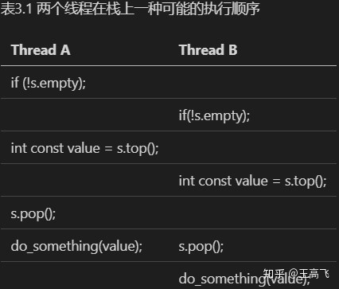

#### 1 共享数据所面临的问题

##### 1.1 竞争条件（race condition）

并发中的竞争条件是指任何结果取决于在两个或多个线程上操作执行的相对顺序；线程竞争去执行它们各自的操作。大多数情况下，这种竞争是良性的，因为任何可能的结果都可接受，哪怕这些结果会随着不同的相对顺序而改变。例如，有两个线程同时向一个队列中添加任务，只要保持住系统不变量，通常谁先谁后都没有什么影响。当竞争条件导致不变量遭到破坏时，才会发生问题，比如双向链表的例子。当谈到并发时，术语“竞争条件”通常指有问题的竞争条件；良性的竞争条件不是很有趣也不会引起bug。C++标准中也定义了“数据竞争”这个术语意指这个特殊的竞争条件是由于并发的去修改一个单一对象(参见5.1.2节)，数据竞争会导致可怕的未定义行为。

有问题的竞争条件典型地发生在完成一个操作需要修改多个不同的数据片段，比如示例对两个连接指针的修改。因为这个操作要访问两个独立的数据片段，它们必须被独立的指令修改，并且当只有其中之一的指令完成的时候，另一个线程可能潜在地访问这个数据结构。因为出现的概率太低，竞争条件难于发现和复现。如果修改是通过连续的CPU指令完成的，这个问题出现在任何一次运行中的可能性都很小，即使数据结构被另一个线程并发的访问。随着系统负载增加时，以及操作执行次数的增加，有问题的执行序列出现的机会也在增加。不可避免的是这类问题会在最不适宜的时候出现。竞争条件通常是时序敏感的，所以程序在调试模式运行时，它们经常会完全消失，因为调试模式会影响程序的时序，哪怕只是很轻微地影响。

如果你在写多线程程序，竞争条件就会成为你生命中的祸害；编写并发软件最大的复杂性来自于避免有问题的竞争条件。

##### 1.2 避免有问题的竞争条件

有一些方法可以解决有问题的竞争条件，最简单的选项就是把数据结构包裹在某种保护机制下，确保只有进行修改的线程才能看到不变量被破坏时的中间状态。从其他访问数据结构的线程的视角来看，修改要么还没开始要么已经完成。C++标准库提供一些这类的机制，我们会在本章描述。

另一个选项是修改数据结构和不变量的设计，以便让修改由一系列不可分割的变化来完成，每一个都维持了不变量，这就是所谓的无锁编程，不过，这种方式很难得到正确的结果。如果在这个层级上工作，内存模型上的细微差异，以及识别哪个线程能看到哪些值集会变的很复杂。内存模型将在第5章讨论，无锁编程将在第7章讨论。

另一种处理竞争条件的方式是，把更新数据结构当做事务来处理，就像在一个事务中更新数据库一样。所需的一系列数据修改和读取存储在一个事务日志中，然后再一步提交。如果提交因为数据结构被另一个线程修改了而不能进行，事务就会被重启。这称作为“软件事务内存”(STM，software transactional memory)。写作这本书的时候这是一个很活跃的研究领域。本书不会讨论这个话题，因为在C++中没有直接支持STM (尽管C++有事务性内存扩展的技术规范[1])。但是，私下做一些事情然后一步提交的思想会在后面提及。


#### 2 使用互斥锁保护共享变量

当程序中有共享的数据结构时，比如前面章节的链表，你肯定不想让程序陷入竞争条件，或是出现不变量被破坏的情况。如果你能将所有访问数据结构的代码片段都标记为互斥的（mutually exclusive）岂不美哉？这样的话，任何一个线程在执行其中一段时，其他线程试图访问共享数据的话，就必须进行等待，直到第一个线程操作结束。除非该线程就在执行修改操作，否则任何线程都不可能会看到被破坏的不变量。

这不是童话里的愿望——如果你使用一个称为互斥锁（mutex,*mut*ual *ex*clusion的组合）的同步原语的话，这正是你所得到的。在访问共享数据前，锁住和数据关联的互斥锁，在访问结束后，再将数据关联的互斥锁解锁。线程库需要保证，一旦一个线程已经锁住了指定的互斥锁，所有其他线程试图锁住这把锁时必须等待，直到成功锁住互斥锁的线程解锁它。这就保证了所有线程都能看到共享数据的自我一致的视图，而不破坏不变量。

互斥锁是C++数据保护最通用的机制，但它不是万能的；组织你的代码来保护正确的数据 (见3.2.2节)，并避免接口中固有的竞争条件(见3.2.3节)是非常重要的。不过，互斥锁自身也有问题，会造成死锁(见3.2.4节)，以及保护了太多或太少的数据(见3.2.8节)。让我们从基础开始。

##### 2.1 C++中使用互斥锁

C++中通过构建一个`std::mutex`实例创建互斥锁，通过成员函数`lock()`对互斥锁上锁，`unlock()`进行解锁。不过，实践中不推荐直接去调用成员函数，因为这意味着，必须记住在每个函数出口都要去调用`unlock()`，也包括发生异常的情况。C++标准库为互斥锁提供了一个RAII语法的`std::lock_guard`类模板，在构造时锁住提供的互斥锁，并在析构的时候进行解锁，从而保证了一个锁住的互斥锁能被正确解锁。下面的程序清单中，展示了如何在多线程中，使用`std::mutex`构造的`std::lock_guard`实例，对一个列表进行访问保护。`std::mutex`和`std::lock_guard`都在`<mutex>`头文件中声明。

```cpp
// 清单3.1 使用互斥锁保护列表

#include <list>
#include <mutex>
#include <algorithm>
 
std::list<int> some_list;    // 1
std::mutex some_mutex;    // 2
 
void add_to_list(int new_value)
{
 std::lock_guard<std::mutex> guard(some_mutex);    // 3
 some_list.push_back(new_value);
}
 
bool list_contains(int value_to_find)
{
 std::lock_guard<std::mutex> guard(some_mutex);    // 4
 return std::find(some_list.begin(),some_list.end(),value_to_find) != some_list.end();
}
```

清单3.1中有一个全局变量①，这个全局变量被一个全局的`std::mutex`实例保护②。`add_to_list()`③和`list_contains()`④函数中使用`std::lock_guard<std::mutex>`，使得这两个函数中对数据的访问是互斥的：`list_contains()`永远也看不到列表正在被`add_to_list()`修改。C++17中添加了一个新特性，称为类模板参数推导，这意味着对于像`std::lock_guard`这样的简单类模板，其模板参数列表通常可以省略。在C++17编译器上③和④的代码可以简化成：

```cpp
std::lock_guard guard(some_mutex);
```

为了让代码更加清晰，并且兼容老的编译器，我将会继续使用std::lock_guard，并在代码片段中写明模板参数的类型。

某些情况下使用全局变量没问题，但在大多数情况下，互斥锁通常会与需要保护的数据放在同一类中，而不是使用全局变量。这是面向对象设计准则的标准应用：将其放在一个类中，就可以清晰标记它们为相关的，也可对类的功能进行封装，进而增强保护。这种情况下，函数`add_to_list`和`list_contains`可以作为这个类的成员函数。互斥锁和需要保护的数据，在类中都定义为private成员，这可以更简单的识别哪些代码需要访问这个数据，因而哪些代码需要锁住互斥锁。当所有成员函数在访问任务数据成员前锁住互斥锁，结束时解锁，数据就被很好的保护起来免受所有外来者的干扰。

这并不完全正确：当其中一个成员函数返回的是保护数据的指针或引用时，那么成员函数对互斥锁处理的再好也没有用，因为你在保护罩上炸了个大洞。任何访问指针或者引用的代码现在可以访问（并且潜在的修改）保护的数据而不需要锁住互斥锁。用互斥锁保护数据因而需要谨慎的设计接口，来保证在访问任何保护数据之前，互斥锁是锁住的，并且不留后门。

##### 2.2 构建代码来保护共享数据

使用互斥锁来保护数据，并不是仅仅在每一个成员函数中都加入一个std::lock_guard对象那么简单；一个迷失(stray)指针或引用，会让这种保护形同虚设。不过，检查迷失指针或引用很容易，只要没有成员函数返回指向保护数据的指针或引用，数据就是安全的。如果再深入一点，就没这么简单了。和确保成员函数不会传出指针或引用一样，检查它们不会把这些指针或者引用传给它们调用的函数同样重要，尤其这些函数不受控制。这些函数可能存储指针或者引用到某个地方，之后在没有互斥锁保护的情况下使用。这方面尤其危险的是：函数是在运行时通过一个函数参数提供的，如同下面清单中所示那样。

```cpp
// 清单3.2 无意中传递了保护数据的引用

class some_data
{
  int a;
  string b;
public:
  void do_something();
}

class data_wrapper
{
  some_data data;
  std::mutex m;
public:
  template<typename Function> void process_data(Function func)
  {
    std::lock_guard<std::mutex> l(m);
    func(data);
  }
}

some_data* unprotected_data;

void malicious_function(some_data& protected_data)
{
  unprotected_data = &protected_data;
}

data_wrapper x;

void foo()
{
  x.process_data(malicious_function);
  unprotected_data->do_something();
}
```

例子中process_data看起来没有任何问题，std::lock_guard对数据做了很好的保护，但调用用户提供的函数func①，就意味着foo能够绕过保护机制将函数malicious_function传递进去②，然后在没有锁住互斥锁的情况下调用do_something()。

从根本上说，这段代码的问题在于它没有完成你想做的事情：**标记所有访问数据结构的代码片段为互斥的**。在这里，遗漏了函数foo()中调用unprotected->do_something()的代码。不幸的是，这部分问题C++线程库无法提供任何帮助，只能由开发者使用正确的互斥锁来保护数据。从正面看，还是有章可循的：**切勿将指向保护数据的指针或引用传递到互斥锁作用域之外**，无论是从函数返回它们，还是把他们存储在外部可见的内存，亦或是把他们以参数形式传递给用户提供的函数。

虽然这是在使用互斥锁保护共享数据时常犯的错误，但远不是唯一陷阱。下一节中，你将会看到，即便是使用了互斥锁对数据进行了保护，竞争条件依旧可能存在。

##### 2.3 发现接口中固有的竞争条件

仅因为使用了互斥锁或其他机制保护了共享数据，并不意味着你不会受到竞争条件的影响；你仍然必须确保合适的数据受到了保护。考虑双链表的例子，为了能让线程安全地删除一个节点，需要确保防止对这三个节点的并发访问：需要删除的节点及其前后两个节点。如果只对指向每个节点的指针进行单独的访问保护，那比没有使用互斥锁也好不了多少，因为竞争条件仍会发生——不是在单个步骤需要保护单个节点，是整个数据结构和整个删除操作需要保护。这种情况下最简单的解决方案就是使用互斥锁来保护整个链表，如清单3.1所示。

尽管链表的单个操作是安全的，但不意味着你就走出了困境；即使在一个很简单的接口中，依旧可能遇到竞争条件。考虑栈的数据结构，像清单3.3中展示的std::stack容器适配器，除了构造函数和swap()以外，只需要对std::stack提供五个操作：push()一个新元素进栈，pop()一个元素出栈，top()查看栈顶元素，empty()判断栈是否为空，size()了解栈中有多少个元素。如果你更改top()，使其返回一个拷贝而不是一个引用(即遵循了3.2.2节中的指导原则)并使用互斥锁保护内部数据，这个接口在本质上仍然受制于竞争条件。这个问题并不是基于互斥锁实现所特有的；这是一个接口问题，因此在无锁实现中仍然会出现竞争条件。

```cpp
// 清单3.3 std::stack容器适配器接口

template<typename T, typename Container=std::deque<T>> class stack
{
public:
    explicit stack(const Container&);
    explicit stack(Container&& = Container());

    template<class Alloc> explicit stack(const Alloc&);
    template<class Alloc> stack(const Container&, const Alloc&);
    template<class Alloc> stack(Container&&, const Alloc&);
    template<class Alloc> stack(stack&&, const Alloc&);
    bool empty() const;
    size_t size() const;
    T& top();
    T const& top() const;
    void push(T const&);
    void push(T&&);
    void pop();
    void swap(stack&&);

    template<class... Args> void emplace(Args&&... args);
};
```

虽然empty()和size()可能在返回时是正确的，但其结果是不可靠的；当它们返回后，其他线程就可以自由地访问栈，并且可能push()新元素到栈中，也可能pop()一些已在栈中的元素。这些操作可能发生在调用empty()或者size()的线程使用它们的返回值之前。当栈实例不是共享的，使用empty()检查非空再调用top()访问栈顶部的元素是安全的。如下所示：

```cpp
stack<int> s;
if (!s.empty())  // 1
{
 int const value = s.top(); // 2
 s.pop(); // 3
 do_something(value);
}
```

以上，不仅在单线程代码中是安全的，而且在空栈上调用top()是未定义的行为也符合预期。 对于共享的栈对象，这样的调用顺序就不再安全了，因为在调用empty()①和调用top()②之间，可能有来自另一个线程的pop()调用，它会删除最后一个元素。这是一个经典的竞争条件，使用互斥锁对栈内部数据进行保护，但依旧不能阻止它；这是接口带来的问题。

怎么解决呢？这个问题是接口设计的后果，所以解决的方法就是改变接口。有人会问：怎么改？在这个简单的例子中，当调用top()时，发现栈已经是空的了，那么就抛出异常。虽然这能直接解决这个问题，但它让编码更加笨重，因为现在你需要有能力捕获异常，即使empty()返回false。这使得对empty()的调用变成了一个优化，它避免了在栈已经为空的情况下抛出一个异常（尽管如果状态在empty()和top()之间发生了改变，异常仍然会抛出），而不是设计的必要部分。

当仔细的观察之前的代码段，就会在调用top()②和pop()③之间发现另一个潜在的竞争条件。假设两个线程运行着前面的代码，并且都引用同一个栈对象s。这并非罕见的情况，当为性能而使用线程时，多个线程在不同的数据上执行相同的操作是很平常的，并且共享栈对象是在它们之间划分工作的理想方式（虽然更通用的是，使用队列——参见第6和7章的例子）。假设，一开始栈中有两个元素，在两个中的任何一个线程上你都不需要担心empty()和top()之间的竞争，只需要考虑潜在的执行模式。

当栈被一个内部互斥锁所保护时，一次只有一个线程可以调用栈的成员函数，所以调用可以很好地交错执行，但是do_something()是可以并发运行的。在表3.1中，展示一种可能的执行顺序。



你可以看到，如果只有这两个线程在运行，在对top()的两次调用之间没有任何东西可以修改栈，所以，两个线程都看到相同的值。不仅是这样，在两次pop()之间没有调用top()。结果，栈中两个值中的一个没有读出来就被扔掉了，另一个值又被处理了两次。这是另一个竞争条件，比empty()/top()未定义行为的竞争更加阴险：看起来没有任何错误，这个bug的后果又远离原因，尽管这个后果明显依赖于do_something()做了什么。

这就要求接口来一个翻天覆地的变化，其中之一就是组合top()和pop()在一个互斥锁的保护下。Tom Cargill[1]指出如果对象的拷贝构造函数在栈中会抛出一个异常，这样的处理方式就会有问题。这个问题由Herb Sutter[2]从异常安全的角度进行了相当全面的处理，不过潜在的竞争条件，为组合带来了一些新东西。

如果还没有意识到问题，考虑`stack<vector<int>>`。vector是一个动态容器，当你拷贝一个vector，标准库会从堆上分配更多的内存来完成这次拷贝。如果这个系统处在重度负荷，或有严重的资源限制的情况下，这种内存分配就会失败，所以vector的拷贝构造函数可能会抛出一个std::bad_alloc异常。当vector中存有大量元素时，很可能就是这种情况。如果pop()函数定义成返回弹出值时，当然也就从栈中移除了这个值，那么会有一个潜在的问题：只有在栈已经修改以后，这个弹出值才返回给调用者；但当拷贝数据的返回给调用者的时候可能抛出一个异常。如果这种情况发生了，要弹出的数据就丢失了；它的确从栈上移除了，但是拷贝失败了！std::stack接口的设计人员将这个操作分为两部分：先获取顶部元素(top())，然后从栈中移除(pop())。这样，如果不能安全的拷贝数据，它仍然呆在栈上。如果问题是堆内存不足，应用可能会释放一些内存，然后重试。

不幸的是，在消除竞争条件时，你试图避免的正是这种分割。幸运的是，我们还有别的选项，但是它们是要付出代价的。

**选项1： 传入一个引用**

第一个选项是将变量的引用作为参数，传入pop()函数中获取想要的弹出值：

```cpp
std::vector<int> result;
some_stack.pop(result);
```

大多数情况下，这种方式还不错，但有个明显的劣势：需要调用代码提前构造出一个栈中值类型的实例，用于接收目标值。对于一些类型，这样做是不现实的，因为构造一个实例，从时间和资源的角度上来看，都很昂贵。对于其他的类型，这样也不总能行得通，因为构造函数需要的一些参数，在这个阶段的代码不一定具备。最后，它要求存储的类型必须是可赋值的，这是一个重大限制：很多用户自定义类型可能都不支持赋值操作，即使它们可能支持移动构造，甚至是拷贝构造(从而允许按值返回)。

**选项2：要求一个无异常抛出的拷贝构造函数或移动构造函数**

对于有返回值的pop()函数来说，只有异常安全方面的问题，如果值返回可以抛出一个异常的话。很多类型都有不会抛出异常的拷贝构造函数，并且随着新标准中对右值引用的支持(详见附录A，A.1节)，更多类型都将会有一个不会抛出异常的移动构造函数，即使他们的拷贝构造函数会抛出异常。一个有效的选项是限制线程安全的栈只用在这些能够安全按值返回并且不会抛异常的类型上。

这虽然是安全的但并不理想。尽管能在编译时可使用std::is_nothrow_copy_constructible和std::is_nothrow_move_constructible类型特性（type traits），检测出拷贝或移动构造函数不会抛出异常，但是这种方式的局限性太强。在用户自定义的类型中，会在拷贝构造函数中抛异常，并且没有移动构造函数的要比不抛异常的更多（这种情况会随着人们习惯于C++11中的右值引用而有所改变)。如果这些类型不能被存储在你的线程安全的栈中，那将是多么的不幸。

**选项3：返回指向弹出值的指针**

第三个选项是返回一个指向弹出项的指针，而不是按值返回项。指针的优势是自由拷贝，并且不会产生异常，这样你就能避免Cargill提到的异常问题了。缺点就是返回一个指针需要管理分配给对象的内存，对于简单数据类型，比如整型，内存管理的开销要远大于按值返回。对于选择这个方案的接口，使用std::shared_ptr作为指针类型是个不错的选择；不仅能避免内存泄露，因为一旦最后一个指针销毁了，对象也会销毁，而且库能够完全控制内存分配机制，也就不需要new和delete操作。从优化的目的看这是很重要的：需要栈中的每个对象分别用new来分配，相比原始的非线程安全版本强加了太多开销。

**选项4：“选项1 + 选项2”或 “选项1 + 选项3”**

灵活性永远不应该忽视，尤其对通用代码而言。如果你已经选择了选项2或3时，再提供选择1也是很容易的。这样不费吹灰之力，就为代码的用户提供了选择最适合它们选项的能力。

**线程安全栈的示例定义**

清单3.4中是一个接口没有竞争条件的栈类的定义，它实现了选项1和选项3：有两个重载的pop()，其中一个使用引用，这个引用指向存储值的位置，另一个返回std::shared_ptr<>。它接口很简单，只有两个函数：push()和pop();

```cpp
#include <exception>
#include <memory>

struct empty_stack: std::exception
{
    const char* what() const throw();
};

template<typename T> class threadsafe_stack
{
public:
    threadsafe_stack();
    threadsafe_stack(const threadsafe_stack&);
    threadsafe_stack& operator=(const threadsafe_stack&) = delete;
    void push(T, new_value);
    void pop(T& value);
    bool empty() const;
};
```

通过削减接口不仅可以获得最大程度的安全，甚至对整个栈的操作也被限制了。栈是不能直接赋值的，因为赋值操作已经删除了①(详见附录A，A.2节)，并且这里没有swap()函数。假设栈中的元素支持拷贝，那么栈也可以支持拷贝。当栈为空时，pop()函数会抛出一个empty_stack异常，所以一切运行正常，哪怕调用empty()之后栈被修改了。如选项3描述的那样，使用std::shared_ptr可以避免内存分配管理的问题，并避免过度调用new和delete操作。栈中的五个操作，现在就剩下三个：push(), pop()和empty()。甚至empty()都是多余的。简化接口更有利于控制数据，可以保证互斥锁将一个操作完全锁住。下面的代码将展示一个简单的实现——封装了std::stack<>。