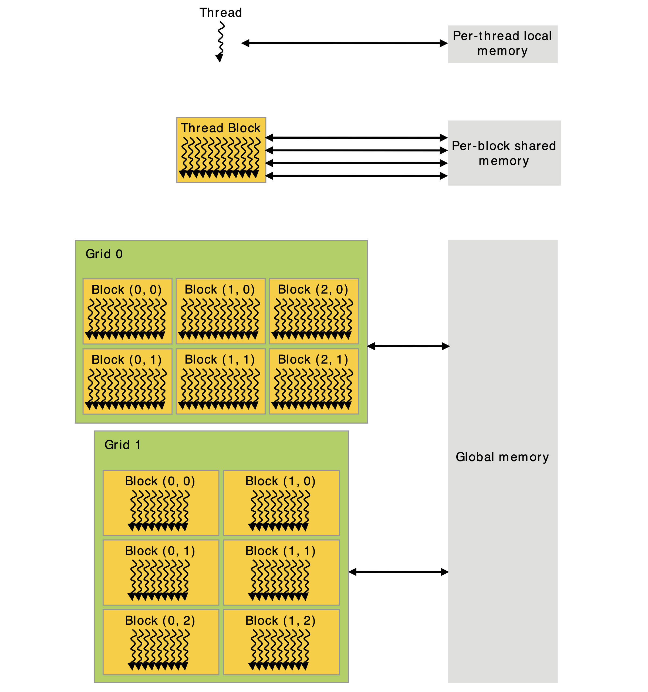

#### 1 核心

CUDA C++通过允许开发者定义C++函数——核心（kernel）来扩展C++，当核心被调用时，会被N个不同的CUDA线程执行N次，与普通C++函数只执行一次相对。核心：

- 通过`__global__`声明说明符和CUDA线程数来定义；
- 通过`<<<...>>>`执行配置语法来调用；
- 每个执行此核心的线程都有一个线程ID，可以在核心内通过内置变量`threadIdx`获得。

下例展示了向量加法：

```cpp
// kernel definition
__global__ void VecAdd(float* A, float* B, float* C)
{
    int i = threadIdx.x;
    C[i] = A[i] + B[i];
}

int main()
{
  ...
  // kernel invocation
  VecAdd<<<1, N>>>(A, B, C);
  ...
}
```


#### 2 线程层次

`threadIdx`是一个3元素向量，因此线程能用一维、二维或三维线程索引来表示，形成一维、二维或三维块的线程，称为线程块。

线程索引和线程ID之间的相互关联是十分直接的：

- 对一维的块，两者是相同的；
- 对大小为$(D_x,D_y)$的二维块，索引为$(x,y)$的线程其ID为$(x+yD_x)$；
- 对大小为$(D_x,D_y,D_z)$的三维块，索引为$(x,y,z)$的线程其ID为$x+yD_x+zD_xD_y$。

下例展示了两个矩阵GPU上的两个显卡相加：

```cpp
__global__ void MatAdd(float A[N][N], float B[N][N], float C[N][N])
{
  int i = threadIdx.x;
  int j = threadIdx.y;
  C[i][j] = A[i][j] + B[i][j];
}

int main()
{
  ...
  // kernel invocation with one block of N*N*1 threads
  int numBlocks = 1;
  dim3 threadPerBlock(N, N);
  VecAdd<<<numBlocks, threadsPerBlock>>>(A, B, C);
  ...
}
```

因为一个块的所有线程都位于同一个处理器核，共享有限的核内存储资源，因此每个块的线程数都有限制，在当前GPU中，一个线程块最多包含1024个线程。

但是一个核心能被多个相同形状的线程块执行多次，因此线程总数等于每个块的线程数乘以总共的块数。块也被组织为一维、二维或三维网格的线程块，如下图所示，一个网格内的线程数量通常由所处理的数据决定。


`<<<...>>>`语法中指定的每个块的线程数和每个网格的的块数可以使用`int`或`dim3`类型：

- 每个网格内的块可以通过一个一维、二维或三维的唯一索引标识，它在核心内通过内置变量`blockIdx`获得；
- 线程块的维度则可以在核心中通过内置变量`blockDim`变量获得。

下例扩展了矩阵相加的示例来处理多个线程块：

```cpp
// kernel definition
__global__ void MatAdd(float A[N][N], float B[N][N], float C[N][N])
{
  int i = blockIdx.x * blockDim.x + threadIdx.x;
  int j = blockIdx.y * blockDim.y + threadIdx.y;
  if (i < N && j < N) C[i] = A[i] + B[i];
}

int main()
{
  ...
  // kernel invocation
  dim3 threadsPerBlock(16, 16);
  dim3 numBlocks(N/threadsPerBlock.x, N/threadsPerBlock.y);
  VecAdd<<<numBlocks, threadsPerBlock>>>(A, B, C);
  ...
}
```

尽管可以任意取之，但通常将块的大小定为$16\times16$。

线程块需要能被独立执行：

- 必须能以任意顺序对它们进行执行，并行或串行；
- 允许在任意数量的核中以任意顺序调度，使开发者编写依据核数扩展的代码。

一个块内的线程可以通过共享内存的共享数据相互协作，并通过同步执行来协调内存的获取。具体而言就是，可以调用`__syncthreads()`内置函数指定同步点，`__syncthreads()`函数类似于一个栅栏，块内的所有线程必须等待，直到允许继续执行。除此之外，[Cooperative Groups API](https://docs.nvidia.com/cuda/cuda-c-programming-guide/index.html#cooperative-groups)提供了丰富的线程同步原语。


#### 3 存储层次

CUDA线程可以从多个内存空间来获得数据（如下图所示）：

- 每个线程都有私有的局部内存；
- 每个线程块都有共享内存，对块内所有的线程可见，与块有同样的生命期；
- 所有线程都能访问全局内存；
- 所有线程还能读取两个只读内存：
  - 常量内存空间；
  - 纹理内存空间。

全局、常量、纹理这三个内存空间是为不同用途而优化的，在同一个应用所加载的所有核心中都是持续的。




#### 4 异构编程

**协处理器**：CUDA编程模型假定CUDA线程在一个物理隔离的设备上运行，并作为一个到主机的协处理器与运行C++程序的主机合作，如下图所示。比如核心在GPU上执行，而程序剩余部分则在主机上执行，即顺序代码在主机运行，而并行代码在设备运行。

**内存分离**：CUDA编程模型还假定主机和设备都维护自己的内存空间，分别被称为主机内存和设备内存。因此，程序管理在调用CUDA运行时可见的全局、常量、纹理内存空间，包括：

- 设备内存的分配与回收；
- 数据在主机和设备之间的传输。

**一致内存**：提供了托管内存来搭建主机和设备内存空间之间的桥梁，通过共同的地址空间，像单一、一致的内存镜像一样，能同时被系统中的CPU和GPU获取。这使得设备内存能被超额索引（overscription），通过避免显式在主机或设备上反应数据，极大简化了应用的移植。


#### 5 计算能力

设备的计算能力由版本数字（有时也被称为SM版本）来表示，版本数字确认了GPU硬件支持的特性，用于在运行时确定当前GPU能使用哪些硬件特征和/或指令。计算能力由一个主版本*X*和次版本*Y*组成，并被计为*X.Y*：

- 具有相同主版本的设备具有同样的核心架构，8对应Ampere架构，7.5是Turing架构，7对应Volta架构，6对用Pascal架构；
- 次版本则对应一些核心架构的增量式改进。
