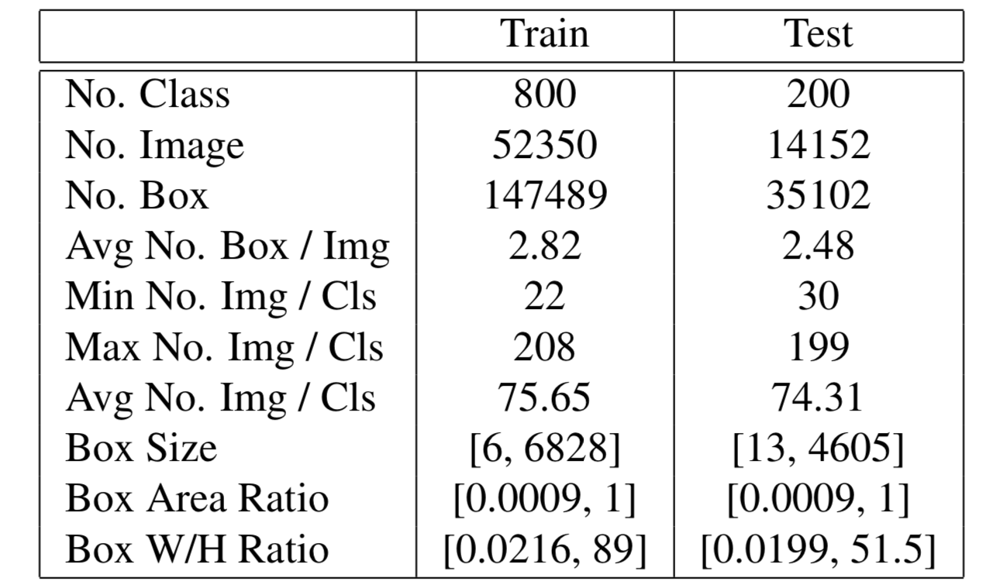
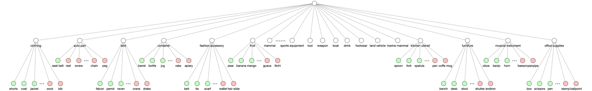

现有的目标检测方法通常严重依赖大量标注数据和长时间训练，也难以扩展到训练数据中未标记的未见目标，这启发我们开发少样本的目标检测算法。但因现实世界中目标光照、形状、材质等的大量变化，少样本学习十分困难。虽然已有一些进展，但都集中在图像分类，很少发掘少样本目标检测。因为将少样本分类的经验迁移到少样本检测并不容易，一个很关键的问题就是如何在凌乱的背景中定位一个未见物体，即从新类别的少量训练样本中学会定位的泛化问题。潜在边框完美错过未见物体或者有很多背景上的误检时有发生，这可能归咎于区域提议网络（RPN）中合适边框不恰当的低分，使得新物体很难被检测。这使得少样本检测本质上异于少样本分类。

本文旨在解决少样本检测问题，给定目标物体的少量支持集，我们希望检测出测试集中属于目标物体类别的所有前景。为此做出了两个主要贡献：一是提出了一个无需重训练或调优就能就能用来检测新目标的通用少样本检测模型，这个方法充分发掘了多个网络阶段孪生网络物体对之间的匹配关系，实验显示它在早期阶段能从一个提高提议质量的注意力模块受益，在后面一个阶段多关系模块则抑制和过滤混淆背景的误检；二是为了训练这个模型构建了有1000个类别而每个类别少量样本的大量标注数据集，它提升了目标检测的泛化学习，使用它我们的方法获得了远好于更大规模基准数据集的性能。就我们所知，这是第一个构建如此多类别少样本检测数据集的尝试。

综合而言，我们提出了一个在RPN上和检测器上有仔细设计注意力模块的新少样本检测模型，由于匹配策略，它的一个重要属性是其训练阶段与测试阶段完全相同。这在本质上使得我们的模型能在线测试新类别物体，而无需预训练或更深的网络调整。

#### FSOD数据集：高多样性少样本目标检测数据集

少样本学习的关键在于模型在新类别上的泛化能力，因此需要一个有大量物体类别的高多样性数据集来训练一个足够通用来检测未见物体并同时提供令人信服评估的模型。

**构建数据集**：因为标签系统不一致、大量标签无法令人满意、训练/测试划分包含相同类别等原因，无法直接应用现有的数据集。为此从OpenImage和ImageNet总结了一个标签系统，通过合并原始标签树的叶标签、聚集相同语义的到一个类别，并删除一些不属于任何也类别的语义；然后删除质量差的标签和大小不适当的边框，删除了小于图像0.05%通常视觉质量不好并不适于充当支持样本的边框；之后遵循少样本学习原则将数据划分为类别不重叠的训练集和测试集，以MSCOCO和ImageNet中的类别构造训练集以防研究者需要一个预训练阶段，然后通过选择与训练集中已有类别相距最远的类别来划分包含200个类别的测试集，而距离计算is-a分类学中连接两个短语意义的最短路径，剩余的类别则合并到总共包含800个类别的训练集。综上，我们构建了一个对训练和测试划分非常清晰的1000类数据集，其中531个类别来自ImageNet，469个来自OpenImage。

**数据集分析**：数据集包含大约66000张图像和182000个边框，具体数据见下表。

这个数据集有如下属性：

- 高多样性类别：数据集包含83个父语义，然后进一步切分为1000个叶类别，标签树如下图所示。由于严格的划分，训练/测试数据集有差异很大语义类别，也很大地挑战了评估模型；
- 挑战性设定：数据集的评估极具挑战，包含的目标边框大小和长宽比例变化极大，并在测试集中26.5%的图像包含不少于3个目标，需注意测试集中包含大量并未包含在标签系统中的其他类别的边框，这也对少样本模型造成了很大的挑战。

尽管有很多类别，但训练图像和边框远少于其他基准，因此是紧凑但对少样本学习有效的。

#### 方法

我们定义少样本目标检测任务为：给定一张目标物体特写的支持图像$s_k$和一张单独的可能含有支持类别$k$的查询图像$q_k$，找到查询中所有支持类别的目标并用边框标记出来。若支持集包含$K$个类别，每个类别$N$个样本，则称其为$K$路$N$样本检测。

##### 深度注意力少样本检测

