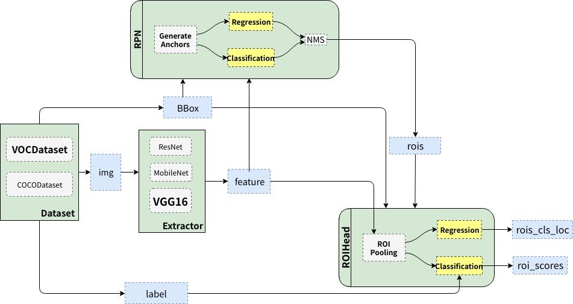
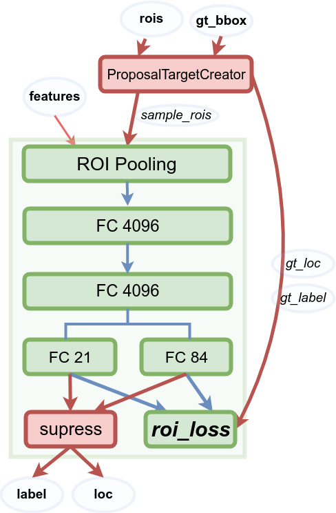
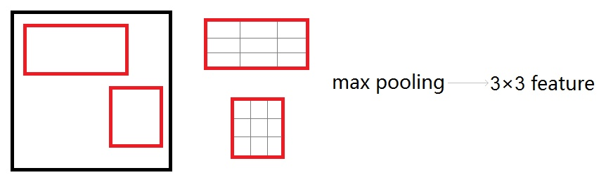

 从编程角度来说， Faster R-CNN主要分为四部分（图中四个绿色框）：

- **Dataset**：提供符合要求的数据格式，目前常用数据集是VOC和COCO；
- **Extractor**： 提取图片特征`features`，可用ZF、VGG16或ResNet101等；
- **RPN(Region Proposal Network)**: 提供候选区域`rois`，每张图给出大概2000个候选框；
- **RoIHead**： 对`rois`分类和微调，判断它是否包含目标，并修正框的位置和座标

Faster R-CNN整体的流程可以分为三步：

- **提特征**： 图片（`img`）经过预训练的网络（`Extractor`），提取到了图片的特征（`feature`）；
- **Region Proposal**： 利用提取的特征（`feature`），经过RPN网络，找出一定数量的`rois`；
- **分类与回归**：将`rois`和图像特征`features`输入到`RoIHead`，对这些`rois`进行分类与位置微调。

#### 1 数据

对输入图片进行如下处理：

- 图片缩放，使得长边小于等于1000，短边小于等于600（至少有一个等于）。
- bbox缩放，相应的bounding boxes也进行等尺度的缩放。
- 对于Caffe的预训练模型，需图片位于0-255，BGR格式，减去均值使得像素均值为0。

返回值格式如下：

- `images`：` (3, H, W)` ，BGR通道；
- `bboxes`：`( 4, K)`，K个bounding boxes左上角和右下角座标，形如`(Y_min,X_min, Y_max,X_max)`；
- `labels`：K个bounding boxes的label，VOC中取值范围为[0-19]；
- `scale`：缩放的倍数，若`H'`为原图高，则（`scale=H/H'` ）。

#### 2 Extractor

使用预训练模型提取图片特征，使用Caffe的VGG16预训练模型，做修改如下：

- 前四层卷积层的学习率设为0以节省显存；
- `Conv5_3`输出作为图片特征（feature），相比于输入下采样了16倍；
- 用VGG最后三层全连接层的前两层初始化RoIHead的部分参数。

一张图片经过`extractor`之后，得到一个`(C, H/16, W/16)`的特征映射。

#### 3 RPN

RPN总体架构如下：

##### 3.1 Anchor

anchor为大小和尺寸固定的候选框，

- 有三种尺寸小（蓝128）中（红256）大（绿512），和三个比例1:1，1:2，2:1，共计9种anchor；
- 用这9种anchor处理特征映射（`feature map`）上每一点，最终生成了 (H/16)× (W/16)×9个；

对一个`(512, 62, 37)`的`feature map`，有62×37×9~ 20000个anchor。

##### 3.2 训练RPN

在`Extractor`输出的特征映射基础上，

1. 先增加了一个卷积；

2. 然后利用两个1x1卷积分别进行二分类（是否为正样本）和位置回归：

   - 进行分类的卷积核通道数为9×2（9个anchor，每个anchor二分类，使用交叉熵损失），
   - 进行回归的卷积核通道数为9×4（9个anchor，每个anchor有4个位置参数）。
   - RPN为全卷积网络（fully convolutional network），对输入图片的尺寸就没有要求。

3. 然后RPN用`AnchorTargetCreator`从20000多候选anchor选出256个进行分类和回归位置。过程如下：

   - 选择每个ground truth bounding box (`gt_bbox`)与其重叠度(IoU)最高的一个anchor作为正样本；

   - 在剩下anchor中选择与任一`gt_bbox`重叠度超过0.7的anchor为正样本，正样本数目不超过128个；

   - 随机选择与`gt_bbox`重叠度小于0.3的anchor作为负样本，正负样本总数为256。

   - 每个anchor的`gt_label`要么为1（前景），要么为0（背景），而`gt_loc`则是由4个位置参数(tx,ty,tw,th)组成，这样比直接回归座标更好：
     $$
     \begin{eqnarray}
     t_x = \frac{x-x_a}{w_a} &;& t_y = \frac{y-y_a}{h_a}\\
     t_w = \log \frac{w}{w_a} &;& t_h = \log \frac{h}{h_a};\\
     t^*_x = \frac{x^*-x_a}{w_a} &;& t^*_y = \frac{y^*-y_a}{h_a}\\
     t^*_w = \log \frac{w^*}{w_a} &;& t^*_h = \log \frac{h^*}{h_a}
     \end{eqnarray}
     $$

   - 使用交叉熵计算分类损失；

   - 使用`Smooth_l1_loss`计算回归损失，且只计算正样本、不计算负样本的位置损失。

##### 3.3 生成RoIs

提供给Fast RCNN(RoIHead)作为训练样本，过程(`ProposalCreator`)如下：

1. 对每张图的feature map计算 (H/16)× (W/16)×9(~20000)个anchor属于前景的概率，及对应位置参数；
2. 选取概率较大的12000个anchor；
3. 利用回归的位置参数修正这12000个anchor的位置，得到RoIs；
4. 利用非极大值(Non-maximum suppression, NMS)抑制，选出概率最大的2000个RoIs.

##### 3.4 注意：

- 在inference时为提高处理速度，12000和2000分别变为6000和300；
- 这部分的操作无需进行反向传播，可利用numpy/tensor实现；
- RPN输出：RoIs（形如`(2000, 4)`或`(300, 4)`的tensor。

#### 4 RoIHead

在RPN给出的2000RoIs上继续进行分类和位置参数的回归。其网络结构：

##### 4.1 RoI池化

**由于RPN给出的2000个RoIs对应feature map不同大小的区域**（是由于scale和ratio不同么？）。因此：

1. 首先利用`ProposalTargetCreator` 挑选出128个sample_rois，规则如下：

   - `RoIs`和`gt_bboxes`的IoU大于0.5的，选择一些（比如32个）为正样本；
   - `RoIs`和`gt_bboxes`的IoU小于等于0（或者0.1）的选择一些（比如 128-32=96个）作为负样本；
   - 为便于训练还对其`gt_roi_loc` 进行标准化处理（减去均值除以标准差）；

2. 然后使用了RoIPooling 将这些不同尺寸的区域全部pooling到同一个尺度（7×7）上；

   以下图为例，对`feature map`上两个不同尺度RoI，经过RoIPooling之后得到了3×3的feature map：

RoI Pooling是一种特殊Pooling操作，将给定图片Feature map `(512, H/16, W/16)` 及128个候选区域座标`(128, 4)`统一下采样到 `(512, 7, 7)`，得到`(128, 512, 7, 7)`向量，可看成是一个`batch_size=128`，通道数为512，7×7的feature map。

##### 4.2 全连接层

RoI Poiling的目的是为共享权重：当所有的RoIs都被pooling成`(512, 7, 7)`的feature map后，将其reshape成一维向量，即可用VGG16预训练权重初始化前两层全连接。

##### 4.3 分类与回归

最后再接两个全连接层，分别为：

- `FC 21` 用于分类，预测RoIs所属类别，20类+背景；
- `FC 84`回归位置，21个类每个都有4个位置参数。

对于分类问题，直接利用交叉熵损失；对于位置的回归损失，一样采用`Smooth_L1Loss`，且只对正样本中的这个类别的4个参数计算损失。比如一个`RoI`在经过`FC 84`后会输出一个84维`loc`向量：

-  若此RoI为负样本，则这84维向量不参与计算 L1_Loss；

- 若此RoI为正样本且属于label K，则自由其`(K×4, K×4+1, K×4+2, K×4+3)`这4个数参与计算损失。

测试时对所有RoIs（大概300个左右) 计算概率，并利用位置参数调整预测候选框位置，然后使用NMS。

##### 4.4 注意

- 在RPN的时候，已对anchor做过一次NMS，在RCNN测试时还需再做一遍；
- 在RPN的时候，已对anchor位置做了回归调整，在RCNN阶段对RoI还需再做一遍；
- 在RPN阶段分类为二分类，而Fast RCNN阶段是21分类。