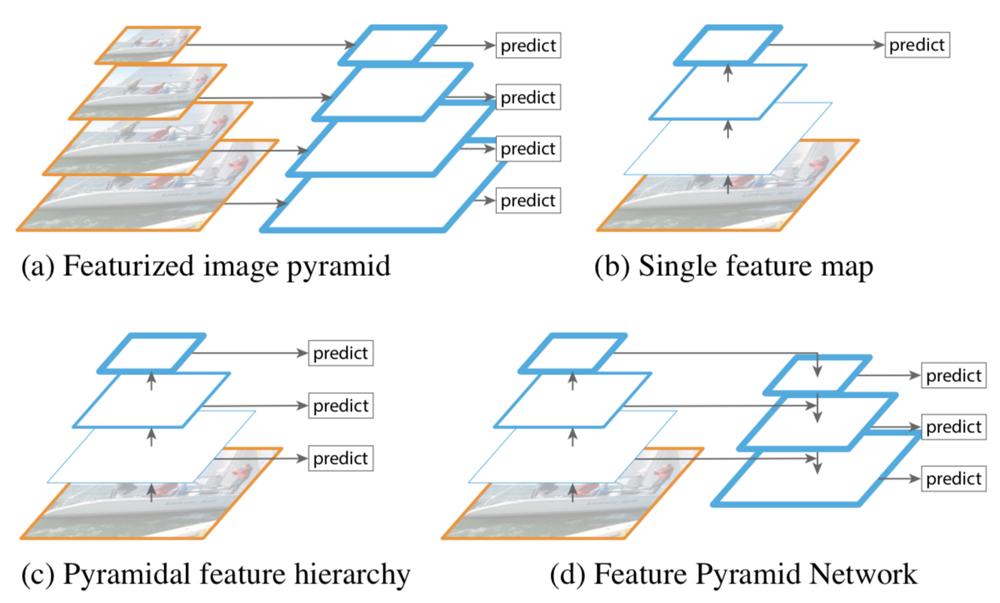
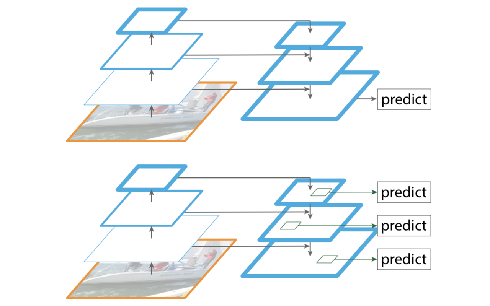
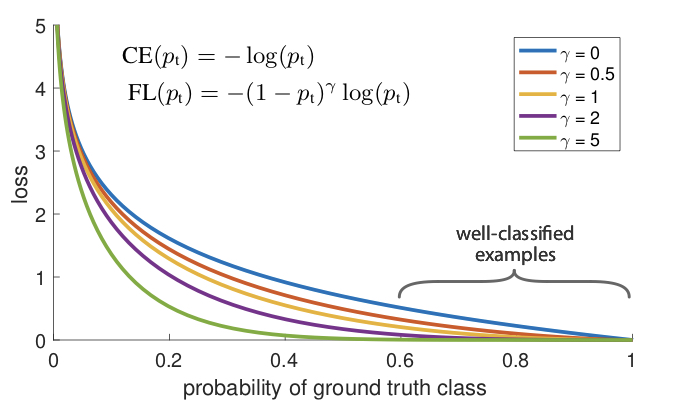
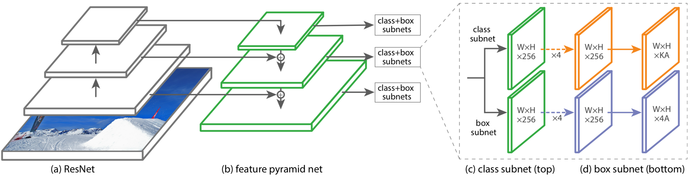

当前最好的物体检测器都是基于两阶段、提议驱动的机制，就像RCNN框架中流行的那样，第一阶段产生一个获选位置的候选目标位置的稀疏集，第二阶段则分辨候选位置的前景类别或背景。而单阶段的检测器则应用在规律、密集的目标位置、大小、横纵比的样本上。本文提出了一个单阶段检测器，第一次达到了更复杂两阶段检测器的COCO AP。为实现这个结果，我们确定了训练期间的类别不平衡是单阶段检测器获得更好正确率的主要阻碍，并提出了新的损失函数来消除这个障碍。

在类RCNN检测器中，类别不平衡是通过一个两阶段串联和启发式采样来解决的。提议阶段就很快将候选位置减少到一个小数目（比如1-2k），过滤掉了大部分的背景样本；在分类阶段，则执行启发式采样，比如固定的前景-背景比率（1:3）、或在线困难样本挖掘（OHEM），来保持前景和背景的间的可控平衡。相反，单阶段检测器必须处理在整个图像上规律采样的大得多的候选目标位置集，实际中经常达到100k左右，密集覆盖了各个空间位置、大小和长宽比。虽然可以采用同样的启发式采样，但并没有多大效果，因为训练中简单可分的背景依然占据了主流。

##### FPN网络

构建于图像金字塔之上的特征金字塔（简称特征图像金字塔）构成了解决多种不同尺度目标识别的标准方法的基础。因目标的大小变化可以通过转变其金字塔层级而抵消，在这层意义上这些金字塔是大小无关的。直观上，通过扫描位置和金字塔层次，这种特性使得模型能够检测大范围不同尺寸的目标。以图像金字塔的每个层次作为特征的首要优势是：它产生一个在所有层次上都有强语义的多尺度特征表达，包括高分辨率层次。但是也会带来延长推理时间等限制。

但图像金字塔并不是唯一的计算多尺度特征表达的方法，一个深度卷积网络会逐层计算特征层级，并且通过下采样层这个特征层级天然就含有不同大小的金字塔的形状。这种网络内部的特征层级会产生不同空间分辨率的特征图，但会引入由不同深度引起的很大的语义代沟，高分辨率图有伤害目标识别表达能力的低层特征。

SSD是最早尝试像特征图像金字塔一样使用卷积金字塔特征层级之一（下图c），理想情况下SSD风格的金字塔会重用来自前向传递中不同层的多尺度特征从而没有额外消耗，但为避免使用低层特征SSD放弃重用已计算的层，而是通过额外增加价格新层从网络的高层（比如VGG网络的conv4_3）开始构建，因此失去了重用特征层级高分辨率图的机会，而这些对检测小目标至关重要。

FPN的目标就是自然地利用卷积网络特征层级金字塔形状的同时创造在所有尺度都有很强语义的特征金字塔。为实现这个目标，FPN依靠一个通过自顶向下旁路与侧边连接将低分辨率、强语义特征与高分辨率、弱语义特征结合的的结构（上图d）。结果就是一个从单一输入图像尺寸上快速构建的在所有层级上都有丰富语义信息的特征金字塔。换句话说展示了如何无需牺牲表达能力、速度和存储就能创建代替特征图像金字塔的网络内部特征金字塔。

采用自顶向下和跳跃连接的类似架构的目标是产生单个用于预测的细粒度的高层特征图（下图顶部），于此相对FPN方法像特征金字塔一样使用这个结构，那个层级的预测都是独立执行（下图底部）。FPN模型输出一个特征图像金字塔。

FPN的目标是利用有从低到高语义信息的金字塔特征层级，并构建一个自始至终都有高层语义的特征金字塔。FPN输入一张任意大小的单尺度图像，以全卷积的形式输出在多个层级大小成比例的特征图，且这个过程独立于主干卷积网络，这里以ResNet为例。这个金字塔的构造包含了一个自底向上旁路、一个自顶向下旁路和侧边连接。

**自底向上旁路**：自底向上旁路是主干卷积网络的前向传播计算，它会计算一个由缩放步长为2的几种尺度特征图组成的特征层级。有许多层产生大小相同的输出图，我们称这些层在同一阶段。对特征金字塔我们为每一阶段定义一个金字塔层级。因为每一阶段的最深的层有最强的特征，因此选择每一阶段最后一层的输出为特征图的参考集，后面再将其充实来创建金字塔。特别地对于ResNet我们使用每个阶段最后一个残差块的激活值输出。对于conv2、conv3、conv4、conv5输出，我们将这些最后残差块记为$\{C_2,C_3,C_4,C_5\}$，对应于输入图像有步长$\{4,8,16,32\}$像素。

**自顶向下旁路与侧边连接**：

##### Focal损失

Focal损失是设计来解决单阶段物体检测场景中极端的前景和背景类别不均衡的问题。先看二分类的交叉熵损失：
$$
\text{CE}(p,y) = \begin{cases}
-\log(p) & \text{if }y=1\\
-\log(1-p) & \text{otherwise}
\end{cases}
$$
上面的$y \in \{\pm1\}$指定真实类别，$p\in[0,1]$是模型对类别$y=1$的估计概率。为方便标记，定义$p_t$：
$$
p_t = \begin{cases}
p & \text{if }y=1\\
1-p & \text{otherwise}
\end{cases}
$$
这样$\text{CE}(p,y)=\text{CE}(p_t)=-\log(p_t)$。CE损失可以看成是下图顶端的蓝色曲线，它的一个重要特性是：即便是很容易区分的的样本($p_t \gg .5$)也会产生不小的损失。在大量简单样本相加后，这些小损失的值也会压倒稀有类别。

处理这种类别不均衡的常用方法是引入类别$1$的加权因子$\alpha \in [0,1]$和类别$-1$的$1-\alpha$。实际中$\alpha$会设为类别频率的倒数，或用交叉验证设置为超参数。为方便标记，我们像$p_t$一样定义$\alpha_t$，并将$\alpha$平衡的CE损失记为：
$$
\text{CE}(p_t) = -\alpha_t\log(p_t)
$$
这个损失是CE的一个简单扩展，我们将其设为将要提出的Focal损失的实验基准。

就如实验所示，密集检测器训练时遇到的大量类别不平衡问题压倒了交叉熵损失，易分类负样本组成了损失的大部分，统治了梯度。尽管$\alpha$平衡了正负样本的重要性，单并为区分简单/困难样本。因此我们提出重塑损失函数来降权简单样本从而聚焦在难样本上的训练。为此提出通过可调节的焦点参数$\gamma\ge0$增加一个调节因子$(1-p_t)^\gamma$到交叉熵损失。因此focal损失定义为：
$$
\text{FL}(p_t) = -(1-p_t)^\gamma\log(p_t)
$$
上图展示了几个$\gamma\in[0,5]$值的Focal损失，我们注意到focal损失的两个特性：一是在一个样本被误分且$p_t$比较小时，调节因子接近于1且损失不受影响，当$p_t \to 1$时因子趋于0，易分类样本的损失就被降权了；二是焦点参数$\gamma$在简单样本被降权后平滑地调整了比率。当$\gamma=0$时FL等价于CE，当$\gamma$增加时调节因子的影响也同样增加，在试验中发现$\gamma=2$时效果最好。

直观上看调节因子降低了简单样本的损失贡献、扩展了接收低损失的样本的范围。比如$\gamma=2$时以$p_t=0.9$分类的样本与CE相比会少100倍的损失，而$p_t=0.968$时则是1000倍。反过来增加了修正误分类样本的重要性（对$p_t\le.5$及$\gamma=2$其损失最多按4倍的比例缩小）。实践中我们使用focal损失的$\alpha$-平衡变体：
$$
\text{FL}(p_t) = -\alpha_t(1-p_t)^\gamma\log(p_t)
$$
这种形式会产生稍微更好的结果。最后需要注意的是结合sigmoid操作计算$p$的损失层会有更好的数值稳定性。

##### RetinaNet检测器

RetinaNet是由一个主干网络和两个任务特定子网络组成的单阶段、统一网络，主干网络负责计算输入图片的特征图，第一个自网络在主干网络的输出上执行卷机目标分类，第二个则执行卷积边框回归。虽然这些成分的细节有很多可能选项，但大部分的参数如实验所示对精确值并非特别敏感。

**主干FPN**：RetinaNet采用FPN作为主干网络。简而言之FPN使用一个自顶向下旁路和侧连接来增强标准卷积网络使其能有效从单个分辨率输入图像中构造一个富余、多尺度的特征金字塔，如下图(a)-(b)所示。每个层次的金字塔都能在一个不同尺度检测目标，从全卷积网络改善了多尺度预测。

RetinaNet在ResNet架构之上构造FPN，构建了从$P_3$到$P_7$的金字塔，其中的数字$l$表示指示金字塔层级（$P_l$的分辨率比输入小$2^l$倍），所有层次金字塔都有$C=256$个通道。虽然很多设计选择都不是决定性的，但强调FPN主干的使用是：仅使用最终的ResNet层的简单实验产生低AP。

**锚框**：retinanet使用类似RPN中那样平移不变的锚框，从$P_3$层到$P_7$层对应的锚框面积是$32^2$到$512^2$，每个金字塔层都使用3种不同长宽比$\{1:2,1:1,2:1\}$。为更密集的尺度覆盖，在每个层次每种长宽比又增加大小为原来设定的$\{2^0,2^{1/3}, 2^{2/3}\}$倍大小的锚框。这样每个层次就有$A=9$个锚框，并通过所有层次覆盖了大小范围在32到813的像素。每个锚框都分配长度为$K$的one-hot向量的分类目标，和一个长度为4的边框回归目标。当与真实边框的IoU大于阈值0.5时赋为前景，小于0.4时为背景，在$[0.4, 0.5)$之间时忽略。边框回归目标计算为每个锚框和赋予的真实边框之间的偏移，若没赋值则忽略。

**分类子网络**：分类网络为每个位置的$A$个锚框和$K$个类别预测存在物体的概率，是一个附加在每个FPN层级上的小型FCN，并在所有金字塔层共享参数。其设计很简单，从一个给定金字塔层级获得$C$通道的输入特征图，这个子网络应用4个通道数为$C$且后跟ReLU激活的$3\times3$卷积层，之后是一个有$K\times A$核的$3\times3$卷积网层。最终使用sigmoid激活来为每个位置输出$K\times A$个二值预测。如上图所示，这里取$C=256$且$A=9$。与RPN相比，RetinaNet的分类子网络更深，仅使用$3\times3$卷积，且不与边框回归子网络共享参数，这些更高层次的设计决策比特定参数值更重要。

**回归子网络**：与目标分类子网络并行，我们添加另一个小型FCN到每个FPN层级来回归。