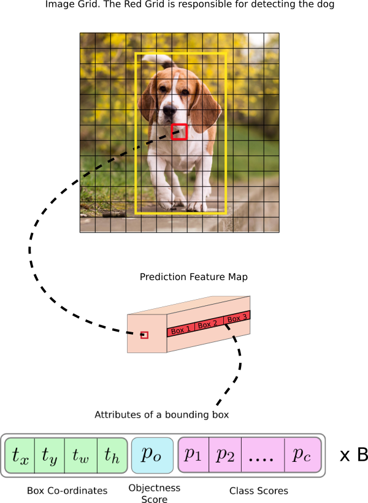
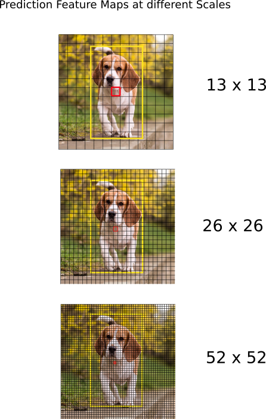
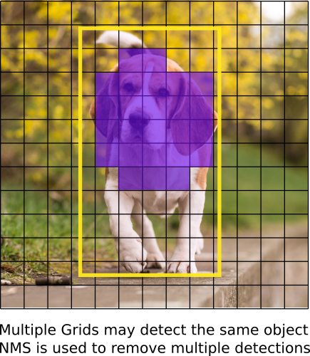
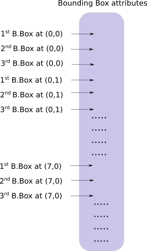

学习物体识别的最优方法是自己从头将其实现。本教程分为5个部分：

1. 理解YOLO工作原理；
2. 创建网络结构层；
3. 实现网络前向传播；
4. 物体性得分阈值与非最大抑制；
5. 设计输入和输出流程。


#### 1.理解YOLO工作原理

YOLO表示“你仅看一次(You Only Look Once)”，一个使用深度CNN学习得特征的目标检测器。

##### 1.1 全卷积网络

YOLO仅使用卷积层，这使它成为一个全卷积网络(FCN)，它：

- 拥有75个卷积层，以及跳跃连接和上采样层。
- 使用了步长为2的卷基层来下采样特征映射，未使用任何形式的池化，避免了常由池化引起的低层特征损失；
- 作为FCN，对输入图像大小是无关的，但实践中依然希望固定一个输入大小，因为一些问题只有在实现算法的时候才会显现，其中很大的一个是需要按批次处理图像。


##### 1.2 解释输出

通常，卷积网络学到的特征被传递到一个分类器/回归器，由它作出检测预测。在YOLO中，使用$1\times1$卷积网络实现预测。这里，注意：

- 输出是一个特征映射，因为使用了$1\times1$卷积，预测映射的大小正好就是它之前特征映射的大小，在YOLO v3中，解释预测映射的方法就是每个神经元预测一个固定数目的边界框；
- 就深度而言，在特征映射中有$(B\times(5+C))$个条目，$B$表示每个神经元能预测的边框的数目，每个边界框会专门检测一类物体；每个边框有$5+C$个特征，描述中心坐标、维度、物体性打分和$C$类信念。在YOLO v3中每个神经元预测3个边框。
- 可以希望特征映射的每个神经元通过它的一个边界框预测一个物体，如果这个物体的中心落入此神经元的感受野（输入图像对神经元可见的区域）。

这与神经网络的训练方式有关，其中仅一个边界框负责检测任意给定物体。

首先需确定这个边界框属于哪个神经元，为此将输入图像分成维度与最终特征映射相同的网格。比如下图，图像大小为$416\times416$，步长为32，则特征映射的维度就是$13\times13$，因此将图像分成$13\times13$个单元：



然后，图像上包含物体实际边框中心的单元被选择来预测这个物体，即上图中标记为红色的单元，闹汗了实际边框（标记为黄色）的中心。红色单元在网格上位于第7行第7列，则分配特征映射的第7行第7列的神经元负责检测这只狗。


##### 1.3 锚框

每个单元能预测3个边框，那其中哪一个分配给狗的实际标记呢？虽然预测边框的宽和高十分有道理，但实际中训练时会导致不稳定的梯度。因此大多数现代物体检测器预测对数空间变形，或到被成为锚框的预训练默认边框的简单偏移。然后，应用这些变形到锚框来获得预测。YOLO v3有3个锚。

回到先前的问题，负责预测狗的边框就是其锚框与实际边框有最大的IoU那一个。


##### 1.4 做出预测

下面的公式描述了将网络输出变形获得边框预测的方法：
$$
\begin{aligned}
b_x &= \sigma(t_x) + c_x\\
b_y &= \sigma(t_y) + c_y\\
b_w &= p_we^{t_w}\\
b_h &= p_he^{t_h}
\end{aligned}
$$

其中$b_x,b_y,b_w,b_h$是预测的$x,y$中心坐标、宽和高，$t_x,t_y,t_w,t_h$是网络的输出，$c_x,c_y$是网格左上角坐标，$p_w,p_h$是边框的锚维度。

**中心坐标**：这里通过sigmoid函数来运行中心坐标预测，这使得输出值在0和1之间。这样做是因为YOLO通常只预测边界框中心的便宜：

- 所预测物体相对于网格左上角；
- 被来自特征映射单元维度正规化；

因此若中心的预测为(0.4, 0.7)，则表示此中心在$13\times13$的特征映射中位于(6.4, 6.7)处（因红色网格的左上角坐标为(6.0, 6.0)）。而当预测结果出现大于1的数时，就违背了YOLO背后的原理，因此结果就通过sigmoid函数修正。

**边框维度**：边框的维度通过应用对数空间转换到输出并乘以锚来预测。


预测结果，$b_w$和$b_h$，由图像的宽和高来正规化。因此若包含狗的边框预测$b_w$和$b_h$是(0.3, 0.8)，则在$13\times13$的特征映射上的实际宽和高是$(13\times0.3, 13\times0.8)$。

**物体性得分**：物体得分表示边框内包含一个物体的概率，也通过一个sigmoid函数。

**类别信念**：类别信念表示检测到物体是某一特定类的概率，之前使用的是softmax，但现在选择了sigmoid。因softmax假设了类别是互斥的。


##### 1.5 不同尺度的预测

YOLO v3做3个不同尺度的预测，检测层在3个不同大小的特征映射上做检测，步长分别是32，16，8。这表示若输入是$416\times416$，分别在$13\times13$、$26\times26$、$52\times52$尺度上检测。

- 网络下采样输入图像直到第一个检测层，在这里使用步长32的一层的特征映射做一次检测；
- 进一步将层以因子2上采样并与前面特征映射大小相同层的特征映射拼接，现以步长16又执行一次检测；
- 重复同样的上采样过程，最终的检测在步长为8的层上执行。

在每个尺度上，每个单元使用3个锚预测3个边框，使得使用锚的总数为9（不同尺度上的锚不同）。



作者表示这样能使YOLO v3更好地检测小物体，上采样能使网络学习细粒度的特征，这对检测小物体很有意义。


##### 1.6 输出处理

对一个$416\times416$的图像，YOLO预测$((52\times52)+(26\times26)+(13\times13))\times3=10647$个结果。

**由物体得分过滤**：首先基于物体性得分过滤边框，得分小于一个阈值的边框会被忽略。

**非最大抑制(NMS)**：NMS致力于解决相同图像的多个检测，比如红网格单元的所有3个边框可能检测一个框，或者临接的单元可能检测同样的物体：




##### 1.7 实现

YOLO仅能检测出现在训练网络数据库内类别的物体，这里会使用官方的权值，它们在COCO数据集上训练，能检测80类的物体。


#### 2.创建网络结构层

##### 2.1 开始

```bash
mkdir YOLOv3 && cd YOLOv3
touch darknet.py	# Darknet is the name of the underlying architecture of YOLO
touch utils.py		# Contain the code for various helper functions
```


##### 2.2 配置文件

官方代码使用了配置文件来构建网络，`cfg`文件逐层地描述网络布局，类似于`.protxt`在caffe的作用。

```bash
mkdir cfg && cd cfg
wget https://raw.githubusercontent.com/pjreddie/darknet/master/cfg/yolov3.cfg
```

在YOLO中使用了5种类型的网络：

**卷积(convolutional)**：

```properties
[convolutional]
batch_normalize=1  
filters=64  
size=3  
stride=1  
pad=1  
activation=leaky
```

**短路(shortcut)**：

```properties
[shortcut]
from=-3  
activation=linear  
```

`shortcut`层是一个跳跃连接，类似于在ResNet中所使用的。`from`参数为3，表示短路层的输出通过加上前一层和从短路层向后第三层的特征映射获得。

**上采样(upsampling)**：

```properties
[upsample]
stride=2
```

以因子`stride`使用双线性上采样来上采样前一层的特征映射。

**路由(Route)**：

```properties
[route]
layers = -4

[route]
layers = -1, 61
```

路径层有一个名为`layers`的特征，可以有一个或两个值：

- 当它仅有一个值时，输出值索引的层的特征映射，这里值为-4，因此这层会输出反向第4层的特征映射；
- 当它有两个值时，返回值索引层的特征映射的拼接，这里值为-1和61，因此会输出前一层和第61层的特征映射，沿深度维拼接。

**YOLO**：

```properties
[yolo]
mask = 0,1,2
anchors = 10,13,  16,30,  33,23,  30,61,  62,45,  59,119,  116,90,  156,198,  373,326
classes=80
num=9
jitter=.3
ignore_thresh = .5
truth_thresh = 1
random=1
```

YOLO层对应于前面描述的检测层。`anchors`特征描述了9个锚，但仅被`mask`索引的才会被使用。

**Net**：

```properties
[net]
# Testing
batch=1
subdivisions=1
# Training
# batch=64
# subdivisions=16
width= 320
height = 320
channels=3
momentum=0.9
decay=0.0005
angle=0
saturation = 1.5
exposure = 1.5
hue=.1
```

cfg还有一种`net`组件，但它不是一个层，因为它只描述了网络的输入和参数信息。


##### 2.3 解析配置文件

在`darknet.py`中添加：

```python
from __future__ import division

import torch 
import torch.nn as nn
import torch.nn.functional as F 
from torch.autograd import Variable
import numpy as np
```

定义`parse_cfg`函数，思想是将每一层存为一个字典，组件的特征和它们的值存储为键-值对。

```python
def parse_cfg(cfgfile):
    """
    Takes a configuration file
    Returns a list of blocks. Each blocks describes a block in the neural
    network to be built. Block is represented as a dictionary in the list
    """
    
    file = open(cfgfile, 'r')
	lines = file.read().split('\n')                    # store the lines in a list
	lines = [x for x in lines if len(x) > 0]           # get rid of the empty lines 
	lines = [x for x in lines if x[0] != '#']          # get rid of comments
	lines = [x.rstrip().lstrip() for x in lines]       # get rid of fringe whitespaces
    
    block = {}
	blocks = []

	for line in lines:
    	if line[0] == "[":           # This marks the start of a new block
        	if len(block) != 0:      # Implies it is storing values of previous block.
            	blocks.append(block) # add it the blocks list
            	block = {}           # re-init the block
        	block["type"] = line[1:-1].rstrip()     
    	else:
        	key,value = line.split("=") 
        	block[key.rstrip()] = value.lstrip()
	blocks.append(block)

	return blocks
```


##### 2.4 创建构件

现在使用`parse_cfg`返回的列表构建PyTorch模块。这里有5种层，PyTorch提供了`convolutional`和`upsample`层，还需扩展`nn.Module`类来构建其余的层：

```python
def create_modules(blocks):
    # Captures the information about the input and pre-processing    
    net_info = blocks[0]
    module_list = nn.ModuleList()
    prev_filters = 3
    output_filters = []
    
    # iterate over the list of blocks, and create a module for each block 
    for index, x in enumerate(blocks[1:]):
        module = nn.Sequential()
        #check the type of block
        #create a new module for the block
        #append to module_list
        
        # If it's a convolutional layer
        if (x["type"] == "convolutional"):
            #Get the info about the layer
            activation = x["activation"]
            try:
                batch_normalize = int(x["batch_normalize"])
                bias = False
            except:
                batch_normalize = 0
                bias = True

            filters= int(x["filters"])
            padding = int(x["pad"])
            kernel_size = int(x["size"])
            stride = int(x["stride"])

            if padding:
                pad = (kernel_size - 1) // 2
            else:
                pad = 0

            #Add the convolutional layer
            conv = nn.Conv2d(prev_filters, filters, kernel_size,
                             stride, pad, bias = bias)
            module.add_module("conv_{0}".format(index), conv)

            #Add the Batch Norm Layer
            if batch_normalize:
                bn = nn.BatchNorm2d(filters)
                module.add_module("batch_norm_{0}".format(index), bn)

            #Check the activation, It is either Linear or Leaky ReLU
            if activation == "leaky":
                activn = nn.LeakyReLU(0.1, inplace = True)
                module.add_module("leaky_{0}".format(index), activn)

        #If it's an upsampling layer, use Bilinear2dUpsampling
        elif (x["type"] == "upsample"):
            stride = int(x["stride"])
            upsample = nn.Upsample(scale_factor = 2, mode = "bilinear")
            module.add_module("upsample_{}".format(index), upsample)

        #If it is a route layer
        elif (x["type"] == "route"):
            x["layers"] = x["layers"].split(',')
            #Start  of a route
            start = int(x["layers"][0])
            #end, if there exists one.
            try:
                end = int(x["layers"][1])
            except:
                end = 0
            #Positive anotation
            if start > 0: 
                start = start - index
            if end > 0:
                end = end - index
            route = EmptyLayer()
            module.add_module("route_{0}".format(index), route)
            if end < 0:
                filters = output_filters[index + start] + output_filters[index + end]
            else:
                filters= output_filters[index + start]

        #shortcut corresponds to skip connection
        elif x["type"] == "shortcut":
            shortcut = EmptyLayer()
            module.add_module("shortcut_{}".format(index), shortcut)

        #Yolo is the detection layer
        elif x["type"] == "yolo":
            mask = x["mask"].split(",")
            mask = [int(x) for x in mask]

            anchors = x["anchors"].split(",")
            anchors = [int(a) for a in anchors]
            anchors = [(anchors[i], anchors[i+1]) for i in range(0, len(anchors),2)]
            anchors = [anchors[i] for i in mask]

            detection = DetectionLayer(anchors)
            module.add_module("Detection_{}".format(index), detection)

        module_list.append(module)
        prev_filters = filters
        output_filters.append(filters)

return (net_info, module_list)
```

一些解释：

- **nn.ModuleList**：函数返回一个`nn.ModuleList`，这个类几乎就是一个包含`nn.Module`对象的列表；不过在添加一个`nn.Module`为`nn.ModuleList`（即添加模块到网络）时，`nn.ModuleList`内所有`nn.Module`对象（模块）的`parameter`也添加为`nn.Module`对象的`parameter`。

- 当定义卷积网络时，必须定义它的核的维度，核的宽度和高度由cfg文件定义，核的深度就是前一层滤波器的数目（或特征映射的深度）。这表示需要追踪即将应用的卷积层的核心数目，这就是变量`prev_filter`的作用，它的初始值为3，对应RGB三个通道。

- 路由层会从前面层带来（或许是拼接的）特征映射，若有一个卷积层刚好在路由层后面，则前面层应用的核心，正好是路由层带来的，因此不只需要追踪前面曾的核心数，还需要先前层的没一个。因此在迭代时，追加每一个组件的输出核数目到列表`output_filters`。

- `nn.Sequential`类用于顺序执行一些`nn.Module`对象，若查看cfg文件就会明白一个组建可能会包含多个层。比如一个`convolutional`类构件除了卷及层外，还有`batchnorm`层和`leaky ReLU`激活层，使用`nn.Sequential`和它的`add_module`函数来将这些层连接起来。

- 在实现`route`层时，先提取出`layer`特征的信息并转换为整数存储在列表中。然后创建一个新层命名为`EmptyLayer`，就如其名所示仅是一个空层，其定义为：

  ```python
  class EmptyLayer(nn.Module):
      def __init__(self):
          super(EmptyLayer, self).__init__()
  ```

  其作用是放置一个简单的层代替路由层，然后在表示darknet的`nn.Module`对象的`forward`函数中直接执行拼接，路由层前方的一个卷积层应用其核心到（可能拼接的）前面层的特征映射。后面的代码更新`filters`变量来保存路由层输出的核心数：

  ```python
  if end < 0:
      #If we are concatenating maps
      filters = output_filters[index + start] + output_filters[index + end]
  else:
      filters= output_filters[index + start]
  ```

- `shortcut`层也用到了上面的空层，也执行一个非常简单的操作。

- `YoLo`层定义一个新的`DetectionLayer`层保存用于检测边框的锚。检测层定义为：

  ```python
  class DetectionLayer(nn.Module):
      def __init__(self, anchors):
          super(DetectionLayer, self).__init__()
          self.anchors = anchors
  ```


##### 2.5测试代码

可与在`darknet.py`的最后添加下面的行并运行文件：

```python
blocks = parse_cfg("cfg/yolov3.cfg")
print(create_modules(blocks))
```


#### 3. 实现网络前向传递

##### 3.1定义网络

在PyTorch中使用`nn.Module`类来构建定制架构，在`darknet.py`中添加下面的类：

```python
class Darknet(nn.Module):
    def __init__(self, cfgfile):
        super(Darknet, self).__init__()
        self.blocks = parse_cfg(cfgfile)
        self.net_info, self.module_list = create_modules(self.blocks)
    
    def forward(self, x, CUDA):
    	modules = self.blocks[1:]
    	outputs = {}   #We cache the outputs for the route layer
        write = 0     #This is explained a bit later
		for i, module in enumerate(modules):        
    		module_type = (module["type"])
            if module_type == "convolutional" or module_type == "upsample":
            	x = self.module_list[i](x)
            elif module_type == "route":
                layers = module["layers"]
                layers = [int(a) for a in layers]

                if (layers[0]) > 0:
                    layers[0] = layers[0] - i

                if len(layers) == 1:
                    x = outputs[i + (layers[0])]

                else:
                    if (layers[1]) > 0:
                        layers[1] = layers[1] - i
                    map1 = outputs[i + layers[0]]
                    map2 = outputs[i + layers[1]]
                    x = torch.cat((map1, map2), 1)

            elif  module_type == "shortcut":
                from_ = int(module["from"])
                x = outputs[i-1] + outputs[i+from_]
```


##### 3.2实现网络的前向传递

网络的前向传递通过覆盖`nn.Module`类的`forward`函数实现。`forward`起两个作用：

- 首先计算输出；
- 其次，将输出检测特征映射转换为能够更容易处理的形式（比如转换它们这样不同尺度的检测映射能够更好地拼接）。

```python
    def forward(self, x, CUDA):
    	modules = self.blocks[1:]
    	outputs = {}   #We cache the outputs for the route layer
```

因`route`和`shortcut`层需要前面层的输出映射，因此在`outputs`中缓存没一层的特征映射输出，键是层的索引，值是特征映射。现在`module_list`迭代，

```python
        write = 0     #This is explained a bit later
		for i, module in enumerate(modules):        
    		module_type = (module["type"])
```

**卷积层和上采样层**：

```python
            if module_type == "convolutional" or module_type == "upsample":
            	x = self.module_list[i](x)
```

**路由层和短路层**：路由层中必须考虑来那个中情况。对需要拼接的情况使用了`torch.cat`函数，第二个参数1表示沿深度拼接特征映射。

```python
            elif module_type == "route":
                layers = module["layers"]
                layers = [int(a) for a in layers]

                if (layers[0]) > 0:
                    layers[0] = layers[0] - i

                if len(layers) == 1:
                    x = outputs[i + (layers[0])]

                else:
                    if (layers[1]) > 0:
                        layers[1] = layers[1] - i
                    map1 = outputs[i + layers[0]]
                    map2 = outputs[i + layers[1]]
                    x = torch.cat((map1, map2), 1)

            elif  module_type == "shortcut":
                from_ = int(module["from"])
                x = outputs[i-1] + outputs[i+from_]
```

**YOLO（检测层）**：YOLO的输出是卷积特征映射，包含了有特征映射深度的边框特性，单元预测的边框特性逐个堆叠在一起，这种形式不易于输出处理。


##### 3.3 变换输出

为解决上述问题，引入函数`predict_transform`，它`predict_transform`位于`util.py`中。加入下面代码：

```python
from __future__ import division

import torch 
import torch.nn as nn
import torch.nn.functional as F 
from torch.autograd import Variable
import numpy as np
import cv2 
```

其定义为：

```python
def predict_transform(prediction, inp_dim, anchors, num_classes, CUDA = True):
    batch_size = prediction.size(0)
    stride =  inp_dim // prediction.size(2)
    grid_size = inp_dim // stride
    bbox_attrs = 5 + num_classes
    num_anchors = len(anchors)
    prediction = prediction.view(batch_size, bbox_attrs*num_anchors,
                                 grid_size*grid_size)
    prediction = prediction.transpose(1,2).contiguous()
    prediction = prediction.view(batch_size, grid_size*grid_size*num_anchors,
                                 bbox_attrs)
```

`predict_transform`输入特征映射，将其转换为一个2-D张量，其中每一行对应对应一个边框的特性：



锚的维度对应于`net`块的`height`和`width`特性。