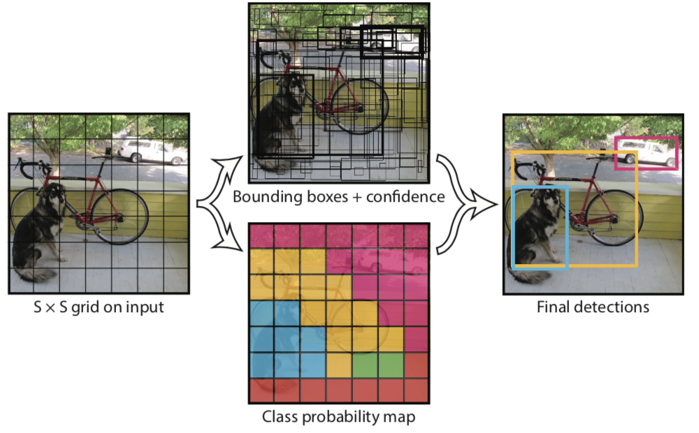
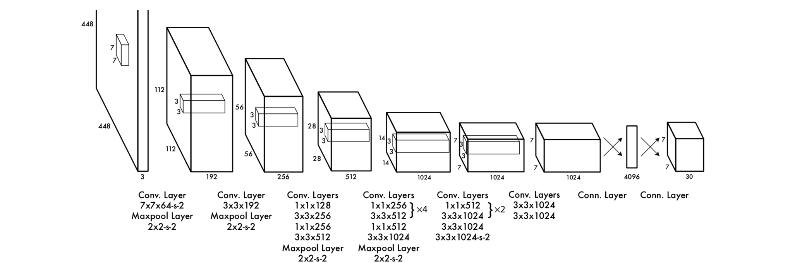

最近一直在左目标检测相关的研究。YOLO是You Only Look Once的缩写，是一种单阶段的目标检测方法，目前已经发展到第三个版本。本文旨在按照自己的理解讲述YOLO系列的原理及其实现。

#### YOLOv1

YOLO将目标检测构造为一个回归问题，使用单一的神经网络直接从像素中获得边界框坐标和类别概率。它的特点有：首先是运行速度快，基础模型的速度是45fps，使用小网络则能达到155fps；其次预测时对图像进行全局推理，隐式地对类别及其外观的上下文信息进行了编码；然后是YOLO学习物体的可推广特征，在艺术品上测试的成绩远超其他检测器。但也有着对一些物体、尤其是小物体定位不准的缺点。

YOLO将输入图像划分为$S\times S$的网格，如果某个物体的中心落入一个网格单元中，则此网格就负责对这个物体的检测。如下图所示：

每个网格单元会预测$B$个边界框及其信心分，这些信心分反映了模型认为这个边界框包含物体的信心程度，也认为是这个预测的精确程度；形式上这个信心定义为$\text{Pr(Object)}*\text{IOU}_{\text{pred}}^{\text{truth}}$；如果网格单元中不存在物体，则信心分应该是0，否则等于预测边框和实际边框的交集除以并集(IOU)。每个边框由5个预测组成：$x,y,w,h$和信心分。坐标$(x,y)$表示边框中心相对于网格单元边界的距离；宽度$w$和高度$h$则是相对于整个图像的；而信心分则表示预测边框和实际边框的IOU。

每个网格单元也会预测$C$个条件类别概率$\text{Pr(Class}_i|\text{Object)}$，这个概率是以网格单元包含目标为条件的，这里不考虑边框数量，只预测一个类别概率集。在测试时将条件类别概率和单个边界框信心预测相乘，得到每个边框关于特定类别的信心分，这些信心分即编码了此类别在这个边框中出现的概率，也表示了预测的边框与此目标的契合程度：
$$
\text{Pr(Class}_i|\text{Object)} * \text{Pr(Object)}*\text{IOU}_{\text{pred}}^{\text{truth}} = \text{Pr(Class}_i\text{)}*\text{IOU}_{\text{pred}}^{\text{truth}}
$$
模型实现为一个卷积网络，并在PASCAL VOC数据集上评估。在VOC评估时，使用了$S=7, B=2$，VOC有20个类别，因此$C=20$，最终的预测是$7\times7\times30$的张量。

网络结构受GoogLeNet启发，有24个卷积层后跟2个全连接层。初始卷积层从图像中提取特征，而全连接层输出预测的概率和坐标。类似于Network in Network，模型使用了$1\times1$的约减层后跟$3\times3$的卷积层，整个结构如下图所示：

