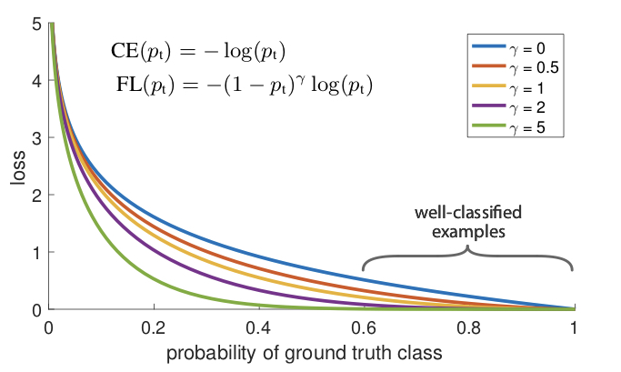

受到前面元学习思想的启发，我们决定将其应用在目标检测中，开发出一个仅使用少量样本应用训练就能实现目标检测的检测器。其具体的原理如下。

##### 损失函数设计

Focal损失是设计来解决单阶段物体检测场景中极端的前景和背景类别不均衡的问题。先看二分类的交叉熵损失：
$$
\text{CE}(p,y) = \begin{cases}
-\log(p) & \text{if }y=1\\
-\log(1-p) & \text{otherwise}
\end{cases}
$$
上面的$y \in \{\pm1\}$指定真实类别，$p\in[0,1]$是模型对类别$y=1$的估计概率。为方便标记，定义$p_t$：
$$
p_t = \begin{cases}
p & \text{if }y=1\\
1-p & \text{otherwise}
\end{cases}
$$
这样$\text{CE}(p,y)=\text{CE}(p_t)=-\log(p_t)$。CE损失可以看成是下图顶端的蓝色曲线，它的一个重要特性是：即便是很容易区分的的样本($p_t \gg .5$)也会产生不小的损失。在大量简单样本相加后，这些小损失的值也会压倒稀有类别。

处理这种类别不均衡的常用方法是引入类别$1$的加权因子$\alpha \in [0,1]$和类别$-1$的$1-\alpha$。实际中$\alpha$会设为类别频率的倒数，或用交叉验证设置为超参数。为方便标记，我们像$p_t$一样定义$\alpha_t$，并将$\alpha$平衡的CE损失记为：
$$
\text{CE}(p_t) = -\alpha_t\log(p_t)
$$
这个损失是CE的一个简单扩展，我们将其设为将要提出的Focal损失的实验基准。

就如实验所示，密集检测器训练时遇到的大量类别不平衡问题压倒了交叉熵损失，易分类负样本组成了损失的大部分，统治了梯度。尽管$\alpha$平衡了正负样本的重要性，单并为区分简单/困难样本。因此我们提出重塑损失函数来降权简单样本从而聚焦在难样本上的训练。为此提出通过可调节的焦点参数$\gamma\ge0$增加一个调节因子$(1-p_t)^\gamma$到交叉熵损失。因此focal损失定义为：
$$
\text{FL}(p_t) = -(1-p_t)^\gamma\log(p_t)
$$
上图展示了几个$\gamma\in[0,5]$值的Focal损失，我们注意到focal损失的两个特性：一是在一个样本被误分且$p_t$比较小时，调节因子接近于1且损失不受影响，当$p_t \to 1$时因子趋于0，易分类样本的损失就被降权了；二是焦点参数$\gamma$在简单样本被降权后平滑地调整了比率。当$\gamma=0$时FL等价于CE，当$\gamma$增加时调节因子的影响也同样增加，在试验中发现$\gamma=2$时效果最好。

