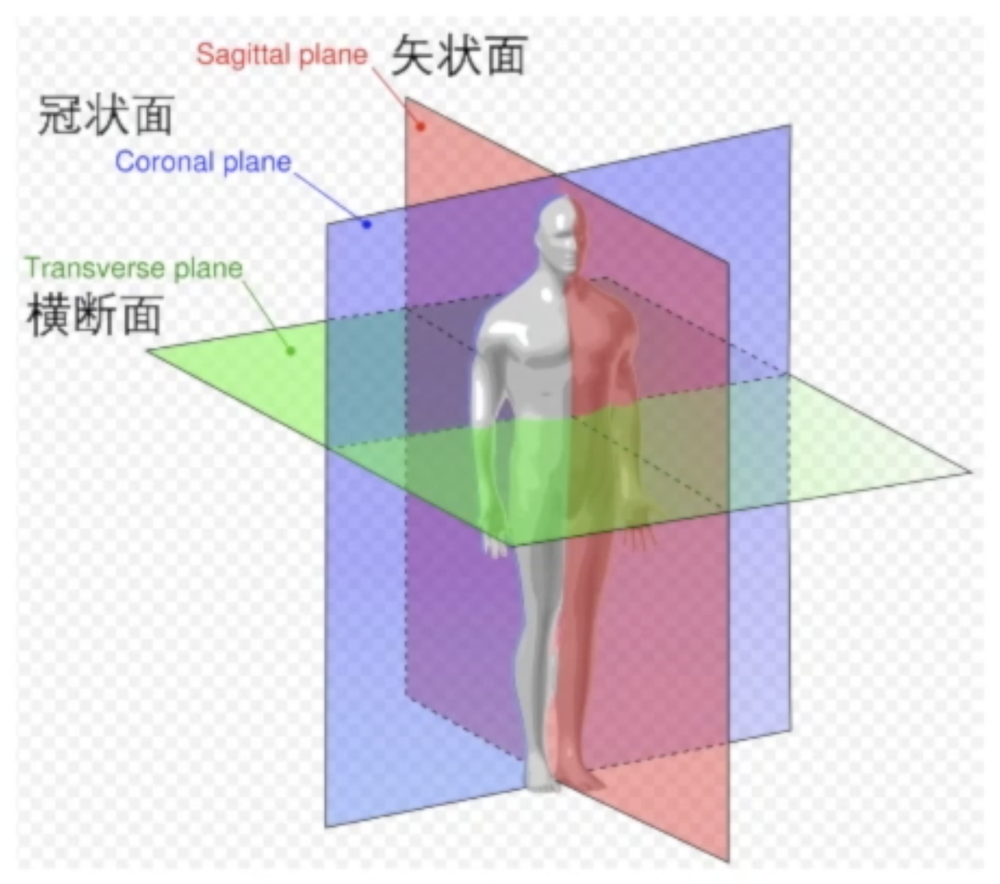
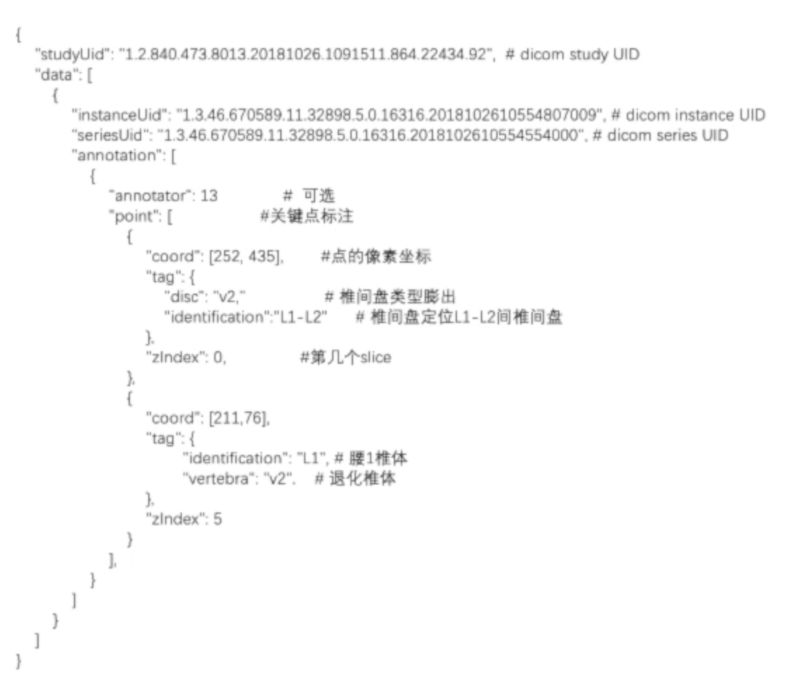
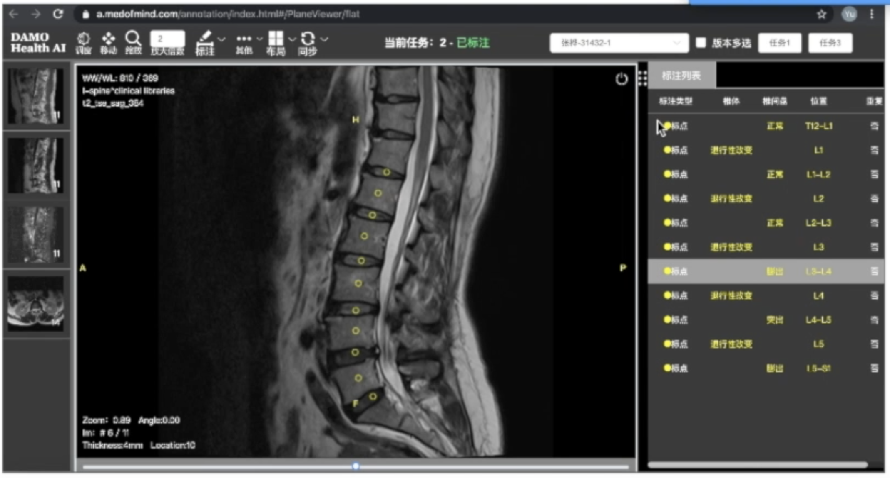

##### 截断面

下图展示了核磁、CT等图像的几种截断面，矢状面（Sagittal Plane）将人分成左右两部分，冠状面（Coronal Plane）将人分成前后两部分，横断面（Transverse Plane）将人分成上下两部分。

##### dicom标准重要字段

下表展示了dicom字段中的一些重要字段：

| 位置         | 名称                        | 含义                                                         |
| ------------ | --------------------------- | ------------------------------------------------------------ |
| (0018, 0050) | Slice Thickness             | 成像的层间距                                                 |
| (0020, 0052) | Frame of Reference UID      |                                                              |
| (0020, 0037) | Image Orientation (Patient) | 病人坐标系下设备采集的朝向                                   |
| (0020, 0032) | Image Position (Patient)    | 病人坐标系下设备采集的位置                                   |
| (0020, 000d) | Study Instances UID         | 病人的一次检查为一个Study                                    |
| (0020, 000e) | Series Instances UID        | 一个Study可能会扫描多个序列，不同的截面叫一个序列            |
| (0008, 0018) | SOP Instances UID           | 一个序列会有不同的帧，每一帧的UID                            |
| (0028, 0030) | Pixel Spacing               | 二维截面的物理分辨率，表明每个pixel所占的体积，入0.6mm，0.9mm等 |
| (0020, 0011) | Series Number               | 当前序列号                                                   |

##### 标注数据

标注数据如下：

需要注意的点有：

- 可以通过`studyUid`、`instanceUid`和`seriesUid`定位到图像；
- 主要使用的信息是`point`，有三个字段：
  - `coord`：x-y坐标，表示图像坐标下的x和y，即相对当前图像左上角的偏移量；
  - `tag`：这个点代表的位置；
  - `zIndex`：表示标在当前序列的第几帧上，与instanceUid一一对应。

##### 标注样本

下图展示了一个标注样本

可见这个study有四个序列，有三个矢状位和一个轴位。