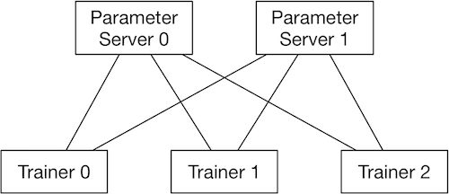
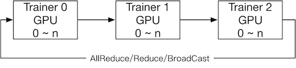

#### 配置简单网络

在解决实际问题时，可以先从逻辑层面对问题进行建模，明确模型所需要的 **输入数据类型**、**计算逻辑**、**求解目标** 以及 **优化算法**。PaddlePaddle提供了丰富的算子来实现模型逻辑。下面以一个简单回归任务举例说明如何使用PaddlePaddle构建模型。


##### 问题描述及定义

给定一组数据 $<X,Y>$，求解出函数 $f$，使得 $y=f(x)$，其中 $x⊂X$ 表示一条样本的特征，为 13 维的实数向量；$y⊂Y$ 为一实数表示该样本对应的值。可以尝试用回归模型来对问题建模，回归问题的损失函数有很多，这里选择常用的均方误差。为简化问题，这里假定 $f$ 为简单的线性变换函数，同时选用随机梯度下降算法来求解模型：

| 输入数据类型        | 样本特征: 13 维 实数                         |
| ------------------- | -------------------------------------------- |
| 样本标签: 1 维 实数 |                                              |
| 计算逻辑            | 使用线性模型，产生 1维实数作为模型的预测输出 |
| 求解目标            | 最小化模型预测输出与样本标签间的均方误差     |
| 优化算法            | 随机梯度下降                                 |


##### 使用PaddlePaddle建模

从逻辑层面明确了输入数据格式、模型结构、损失函数以及优化算法后，需要使用PaddlePaddle提供的API及算子来实现模型逻辑。一个典型的模型主要包含4个部分，分别是：输入数据格式定义，模型前向计算逻辑，损失函数以及优化算法。

**数据层**：PaddlePaddle提供了 `fluid.layers.data()` 算子来描述输入数据的格式，它的输出是一个Variable，这个Variable的实际类型是Tensor。Tensor具有强大的表征能力，可以表示多维数据。为了精确描述数据结构，通常需要指定数据shape以及数值类型type。其中shape为一个整数向量，type可以是一个字符串类型。目前支持的数据类型参考 [Fluid目前支持的数据类型](https://www.paddlepaddle.org.cn/documentation/docs/zh/1.5/user_guides/howto/prepare_data/feeding_data.html#user-guide-paddle-support-data-types) 。 模型训练一般会使用batch的方式读取数据，而batch的size在训练过程中可能不固定。data算子会依据实际数据来推断batch的size，所以这里提供shape时不用关心batch的size，只需关心一条样本的shape即可，更高级用法请参考 [自定义BatchSize维度](https://www.paddlepaddle.org.cn/documentation/docs/zh/1.5/user_guides/howto/prepare_data/feeding_data.html#user-guide-customize-batch-size-rank)。从上知，$x$ 为 13 维的实数向量，y 为实数，可使用下面代码定义数据层：

```python
x = fluid.layers.data(name='x', shape=[13], dtype='float32')
y = fluid.layers.data(name='y', shape=[1], dtype='float32')
```

该模型使用的数据比较简单，事实上data算子还可以描述变长的、嵌套的序列数据。也可以使用 `open_files` 打开文件进行训练。更详细的文档可参照 [准备数据](https://www.paddlepaddle.org.cn/documentation/docs/zh/1.5/user_guides/howto/prepare_data/index_cn.html#user-guide-prepare-data)。

**前向计算逻辑**：实现一个模型最重要的部分是实现计算逻辑，PaddlePaddle提供了丰富的算子。这些算子的封装粒度不同，通常对应一种或一组变换逻辑。算子输出即为对输入数据执行变换后的结果。用户可以灵活使用算子来完成复杂的模型逻辑。比如图像相关任务中会使用较多的卷积算子、序列任务中会使用LSTM/GRU等算子。复杂模型通常会组合多种算子，以完成复杂的变换。PaddlePaddle提供了非常自然的方式来组合算子，一般地可以使用下面的方式：

```python
op_1_out = fluid.layers.op_1(input=op_1_in, ...)
op_2_out = fluid.layers.op_2(input=op_1_out, ...)
...
```

其中op_1和op_2表示算子类型，可以是fc来执行线性变换(全连接)，也可以是conv来执行卷积变换等。通过算子的输入输出的连接来定义算子的计算顺序以及数据流方向。上面的例子中，op_1的输出是op_2的输入，那么在执行计算时，会先计算op_1，然后计算op_2。更复杂的模型可能需要使用控制流算子，依据输入数据来动态执行，针对这种情况，PaddlePaddle提供了IfElseOp和WhileOp等。算子的文档可参考 `fluid.layers`。具体到这个任务, 我们使用一个fc算子：

```python
y_predict = fluid.layers.fc(input=x, size=1, act=None)
```

**损失函数**：损失函数对应求解目标，我们可以通过最小化损失来求解模型。大多数模型使用的损失函数，输出是一个实数值。但是PaddlePaddle提供的损失算子一般是针对一条样本计算。当输入一个batch的数据时，损失算子的输出有多个值，每个值对应一条样本的损失，所以通常会在损失算子后面使用mean等算子，来对损失做归约。模型在一次前向迭代后会得到一个损失值，PaddlePaddle会自动执行链式求导法则计算模型里面每个参数和变量对应的梯度值。这里使用均方误差损失：

```python
cost = fluid.layers.square_error_cost(input=y_predict, label=y)
avg_cost = fluid.layers.mean(cost)
```

**优化方法**：确定损失函数后，可以通过前向计算得到损失值，然后通过链式求导法则得到参数的梯度值。获取梯度值后需要更新参数，最简单的算法是随机梯度下降法：$w=w−η⋅g$。但是普通的随机梯度下降算法存在一些问题: 比如收敛不稳定等。为了改善模型的训练速度以及效果，学术界先后提出了很多优化算法，包括： `Momentum`、`RMSProp`、`Adam` 等。这些优化算法采用不同的策略来更新模型参数，一般可以针对具体任务和具体模型来选择优化算法。不管使用何种优化算法，学习率一般是一个需要指定的比较重要的超参数，需要通过实验仔细调整。这里采用随机梯度下降算法：

```
sgd_optimizer = fluid.optimizer.SGD(learning_rate=0.001)
```

更多优化算子可以参考 `fluid.optimizer()` 。


#### 单机训练

##### 准备工作

要进行PaddlePaddle Fluid单机训练，需要先 [准备数据](https://www.paddlepaddle.org.cn/documentation/docs/zh/1.5/user_guides/howto/prepare_data/index_cn.html#user-guide-prepare-data) 和 [配置简单的网络](https://www.paddlepaddle.org.cn/documentation/docs/zh/1.5/user_guides/howto/configure_simple_model/index_cn.html#user-guide-configure-simple-model) 。当[配置简单的网络](https://www.paddlepaddle.org.cn/documentation/docs/zh/1.5/user_guides/howto/configure_simple_model/index_cn.html#user-guide-configure-simple-model) 完毕后，可以得到两个`fluid.Program`， `startup_program` 和 `main_program`。 默认情况下，可以使用 `fluid.default_startup_program()` 与`fluid.default_main_program()` 获得全局的 `fluid.Program`。

例如:

```python
import paddle.fluid as fluid

image = fluid.layers.data(name="image", shape=[784])
label = fluid.layers.data(name="label", shape=[1])
hidden = fluid.layers.fc(input=image, size=100, act='relu')
prediction = fluid.layers.fc(input=hidden, size=10, act='softmax')
loss = fluid.layers.cross_entropy(input=prediction, label=label)
loss = fluid.layers.mean(loss)
sgd = fluid.optimizer.SGD(learning_rate=0.001)
sgd.minimize(loss)

# Here the fluid.default_startup_program() and fluid.default_main_program()
# has been constructed.
```

在上述模型配置执行完毕后， `fluid.default_startup_program()` 与`fluid.default_main_program()` 配置完毕了。


##### 参数初始化

**参数随机初始化**：用户配置完模型后，参数初始化操作会被写入到`fluid.default_startup_program()` 中。使用 `fluid.Executor()` 运行 这一程序，初始化之后的参数默认被放在全局scope中，即 `fluid.global_scope()`。例如:

```python
exe = fluid.Executor(fluid.CUDAPlace(0))
exe.run(program=fluid.default_startup_program())
```

**载入预定义参数**：在神经网络训练过程中，经常会需要载入预定义模型，进而继续进行训练。如何载入预定义参数，请参考 [模型/变量的保存、载入与增量训练](https://www.paddlepaddle.org.cn/documentation/docs/zh/1.5/user_guides/howto/training/save_load_variables.html#user-guide-save-load-vars)。


##### 单卡训练

执行单卡训练可以使用 `fluid.Executor()` 中的 `run()` 方法，运行训练`fluid.Program` 即可。在运行的时候，用户可以通过 `run(feed=...)`参数传入数据；用户可以通过 `run(fetch=...)` 获取持久的数据。例如:

```python
import paddle.fluid as fluid
import numpy

train_program = fluid.Program()
startup_program = fluid.Program()
with fluid.program_guard(train_program, startup_program):
    data = fluid.layers.data(name='X', shape=[1], dtype='float32')
    hidden = fluid.layers.fc(input=data, size=10)
    loss = fluid.layers.mean(hidden)
    sgd = fluid.optimizer.SGD(learning_rate=0.001)
    sgd.minimize(loss)

use_cuda = True
place = fluid.CUDAPlace(0) if use_cuda else fluid.CPUPlace()
exe = fluid.Executor(place)

# Run the startup program once and only once.
# Not need to optimize/compile the startup program.
startup_program.random_seed=1
exe.run(startup_program)

# Run the main program directly without compile.
x = numpy.random.random(size=(10, 1)).astype('float32')
loss_data, = exe.run(train_program,
                     feed={"X": x},
                     fetch_list=[loss.name])

# Or use CompiledProgram:
compiled_prog = compiler.CompiledProgram(train_program)
loss_data, = exe.run(compiled_prog,
             feed={"X": x},
             fetch_list=[loss.name])
```


##### 多卡训练

在多卡训练中，你可以使用 `fluid.compiler.CompiledProgram` 来编译 `fluid.Program` ，然后调用 `with_data_parallel` 。例如：

```python
# NOTE: If you use CPU to run the program, you need
# to specify the CPU_NUM, otherwise, fluid will use
# all the number of the logic cores as the CPU_NUM,
# in that case, the batch size of the input should be
# greater than CPU_NUM, if not, the process will be
# failed by an exception.
if not use_cuda:
    os.environ['CPU_NUM'] = str(2)

compiled_prog = compiler.CompiledProgram(
    train_program).with_data_parallel(
    loss_name=loss.name)
loss_data, = exe.run(compiled_prog,
                     feed={"X": x},
                     fetch_list=[loss.name])
```

注释：

1. [CompiledProgram](https://www.paddlepaddle.org.cn/documentation/docs/zh/1.5/api_cn/fluid_cn.html#cn-api-fluid-compiledprogram) 会将传入的 `fluid.Program` 转为计算图，即Graph，因为 `compiled_prog` 与传入的 `train_program` 是完全不同的对象，目前还不能够对 `compiled_prog` 进行保存。
2. 多卡训练也可以使用 [ParallelExecutor](https://www.paddlepaddle.org.cn/documentation/docs/zh/1.5/api_cn/fluid_cn.html#cn-api-fluid-parallelexecutor) ，但是现在推荐使用 [CompiledProgram](https://www.paddlepaddle.org.cn/documentation/docs/zh/1.5/api_cn/fluid_cn.html#cn-api-fluid-compiledprogram) .
3. 如果 `exe` 是用CUDAPlace来初始化的，模型会在GPU中运行。在显卡训练模式中，所有的显卡都将被占用。用户可以配置 [CUDA_VISIBLE_DEVICES](http://www.acceleware.com/blog/cudavisibledevices-masking-gpus) 以更改被占用的显卡。
4. 如果 `exe` 是用CPUPlace来初始化的，模型会在CPU中运行。在这种情况下，多线程用于运行模型，同时线程的数目和逻辑核的数目相等。用户可以配置 `CPU_NUM` 以更改使用中的线程数目。


#### 训练过程中评测模型

模型的测试评价与训练的 `fluid.Program` 不同。在测试评价中:

1. 测试评价不进行反向传播，不优化更新参数。
2. 测试评价执行的操作可以不同。
   - 例如 BatchNorm 操作，在训练和测试时执行不同的算法。
   - 测试评价模型与训练模型可以是完全不同的模型。


##### 生成测试 `fluid.Program`

**通过克隆训练 `fluid.Program` 生成测试 `fluid.Program`**：用`Program.clone()` 方法可以复制出新的 `fluid.Program`。 通过设置 `Program.clone(for_test=True)` 复制含有用于测试的操作 `fluid.Program` 。简单的使用方法如下:

```python
import paddle.fluid as fluid

img = fluid.layers.data(name="image", shape=[784])
prediction = fluid.layers.fc(
  input=fluid.layers.fc(input=img, size=100, act='relu'),
  size=10,
  act='softmax'
)
label = fluid.layers.data(name="label", shape=[1], dtype="int64")
loss = fluid.layers.mean(fluid.layers.cross_entropy(input=prediction, label=label))
acc = fluid.layers.accuracy(input=prediction, label=label)

test_program = fluid.default_main_program().clone(for_test=True)

adam = fluid.optimizer.Adam(learning_rate=0.001)
adam.minimize(loss)
```

在使用 `Optimizer` 之前，将 `fluid.default_main_program()` 复制成一个 `test_program` 。之后使用测试数据运行 `test_program`,就可以做到运行测试程序，而不影响训练结果。

**分别配置训练 `fluid.Program` 和测试 `fluid.Program`**：如果训练程序和测试程序相差较大时，用户也可以通过完全定义两个不同的 `fluid.Program`，分别进行训练和测试。在PaddlePaddle Fluid中，所有的参数都有名字。如果两个不同的操作，甚至两个不同的网络使用了同样名字的参数，那么他们的值和内存空间都是共享的。PaddlePaddle Fluid中使用 `fluid.unique_name` 包来随机初始化用户未定义的参数名称。通过 `fluid.unique_name.guard` 可以确保多次调用某函数参数初始化的名称一致。例如:

```python
import paddle.fluid as fluid

def network(is_test):
    file_obj = fluid.layers.open_files(filenames=["test.recordio"] if is_test else ["train.recordio"], ...)
    img, label = fluid.layers.read_file(file_obj)
    hidden = fluid.layers.fc(input=img, size=100, act="relu")
    hidden = fluid.layers.batch_norm(input=hidden, is_test=is_test)
    ...
    return loss

with fluid.unique_name.guard():
    train_loss = network(is_test=False)
    sgd = fluid.optimizer.SGD(0.001)
    sgd.minimize(train_loss)

test_program = fluid.Program()
with fluid.unique_name.guard():
    with fluid.program_gurad(test_program, fluid.Program()):
        test_loss = network(is_test=True)

# fluid.default_main_program() is the train program
# fluid.test_program is the test program
```


##### 执行测试 `fluid.Program`

**使用 `Executor` 执行测试 `fluid.Program`**：用户可以使用 `Executor.run(program=...)` 来执行测试 `fluid.Program`。例如

```python
exe = fluid.Executor(fluid.CPUPlace())
test_acc = exe.run(program=test_program, feed=test_data_batch, fetch_list=[acc])
print 'Test accuracy is ', test_acc
```

**使用 `ParallelExecutor` 执行测试 `fluid.Program`**：用户可以使用训练用的 `ParallelExecutor` 与测试 `fluid.Program` 一起，新建一个测试的 `ParallelExecutor` ；再使用测试 `ParallelExecutor.run` 来执行测试。

例如:

```python
train_exec = fluid.ParallelExecutor(use_cuda=True, loss_name=loss.name)
test_exec = fluid.ParallelExecutor(use_cuda=True, share_vars_from=train_exec,
                                   main_program=test_program)
test_acc = test_exec.run(fetch_list=[acc], ...)
```


#### 多机训练

##### 分布式训练快速开始

我们将会在介绍如何快速在一个集群中启动一个 PaddlePaddle 的分布式训练任务，在开始之前，请按如下步骤做些准备工作：

1. 准备一个网络连通的训练集群，在本文中我们使用4个训练节点使用 `*.paddlepaddle.com` 来表示节点的主机名称，您可以根据实际情况修改它。
2. 在开始之前确保已经阅读过 install_steps 并且可以在集群的所有节点上可以正常运行 PaddlePaddle。

**样例代码**：下面使用一个非常简单的线性回归模型作为样例来解释如何启动一个包含2个 `PSERVER` 节点以及 2个 `TRAINER` 节点的分布式训练任务，您可以将本段代码保存为 `dist_train.py` 运行：

```python
import os
import paddle
import paddle.fluid as fluid

# train reader
BATCH_SIZE = 20
EPOCH_NUM = 30
BATCH_SIZE = 8

train_reader = paddle.batch(
    paddle.reader.shuffle(
        paddle.dataset.uci_housing.train(), buf_size=500),
    batch_size=BATCH_SIZE)

def train():
    y = fluid.layers.data(name='y', shape=[1], dtype='float32')
    x = fluid.layers.data(name='x', shape=[13], dtype='float32')
    y_predict = fluid.layers.fc(input=x, size=1, act=None)

    loss = fluid.layers.square_error_cost(input=y_predict, label=y)
    avg_loss = fluid.layers.mean(loss)
    opt = fluid.optimizer.SGD(learning_rate=0.001)
    opt.minimize(avg_loss)

    place = fluid.CPUPlace()
    feeder = fluid.DataFeeder(place=place, feed_list=[x, y])
    exe = fluid.Executor(place)

    # fetch distributed training environment setting
    training_role = os.getenv("PADDLE_TRAINING_ROLE", None)
    port = os.getenv("PADDLE_PSERVER_PORT", "6174")
    pserver_ips = os.getenv("PADDLE_PSERVER_IPS", "")
    trainer_id = int(os.getenv("PADDLE_TRAINER_ID", "0"))
    eplist = []
    for ip in pserver_ips.split(","):
        eplist.append(':'.join([ip, port]))
    pserver_endpoints = ",".join(eplist)
    trainers = int(os.getenv("PADDLE_TRAINERS"))
    current_endpoint = os.getenv("PADDLE_CURRENT_IP", "") + ":" + port

    t = fluid.DistributeTranspiler()
    t.transpile(
        trainer_id = trainer_id,
        pservers = pserver_endpoints,
        trainers = trainers)

    if training_role == "PSERVER":
        pserver_prog = t.get_pserver_program(current_endpoint)
        startup_prog = t.get_startup_program(current_endpoint, pserver_prog)
        exe.run(startup_prog)
        exe.run(pserver_prog)
    elif training_role == "TRAINER":
        trainer_prog = t.get_trainer_program()
        exe.run(fluid.default_startup_program())

        for epoch in range(EPOCH_NUM):
            for batch_id, batch_data in enumerate(train_reader()):
                avg_loss_value, = exe.run(trainer_prog,
                                      feed=feeder.feed(batch_data),
                                      fetch_list=[avg_loss])
                if (batch_id + 1) % 10 == 0:
                    print("Epoch: {0}, Batch: {1}, loss: {2}".format(
                        epoch, batch_id, avg_loss_value[0]))
        # destory the resource of current trainer node in pserver server node
        exe.close()
    else:
        raise AssertionError("PADDLE_TRAINING_ROLE should be one of [TRAINER, PSERVER]")

train()
```


##### 环境变量说明

在启动分布式训练任务时，使用不同的环境变量来表示不同的节点角色，具体如下：

| 环境变量               | 数据类型 | 样例                                              | 描述                                                         |
| ---------------------- | -------- | ------------------------------------------------- | ------------------------------------------------------------ |
| `PADDLE_TRAINING_ROLE` | str      | `PSERVER,TRAINER`                                 | 当前训练节点角色                                             |
| `PADDLE_PSERVER_IPS`   | str      | `ps0.paddlepaddle.com`,<br>`ps1.paddlepaddle.com` | 分布式训练任务中所有 PSERVER 节点的 IP 地址或 hostname, 使用”,”分隔 |
| `PADDLE_PSERVER_PORT`  | int      | 6174                                              | PSERVER 进程监听的端口                                       |
| `PADDLE_TRAINERS`      | int      | 2                                                 | 分布式训练任务中 trainer 节点的数量                          |
| `PADDLE_CURRENT_IP`    | str      | `ps0.paddlepaddle.com`                            | 当前 PSERVER 节点的 IP 地址或 hostname                       |
| `PADDLE_TRAINER_ID`    | str      | 0                                                 | 当前 TRAINER 节点的 ID (唯一)， 取值范围为 [0, PADDLE_TRAINERS) |

注： 环境变量只是获取运行时信息的一种方式，实际任务中可以采用命令行参数等方式获取运行时信息。


##### 分布式训练相关 API：

**`DistributeTranspiler`**：基于 pserver-trainer 架构的的分布式训练任务分为两种角色： Parameter Server(PSERVER) 以及 TRAINER, 在 Fluid 中，用户只需配置单机训练所需要的网络配置, `DistributeTranspiler` 模块会自动地根据 当前训练节点的角色将用户配置的单机网路配置改写成 PSERVER 和 TRAINER 需要运行的网络配置:

```python
t = fluid.DistributeTranspiler()
t.transpile(
    trainer_id = trainer_id,
    pservers = pserver_endpoints,
    trainers = trainers)
if PADDLE_TRAINING_ROLE == "TRAINER":
    # fetch the trainer program and execute it
    trainer_prog = t.get_trainer_program()
    ...

elif PADDLE_TRAINER_ROLE == "PSERVER":
    # fetch the pserver program and execute it
    pserver_prog = t.get_pserver_program(current_endpoint)
    ...
```

**`exe.close()`**：PSERVER 节点中会保存所有 TRAINER 节点的状态信息，在 TRAINER 结束训练时需要调用 `exe.close()` 通知所有 PSERVER 节点释放当前 TRAINER 节点的资源:

```
exe = fluid.Executor(fluid.CPUPlace())
# training process ...
exe.close() # notify PServer to destory the resource
```

注意：所有的trainer在退出时都需要调用exe.close()。


##### 启动分布式训练任务

| 启动节点                    | 启动命令                                                     | 说明                   |
| --------------------------- | ------------------------------------------------------------ | ---------------------- |
| `ps0.paddlepaddle.com`      | `PADDLE_TRAINING_ROLE=PSERVER`,<br>`PADDLE_CURRENT_IP=ps0.paddlepaddle.com`,<br>`PADDLE_PSERVER_IPS=ps0.paddlepaddle.com,`<br>`ps1.paddlepaddle.com`,<br>`PADDLE_TRAINERS=2 PADDLE_PSERVER_PORT=6174 python`,<br>`fluid_dist.py` | 启动 PSERVER 节点      |
| `ps1.paddlepaddle.com`      | `PADDLE_TRAINING_ROLE=PSERVER`,<br>`PADDLE_CURRENT_IP=ps1.paddlepaddle.com`,<br>`PADDLE_PSERVER_IPS=ps0.paddlepaddle.com`,<br>`ps1.paddlepaddle.com`,<br>`PADDLE_TRAINERS=2 PADDLE_PSERVER_PORT=6174 python`,<br>`fluid_dist.py` | 启动 PSERVER 节点      |
| `trainer0.paddlepaddle.com` | `PADDLE_TRAINING_ROLE=TRAINER`,<br>`PADDLE_PSERVER_IPS=ps0.paddlepaddle.com,`<br>`ps1.paddlepaddle.com`,<br>`PADDLE_TRAINERS=2 PADDLE_TRAINER_ID=0`,<br>`PADDLE_PSERVER_PORT=6174 python fluid_dist.py` | 启动第0号 TRAINER 节点 |
| `trainer1.paddlepaddle.com` | `PADDLE_TRAINING_ROLE=TRAINER`,<br>`PADDLE_PSERVER_IPS=ps0.paddlepaddle.com,`<br>`ps1.paddlepaddle.com`,<br>`PADDLE_TRAINERS=2 PADDLE_TRAINER_ID=1`,<br>`PADDLE_PSERVER_PORT=6174 python fluid_dist.py` | 启动第1号 TRAINER 节点 |


#### 分布式训练使用手册

##### 分布式训练基本思想

分布式深度学习训练通常分为两种并行化方法：数据并行，模型并行，参考下图：


在模型并行方式下，模型的层和参数将被分布在多个节点上，模型在一个mini-batch的前向和反向训练中，将经过多次跨节点之间的通信。每个节点只保存整个模型的一部分；在数据并行方式下，每个节点保存有完整的模型的层和参数，每个节点独自完成前向和反向计算，然后完成梯度的聚合并同步的更新所有节点上的参数。Fluid目前版本仅提供数据并行方式，另外诸如模型并行的特例实现（超大稀疏模型训练）功能将在后续的文档中予以说明。在数据并行模式的训练中，Fluid使用了两种通信模式，用于应对不同训练任务对分布式训练的要求，分别为RPC通信和Collective 通信。其中RPC通信方式使用 [gRPC](https://github.com/grpc/grpc/) ，Collective通信方式使用[NCCL2](https://developer.nvidia.com/nccl) 。

**RPC通信和Collective通信的横向对比如下：**

| Feature        | Collective | RPC  |
| -------------- | ---------- | ---- |
| Ring-Based通信 | Yes        | No   |
| 异步训练       | Yes        | Yes  |
| 分布式模型     | No         | Yes  |
| 容错训练       | No         | Yes  |
| 性能           | Faster     | Fast |

- RPC通信方式的结构：

  

  使用RPC通信方式的数据并行分布式训练，会启动多个pserver进程和多个trainer进程，每个pserver进程会保存一部分模型参数，并负责接收从trainer发送的梯度并更新这些模型参数；每个trainer进程会保存一份完整的模型，并使用一部分数据进行训练，然后向pserver发送梯度，最后从pserver拉取更新后的参数。

  pserver进程可以在和trainer完全不同的计算节点上，也可以和trainer公用节点。一个分布式任务所需要的pserver进程个数通常需要根据实际情况调整，以达到最佳的性能，然而通常来说pserver的进程不会比trainer更多。

  **注：** 在使用GPU训练时，pserver可以选择使用GPU或只使用CPU，如果pserver也使用GPU，则会增加一次从CPU拷贝接收到的梯度数据到GPU的开销，在某些情况下会导致整体训练性能降低。

  **注：** 在使用GPU训练时，如果每个trainer节点有多个GPU卡，则会先在每个trainer节点的多个卡之间执行NCCL2通信方式的梯度聚合，然后再通过pserver聚合多个节点的梯度。

- NCCL2通信方式的结构：

  

  使用NCCL2（Collective通信方式）进行分布式训练，是不需要启动pserver进程的，每个trainer进程都保存一份完整的模型参数，在完成计算梯度之后通过trainer之间的相互通信，Reduce梯度数据到所有节点的所有设备然后每个节点在各自完成参数更新。


##### 使用parameter server方式的训练

使用 `transpiler` API可以把单机可以执行的程序快速转变成可以分布式执行的程序。在不同的服务器节点 上，通过传给 `transpiler` 对应的参数，以获取当前节点需要执行的 `Program` 。


### 需要配置参数包括

| 参数             | 说明                                                         |
| ---------------- | ------------------------------------------------------------ |
| role             | **必选**区分作为pserver启动还是trainer启动，不传给transpile，也可以用其他的变量名或环境变量 |
| trainer_id       | **必选**如果是trainer进程，用于指定当前trainer在任务中的唯一id，从0开始，在一个任务中需保证不重复 |
| pservers         | **必选**当前任务所有pserver的ip:port列表字符串，形式比如：127.0.0.1:6170,127.0.0.1:6171 |
| trainers         | **必选**trainer节点的个数                                    |
| sync_mode        | **可选**True为同步模式，False为异步模式                      |
| startup_program  | **可选**如果startup_program不是默认的fluid.default_startup_program()，需要传入此参数 |
| current_endpoint | **可选**只有NCCL2模式需要传这个参数                          |

一个例子，假设有两个节点，分别是 `192.168.1.1` 和 `192.168.1.2` ，使用端口6170，启动4个trainer， 则代码可以写成：

```python
role = "PSERVER"
trainer_id = 0  # get actual trainer id from cluster
pserver_endpoints = "192.168.1.1:6170,192.168.1.2:6170"
current_endpoint = "192.168.1.1:6170" # get actual current endpoint
trainers = 4
t = fluid.DistributeTranspiler()
t.transpile(trainer_id, pservers=pserver_endpoints, trainers=trainers)
if role == "PSERVER":
    pserver_prog = t.get_pserver_program(current_endpoint)
    pserver_startup = t.get_startup_program(current_endpoint,
                                            pserver_prog)
    exe.run(pserver_startup)
    exe.run(pserver_prog)
elif role == "TRAINER":
    train_loop(t.get_trainer_program())
```

**选择同步或异步训练**：Fluid分布式任务可以支持同步训练或异步训练，在同步训练方式下，所有的trainer节点，会在每个mini-batch 同步地合并所有节点的梯度数据并发送给parameter server完成更新，在异步训练方式下，每个trainer没有相互同步等待的过程，可以独立地更新parameter server的参数。通常情况下，使用异步训练方式，可以在trainer节点更多的时候比同步训练方式有更高的总体吞吐量。在调用 `transpile` 函数时，默认会生成同步训练的分布式程序，通过指定 `sync_mode=False` 参数即可生成异步训练的程序：

```
t.transpile(trainer_id, pservers=pserver_endpoints, trainers=trainers, sync_mode=False)
```

**选择是否使用分布式embedding表进行训练**：embedding被广泛应用在各种网络结构中，尤其是文本处理相关的模型。在某些场景，例如推荐系统或者搜索引擎中， embedding的feature id可能会非常多，当feature id达到一定数量时，embedding参数会变得很大，一方面可能 单机内存无法存放导致无法训练，另一方面普通的训练模式每一轮迭代都需要同步完整的参数，参数太大会让通信变得 非常慢，进而影响训练速度。

Fluid支持千亿量级超大规模稀疏特征embedding的训练，embedding参数只会保存在parameter server上，通过 参数prefetch和梯度稀疏更新的方法，大大减少通信量，提高通信速度。该功能只对分布式训练有效，单机无法使用。 需要配合稀疏更新一起使用。

使用方法，在配置embedding的时候，加上参数 `is_distributed=True` 以及 `is_sparse=True` 即可。 参数 `dict_size` 定义数据中总的id的数量，id可以是int64范围内的任意值，只要总id个数小于等于dict_size就可以支持。 所以配置之前需要预估一下数据中总的feature id的数量。

```python
emb = fluid.layers.embedding(
    is_distributed=True,
    input=input,
    size=[dict_size, embedding_width],
    is_sparse=True)
```

**选择参数分布方法**：参数 `split_method` 可以指定参数在parameter server上的分布方式。Fluid默认使用 [RoundRobin](https://en.wikipedia.org/wiki/Round-robin_scheduling) 方式将参数分布在多个parameter server上。此方式在默认未关闭参数切分的情况下，参数会较平均的分布在所有的 parameter server上。如果需要使用其他，可以传入其他的方法，目前可选的方法有： `RoundRobin` 和 `HashName` 。也可以使用自定义的分布方式，只需要参考 [这里](https://github.com/PaddlePaddle/Paddle/blob/develop/python/paddle/fluid/transpiler/ps_dispatcher.py#L44) 编写自定义的分布函数。

**关闭切分参数**：参数 `slice_var_up` 指定是否将较大（大于8192个元素）的参数切分到多个parameter server以均衡计算负载，默认为开启。当模型中的可训练参数体积比较均匀或者使用自定义的参数分布方法是参数均匀分布在多个parameter server上， 可以选择关闭切分参数，这样可以降低切分和重组带来的计算和拷贝开销：

```
t.transpile(trainer_id, pservers=pserver_endpoints, trainers=trainers, slice_var_up=False)
```

**开启内存优化**：在parameter server分布式训练模式下，要开启内存优化 `memory_optimize` 和单机相比，需要注意按照下面的规则配置：

- 在pserver端，**不要**执行 `memory_optimize`
- 在trainer端，先执行 `fluid.memory_optimize` 再执行 `t.transpile()`
- 在trainer端，调用 `memory_optimize` 需要增加 `skip_grads=True` 确保发送的梯度不会被重命名： `fluid.memory_optimize(input_program, skip_grads=True)`

示例：

```python
if role == "TRAINER":
    fluid.memory_optimize(fluid.default_main_program(), skip_grads=True)
t = fluid.DistributeTranspiler()
t.transpile(trainer_id, pservers=pserver_endpoints, trainers=trainers)
if role == "PSERVER":
    # start pserver here
elif role == "TRAINER":
    # start trainer here
```


##### 使用NCCL2通信方式的训练

NCCL2模式的分布式训练，由于没有parameter server角色，是trainer之间互相通信，使用时注意：

- 配置 `fluid.DistributeTranspilerConfig` 中 `mode="nccl2"` 。
- 调用 `transpile` 时，`trainers` 传入所有trainer节点的endpoint，并且传入参数 `current_endpoint` 。 在此步骤中，会在 `startup program` 中增加 `gen_nccl_id_op` 用于在多机程序初始化时同步NCCLID信息。
- 初始化 `ParallelExecutor` 时传入 `num_trainers` 和 `trainer_id` 。 在此步骤中，`ParallelExecutor` 会使用多机方式初始化NCCL2并可以开始在多个节点对每个参数对应的梯度执行跨节点的`allreduce` 操作，执行多机同步训练

一个例子：

```python
trainer_id = 0 # get actual trainer id here
trainers = "192.168.1.1:6170,192.168.1.2:6170"
current_endpoint = "192.168.1.1:6170"
config = fluid.DistributeTranspilerConfig()
config.mode = "nccl2"
t = fluid.DistributeTranspiler(config=config)
t.transpile(trainer_id, trainers=trainers, current_endpoint=current_endpoint)
exe = fluid.ParallelExecutor(use_cuda,
  loss_name=loss_name, num_trainers=len(trainers.split(",")), trainer_id=trainer_id)
...
```

**NCCL2模式必要参数说明**：

| 参数             | 说明                                                         |
| ---------------- | ------------------------------------------------------------ |
| trainer_id       | (int) 任务中每个trainer节点的唯一ID，从0开始，不能有重复     |
| trainers         | (int) 任务中所有trainer节点的endpoint，用于在NCCL2初始化时，广播NCCL ID |
| current_endpoint | (string) 当前节点的endpoint                                  |

目前使用NCCL2进行分布式训练仅支持同步训练方式。使用NCCL2方式的分布式训练，更适合模型体积较大，并需要使用同步训练和GPU训练，如果硬件设备支持RDMA和GPU Direct，可以达到很高的分布式训练性能。

**启动多进程模式 NCCL2 分布式训练作业**：通常情况下使用多进程模式启动 NCCL2 分布式训练作业可以获得更好多训练性能，Paddle 提供了 `paddle.distributed.launch` 模块可以方便地启动多进程作业，启动后每个训练进程将会使用一块独立的 GPU 设备。 使用时需要注意：

- 设置节点数：通过环境变量 `PADDLE_NUM_TRAINERS` 设置作业的节点数，此环境变量也会被设置在每个训练进程中。
- 设置每个节点的设备数：通过启动参数 `--gpus` 可以设置每个节点的 GPU 设备数量，每个进程的序号将会被自动设置在环境变量 `PADDLE_TRAINER_ID` 中。
- 数据切分： 多进程模式是每个设备一个进程，一般来说需要每个进程处理一部分训练数据，并且保证所有进程能够处理完整的数据集。
- 入口文件：入口文件为实际启动的训练脚本。
- 日志：每个训练进程的日志默认会保存在 `./mylog` 目录下，您也可以通过参数 `--log_dir` 进行指定。

启动样例:

```bash
> PADDLE_NUM_TRAINERS=<TRAINER_COUNT> python -m paddle.distributed.launch train.py --gpus <NUM_GPUS_ON_HOSTS> <ENTRYPOINT_SCRIPT> --arg1 --arg2 ...
```

**NCCL2分布式训练注意事项**：

**注意：** 使用NCCL2模式分布式训练时，需要确保每个节点训练等量的数据，防止在最后一轮训练中任务不退出。通常有两种方式：

- 随机采样一些数据，补全分配到较少数据的节点上。（推荐使用这种方法，以训练完整的数据集）。
- 在python代码中，每个节点每个pass只训练固定的batch数，如果这个节点数据较多，则不训练这些多出来的数据。

**说明：** 使用NCCL2模式分布式训练时，如果只希望使用一个节点上的部分卡，可以通过配置环境变量：`export CUDA_VISIBLE_DEVICES=0,1,2,3` 指定。

**注意：** 如果系统中有多个网络设备，需要手动指定NCCL2使用的设备，假设需要使用 `eth2` 为通信设备，需要设定如下环境变量：

```bash
export NCCL_SOCKET_IFNAME=eth2
```

另外NCCL2提供了其他的开关环境变量，比如指定是否开启GPU Direct，是否使用RDMA等，详情可以参考 [ncclknobs](https://docs.nvidia.com/deeplearning/sdk/nccl-developer-guide/index.html#ncclknobs) 。


#### 使用FleetAPI进行分布式训练

##### FleetAPI 设计说明

Fleet是PaddlePaddle Fluid最新优化的多机API版本， 统一了多机API的实现，兼容Transpiler/Collective两种模式。 可以在MPI环境及K8S环境下进行多机训练，以及自定义分布式训练配置。


##### FleetAPI 接口说明

| 接口                  | 说明                                                         |
| --------------------- | ------------------------------------------------------------ |
| init                  | fleet初始化，需要在使用fleet其他接口前先调用，用于定义多机的环境配置 |
| distributed_optimizer | fleet多机训练策略优化，接收一个标准Optimizer及相应的多机运行策略，fleet会根据优化策略进行优化 |
| init_server           | fleet加载model_dir中保存的模型相关参数进行parameter server的初始化 |
| run_server            | fleet启动parameter server服务                                |
| init_worker           | fleet初始化当前worker运行环境                                |
| is_worker             | 判断当前节点是否是Worker节点，是则返回True，否则返回False    |
| is_server             | 判断当前节点是否是Server节点，是则返回True，否则返回False    |
| save_inference_model  | fleet保存预测相关的模型及参数，参数及用法参考 code:fluid.io.save_inference_model |
| save_persistables     | fleet保存多机模型参数，参数及用法参考 code:fluid.io.save_persistables |


##### FleetAPI 一般训练步骤

**通过import引入需要使用的模式**：使用parameter server方式的训练：

```python
from paddle.fluid.incubate.fleet.parameter_server.distribute_transpiler import fleet
```

**初始化**：Fleet使用 code:fleet.init(role_maker=None) 进行初始化，当用户不指定role_maker, 则Fleet默认用户使用MPI环境，会采用MPISymetricRoleMaker。如果用户使用非MPI环境，则需要通过UserDefinedRoleMaker自行定义执行环境。 例如：

```python
role = UserDefinedRoleMaker(current_id=0,
                 role=Role.WORKER,
                 worker_num=3,
                 server_endpoints=["127.0.0.1:6001","127.0.0.1:6002"])
fleet.init(role_maker=role)
```

**分布式策略及多机配置**：对于Transpiler模式，需要使用 DistributeTranspilerConfig 指定多机配置。 Fleet需要在用户定义的optimizer之上装饰 code:fleet.distributed_optimizer 来完成多机分布式策略的配置。

| 接口         | 说明                                                         |
| ------------ | ------------------------------------------------------------ |
| sync_mode    | Fleet可以支持同步训练或异步训练， 默认会生成同步训练的分布式程序，通过指定 `sync_mode=False`参数即可生成异步训练的程序 |
| split_method | 指定参数在parameter server上的分布方式, 默认使用 RoundRobin, 也可选`HashName` |
| slice_var_up | 指定是否将较大（大于8192个元素）的参数切分到多个parameter server以均衡计算负载，默认为开启 |

例如：

```python
config = DistributeTranspilerConfig()
config.sync_mode = True

# build network
# ...
avg_cost = model()

optimizer = fluid.optimizer.Adam(learning_rate=0.001)
# 加入 fleet distributed_optimizer 加入分布式策略配置及多机优化
optimizer = fleet.distributed_optimizer(optimizer, config)
optimizer.minimize(avg_cost)
```

**具体训练流程**：

```python
# 启动server
if fleet.is_server():
    fleet.init_server()
    fleet.run_server()

# 启动worker
if fleet.is_worker():
    # 初始化worker配置
    fleet.init_worker()

    feeder = fluid.DataFeeder(place=place, feed_list=[x, y])
    train_reader = paddle.batch(fake_reader(), batch_size=24)

    exe.run(fleet.startup_program)

    PASS_NUM = 10
    for pass_id in range(PASS_NUM):
        for batch_id, data in enumerate(train_reader()):
            avg_loss_value, auc_value, auc_batch_value = \
                exe.run(fleet.main_program, feed=feeder.feed(data), fetch_list=[avg_cost, auc, auc_batch])
            print("Pass %d, cost = %f, auc = %f, batch_auc = %f" % (pass_id, avg_loss_value, auc_value, auc_batch_value))
    # 通知server，当前节点训练结束
    fleet.stop_worker()
```


#### 模型/变量的保存、载入与增量训练

##### 模型变量分类

在PaddlePaddle Fluid中，所有的模型变量都用 `fluid.framework.Variable()` 作为基类。 在该基类之下，模型变量主要可以分为以下几种类别：

1. 模型参数

> 模型参数是深度学习模型中被训练和学习的变量，在训练过程中，训练框架根据反向传播(backpropagation)算法计算出每一个模型参数当前的梯度， 并用优化器(optimizer)根据梯度对参数进行更新。模型的训练过程本质上可以看做是模型参数不断迭代更新的过程。 在PaddlePaddle Fluid中，模型参数用 `fluid.framework.Parameter` 来表示， 这是一个 `fluid.framework.Variable()` 的派生类，除了具有 `fluid.framework.Variable()` 的各项性质以外， `fluid.framework.Parameter` 还可以配置自身的初始化方法、更新率等属性。

2. 长期变量

> 长期变量指的是在整个训练过程中持续存在、不会因为一个迭代的结束而被销毁的变量，例如动态调节的全局学习率等。 在PaddlePaddle Fluid中，长期变量通过将 `fluid.framework.Variable()` 的 `persistable` 属性设置为 `True` 来表示。所有的模型参数都是长期变量，但并非所有的长期变量都是模型参数。

3. 临时变量

> 不属于上面两个类别的所有模型变量都是临时变量，这种类型的变量只在一个训练迭代中存在，在每一个迭代结束后， 所有的临时变量都会被销毁，然后在下一个迭代开始之前，又会先构造出新的临时变量供本轮迭代使用。 一般情况下模型中的大部分变量都属于这一类别，例如输入的训练数据、一个普通的layer的输出等等。


##### 如何保存模型变量

根据用途的不同，我们需要保存的模型变量也是不同的。例如，如果我们只是想保存模型用来进行以后的预测， 那么只保存模型参数就够用了。但如果我们需要保存一个checkpoint（检查点，类似于存档，存有复现目前模型的必要信息）以备将来恢复训练， 那么我们应该将各种长期变量都保存下来，甚至还需要记录一下当前的epoch和step的id。 因为一些模型变量虽然不是参数，但对于模型的训练依然必不可少。

**save_vars、save_params、save_persistables 以及 save_inference_model的区别**：

1. `save_inference_model` 会根据用户配置的 `feeded_var_names` 和 `target_vars` 进行网络裁剪，保存下裁剪后的网络结构的 `__model__` 以及裁剪后网络中的长期变量
2. `save_persistables` 不会保存网络结构，会保存网络中的全部长期变量到指定位置。
3. `save_params` 不会保存网络结构，会保存网络中的全部模型参数到指定位置。
4. `save_vars` 不会保存网络结构，会根据用户指定的 `fluid.framework.Parameter` 列表进行保存。

> `save_persistables` 保存的网络参数是最全面的，如果是增量训练或者恢复训练， 请选择 `save_persistables` 进行变量保存。 `save_inference_model` 会保存网络参数及裁剪后的模型，如果后续要做预测相关的工作， 请选择 `save_inference_model` 进行变量和网络的保存。 `save_vars 和 save_params` 仅在用户了解清楚用途及特殊目的情况下使用， 一般不建议使用。

**保存模型用于对新样本的预测**：如果我们保存模型的目的是用于对新样本的预测，那么只保存模型参数就足够了。我们可以使用 `fluid.io.save_params()` 接口来进行模型参数的保存。例如：

```
import paddle.fluid as fluid

exe = fluid.Executor(fluid.CPUPlace())
param_path = "./my_paddle_model"
prog = fluid.default_main_program()
fluid.io.save_params(executor=exe, dirname=param_path, main_program=None)
```

上面的例子中，通过调用 `fluid.io.save_params` 函数，PaddlePaddle Fluid会对默认 `fluid.Program` 也就是 `prog` 中的所有模型变量进行扫描， 筛选出其中所有的模型参数，并将这些模型参数保存到指定的 `param_path` 之中。


##### 如何载入模型变量

与模型变量的保存相对应，我们提供了两套API来分别载入模型的参数和载入模型的长期变量，分别为保存、加载模型参数的 `save_params()` 、 `load_params()` 和 保存、加载长期变量的 `save_persistables` 、 `load_persistables` 。

**载入模型用于对新样本的预测**：对于通过 `fluid.io.save_params` 保存的模型，可以使用 `fluid.io.load_params` 来进行载入。例如：

```python
import paddle.fluid as fluid

exe = fluid.Executor(fluid.CPUPlace())
param_path = "./my_paddle_model"
prog = fluid.default_main_program()
fluid.io.load_params(executor=exe, dirname=param_path,
                     main_program=prog)
```

上面的例子中，通过调用 `fluid.io.load_params` 函数，PaddlePaddle Fluid会对 `prog` 中的所有模型变量进行扫描，筛选出其中所有的模型参数， 并尝试从 `param_path` 之中读取加载它们。

需要格外注意的是，这里的 `prog` 必须和调用 `fluid.io.save_params` 时所用的 `prog` 中的前向部分完全一致，且不能包含任何参数更新的操作。如果两者存在不一致， 那么可能会导致一些变量未被正确加载；如果错误地包含了参数更新操作，那可能会导致正常预测过程中参数被更改。 这两个 `fluid.Program` 之间的关系类似于训练 `fluid.Program` 和测试 `fluid.Program` 之间的关系，详见： [训练过程中评测模型](https://www.paddlepaddle.org.cn/documentation/docs/zh/1.5/user_guides/howto/training/test_while_training.html#user-guide-test-while-training)。

另外，需特别注意运行 `fluid.default_startup_program()` 必须在调用 `fluid.io.load_params` 之前。如果在之后运行，可能会覆盖已加载的模型参数导致错误。


##### 预测模型的保存和加载

预测引擎提供了存储预测模型 `fluid.io.save_inference_model` 和加载预测模型 `fluid.io.load_inference_model` 两个接口。

- `fluid.io.save_inference_model`：请参考 [预测引擎](https://www.paddlepaddle.org.cn/documentation/docs/zh/1.5/api_guides/low_level/inference.html#api-guide-inference)。
- `fluid.io.load_inference_model`：请参考 [预测引擎](https://www.paddlepaddle.org.cn/documentation/docs/zh/1.5/api_guides/low_level/inference.html#api-guide-inference)。


##### 增量训练

增量训练指一个学习系统能不断地从新样本中学习新的知识，并能保存大部分以前已学习到的知识。因此增量学习涉及到两点：在上一次训练结束的时候保存需要的长期变量， 在下一次训练开始的时候加载上一次保存的这些长期变量。 因此增量训练涉及到如下几个API: `fluid.io.save_persistables`、`fluid.io.load_persistables` 。

**单机增量训练**：单机的增量训练的一般步骤如下：

1. 在训练的最后调用 `fluid.io.save_persistables` 保存持久性参数到指定的位置。
2. 在训练的startup_program通过执行器 `Executor` 执行成功之后调用 `fluid.io.load_persistables` 加载之前保存的持久性参数。
3. 通过执行器 `Executor` 或者 `ParallelExecutor` 继续训练。

例如：

```python
import paddle.fluid as fluid

exe = fluid.Executor(fluid.CPUPlace())
path = "./models"
prog = fluid.default_main_program()
fluid.io.save_persistables(exe, path, prog)
```

上面的例子中，通过调用 `fluid.io.save_persistables` 函数，PaddlePaddle Fluid会从默认 `fluid.Program` 也就是 `prog` 的所有模型变量中找出长期变量，并将他们保存到指定的 `path` 目录下。

```python
import paddle.fluid as fluid

exe = fluid.Executor(fluid.CPUPlace())
path = "./models"
startup_prog = fluid.default_startup_program()
exe.run(startup_prog)
fluid.io.load_persistables(exe, path, startup_prog)
main_prog = fluid.default_main_program()
exe.run(main_prog)
```

上面的例子中，通过调用 `fluid.io.load_persistables` 函数，PaddlePaddle Fluid会从默认 `fluid.Program` 也就是 `prog` 的所有模型变量中找出长期变量，从指定的 `path` 目录中将它们一一加载， 然后再继续进行训练。

**多机增量（不带分布式大规模稀疏矩阵）训练的一般步骤为**：多机增量训练和单机增量训练有若干不同点：

1. 在训练的最后调用 `fluid.io.save_persistables` 保存长期变量时，不必要所有的trainer都调用这个方法来保存，一般0号trainer来保存即可。
2. 多机增量训练的参数加载在PServer端，trainer端不用加载参数。在PServer全部启动后，trainer会从PServer端同步参数。
3. 在确认需要使用增量的情况下， 多机在调用 `fluid.DistributeTranspiler.transpile` 时需要指定 `current_endpoint` 参数。

多机增量（不带分布式大规模稀疏矩阵）训练的一般步骤为：

1. 0号trainer在训练的最后调用 `fluid.io.save_persistables` 保存持久性参数到指定的 `path` 下。
2. 通过HDFS等方式将0号trainer保存下来的所有的参数共享给所有的PServer(每个PServer都需要有完整的参数)。
3. PServer在训练的startup_program通过执行器（`Executor`）执行成功之后调用 `fluid.io.load_persistables` 加载0号trainer保存的持久性参数。
4. PServer通过执行器 `Executor` 继续启动PServer_program.
5. 所有的训练节点trainer通过执行器 `Executor` 或者 `ParallelExecutor` 正常训练。

对于训练过程中待保存参数的trainer， 例如：

```python
import paddle.fluid as fluid

exe = fluid.Executor(fluid.CPUPlace())
path = "./models"
trainer_id = 0
if trainer_id == 0:
    prog = fluid.default_main_program()
    fluid.io.save_persistables(exe, path, prog)
```

上面的例子中，0号trainer通过调用 `fluid.io.save_persistables` 函数，PaddlePaddle Fluid会从默认 `fluid.Program` 也就是 `prog` 的所有模型变量中找出长期变量，并将他们保存到指定的 `path` 目录下。然后通过调用第三方的文件系统（如HDFS）将存储的模型进行上传到所有PServer都可访问的位置。对于训练过程中待载入参数的PServer， 例如：

```python
import paddle.fluid as fluid

exe = fluid.Executor(fluid.CPUPlace())
path = "./models"
pserver_endpoints = "127.0.0.1:1001,127.0.0.1:1002"
trainers = 4
training_role == "PSERVER"
config = fluid.DistributeTranspilerConfig()
t = fluid.DistributeTranspiler(config=config)
t.transpile(trainer_id, pservers=pserver_endpoints, trainers=trainers, sync_mode=True, current_endpoint=current_endpoint)

if training_role == "PSERVER":
    current_endpoint = "127.0.0.1:1001"
    pserver_prog = t.get_pserver_program(current_endpoint)
    pserver_startup = t.get_startup_program(current_endpoint, pserver_prog)

    exe.run(pserver_startup)
    fluid.io.load_persistables(exe, path, pserver_startup)
    exe.run(pserver_prog)
if training_role == "TRAINER":
    main_program = t.get_trainer_program()
            exe.run(main_program)
```

上面的例子中，每个PServer通过调用HDFS的命令获取到0号trainer保存的参数，通过配置获取到PServer的 `fluid.Program` ，PaddlePaddle Fluid会从此 `fluid.Program` 也就是 `pserver_startup` 的所有模型变量中找出长期变量，并通过指定的 `path` 目录下一一加载。