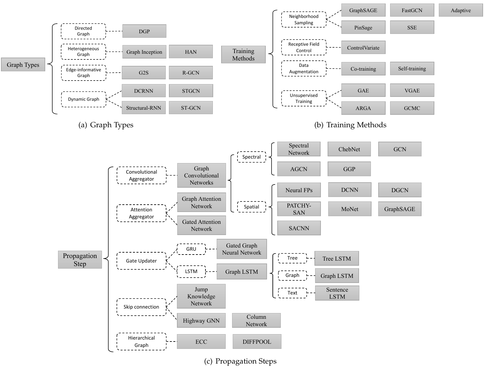

### 1. 简介

图是一种对一系列物体（节点）和关系（边）进行建模的非欧数据结构，图分析主要关注节点分类、链接预测和聚类，图神经网络（Graph Neural Networks）是基于深度学习的在图领域进行操作的方法。

GNN的首个推动源于卷积神经网络，CNN能构提取多尺度局部空间特征并将其组合起来构造高表达能力特征的能力，随着对CNN和图的深入研究，我们发现CNN的关键：局部连接、权值共享、使用多层，在图领域也十分重要：因1）图是最典型的局部连接的结构；2）全职共享相比传统谱图理论减少了计算代价；3）多层结构是处理层级模式的关键，能获取不同尺寸的特征。但CNN仅能处理图像（2D网格）和文本（1D序列）这样的普通欧式数据，尽管可以将它们看成是图的个例。

另一个推动则来自图嵌入，它会学习使用低维向量来表示图节点、边和子图。遵循表示学习的思想和词嵌入的成功，首个基于表示学习的图嵌入方法DeepWalk将跳元模型应用在生成的随机游走上，类似的方法如node2vec、LINE和TADW也获得了突破。但这些方法有两个缺点：一是编码器中没有节点共享参数使得计算效率不高，二是直接的嵌入方法缺乏泛化能力。

基于CNN和嵌入，研究者提出图神经网络来从图结构共同地集合信息，因此能够对元素及其依赖组成的输入和/或输出进行建模，甚至能够使用RNN核同时对图上的扩散过程进行建模。

下面解释图神经网络值得被研究的几个基本原因：

- 第一，CNN和RNN这样标准的神经网络无法恰当地处理图输入，因其会将节点特征按照特定顺序堆叠，但图中并没有一个自然的顺序，要完整地表达一个图，需要遍历所有的可能顺序来作为CNN和RNN模型的输入，这在计算时是十分冗余的。为解决这个问题，GNN忽视节点输入顺序，在每个节点上分别传播，换句话说GNN的输出与节点输入顺序无关。
- 第二，图中的边表达了两个节点之间的依赖关系，在标准神经网络中，依赖信息仅作为节点特征考虑，但GNN能够执行图特征引导的传播，而非仅仅特征的一部分。GNN通常使用其邻接节点状态的加权和来更新隐状态。
- 第三，在高级人工智能研究中推理是非常重要的研究课题，而人类大脑的推理几乎都是基于日常经验提取的图上的；GNN能够从场景图像和故事文档这样的非结构数据中探索生成图，而这会是高级AI进一步研究的有力神经模型。最近已经证明一个简单结构的未训练GNN也能表现得很好。

本文提供了不同GNN模型的彻底回顾及其应用的系统分类。

### 2. 模型

我们首先描述原始的图神经网络工作，也列出其在表达能力和训练效率上的局限；然后引入几种旨在缓解这些局限的GNN变体，这些变体在不同类型的图上执行，使用不同的传播函数和高级训练方法；之后展示三种能够推广和扩展到许多工作的通用框架，其中消息传播网络（MPNN）统一了多种图神经网络和图卷积网络，非局部网络（NLNN）统一了几种自注意力风格的方法，以及图网络（GN）能够推广到几乎所有本文提到的GNN变体。在此之前先引入一些记号：

|                          记号                           |                 描述                  |
| :-----------------------------------------------------: | :-----------------------------------: |
|                      $\mathbb R^m$                      |             $m$维欧氏空间             |
|                 $a,\mathbf a,\mathbf A$                 |           标量、向量、矩阵            |
|                      $\mathbf A^T$                      |               矩阵转置                |
|                      $\mathbf I_N$                      |             $N$维单位矩阵             |
|           $\mathbf g_\theta \star \mathbf x$            | $\mathbf g_\theta$和$\mathbf x$的卷积 |
|                           $N$                           |               节点个数                |
|                          $N^v$                          |               节点个数                |
|                          $N^e$                          |                边个数                 |
|                     $\mathcal N_v$                      |           节点$v$的近邻集合           |
|                     $\mathbf a_v^t$                     |   节点$v$在时间$t$的向量$\mathbf a$   |
|                      $\mathbf h_v$                      |            节点$v$的隐状态            |
|                     $\mathbf h_v^t$                     |       节点$v$在时间$t$的隐状态        |
|                    $\mathbf e_{vw}$                     |         节点$v$到$w$边的特征          |
|                      $\mathbf e_k$                      |          标记为$k$的边的特征          |
|                     $\mathbf o_v^t$                     |             节点$v$的输出             |
| $\mathbf W^i,\mathbf U^i,\mathbf W^o,\mathbf U^o,\dots$ | 计算$\mathbf i,\mathbf o,\dots$的矩阵 |
|               $\mathbf b^i, \mathbf b^o$                | 计算$\mathbf i,\mathbf o,\dots$的向量 |
|                        $\sigma$                         |              sigmoid函数              |
|                         $\rho$                          |           可供选非线形函数            |
|                         $\tanh$                         |             双曲正切函数              |
|                   $\text{LeakyReLU}$                    |             LeakyReLU函数             |
|                         $\odot$                         |            逐元素相乘操作             |
|                         $\Vert$                         |               向量拼接                |

#### 2.1 图神经网络

图神经网络首先在[文献1]()中被提出，它扩展已有的神经网络来处理以图领域表达的数据。在一个图中，每个节点都很自然地用其特征和相关节点来表达。GNN的目标是学习一个包含每个节点近邻信息的状态嵌入$\mathbf h_v \in \mathbb R^s$，$\mathbf h_v$是节点$v$的一个$s$维向量，能用于产生作为标签的输出$\mathbf o_v$。称参数化函数$f$为**局部转移函数**，它被所有节点共享并按照近邻的输入更新节点状态；令$g$为**局部输出函数**，它描述产生输出的方式。这样，$\mathbf h_v$和$\mathbf o_v$就定义为：
$$
\begin{eqnarray}
\mathbf h_v &=& f\left( \mathbf x_v, \mathbf x_{co[v]}, \mathbf h_{ne[v]}, \mathbf x_{ne[v]} \right)\tag{1}\\
\mathbf o_v &=& g\left( \mathbf h_v, \mathbf x_v \right) \tag{2}
\end{eqnarray}
$$
其中$\mathbf x_v$是$v$的特征，$\mathbf x_{co[v]}$是其边的特征，$\mathbf h_{ne[v]}$、$\mathbf x_{ne[v]}$是节点近邻的状态和特征。令$\mathbf H$、$\mathbf O$、$\mathbf X$和$\mathbf X_N$分别为堆叠所有状态、输出、特征和节点特征所构造的向量，则就有一个紧致的形式：
$$
\begin{eqnarray}
\mathbf H &=& F(\mathbf H, \mathbf X) \tag{3}\\
\mathbf O &=& G(\mathbf H, \mathbf X_N) \tag{4}
\end{eqnarray}
$$
其中**全局转移函数**$F$，**全局输出函数**$G$分别是所有节点的$f$和$g$的堆叠版。$\mathbf H$的值是方程(3)的驻点，若$\mathbf F$为压缩映射（contraction map）时值是唯一的。由Banach驻点定理，GNN使用下面的经典迭代模式来计算状态：
$$
\mathbf H^{t+1} = F\left( \mathbf H^t, \mathbf X \right) \tag{5}
$$
对任意初始值$\mathbf H(0)$动态系统方程(5)指数快地收敛到方程(3)的解。注意$f$和$g$中描述的计算可以解释为前向神经网络。在有了GNN框架之后，下面的问题就是如何学习$f$和$g$的参数。使用目标信息监督（特定节点为$\mathbf t_v$），可以将损失函数写成：
$$
loss = \sum_{i=1}^p(\mathbf t_i - \mathbf o_i) \tag{6}
$$
其中$p$是监督节点的个数。学习算法基于一个梯度下降策略并被分解为下面的步骤：

- 状态$\mathbf h_v^t$由公式1迭代更新直到时间$T$，它们接近公式3的驻点解$\mathbf H(T) \approx \mathbf H$；
- 从损失计算权值$\mathbf W$的梯度；
- 权值$\mathbf W$基于上一步计算的梯度更新。

**局限**：尽管实验结果显示GNN是建模结构化数据的有力结构，但原始GNN依然有一些局限。首先，迭代更新节点隐状态求驻点效率很低，若放松驻点假设则可以设计一个多层GNN来获得节点及其近邻的稳定表达；其次，GNN使用在迭代中使用同样的参数，而大多数神经网络在不同层使用不同参数，作为分级特征提取方法，而且节点隐状态更新是一个顺序过程，可以从GRU和LSTM这样的RNN核中受益；第三，原始GNN并无法有效建模富含信息的边的特征，比如知识图谱的边有不同类型的关系，通过不同边传递的消息按照边的类型也不同，另外如何学习边的隐状态也是一个问题；最后如果关注节点而非图的表达并不适于使用驻点，因驻点表达的分布在值上会十分平滑，以及更少包含信息来区分每个节点。

#### 2.2 图神经网络变体

这个部分展示几种图神经网络的变体。2.2.1节关注在不同类型图上的操作，这些变体扩展了原始模型的能力；2.2.2节列出一些在传播步骤上的修改（卷积、门限机制、注意力机制和跳跃连接），这些模型可以更高质量地学习表达；2.2.3节描述了使用高级训练方法的变体来改善训练效率。不同类型图神经网络的概览见下图：

##### 2.2.1 图类型

原始GNN中，输入图由带标签信息的节点和无向边组成，是最简单的图形式。但图也有许多其他的变体：

**有向图**：虽然无向边可以看成是两条有向边，但有向边能够携带更多的信息，比如知识图谱中边从头实体出发在尾实体结束，头实体是尾实体的父类，这表明我们应该区别对待从父类和从子类出发的信息传播过程。[DGP](https://arxiv.org/pdf/1805.11724.pdf)使用两种权值矩阵，$\mathbf W_p$和$\mathbf W_c$来包含更精确的结构信息。传播规则如下：
$$
\mathbf H^t = \sigma\left( \mathbf D_p^{-1}\mathbf A_p\sigma\left( \mathbf D_c^{-1}\mathbf A_c\mathbf H^{t-1}\mathbf W_c \right)\mathbf W_p \right) \tag{7}
$$
其中$\mathbf D_p^{-1}\mathbf A_p$和$\mathbf D_c^{-1}\mathbf A_c$分别是父和子的正规化邻接矩阵。

**异构图**：异构图中由多种不同类型的节点，最简单的处理异构图的方法就是将每个结点的类型转换为一个one-hot特征向量并与原始特征拼接。[GraphInception](https://web.cs.wpi.edu/~xkong/publications/papers/www18.pdf)引入元路径到异构图的传播中。通过元路径，我们可以基于节点类型和距离将近邻分组。对每个近邻组，GraphInception将其看成一个同构图中的子子图来进行传播，并将来自不同同构图的传播结果拼接来作共同的节点表达。最近提出的异构图注意力网络（HAN），使用节点层次和语义层次的注意力，能同时考虑节点重要性和元路径。

**带边信息的图**：另一种图的变体是每条边有权值、或类型这样的额外信息。我们列出两种处理这种图的方法：

- 一种是将图转化为双边图，其中原始边也变成节点，一条原始边被分成两条新边，即在边将诶殿和开始/结束节点之间有两条新边。[G2S](https://arxiv.org/pdf/1806.09835.pdf)中的编码器对近邻使用下面的聚合函数：
  $$
  \mathbf h_v^t = \rho \left( \frac1{\left\vert \mathcal N_v \right\vert} \sum_{u \in \mathcal N_v} \mathbf W_r\left( \mathbf r_v^t \odot \mathbf h_u^{t-1} + \mathbf b_r \right) \right) \tag{8}
  $$
  其中$\mathbf W_r$和$\mathbf b_r$是不同类型边（关系）的传递参数；

- 另一种是可以在不同类型边上为传播调整不同权值矩阵。当关系数目很大时，[r-GCN](https://arxiv.org/pdf/1703.06103.pdf)引入两种正则化来减少参数量：基和块对角分解。通过基分解，每个$\mathbf W_r$定义为：
  $$
  \mathbf W_r = \sum_1^B a_{rb}\mathbf V_b \tag{9}
  $$
  这里每个$\mathbf W_r$是一个基变换$\mathbf V_b \in \mathbb R^{d_{in}\times d_{out}}$与系数$a_{rb}$的线性组合。在块对角分解中，r-GCN通过在一系列低维矩阵上直接求和来定义每个$\mathbf W_r$，但比第一个需要更多的参数。

**动态图**：另一种图变体是动态图，它有静态图结构和动态输入信号。为获取这两种信息，[DCRNN](https://arxiv.org/pdf/1707.01926.pdf)和[STGCN](https://arxiv.org/pdf/1709.04875.pdf)首先通过GNN收集空间信息，然后将输出提供给一个序列模型如seq2seq模型或CNN。与此不同，[Structural-RNN](https://arxiv.org/pdf/1511.05298.pdf)与[ST-GCN](https://arxiv.org/pdf/1801.07455.pdf)同时收集空间和时间消息，它们将静态图结构用时间连接扩展因此能将传统GNN应用到扩展图上。

##### 2.2.2 传播类型

