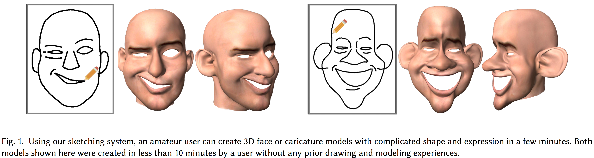
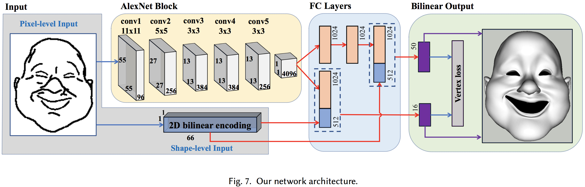
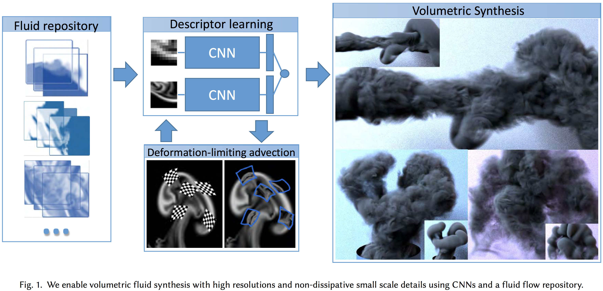
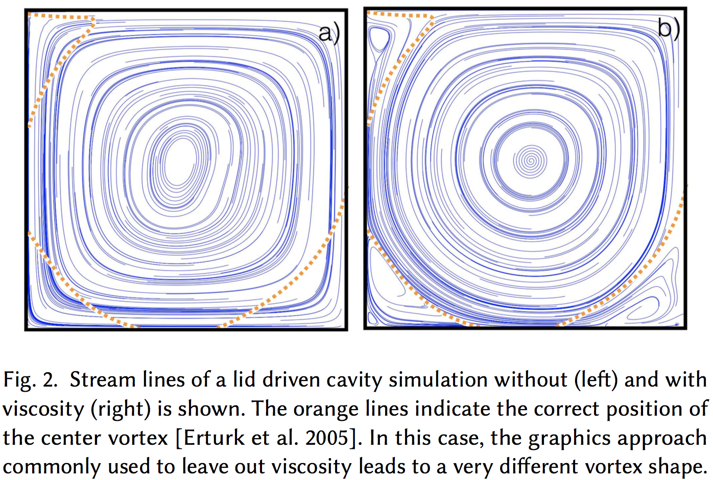
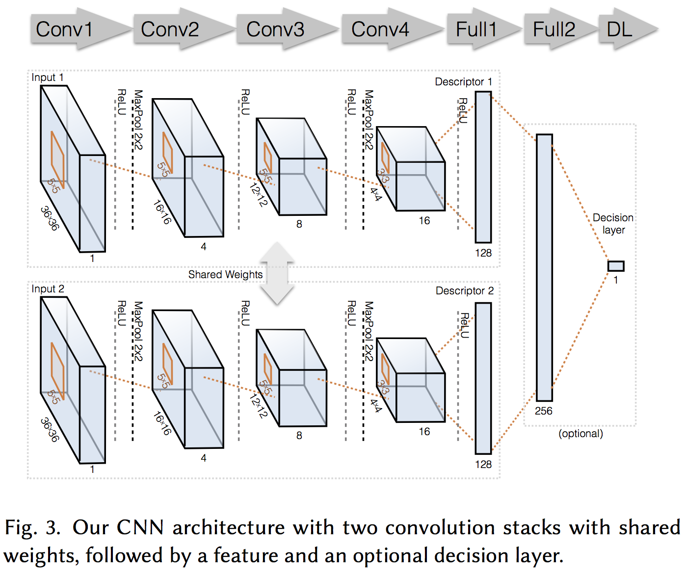
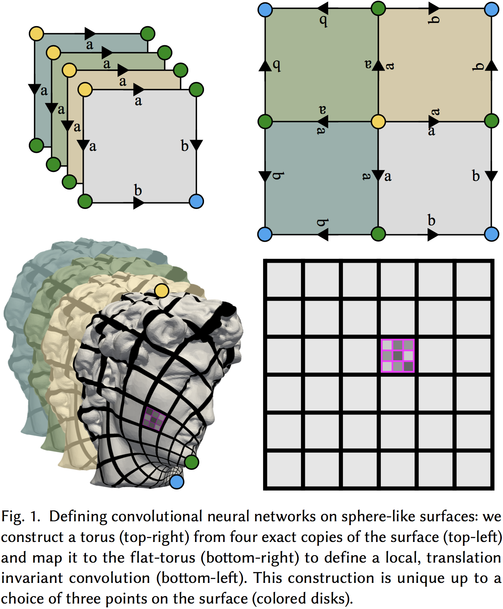
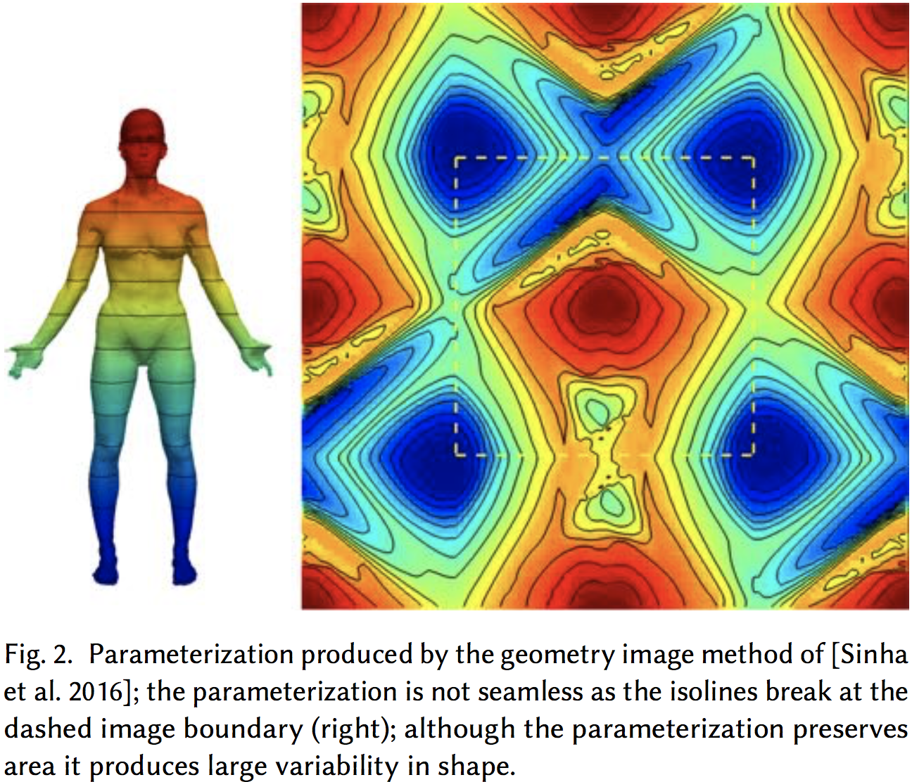

近来以深度神经学习技术在计算机视觉、语音识别、自然语言处理等方面取得了长足的进展，在计算机图形学领域亦有逐渐上升的趋势。为了解目前的应用情况，我查阅了2017年在SIGGRAPH等会议的论文，深入了解了深度学习技术在渲染领域的应用，下面是一些比较有代表的工作。

#### FaceSketch2Face

这时SIGGRAPH2017年的一篇文章，将卷积神经网络应用在了面部建模。面部建模在视觉计算领域中已经有了很多的努力，有许多应用场景，包括卡通人物、社交媒体头像、3D面部漫画以及与面部相关的艺术和设计，在这些领域中低成本的交互面部建模是常用的方法，尤其在业余爱好者中。作者提出了基于深度学习的3D面部和漫画建模的素描系统。这个系统有高效的素描界面，允许用户手动手动描绘不精确但足够表现的2D线条来表达面部特征的轮廓。作者设计了一个崭新的基于CNN的深度回归网络用于从2D素描中推测3D面部模型。网络融合CNN和输入素描基于形状的特征，并有两个全连接的独立分支产生双线性面部表达系数的独立子集。这个系统也支持基于手势的交互来使用户进一步操纵初始的面部模型。用户调研和数值结果都指示了这个素描系统能帮助用户快速而有效地产生面部模型。作者也构造了一个增大了很多的、有类别特征、表示和不同程度夸张的面部数据库来推广进一步的研究和面部建模技术的评估。

考虑一个人是如何画2D脸的。很自然，人会先快速画出最外面的轮廓，然后是不同的脸部特征，包括眼睛、鼻子和嘴。这样一系列轮廓和框架已经给出了非常好的潜在脸部描述，即使它们仅仅是稀疏的线条集合。注意到这样的轮廓和框架也在3D面部存在，除了额外的深度信息和轮廓是基于视角的。然而，即使当3D轮廓和框架是充分说明的，这些稀疏线条之间的脸部区域形状依然是未知的。幸运的是，这些区域的3D形状与轮廓和框架的2D和3D形状是高度相关的。因此，从数据中学习这样的关系并让其指导高效的面部建模至关重要。

系统的架构如Figure 7所示。在这个系统中，一个底层的深度回归网络负责2D面部素描到3D面部模型的转换。它将2D素描视为一幅图像，并依靠一个运行在原始像素上的卷积神经网络来计算素描所有线条的定长描述；为弥补全局上下问的缺乏，系统直接使用一个降维模型来表示主要面部特征的全部形状。深度网络的输出是双线性脸表示的系数集合，它们能用于面部网眼所有3D边的重建。这种双线性表示将特性与表情视为两个拥有不同系数的独立模式。为避免这两种模式之间的相互干扰，深度网络有两个全连接层数量不同的独立分支紧接在共同的卷基层后面。总之而言，这篇文章有下面三个贡献：

- 提出一个新的3D面部和漫画模拟的素描系统。这个系统有省力的素描界面，能自动从2D素描中通过学习两者相关性来生成初始的3D面部模型。系统还支持基于手势的交互以使用户进一步操作原始面部模型。
- 为从2D素描中推测3D面部模型设计了一个新的基于CNN的深度回归网络。这个网络融合CNN和输入素描基于形状的特征，有两个独立的生成双线性面部表示的两个独立系数子集全连接层分支。
- 为训练和测试模型构造了一个有多种特征、表情和不同程度夸张的数据库。数据库会公开发布以供其他面部模型研究人员使用。

#### CNNPatches

这也是SIGGRAPH 2017的文章，使用的也是卷积神经网络，应用到流体模拟。作者展示了一种新的数据驱动的使用可重用时空流体数据仓库来合成高分辨率流体模拟的算法。这个工作使用一个学习对分辨率不同的流体区域和数值黏度之间相似度编码的方法的描述工具。他们使用了卷积神经网络来从烟雾密度和流动速度这样的流体数据来生成这个描述工具，同时，也展示了能健壮追踪可变流体区域的变形限制补片对流方法。利用这种补片对流，该方法可以从其仓库细节详尽的流体中产生稳定的时空数据集。然后使用学到的描述工具在运行新仿真时快速定位合适的数据集。这就使得这个方法十分高效，并且不依赖分辨率。作者还在论文中展示了其方法产生的团块的例子，有着非常高效的分辨率，以及自然融合到底面流体运动中的无消耗小尺寸细节。

解决自然烟雾的海量细节长久以来都是流体模拟的阻碍；作者采取了有别于以往的新的视角来高效实现高分辨率流体：使用大量预先计算好的时空区域集合，从中合成新的高分辨率团块。为高效寻找到仓库中的最佳匹配区域，这种方法使用了新的、l流体感知特征的描述工具，并确保了在此特征空间的$L_2$距离在流动密度和流体运动方面对应于流动区域真正的配对，这样即使在巨大的流体数据集库中都能十分高效地获得条目。

同样困难的还有数值黏度问题，在这里作者展示了在图形学中可以为典型的烟雾模拟预测数值密度的影响，并用数据驱动的方式来完成了这个任务，也就是说训练了一个在不同大小数值黏度模拟之间建立对应的模型。

这个方法为流体中定位的区域计算之中对应和仓库查询，下面称这种区域为补片。这种方法使用了变形拉格朗日帧来依据时间追踪补片，它有小特征预先训练并存储在仓库而不会无意消耗的优势，也绕开了严格的时间步限制。另一方面，方法也提出一种新的用预先步的变形限制对流模式来确保对应的区域不会随时间变得弱形状。受湍流分形特质、理查德森能量级联中主要单向能量向小尺度迁移的启发，作者独立地匹配和追踪每个补片。这就产生了一个十分高效的方法，因其允许并行地运行所有基于补片的计算。

总结而言，这个工作的贡献在于：

- 一个新的基于CNN为密度和速度计算健壮、低维特征描述的方法，
- 带预期的变形限制补片对流
- 基于可重用时空区域的高效团块合成的算法

组合起来，这个工作使得利用可重用时空流体仓库极具高效地合成细节详尽的流动团块成为可能。作者也提供了基于密度流体数据集卷积神经网络和相似度学习的评估。

#### ToricCNN

受近来CNN在图像处理相关任务成功的启发，许多研究工作开始尝试在几何任务里取得同样的成功。将CNN应用到表面的一个主要困难即是在表面定义自然的卷积算子。本文展示一种用到二维平坦环面的全局无缝参数化将深度学习应用于球类形状的方法，其中对卷积操作进行了良好的定义。结果表明，标准的深度学习框架能很好地应用于学习形状语义、高层的特性。我们在消除图像和表面之间鸿沟的一个迹象是这个算法成功地从输入的原始低维特征向量学习到了语义信息。我们通过两个应用展示这个方法的用处：人体分割和结构表面的自动地形探测。可以显示我们的算法与竞争的几何深度学习分割算法相比是有利的，能够在结构表面产生有意义的对应，而这是手工特征必定失败的领域。

近来几何处理与视觉社区致力于将深度卷积网络(CNN)难以置信的成功迁移到几何设定中。一个特定的有趣场景是为二维球形曲面上的函数或标签的有监督学习应用CNN。这是分析人体、解剖和媒体数据的时经常遇到的问题。

将CNN应用到像立体网格或外部二维相机的深度地图投影这样的表面可变表达时需要用3维网格工作，或处理大量相机和光照参数，对变形十分敏感（比如人姿势的改变）。虽然可能学习一个对变形不变的表达，但需要大量的训练数据。相反，我们的目的是提供一个能将CNN直接应用到表面的固有表达。

将CNN应用到曲面的一个主要困难是没有清晰的卷积操作的泛化，尤其是两个被认为是CNN架构取得成功的关键的卷积算子的特性：局部性以及转化不变性。虽然在点周围的测地片段上局部参数化一个表面是节能的，但这样的表达缺乏全局语境。有研究提出几何图像到全局参数化球形表面到一副图像，然而尽管连续，这种表达却非无缝的（参数化依赖于为计算做的剪枝）,它们的参数化空间，即区域保存映射有非常大的自由度（比如它要求无限数量的点约束来唯一定义一个映射），因此可以以很多不同的任意方式来表达同一个形状（如Figure 2所示）。最后，几何图像上的卷积并非转化不变的。

在表面上定义一个转化不变的卷积操作并不简单。第一个障碍便是拓扑的：转化不变卷积的唯一很好地定义的表面类是环面。然而，将球形表面映射为一个环面而不引入不连续性，也就是说将表面上相邻的点映射到环面上远离的点，显然是不可能的。信息会通过不连续性不同地传播，卷积的局部性也会丢失。第二个困难是几何的：我们希望在不同表面间的映射能足够一致，这样映射的测试表面与训练表面看起来相似。这与映射空间相关，或者说规定一个唯一映射所需的自由度的数目，取决于环面的转化。从这些映射中学习的越困难，所需的参数就越多（例如最坏的情况是目标位置的每一个源点都是一个自由度）。

我们通过一个拓扑构造来解决这些挑战：与其处理原始球形表面，我们构造四个此表面的精密副本组成的表面覆盖，并有环面的拓扑，见Figure 1顶部一行。此外，我们展示这种环面能使用一个高效算法共形地（保留正交方向）映射到平坦环面。这定义了一个4-覆盖的局部转化不变卷积，见Figure 1中的单个卷积版面例子-底部一行。这种构造取决于表面三个点的选择是唯一的；Figure 1中展示的卷积由底部左侧插图中的三点创建（表示为彩色圆盘）。

这种构造提供了一个球形表面上的六维无缝卷积空间：每个点三元组的选择都对应于唯一共形映射，反过来也定义了一个卷积算子，或等价地，一个在表面4-覆盖上的共形平坦环面结构。因为等高线特别是共形映射，这种构造也是形状等高线变形不变的。这个卷积空间的相对低维性使得能实现数据增强的上下文下在此空间的高效采样。共形性在平坦环面上保存了转化方向的方向性，但引入了尺度变化；在这种意义上三元组类似一个放大镜—将表面的不同部分放大。

我们将上面监督学习的构造应用到表面，目标是在简单的表面向量函数（比如坐标函数、法线、曲率、或其他常用几何特征）与困难的目标向量向量函数（比如语义分割或地标标注）之间的非线性关系。从4-覆盖到平坦环面的共形映射会被无缝地用于将这些函数迁移到将作为我们训练领域的平坦环面。为了在平坦环面领域利用现有的基于图像的CNN架构和优化算法，我们提出了三个新的技术构成：

1. 环填充层代替了零填充以实现在平坦环面的充分平移不变性；
2. 一个比表面函数空间的投影层以适当地在原始表面与其4-覆盖之间映射函数；以及
3. 一个聚合步骤来从多个三元组推断预测。

实验显示我们的方法在分割任务中能比现在最好的几何学习方法更好地学习和泛化语义函数。并且，他能仅使用基本的本地数据（欧几里德坐标，曲率，法线）来回获得较高的成功率，展示了从低层信号学习高层特征的能力。这是定义局部转化不变卷积算子的关键优势。最后，它易于实现，并完全兼容当前为图片实现的标准CNN。