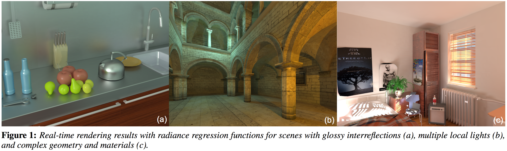
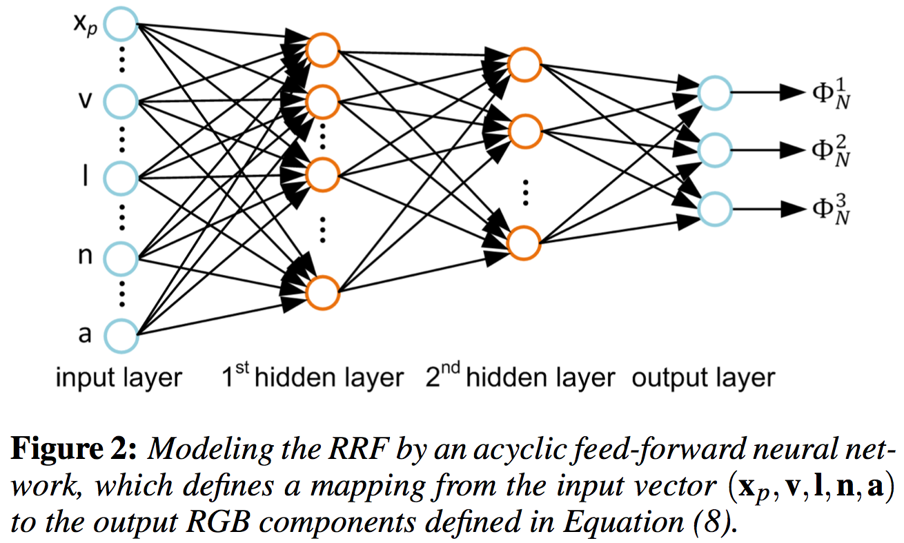
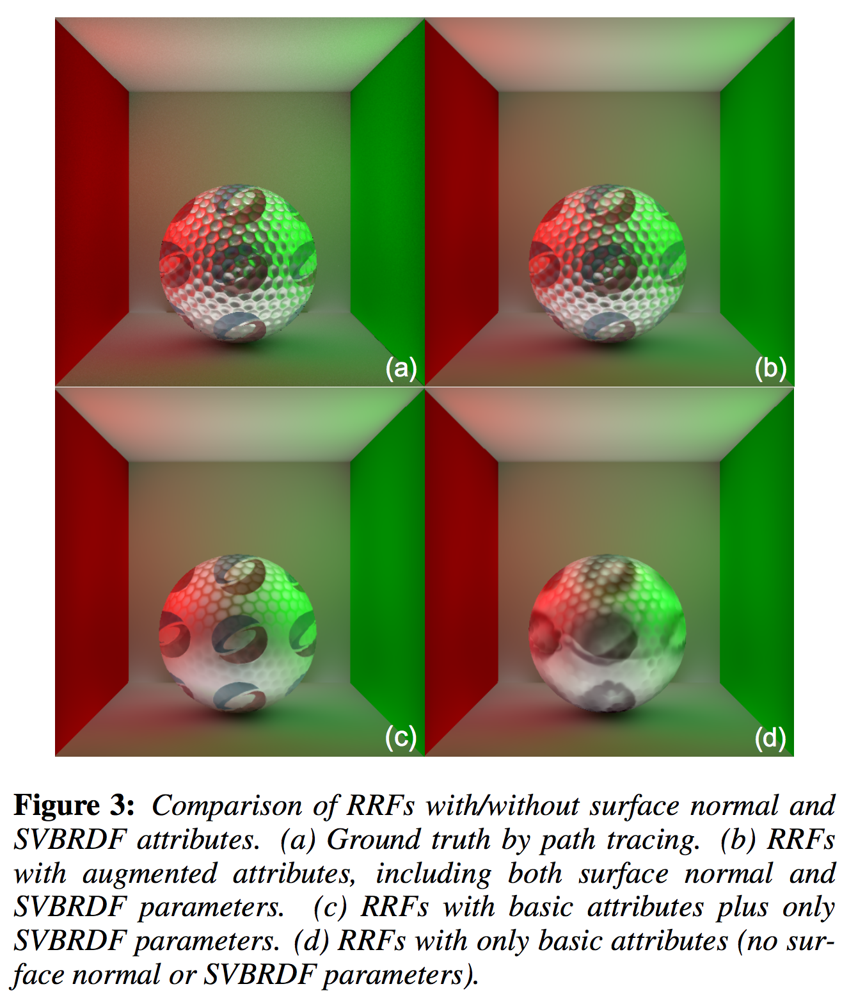
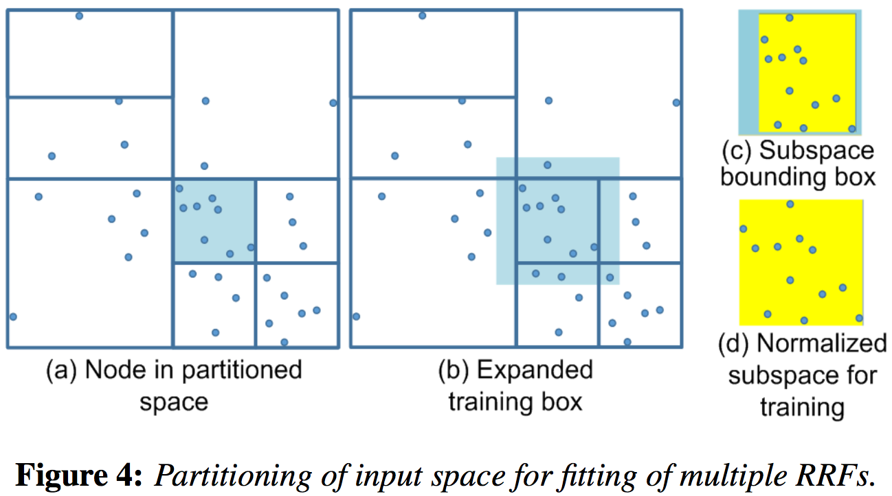
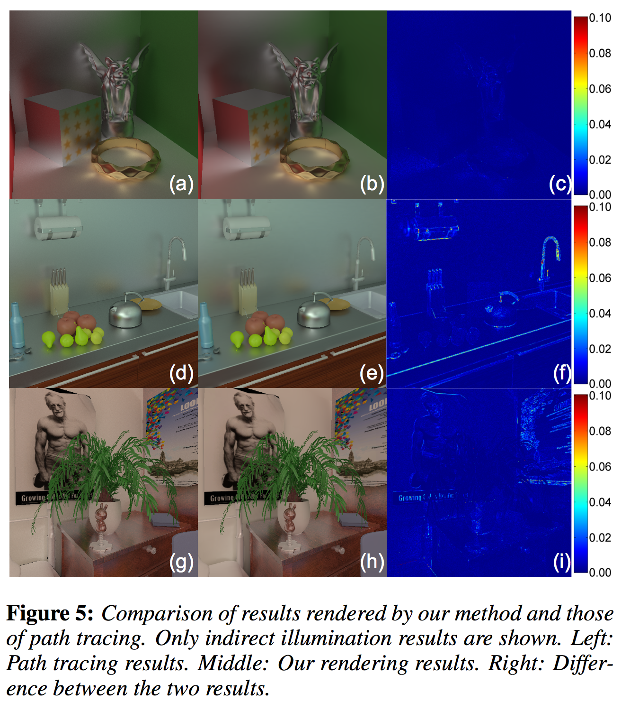
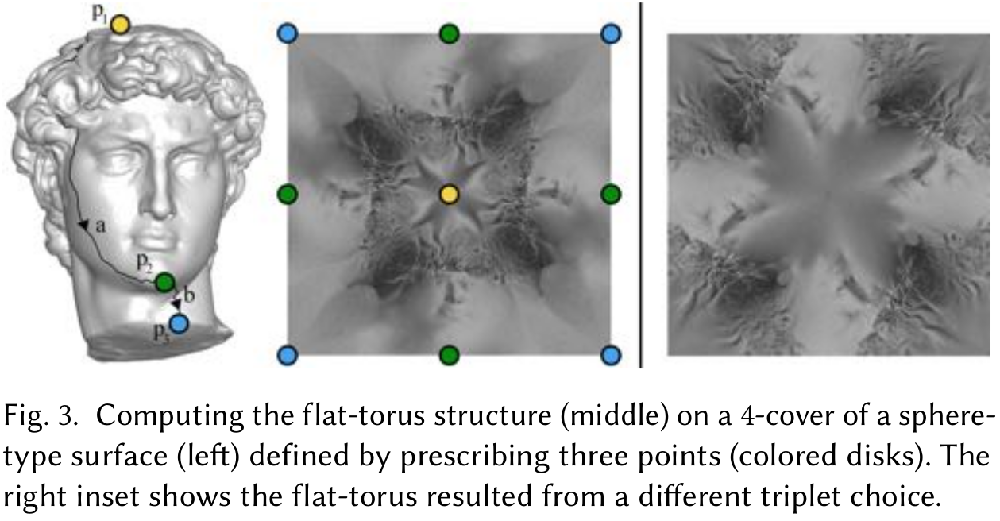
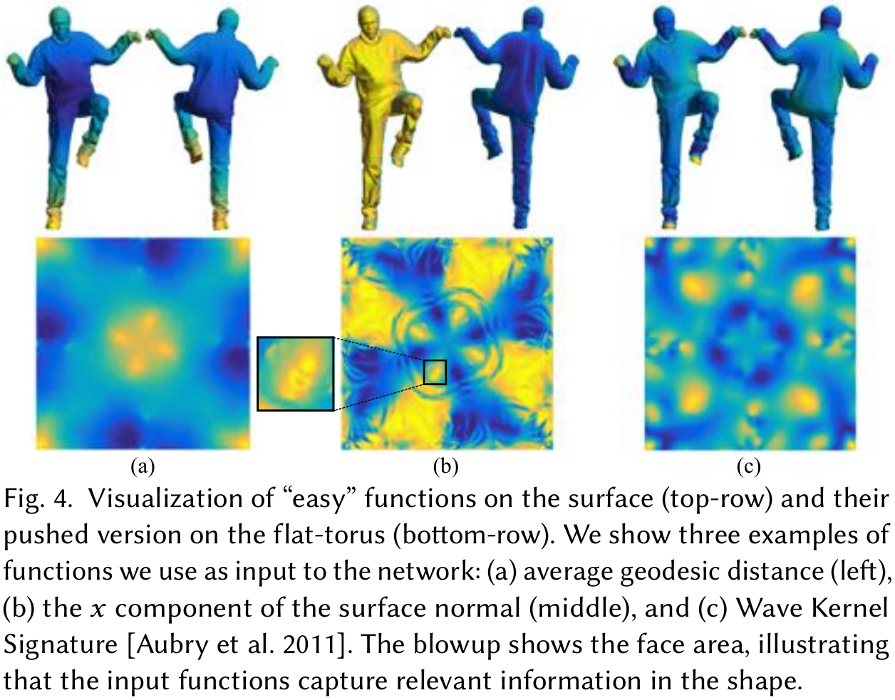
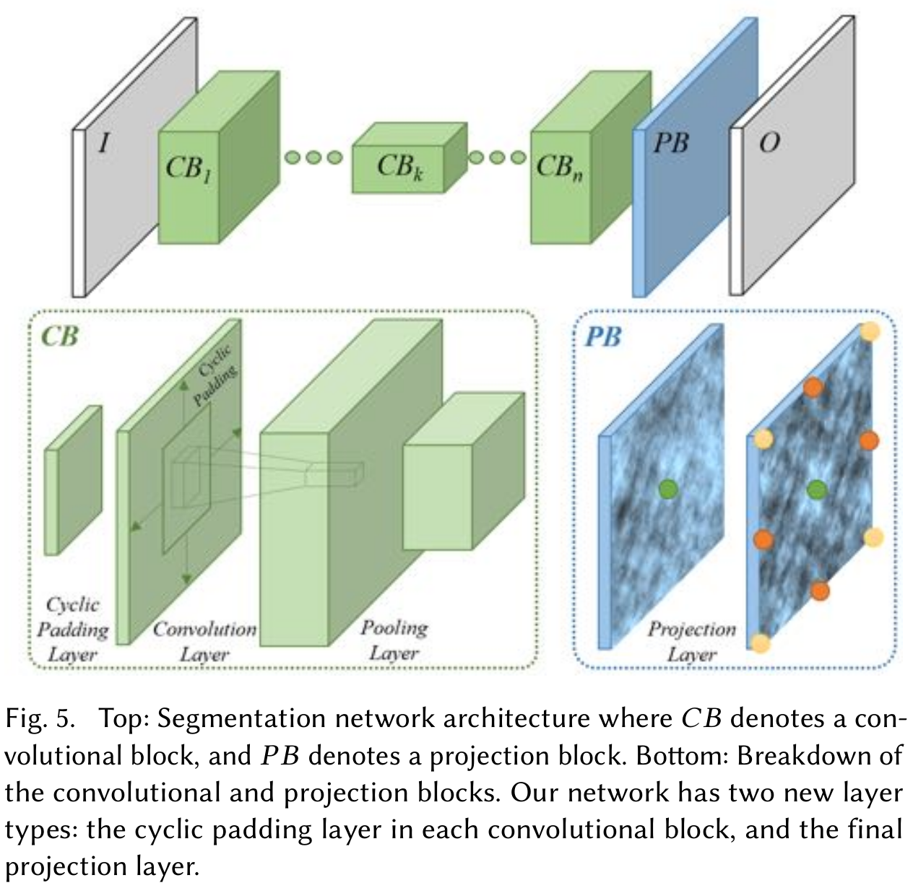
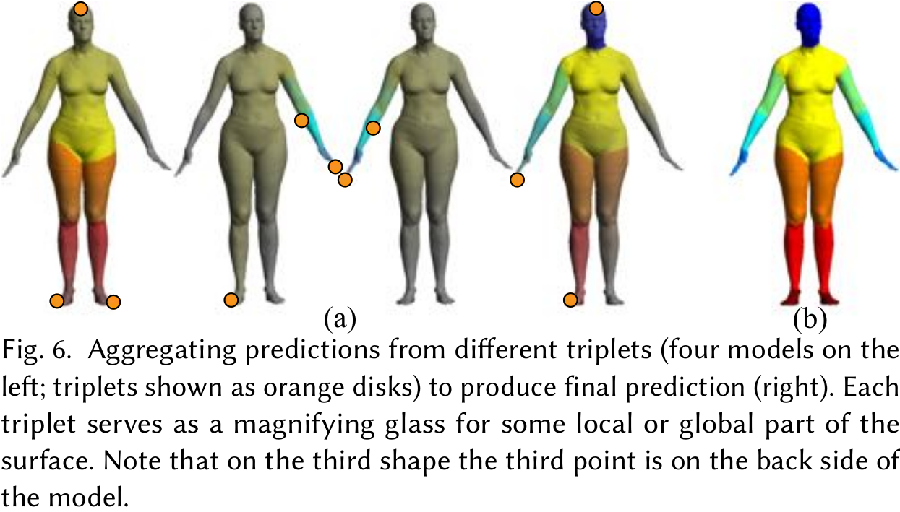

由于本人研究方向是人工智能相关的，因此比较关注人工智能技术在计算机图形学中的作用，因此参看了最近一些SIGGRAPH的论文，下面是感觉在渲染方面比较好的方法：

####  [基于辐射回归函数的全局照明](http://www.renpr.org/project/ShadeBot.htm)

作者展示了一种动态局部光源场景下全局照明快速渲染的辐射回归函数。辐射回归函数(RRF)代表一种从表面点的局部和上下文属性，比如未知、视向、照明条件，到其间接照明值的映射。RRF通过回归分析由预先计算的底纹例子获得，它确定了最优匹配底纹的函数。对于给定场景，底纹例子由离线渲染器事先计算。

这个方法的核心思想是发掘间接照明的数据非线性连贯性以使RFF既紧密又快速地来评估。我们将RRL建模为多层无环前向神经网络，它提供了间接照明的函数一个紧密近似，并能在运行时快速地被估计。为高效地对空间变化材料特性的场景建模，我们使用一个属性的强化集所谓神经网络的输入来减少神经网络需要运行的推断的数量。为解决集合复杂性更强的场景，将RRF模型的输入空间分割并将子空间表示为分开的、更小的RRFs来更快地评估。作为结果，RRF模型对用一直增加的福昌场景几何和材料变化测量得很好。由于其紧密性和评估的简易性，RRF模型能够实现完整全局照明效果的实时渲染，包括改变的焦散曲线和多反射高频率光滑互反射。

##### 简介

全局光线运输提供了是逼真渲染的必要成分的有富可视底纹效果的场景。大多数的底纹细节来光的多反射。这种反射的光线，即间接光照，计算起来十分消耗资源，即使是最好的方法，动态视角和照明的实时渲染也十分困难。间接照明的实时渲染的两个困难是处理动态局部光源和解决高频光滑互反射。大多数现存的方法都假定光照环境都是在场景中新的额单光源采样得到而结果则存储为环境地图。因为这个原因，这些方法无法精确地表示场景不同部分的局部光线的入射辐射。

为解决这些困难，作者提出了辐射回归函数，一个在给定视向和光照条件情况下为每个表面点返回间接照明值的函数。这个方法的核心思想是将RRF设计为表面点特征的非线性函数，这样就是的它有紧密的表示并能快速评估。RRF在事先离线渲染计算好的训练样本上用非线性回归来学习一个给定场景。这些样本由一系列随机观察和光照条件渲染的表面点组成。因为给定场景下表面点的间接照明是由其位置决定，我们将这些特征定义为点的基本属性并学习相应于它们的RRF。在渲染中，每个可视表面点的属性在评估间接照明时得到。每个点的间接照明其后则由它们的属性用RRF计算得到，并被添加到间接照明中以产生全局的照明方案。

这个方法将RRF建模为一个多层无环前向神经网络。作为一个通用函数近似算子，这样一个神经网络可以在给定充足的训练样本时可以近似间接照明噶不是故意到任意精度。设计这个网络的主要的问题是如何通过对预先计算的训练样本的高效使用来获得好的近似。为解决这个问题，作者提出了两个技巧。第一个是增强每一个点的属性集来包含空间变化的表面特性。通过对相应包含表面法线和材料属性的增强属性集运行回归，样本利用的效率得到了极大的提升，因从强化特征到间接照明的映射能更简单地从训练样本中获得。第二个技巧是分割RRF输入向量的空间并为每个子空间适配一个单独的RRF。为加快运行时间评估，作者应用了几个更小的神经网络来共同和更高效地表示贯穿场景的间接照明。

这个方法的主要贡献是一个根本上全新的为预先计算全局照明的实时渲染的新方法。它直接近似间接照明，这是一个相当复杂和非线性的6维函数（关于表面位置、观察方向和光照方向）。通过精心设计的神经网络，这个方法能有效地在所有6个维度同时挖掘函数的非线性一致性。解析神经网络RRFs的评估可以在很容易集成到已有渲染管道的有延迟阴影传递的屏幕空间完成。因此，预计算的RRFs可以很紧凑也很快速地评估，并能渲染很难的视觉效果——比如焦散曲线，直接阴影下的形状，以及高频光滑互反射——所有的都是实时的。在这个方法中预计算的神经网络仅依赖于物体表面的光照效果，而不受底层的表面网眼影响，这也使得这个方法更加可扩展。

#### [基于环面覆盖的表面卷积神经网络](http://vovakim.com/data/papers_small/17_SIGGRAPH_ToricCNN.pdf)

受近来CNN在图像处理相关任务成功的启发，许多研究工作开始尝试在几何任务里取得同样的成功。将CNN应用到表面的一个主要困难即是在表面定义自然的卷积算子。

本文展示一种用到二维平坦环面的全局无缝参数化将深度学习应用于球类形状的方法，其中对卷积操作进行了良好的定义。结果表明，标准的深度学习框架能很好地应用于学习形状语义、高层的特性。我们在消除图像和表面之间鸿沟的一个迹象是这个算法成功地从输入的原始低维特征向量学习到了语义信息。

我们通过两个应用展示这个方法的用处：人体分割和结构表面的自动地形探测。可以显示我们的算法与竞争的几何深度学习分割算法相比是有利的，能够在结构表面产生有意义的对应，而这是手工特征必定失败的领域。

##### 简介

近来几何处理与视觉社区致力于将深度卷积网络(CNN)难以置信的成功迁移到几何设定中。一个特定的有趣场景是为二维球形曲面上的函数或标签的有监督学习应用CNN。这是分析人体、解剖和媒体数据的时经常遇到的问题。

将CNN应用到像立体网格或外部二维相机的深度地图投影这样的表面可变表达时需要用3维网格工作，或处理大量相机和光照参数，对变形十分敏感（比如人姿势的改变）。虽然可能学习一个对变形不变的表达，但需要大量的训练数据。相反，我们的目的是提供一个能将CNN直接应用到表面的固有表达。

将CNN应用到曲面的一个主要困难是没有清晰的卷积操作的泛化，尤其是两个被认为是CNN架构取得成功的关键的卷积算子的特性：局部性以及转化不变性。虽然在点周围的测地片段上局部参数化一个表面是节能的，但这样的表达缺乏全局语境。有研究提出几何图像到全局参数化球形表面到一副图像，然而尽管连续，这种表达却非无缝的（参数化依赖于为计算做的剪枝）,它们的参数化空间，即区域保存映射有非常大的自由度（比如它要求无限数量的点约束来唯一定义一个映射），因此可以以很多不同的任意方式来表达同一个形状（如Figure 2所示）。最后，几何图像上的卷积并非转化不变的。

在表面上定义一个转化不变的卷积操作并不简单。第一个障碍便是拓扑的：转化不变卷积的唯一很好地定义的表面类是环面。然而，将球形表面映射为一个环面而不引入不连续性，也就是说将表面上相邻的点映射到环面上远离的点，显然是不可能的。信息会通过不连续性不同地传播，卷积的局部性也会丢失。第二个困难是几何的：我们希望在不同表面间的映射能足够一致，这样映射的测试表面与训练表面看起来相似。这与映射空间相关，或者说规定一个唯一映射所需的自由度的数目，取决于环面的转化。从这些映射中学习的越困难，所需的参数就越多（例如最坏的情况是目标位置的每一个源点都是一个自由度）。

我们通过一个拓扑构造来解决这些挑战：与其处理原始球形表面，我们构造四个此表面的精密副本组成的表面覆盖，并有环面的拓扑，见Figure 1顶部一行。此外，我们展示这种环面能使用一个高效算法共形地（保留正交方向）映射到平坦环面。这定义了一个4-覆盖的局部转化不变卷积，见Figure 1中的单个卷积版面例子-底部一行。这种构造取决于表面三个点的选择是唯一的；Figure 1中展示的卷积由底部左侧插图中的三点创建（表示为彩色圆盘）。

这种构造提供了一个球形表面上的六维无缝卷积空间：每个点三元组的选择都对应于唯一共形映射，反过来也定义了一个卷积算子，或等价地，一个在表面4-覆盖上的共形平坦环面结构。因为等高线特别是共形映射，这种构造也是形状等高线变形不变的。这个卷积空间的相对低维性使得能实现数据增强的上下文下在此空间的高效采样。共形性在平坦环面上保存了转化方向的方向性，但引入了尺度变化；在这种意义上三元组类似一个放大镜—将表面的不同部分放大。

我们将上面监督学习的构造应用到表面，目标是在简单的表面向量函数（比如坐标函数、法线、曲率、或其他常用几何特征）与困难的目标向量向量函数（比如语义分割或地标标注）之间的非线性关系。从4-覆盖到平坦环面的共形映射会被无缝地用于将这些函数迁移到将作为我们训练领域的平坦环面。为了在平坦环面领域利用现有的基于图像的CNN架构和优化算法，我们提出了三个新的技术构成：(*i*)：环填充层代替了零填充以实现在平坦环面的充分平移不变性；(*ii*)：一个比表面函数空间的投影层以适当地在原始表面与其4-覆盖之间映射函数；以及(*iii*)：一个聚合步骤来从多个三元组推断预测。

实验显示我们的方法在分割任务中能比现在最好的几何学习方法更好地学习和泛化语义函数。并且，他能仅使用基本的本地数据（欧几里德坐标，曲率，法线）来回获得较高的成功率，展示了从低层信号学习高层特征的能力。这是定义局部转化不变卷积算子的关键优势。最后，它易于实现，并完全兼容当前为图片实现的标准CNN。

##### 方法

卷积神经网络是一类大多用卷积层来使用局部区域空间关系的特定神经网络。用连贯卷积后跟非线性函数的深度CNN已在图像理解领域展示了极大的成功。我们的目标是将CNN架构调整到几何表面。

*问题定义*    训练数据由一些类球表面网格$\mathcal S_i \in \mathbb R^3$、表面$\mathcal S_i$的记为$x_i \in \mathcal F(\mathcal S_i, \mathbb R^d)$“简单”$d$维向量函数、真实的“困难”函数$y_i \in \mathcal F(\mathcal S_i, \mathcal L)$的三元组$\left\{\left( \mathcal S_i ,x_i, y_i\right)\right\}_{i \in I}$组成，其中$\mathcal L=\{1,\dots,L\}$是标签集。所谓“简单”函数表示函数可以在表面高效地计算出来，比如坐标函数、曲率、发现和形状特征；所谓“困难”函数是指那些没有简单算法来计算的函数，比如语义标签（即物体部分）必须先手动规定。

我们的目标是找到表面“简单”和“困难”函数相关的非线性映射。数学上就是寻找一个函数$F$，
$$
F:\mathcal F(\mathcal S_i, \mathbb R^d) \rightarrow \mathcal F(\mathcal S_i, \mathbb R^L)
$$
输入平面上$d$维向量（“简单”）函数产生同一表面的信念$L$维向量（“困难”）函数。也就是说，它产生每个点$p \in \mathcal S_i$的信念向量$F(x_i)[p] \in \mathbb R_+^L$正确地预测真实标签$y_i[p] \in \mathcal L$（即$F(x_i)[p]$的最大值在其第$y_i[p]$个坐标取得）。

*平坦环面$\mathcal T$上的CNN*    虽然CNN是映射“简单”和“困难”函数的有力工具，现存的架构并不能直接在$\mathcal S$上运行。因此我们提出将函数转化为一个平坦环面，记为$\mathcal T$，并在此领域内训练CNN。选用平坦环面是因为用传统2维卷积的CNN通过将拼图谈环面离散化为$m\times n$网格直接解决$\mathcal T$上的问题（我们使用$m=n=512$）。

将$\mathcal S$映射为$\mathcal T$并不简单，因这两个领域有不同的拓扑。我们通过引入新的拓扑结构$\mathcal S^4$来解决这个问题。领域$\mathcal S^4$由4个表面切片的副本以到圆盘拓扑同样的方式组成，并缝合到一个（无界的）类环表面。我们将$\mathcal S^4$共形地映射到这个平面，其中这4个表面副本无缝地铺成这个平坦环面。注意这种映射并非是唯一的，并由$\mathcal S$上点的三元组定义。每个三元组提供一个$\mathcal T$上不同的图像，其分辨率（表面区域是缩放的）并非是一致的，会在$\mathcal S$上变化。

我们通过改变网络结构、训练数据和改变网络输出的解释方式来解决映射的模糊性。首先，添加一个新的使得转化不便卷积的环填充层（即对环面对称性固定）。其次，我们吸收一个投影操作层以确保网络输出对$\mathcal S^4$的对称性（也就是输入表面的多个副本）是固定的。这些层都是可微并支持端到端的训练。第三，对多个三元组采样以产生$\mathcal T$上多个训练图像，以充分增强我们的训练数据。最后，当我们在测试时间分析一个表面时，聚合平面上的几个映射（和不同的三元组生成）。

我们方法的一个关键成分是表面$\mathcal S$和平坦环面$\mathcal T$之间的迁移函数。也就是给定一个$\mathcal S_i$上的函数$x_i$，我们希望以一种保有局部性和拓扑（即临近）关系的无缝方式迁移到平坦环面上。我们也希望这种迁移尽可能唯一，并对$\mathcal S_i$等距变形保持不便以避免无谓的数据增强。下面我们展示给定点的三元组$\mathcal P=\{p_1, p_2, p_3\} \in \mathcal S_i$，存在唯一的迁移操作。

因为$\mathcal S$和$\mathcal T$有不同的拓扑，要产生这两种领域内的无缝迁移，我们定义一个中间表面$\mathcal S^4$，$\mathcal S$的一个环类4-覆盖（分支覆盖）。要产生$\mathcal S^4$，我们先制作表面的4个副本，并将每个按路径切割：
$$
\require{AMScd}
\begin{CD}
p_1 @>a>> p_2 @>b>>p_3
\end{CD}
$$
来获得圆盘类的表面（见Figure 3左边）。

接着，将四个表面依据Figure 1右上部分显示的指导那样缝合，以得到环面类型的表面$\mathcal S^4$。需注意这个指导与真实应用的切割（也就是Figure 3中的$a,b$）是无关的并且不同的切割会产生同样的表面$\mathcal S^4$。最后，我们计算一个映射：$\Phi_{\mathcal P}:\mathcal S^4 \rightarrow \mathcal T$将$\mathcal S^4$共形地转变为$\mathcal T$（见Figure 3中间部分）。实际中，为计算这个映射，我们先将$\mathcal S^4$中的单个圆盘形副本（见Figure 3左边部分）映射到此平面，使用Aigerman&Lipman2015中紧跟复制结果二维网格直到覆盖平坦环面代表性方形片的方法（使用$\{\pi /2, \pi, \pi/2\}$轨道），也就是$[0,1]^2$。对于权值使用固定在$10^{-2}$的负值余切权值来确保正性和由此的双射。每个三元组$\mathcal P$，这个近乎共形的映射可以通过解一个线性方程的系数系统很高效地计算，其中结果的映射为圆盘形$\mathcal S$的每个顶点定义2维位置。

我们使用$\Phi_{\mathcal P}$来在表面$\mathcal S$和平坦环面$\mathcal T$之间迁移函数。给定函数$x \in \mathcal F(\mathcal S, \mathbb R^d)$，通过下面公式定义其到平坦环面的前推，$\text{push}_{\mathcal P}(x) \in \mathbb R^{m\times n\times d}$：
$$
\text{push}_{\mathcal P}(x) = x \circ \Psi \circ \Phi_{\mathcal P}^{-1}
$$
其中$\Psi\ :\ \mathcal S^4 \rightarrow \mathcal S$是将$\mathcal S^4$上每个点带到$\mathcal S$上对应点的投影映射。也就是说，给定一个在此离散环面的元胞（即像素），将其几何中心通过$\Phi_{\mathcal P}^{-1}$映射到$\mathcal S^4$，然后通过映射$\Psi$到$\mathcal S$。我们在此点评估$x$并将相应的$d$维向量值赋值到这个单元。实际上，我们使用Matlab的"patch"命令来生成$\text{push}_{\mathcal P}(x)$的每个频道。Figure 4可视化了“简单”函数$x$和其到$\mathcal T$的前推。上面$\mathcal S^4$的构造和到平坦环面$\mathcal S^4  \mapsto \mathcal T$映射的有趣代替可能是使用表面$\mathcal S$的单个副本和到球类平坦表示（Euclidean轨形）$\mathcal S \mapsto \mathcal O$的映射。这个对应到采取平坦环面的四分之一（即Figure 4中左上的四分之一）。尽管这种表示更紧凑，但并不是拓扑正确的，因其卷积核会被应用在不同方向到切割不同边上的点。

既然我们能在$\mathcal S$和$\mathcal T$之间映射函数，我们解释如何在平坦环面训练CNN。一个平坦环面的CNN定义为输入环面上的$d$维向量函数到环面上$L$维向量函数的非线性函数。因此我们标记：
$$
f(\bullet,w):\mathbb R^{m\times n\times d} \rightarrow \mathbb R^{m\times n\times L}
$$
其中$w$表示网络参数。

我们首先描述$\mathcal T$上将$\mathcal T$的转化对称性和它由表面（即$\mathcal S^4$）4个副本覆盖的事实考虑进去的$f$的合理架构。为了训练$f$，我们使用多个三元组$\mathcal P_k$来将表面$(\mathcal S_i, x_i, y_i)$训练样本推进到平坦环面，通过将同样的表面以不同的方式映射来增强我们的数据。我们使用这些训练数据来优化$w$，即CNN 的参数。最后，我们解释我们训练的网络如何能被用来分析输入的测试图形。

*$\mathcal T$上CNN的网络结构*    网络$f(\bullet, w)$的输入和输出以离散二维图片的形式表示，并有很多最好的网络结构已经证明在这种数据上的高度有效性。在这个工作中，我们使用有两个主要差异的FCN32 CNN结构：首先，因为我们需要$f$是充分转化不变的并在我们应用环形填充而非图像中使用的标准零填充的平坦环面很好定义。这对无缝学习直观重要。第二，因为$\mathcal S^4$中有4个$\mathcal S$的副本，几个在平坦环面预测对应到$\mathcal S$上同一个点。因此，为使网络$f(\bullet, w) \in \mathbb R^{m\times n\times L}$最终的输出在$\mathcal S$上良好定义（因此我们可以使用$\text{push}^{-1}$），我们结合一个考虑$m\times n$网格上对应$\mathcal S$上相同点并使用最大值代替它们的值的投影操作。与标准赤化层相似，平均对应值导致较差的结果。我们实现了两个对应这些改变的可微的层，使得能$f(\bullet, w)$端到端的学习。Figure 5展示了新的层和它们在网络结构的合并。

注意到上面提到的最大化投影层与在多个输入图像的变形版本的对应像素上池化并致力于学习转化不变特征的TI-池化有相似之处。相反，我们的层在表面上对应点池化以得到表面上在每个点的单个预测。

*数据生成*    为训练网络，首先需要将训练数据推送到在平坦环面$\mathcal T$上定义的图像。给定训练数据$\{(\mathcal S_i, x_i, y_i)\}_{i \in I}$，对每个$i$，我们从$\mathcal S_i \times \mathcal S_i \times \mathcal S_i$采样$\rho$个三元组$\mathcal P=(p_1,p_2,p_3)  \subset \mathcal S_i$。然后对每个$\mathcal P$我们创造一对
$$
(X_k, Y_k) = (\text{push}_{\mathcal P}(x_i), \text{push}_{\mathcal P}(y_i))
$$
其中每对对应训练的输入$X_k \in \mathbb R^{m\times n\times d}$和输出$Y_k \in \mathbb R^{m\times n\times L}$直接与$f(\bullet, w)$兼容，而$k$是$|I|\times \rho$这样对的索引。三元组的选择遵循表面良好覆盖的基本原理以使每个点值至少在一个映射内以合理尺寸因子展现出来（不是太低）。因此，我门对表面上一致分布点的小数值采样（包括AGD局部最大值）并随机从这个集合中选取三元组。

*在$\mathcal T$上训练CNN*    我们使用这个数据通过找到对应下面损失函数局部最优参数$w$来训练CNN：
$$
E(w) = \sum_k \sigma\left( f(X_k,w),Y_k \right)
$$
其中$\sigma$是每个像素的标准softmax损失，权值为$1/(\delta+c)$；$c$是像素真实类的大小，$\delta=4000$是正则化算子。我们使用Matconvnet、其学习率为0.0001的SGD来训练。我们使用FCN32的参数来初始化网络，删除和/或复制频道以适配我们数据维度。

*在$\mathcal T$上集聚CNN输出*    给定新的表面$\mathcal S$和相应的向量函数$x$，我们使用训练好的CNN来定义最后的的预测器$F$：
$$
F(x)=\sum_{\mathcal P} S(\mathcal P) \odot \text{push}_{\mathcal P}^{-1}\left(f(\text{push}_{\mathcal P}(x), w)\right)
$$
其中$\mathcal P$是$\rho$个随机三元组集合的一个，$S(\mathcal P)$是一个权值函数选来补偿由映射$\Phi_{\mathcal P}$引起的尺寸改变，$\odot$是基于点的乘法函数。权值函数$S(\mathcal P)$用作映射$\Phi_{\mathcal P}$的放缩因子，在表面的每个顶点都用一个三角区域的邻接三角比例的加权均值定义。我们的聚合方法由放缩因子可作为CNN在表面的每个点预测的信念衡量所激发。

Figure 6展示了一个聚合例子，其中4个左边模型展示了由橙色的圆盘可视化出来4个不同三元组$\mathcal P$的贡献（灰色对应低尺寸因子的点），而右边的模型是最终的结果。

