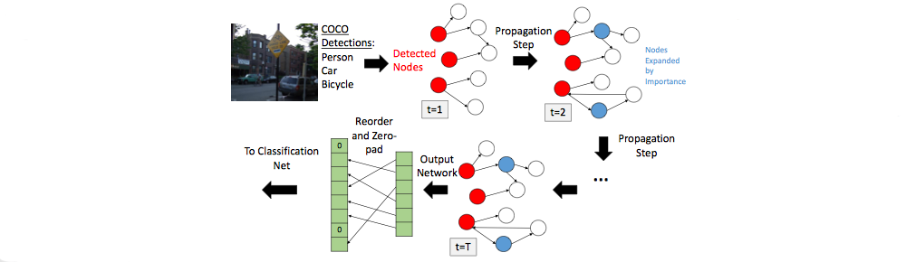
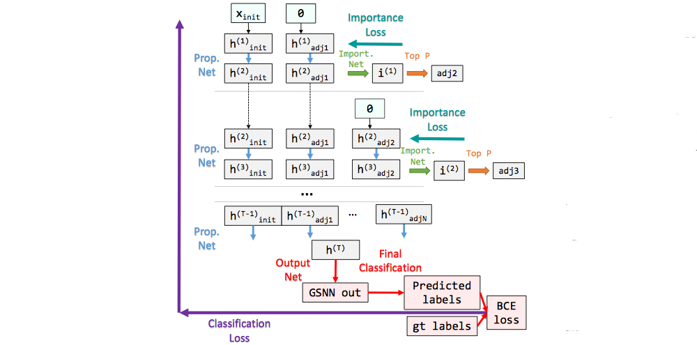
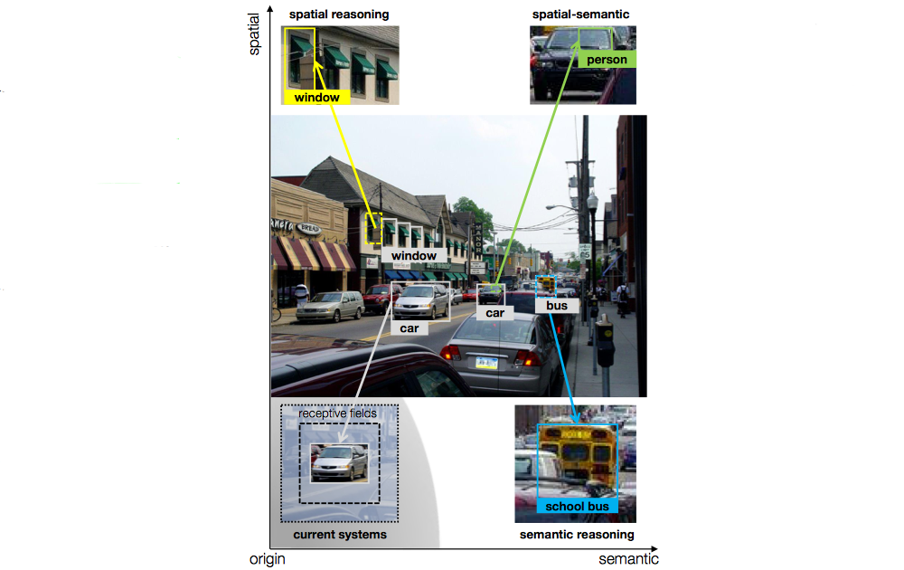
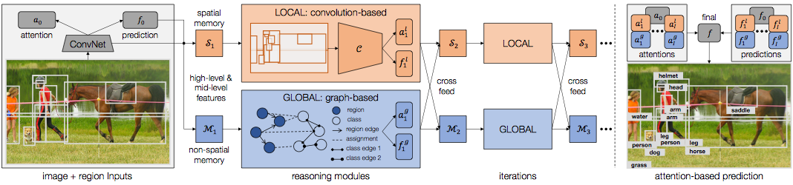

#### The More You Know

不同于基于学习的计算机算法，人类能够：

- 获得关于世界的知识并使用这些知识推理视觉世界；
- 用很少的样本，学习物体特征、物体间关系，获得大量视觉概念；

本文：

- 调查结构化先验知识——知识图谱的应用；
- 使用图搜索(Graph Search)神经网络(GSNN)将知识图谱引入图像分类流程；
- 展示这些先验知识能改善图像分类性能。

本文调整端到端的门限图(Gated Graph)网络(GGNN)到多标记图像分类任务，引入GSNN，它：

- 使用来自图像的特征高效标记图，选择图的相关子集，并在表示视觉概念的结点预测输出；
- 学习一个传播模型，它推断不同类型关系和概念以在之后用于分类的结点上产生输出的；
- 减轻了GGNN的计算问题使得能在海量知识图谱上对图像任务进行有效训练；
- 通过追寻信息在图中的传递分类的解释。

本文的贡献有：

- 引入GSNN作为将海量知识图谱吸收进在大型图赏计算可行的端到端学习系统；
- 一个使用有噪知识图谱进行图像分类的框架；
- 使用传播模型解释图像分类的能力。

##### 图门限网络(GGNN)

GGNN的思想是给定一个$N$结点的图，希望产生一些既可以是每个图结点的输出$o_1,o_2,\cdots,o_N$，也可以是整个图的输出$o_G$。这通过学习一个类似于LSTM的传播模型完成。对于图中每个节点$v$，在每个时间步$t$都有一个隐状态表达$h_v^{(t)}$：

- 在$t=0$以一个与问题相关的初始隐状态$x_v$开始。比如若要学习图的可达性，$x_v$就是2比特指示结点为起点还是终点的向量；在视觉知识图谱推理中，$x_v$就是1比特的表示在物体检测器或分类器上当前展示类别信念的激活值；

- 然后，将图的结构编码为一个矩阵$A$，用于根据连接边类型获得临界结点的隐状态；之后用一个类似于LSTM的门限更新模块来更新因状态；这个**传播网络(propagation network)**的基本循环(recurrence)是：
  $$
  \begin{eqnarray}
  h_v^{(1)} &=& \left[ x_v^T, 0 \right]^T \tag{1}\\
  a_v^{(t)} &=& A_v^T \left[ h_1^{(t-1)}, \cdots,h_N^{(t-1)} \right]^T + b \tag{2}\\
  z_v^t &=& \sigma\left( W^za_v^{(t)} + U^zh_v^{(t-1)} \right) \tag{3}\\
  r_v^t &=& \sigma\left( W^ra_v^{(t)} + U^rh_v^{(t-1)} \right) \tag{4}\\
  \widetilde{h_v^t} &=& \tanh\left( Wa_v^{(t)}+U\left( r_v^t\odot h_v^{(t-1)} \right) \right) \tag{5}\\
  h_v^{(t)} &=& \left( 1-z_v^t \right) \odot h_v^{(t-1)} + z_v^t \odot \widetilde{h_v^t} \tag{6}
  \end{eqnarray}
  $$
  其中$x_v$是问题相关的标记，$A_v$是结点$v$的图临接性矩阵，$W$和$U$都是学习的参数。公式(1)是用$x_v$和空白维度初始化隐状态；公式(2)展示了来自临界结点的传播更新；公式(3-6)结合了来自临界结点信息和当前结点隐状态来计算下个隐状态；

- 经过$T$步之后，就得到了最终隐状态。结点层次的输出可通过
  $$
  o_v = g\left( h_v^{(T)},x_v \right) \tag{7}
  $$
  计算，其中$g$是全连接的输出网络。

##### 图搜索网络(GSNN)

将GGNN应用到GSNN的最大问题是器计算可扩展性，本文的解决方案是GSNN。就如名称所表示的，其思想是以一些基于输入的初始结点开始并选择扩展对最终输出有用的结点，而非一次在图的所有结点上执行循环更新。在训练和测试期间：

- 基于由物体检测器或分类器确定的当前展示概念的似然来确定图中的初始结点；在实验中为80个COCO类别的每一个都使用了Faster R-CNN。

- 在获得初始结点后，也将临接到初始结点的结点添加到激活集，给定初始结点，这里希望：

  - 首先将初始结点的信念传播到所有临接结点中；

  - 之后，需要一种确定下一步扩展结点的方法，因此学习一个每结点(per-node)评估函数，来评估每个结点的重要性；在每步传播之后，对每个结点预测一个重要性分数：
    $$
    i_v^{(t)} = g_i \left(h_v, x_v \right) \tag{8}
    $$
    其中$g_i$是学习到的**重要性网络**；

  - 在获得$i_v$之后，取得分前$P$个未被扩展过的结点加入到已扩展集合中，并将所有临接到它们的结点添加到激活集中，如下图所示：

    

- 这样就获得了一个输入一系列初始结点和标记、输出图中每个激活结点的每结点输出的端到端网络。它由三个网络集组成：传播网络、重要性网络和输出网络。来自问题的最终损失能从流水线的最终输出通过输出网络传播回，而重要性损失则经由每个重要性输出传播。

  

  GSNN网络结构如上图所示：

  - 首先，检测信念$x_{\text{init}}$初始化初始检测到结点的隐状态$h_{\text{init}}^{(1)}$；
  - 然后，用0初始化临接结点的隐状态$h_{\text{adj1}}^{(1)}$，用传播网络更新隐状态，并用这些$h^{(2)}$值预测重要性分数$i^{(1)}$；
  - 之后，用$i^{(1)}$选择接下来的结点添加$\text{adj2}$并用$h_{\text{adj2}}^{(2)}=0$初始化，再次用传播网络更新这些隐状态；
  - 经过$T$步以后，用所有积累的隐状态$h^T$去预测所有激活结点的GSNN输出；

  在传播过程中，二元交叉熵(binary cross entropy, BCE)损失通过输出层反向投送，而重要性损失则通过重要性网络投送来更新网络参数。

  另外，在这里的图网络中，一个特定代表“马”或“猫”的结点很可能是相关的，这样可以在图像概念上限制到一个静态图，因此引入结点偏置项，即对图中的每个结点有一些学习到的值。输出公式现在变为$g\left( h_v^{(T)},x_v, n_v \right)$，其中$n_v$是在整个图上绑定到某个节点$v$的偏置项。这个值存储在一个表格中，其值通过传播更新。

#### Iterative Visual Reasoning Beyond Convolutions

在人类视觉中，空间和语义推理至关重要。下图中，空间推理如左上角所示：若一条直线上4个区域中的3个是“窗户”，则第4个也很可能是“窗户”；右下角为语义推理：仅有“公车”样本并知道两者的联系，即便极少或没有样本也能识别“校车”；最后是空间-语义推理：公路上“轿车”的识别能帮助识别车内”开车“的”人“。

关系推理的关键是迭代构建估计。本文提出一个迭代视觉推理的框架，不仅依赖于卷积，也能从结构化信息的知识图谱中学习。算法的核心由两个模块组成：

- 局部模块，基于空间内存存储先前信念，使用卷积网络执行像素级推理，主要通过并行存储更新改善效率；

- 全局图推理模块，基于图结构进行超越区域的推理，它有3个组件：

  - a)一个知识图谱，将类表示为节点并构建边来编码不同类型的语义关系；
  - b)当前图像的区域图，其中图像中的区域为节点，区域间的空间关系为边；
  - c)一个赋值图将区域赋给类。

  为此开发了一个在图上传递信息的推理模块。

局部和全局模块都迭代展开并互相提供预测以提炼估计。注意局部和全局推理并非孤立的：好的图像理解通常是学到先验背景知识和图像特定观测的结合。因此整个流程将通过允许在做最终预测时依赖最相关特征的注意力机制将两者能量结合起来。模型框架如下图：

##### 用卷积推理

首个构件是局部模块。在高层次上，其思想是使用空间存储$\mathcal S$在被发现位置存储前面检测到的物体。$\mathcal S$是一个三维张量，张量的前两个维度为高度$H$和宽度$W$，对应图像的缩小尺寸($1/16$)，第三个维度深度$D(=512)$，使存储的每个单元$c$为一个存储那个位置可能有用信息的向量。

$\mathcal S$使用高层和中层特征进行更新。对高层，会存储对应所估计类别标签的信息；但仅知类别并不理想，更多细节可能有助于其他物体，因此连同从底部卷积层$h$到馈入存储的映射，在softmax激活前使用模型(logits)$f$。

给定要更新的区域$r$，首先从底部层收割对应特征，并用双线性插值调整其大小为与定义的方形($7\times7$)作为$h$。因高层特征$f$是包含整个区域的向量，将器添加到所有49个位置位置上。使用两个$1\times1$卷积来融合信息并形成$r$的输入特征向量$f_r$。存储$\mathcal S$中同一区域也收割并调整其大小为$7\times7$，记为$s_r$。这样校准之后，使用卷积门限循环单元(GRU)来写存储：
$$
s_r' = u \circ s_r + (1-u) \circ \left( W_ff_r + W_s(z \circ s_r) + b \right)
$$
其中$s_r'$是$r$的更新存储，$u$是更新门，$z$是重置门，$W_f$、$W_s$和$b$是卷积权重和偏置，$\circ$是逐条目相乘。更新后，$s_r'$经过又一次修剪和调整大小操作后回置到$\mathcal S$。本文还提出了作为近似并行更新区域的方法。在重叠案例上，一个单元会被不同区域覆盖多次。在将区域回置到$\mathcal S$时，会计算一个权值矩阵$\Gamma$，其中每个条目$\gamma_{r,c}\in[0,1]$追踪一个区域$r$占一个单元$c$的比例：1表示完全被次区域覆盖，0表示无覆盖。更新单元的最终值是所有区域的加权和。实际的推理模块，一个有3个$3\times3$卷积和2个4096维全连接层的卷积网络$\mathcal C$，取$\mathcal S$为输入，在感受野的局部窗口内构建连接来执行预测。因为2维图像结构和位置信息都保存在$\mathcal S$中，因此这个结构对用空间推理的关系特别有用。

##### 超越卷积

第二个模块是超越局部区域和卷积的全局推理。这里的全局有双重含义：

- 首先是空间，即希望让相距更远的区域直接互相交换信息，而不受到推理模块$\mathcal C$感受野的限制；
- 第二是语义，即希望利用视觉知识库来提供整个图像类之间普遍正确（比如常识）的关系。

为获得这两种推理，构建图$\mathcal{G(N,E)}$，其中$\mathcal N$和$\mathcal E$分别表示节点集和边集：

- $\mathcal N$中定义两种节点：
  - $R$个区域的区域节点$\mathcal N_r$；
  - $C$个类的类节点$\mathcal N_c$；
- $\mathcal E$则定义了节点间的三组边：
  - 首先对于$\mathcal N_r$，用空间图编码区域间的空间关系($\mathcal E_{r\to r}$)，设计了多种类型边来描绘相对位置。从最基础的关系比如“左/右”和“顶/底”开始，通过衡量两者间的像素级距离来定义边权值。注意这里并不直接使用原始距离$x$，而是直觉是越近的区域关系越大，用核$\kappa(x)=\exp(-x/\Delta)$将其归一化到$[0,1]$之间，其中$\Delta=50$为带宽。这些权值之后就直接在图的临接矩阵中使用。另外包含了编码覆盖模式（比如IoU）的边，这在两个区域重叠时十分有效。
  - 其次是位于区域和类之间的边，会将区域赋给类；这样的边承担将信念从区域传递到类($e_{r\to c}$)或从类回馈到区域($e_{c\to r}$)的功能；这里并不只连接到最有信心的类，而是选择全softmax分数$p$来定义连接到所有类的边权值；希望这样能传递更多信息因此对错误分配更稳健。
  - 然后是知识库中类之间的语义关系构成的边($\mathcal E_{c\to c}$)，同样有多种类型，比如“是一种(is-kind-of)”、“是一部分(is-part-of)”等；很多都是普遍正确并被认为常识；有趣的是即便超出这些的关系（比如行为、介词）也有助于识别，比如“人骑车”，知道关系“骑”的两者的空间配置就有助于删除很多伪造解释。为此，本文测试了两种知识图谱：
    - 一种是自身的，以绝大多数常识边创建；
    - 另一个包含在大尺度上积累的更多类型的关系；

现在描述基于图推理的模块$\mathcal R$。作为图的输入，使用$M_r\in\mathbb R^{R\times D}$标记来自所有区域节点$\mathcal N_r$组合的特征，其中$D$(=512)是特征的频道数。对每个类节点$n_c$，选择现有的词向量作为方便的表示，记为$M_c\in\mathbb R^{C\times D}$。