#### 卷积神经网络

CNN从视觉皮层的生物学获得启发，视觉层有小部分细胞对特定部分的视觉区域敏感；比如一些神经元只对垂直边缘兴奋，另一些只对水平或对角边缘兴奋。这些神经元都以柱状结构的形式进行排列，而且一起工作才能产生视觉感知。这种一个系统的特定组件有特定任务的观点（视觉皮层的神经元细胞寻找特定特征）构成了CNN的基础。CNN由一系列卷积层、非线形层（就是激活层？）、池化（下采样，downsampling）层和全连接层。

CNN第一层通常是卷积层，输入通常为$\text{width} \times \text{height} \times 3$的像素数组，滤波器（卷积核或神经元）一次扫描图像的所有区域，扫描过的区域（也就是滤波器的大小）称为感受野；滤波器的深度必须与输入内容的深度相同，因此滤波器为$\text{krnl_w} \times \text{krnl_h} \times 3$的数组。滤波器在图像上滑动（卷积运算）时进行与相应区域的点积，若步长(stride)为1，最后得到一个$\text{(width-krnl_w)} \times \text{(height-krnl_h)} \times 1$的数组，称之为激活映射(activation map)或特征映射(feature map)。当使用$n$个$\text{krnl_w} \times \text{krnl_h} \times 3$滤波器时，就会得到$\text{(width-krnl_w)} \times \text{(height-krnl_h)} \times n$的数组；采用的滤波器越多，空间维度(spatial dimension)就保留得越好。

就高层角度而言，每个滤波器可以看成是特征标识符(feature identities)，这里的特征指的是如直线边缘、原色、曲线之类的东西。假设有一个$7 \times 7 \times 3$的曲线检测器（为方便分析，暂且忽略深度为3，只关心滤波器和图像顶层层面），它将有一个像素结构，在曲线旁会产生更高的数值。

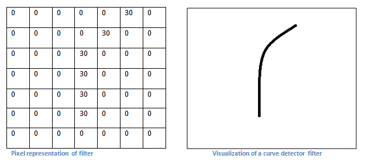

如果输入图像上某个形状看起来很像滤波器表示的曲线，则所有点积加在一起会得到一个很大的数值；反之，则是一个很小的数值。

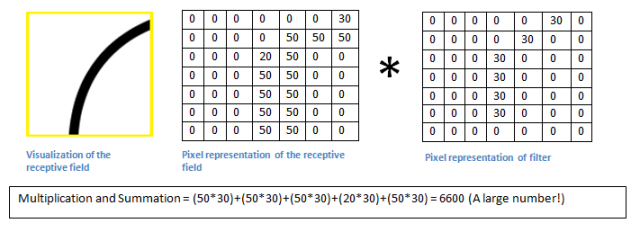

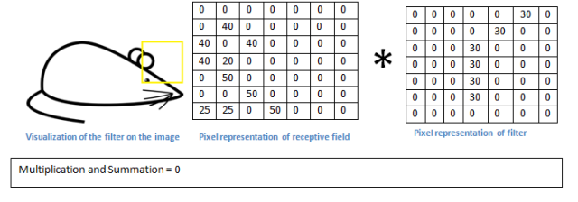

这个卷积层的输出是一个激活映射(activation map)，显示图像里最像曲线的区域。这仅是检测又拐弯曲线的过滤器，还有其他检测左转弯或直线边缘的过滤器。过滤器越多，激活映射深度越大，对输入内容了解就越多。因此，当在输入内容中寻找特定特征时，第一层上的过滤器在输入图像上进行卷积运算和“激活”。

卷积层之间还有其他类型的层，总的来说用于非线形和维度保留功能以提高网络的稳健性并控制过拟合。一个典型的CNN结构为：
$$
\text{Input} \rightarrow \text{Conv} \rightarrow \text{ReLU} \rightarrow \text{Conv} \rightarrow \text{ReLU} \rightarrow \text{Pool} \rightarrow \text{ReLU} \rightarrow \text{Conv} \rightarrow \text{ReLU} \rightarrow \text{Pool} \rightarrow \text{FullyConnected}
$$
第一个卷积层检测边缘和曲线一类的低级特征；为预测出图片内容的分类，网络需要识别更高级的特征，例如手、爪子和耳朵的区别。当进入另一个卷积层时，第一个卷积层的输出便是第二个卷积层的输入，也就是激活映射（大体描绘了低级特征在原始图片中的位置），通过第二个卷积层之后，输出将表示更高级的特征的激活映射，这类特征可以是半圆（曲线和直线的组合）或四边形（几条直线的组合）。随着进入网络越深和经过更多卷积层后，将得到更为复杂特征的激活映射。越深入网络，滤波器的感受野就越大，意味着能处理更大范围的原始输入内容。

检测高级特征之后，最后一层的全连接层处理输入内容（可能是卷积层、ReLU层或池化层的输出）后会输出一个$N$维的向量，$N$是分类数量。它观察高级特征并确定这些特征与哪一类最吻合（可以用softmax，也有其他的方法）。

初始时，CNN权重和滤波器的值都是随机的，通过反向传播来得到最终的网络。反向传播可分为四部分：前向传导，损失函数，后向传导和权重更新。假设损失是$L$，$W$是特定层级权重；在网络中进行后向传播确定出那部分权重导致最大损失，然后顺着梯度的方向将所有滤波器的权重更新：
$$
W = W_i - \eta \frac{dL}{dW}
$$
总体而言，前向传导、损失函数、后向传导、权重更新为一个学习周期，对每一个训练图片，将重复固定数目的周期。

要改变卷积层的行为，选择了滤波器的尺寸后，还要选择步幅(stride)和填充(padding)。步幅控制着滤波器围绕输入内容进行卷积计算的方式；步幅的选择通常要确保输出内容是一个整数而非分数；增大步幅，输出内容就会减少；正常情况下若希望减少重叠并缩小空间维度(spatial dimension)时，会增加步幅。卷积操作后所得的结果会比原始输入缩小，若要减缓尺寸缩小的速度，在网络的早期层中尽可能多保留原始输入内容信息，或希望卷积后保持与原始输入一样的维度，可以使用0填充。即在**输入内容**的边界周围补充0。

在每个卷积层之后，通常会立即应用一个非线形层（激活层），其目的是给刚在卷积层中经过线性运算的系统引入非线形特征。过去研究者使用双曲正切和$S$型函数，但后来发现ReLU层效果好得多，因为神经网络能在准确度不发生明显改变的情况下将训练速度提高很多（由于计算效率的增加）；它同样能减轻梯度弥散问题ReLU层对输入内容所有值应用函数$f(x)=\max(0,x)$，即将所有负激活都变为0，会增加模型乃至整个神经网络的非线形特征，并且不会影响卷积层的感受野。

几个ReLU层之后会选用一个池化层（下采样层），常用的是最大池化，通常采用一个$2 \times 2$滤波器以及同样长的步幅，然后将其应用到输入内容之上，输出卷积计算每个子区域的最大值。此外还有平均池化和L2-norm池化等。池化层背后的直观理解是：一旦知道了原始输入（这里会有一个高激活值）中的一个特定的特征，它与其它特征的相对位置就比其绝对位置更重要；这一层极大减少了输入的空间维度（长度和宽度改变，深度不变），这样有两个好处：一是权重参数极大减少因此降低了计算成本，二是可以控制过拟合。

Dropout层将“丢弃”该层的一个随机激活参数集，即在前向传播中将这些激活参数集设置为0，这种机制强制网络变得冗余，即该网络能为特定的样本提供合适的分类和输出，即使一些激活参数被丢弃；该机制将保证网络不会对训练样本“过匹配”，因此能缓解过拟合问题。另外，Dropout层只能在训练中使用，不能在测试中使用。

网络层中的网络指的是使用了$1 \times 1$尺寸滤波器的卷积层。这种感受野大于它们所映射空间的网络层之所以有帮助，是因为$1 \times 1$的卷积层跨越了特定深度，所以可以设想$1 \times 1 \times N$的卷积层，此处$N$代表了滤波器的数量。该层有效地使用$N$维数组元素依次相乘的乘法，此时$N$代表该层的输入深度。

迁移学习的思路是帮助降低数据需求，其指使用预训练模型（神经网络的权重和参数都已经被利用更大规模数据训练好）并用自己的数据集将模型微调的过程。这种思路中预训练模型扮演者特征提取器的角色，将移除网络的最后一层并用自有的分类器置换，然后冻结其它所有层的权重并正常训练该网络。

当将图片作为输入时，计算机会用一个包含一列像素值的数组描述。若图片左移一个像素，这种变化对人类而言是微不可查的，但对计算机而言变化非常显著；这幅图的类别或标签不变，数组缺变化了。这种改变训练数据的数组表征而保持标签不变的方法就是数据增强技术。人们经常使用的变化包括灰度变化、水平翻转、垂直翻转、随机编组色值跳变、翻译、旋转等其它多种方法。这样就能获得2倍甚至3倍原数据集的训练样本。

**Pooling层有这样一些作用**：

- 引入不变性，更关注是否存在某些特征而非特征的具体位置；
- 减小下一层输入大小，减小计算量和参数个数；
- 获得定长输入；
- 防止过拟合或有可能带来的欠拟合。

**参数调整**：

- 收集高质量标注数据；
- 输入输出数据做好归一化，以防出现数值问题；方法为主成分分析？（存疑）；
- 参数初始化很重要，一般权重参数0.01均方误差，0均值的高斯分布是万能的，偏差参数全0即可；
- 用SGD，minibatch size 128，或者更小size，但吞吐量会变小，计算效率变低；
- 用带momentum的SGD；
- 梯度更新的步长很重要，一般0.1是个万能值，调参可改进结果，具体做法是人肉监督：用另外的验证集观察测试错误率，一旦不降了，步长减半甚至更多；
- 梯度归一化：除以minibatch size；
- 限制权重参数最大值以防跑飞，一般最大行范数不超过2或4，否则同比收缩；
- 梯度大致应该总是只改变参数的千分之一，偏离这个数字太远的，调之；
- dropout一定要用；
- relu一定要用。

#### CNN架构模型发展

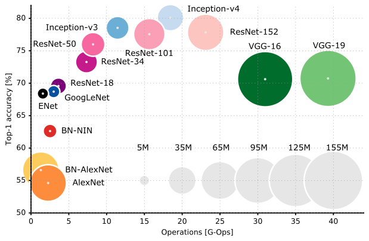

上图横坐标是操作复杂度，纵坐标是精度。模型一开始是权重越多模型越大精度越高，但随着ResNet、GoogleNet、Inception等网络架构出现后，在取得相同或更高精度的情况下，权重参数不断下降。

##### LeNet

1998年LeCun发布LeNet5，使用了5层的神经网络，确定了CNN的三个特性：1.局部感知；2.下采样；3.权值共享。

总结而言，LeNet5：

- 卷积网络使用三层架构：卷积、下采样和非线性激活函数；
- 使用卷积提取图像空间特征；
- 下采样使用了图像的平均稀疏性；
- 激活函数采用了tanh或sigmoid函数；
- 多层神经网络(MLP)作为最后的分类器；
- 层之间使用稀疏连接矩阵，以避免大的计算成本。

##### AlexNet

2012年Alex Krizhevsky发表AlexNet，网络扩展到7层。

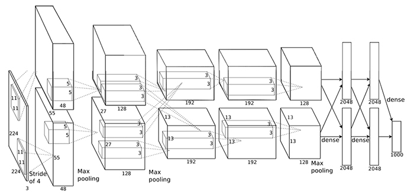

总结而言：

- 使用了ReLU作为激活函数，降低了Sigmoid类函数的运算量；
- 利用Dropout技术在训练期间选择性地剪掉某些神经元，从而避免过拟合；
- 引入max-pooling技术；
- 利用双GPU显著减少训练时间。

##### Network-in-Network

2013年低，Min Lin提出在卷积后面再跟一个$1 \times 1$卷积核对图像进行卷积，此即NiN的核心思想。NiN在每次卷积完后使用，目的是为了在进入下一层时合并更多特征参数。同样NiN也违背LeNet设计原则（浅层网络使用大的卷积核），但却有效地合并卷积特征、减少网络参数、同样的内存可以存储更大的网络。

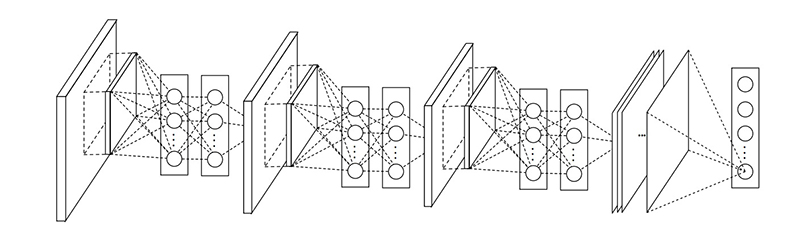

这个“网络中的网络”能提高CNN的局部感知区域；MLP多层感知的厉害之处在于它将卷积特征结合起来成为一个更复杂的特征。

##### VGG

2014年来自牛津大学的VGG网络是首个在每个卷积层上使用更小的$3 \times 3$卷积核对图像进行卷积、并将这些卷积核排列起来作为一个卷积序列；即对原始图像进行$3 \times 3$卷积，然后再进行$3 \times 3$卷积，连续使用小的卷积核对图像进行多次卷积。VGG神奇之处在于使用多个$3 \times 3$卷积核可以模仿较大卷积核那样对图像进行局部感知；后来多的小卷积核串联这一思想被GoogLeNet和ResNet吸收。

下图可以看出，VGG使用多个$3 \times 3$卷积来对高维特征进行提取；VGG相信使用大的卷积核将会造成很大的时间浪费。

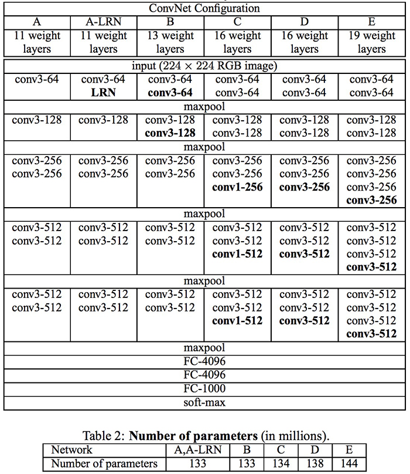

##### GoogLeNet

2014年，为有效减少计算资源，Christian Szegedy提出了GoogLeNet结构（也叫Inception v1）。

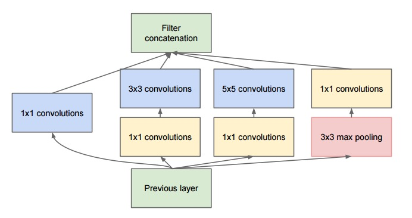

基本上是$1 \times 1$，$3 \times 3$，$5 \times 5$卷积核并行合并。最重要的是使用了$1 \times 1$卷积核(NiN)来减少后续并行操作的特征数量。这个思想现在被称为瓶颈层(Bottleneck Layer)。

受NiN启发，GoogLeNet的Bottleneck Layer减少了特征数量，从而减少了每一层的操作复杂度，因此可以加快推理时间。在将数据传递到下一层卷积之前，特征数量减少了4左右，因此大量节省了计算成本。成功的原因是输入特征是相关的，因此可以适当地通过与$1 \times 1$卷积组合来消除冗余。然后，在卷积具有较小数目的特征之后，可以再一次扩展并作用于下一层输入。

##### Inception V3

Christian团队在2015年发表新文章提出在GoogLeNet中加入一个Batch-normalized层(Inception V3)。Batch-normalized层归一化计算图层输出处所有特征图的平均值和标准差，并使用这些值对其响应进行归一化。这对应于“白化”数据非常有效，并且使得所有神经层具有相同范围并且具有零均值的响应。这有助于训练，因为下一层不必学习输入数据中的偏移，并且可以专注于如何最好地组合特征。

并更好地解释了GoogLeNet原始思想：

- 通过构建平衡深度和宽度的网络，最大化网络的信息流。在进入pooling层之前增加feature maps；
- 当网络层数增加时，特征的数量或层的宽度也相对应地增加；
- 在每一层使用宽度增加以增加下一层之前的特征组合；
- 只使用$3 \times 3$卷积。

最后模型变为：

网络架构最后还使用pooling层+softmax层作为最后的分类器。

##### ResNet

ResNet的一个重要思想是：输出的是两个连续的卷积层，并且输入时绕到下一层去：

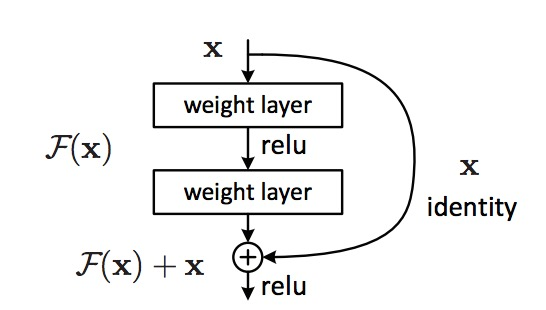

但在这里使用的是绕过2层，并且大规模地在网络中运用这种模型。在2层之后绕过是一个关键，因为绕过单层实践表明并没有太大帮助，而绕过2层可以看作是在网络中的一个小分类器，通过这种架构最后实现了超过1000层的神经网络。

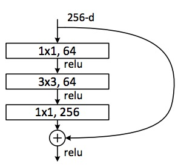

该层首先使用$1 \times 1$卷积然后输出原来特征数的1/4，然后使用$3 \times 3$卷积核，然后在此使用$1 \times 1$卷积核但这次输出特征数为原来输入大小，这样就像Bottleneck Layer那样说的大量减少了计算量，但却保留了丰富的高维特征信息。

ResNet一开始使用的是$7 \times 7$大小的卷积核，然后跟一个pooling层，最后的分类器跟GoogLeNet一样也是一个pooling层+一个softmax层作为分类器。

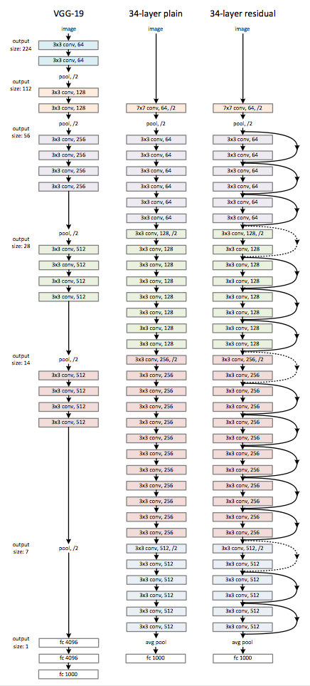

ResNet网络特征：

- ResNet可以看作并行和串行多个模块的结合；
- ResNet上部分的输入和输出一样，因此看上去有点类似RNN，是一个更好的生物神经网络模型。

##### SqueezeNet

2016年提出，说SqueezeNet有着AlexNet一样的精度，却少了近50倍的参数并只需占用很小的内存空间。

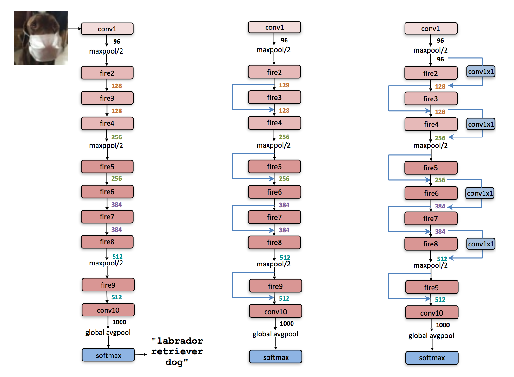

##### Xception

使用与ResNet和Inception V4一样简单优雅的架构，并改进了Inception。具有36个卷积层，与ResNet-34很相似。

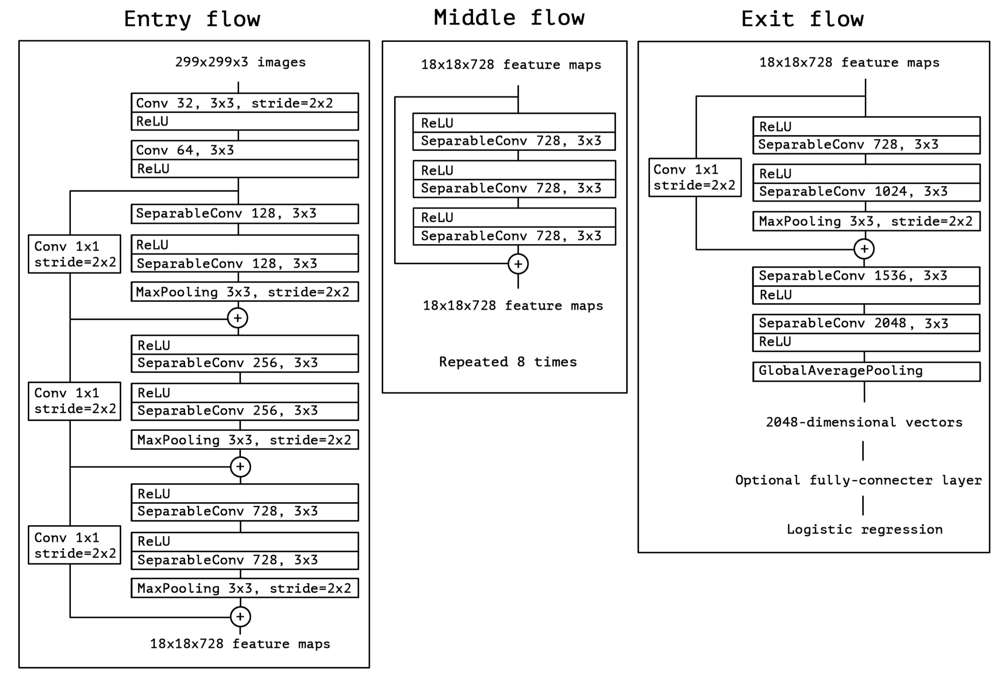

#### RNN

RNN按时间展开：

相应的计算公式为：

- $x_t$是时间步$t$的输入；
- $s_t=f(Ux_t+Ws_{t-1})$是隐状态，也是网络的记忆；
- $o_t = \text{softmax}(Vs_t)$为输出。

需要注意的是：

- $s_t$是网络记忆，获取目前为止所有的信息；输出$o_t$仅依赖于$s_t$；
- RNN在所有的步骤共享一样的参数（上面的$U,V,W$）；这反应出在每一步执行相同的操作；着极大减少了参数量；
- 不一定每一步都有输入或输出。

下面是RNN的改进：

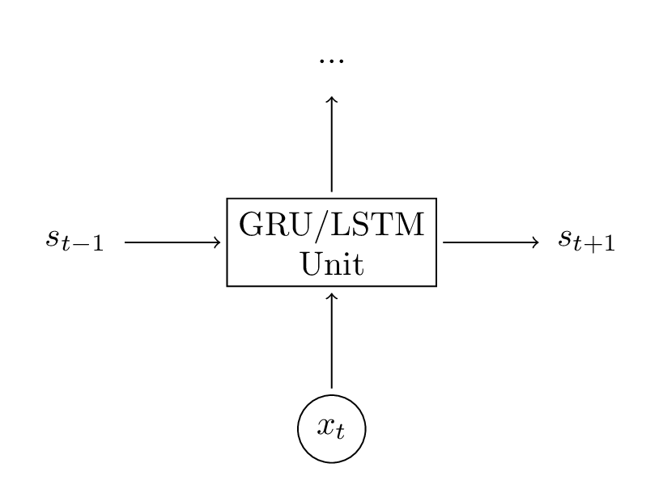

##### LSTM

LSTM致力于解决梯度弥散问题。其隐状态计算公式为：
$$
\begin{aligned}
i &= \sigma \left( x_tU^i + s_{t-1}W^i \right) \\
f &= \sigma \left( x_tU^f + s_{t-1}W^f \right) \\
o &= \sigma \left( x_tU^o + s_{t-1}W^o \right) \\
g &= \tanh \left( x_tU^g + s_{t-1}W^g \right) \\
c_t &= c_{t-1} \circ f + g \circ i \\
s_t &= \tanh(c_t) \circ o
\end{aligned}
$$

- $i,f,o$分别是输入、遗输出门被称为“门”是因为其决定了另一个向量通过多少的内容；输入门决定希望为当前输入计算的最新状态通过的量；遗忘门定义前一个状态允许通过的量；输出门定义希望暴漏给外部网络的内部状态的量。
- $g$是基于当前输入和前一个隐状态计算的“候选”隐状态；
- $c_t$是网络的内存，是前一个记忆$c_{t-1}$乘以遗忘门与最新计算隐状态$g$乘以输入门的结合；
- 结合$c_t$，最终计算输出隐状态$s_t$。

