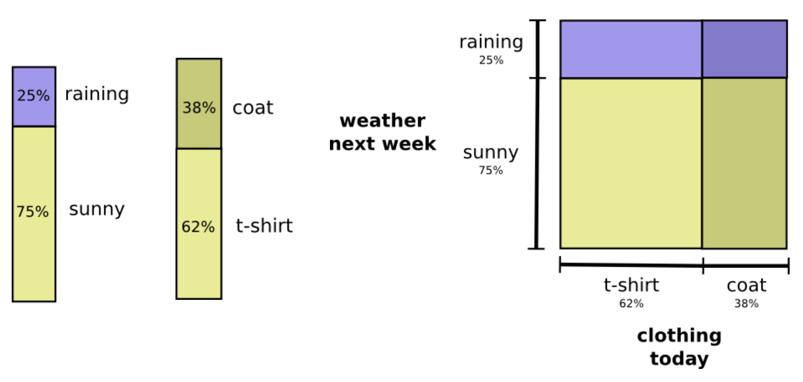

本文翻译和整理自Colah的[博文](http://colah.github.io/posts/2015-09-Visual-Information/)。作者热衷于将模糊的思想形式化为具体的概念。信息论就是一个极好的例子。信息论给了我们描述很多事物的精确语言。事物的确定性？知道问题B的答案后获得关于问题A的信息量？一个信念集与另一个相似性的量？这些信息应用非常广泛，从数据压缩到量子物理，到机器学习，以及它们之间极其广泛的领域。然而信息论显得令人望而生畏，但事实上很多核心的思想都有你非常图形化的解释。

##### 概率论的可视化

在加州，假设天晴的概率为75%；穿外套的概率是38%；则这两个事件的概率以及相互独立时的联合分布可以表示为

当变量相互影响时