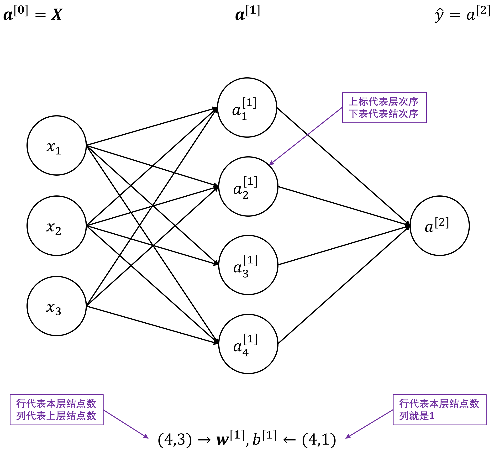

##### 1.神经网络的表达

对于第一个隐层，其计算为：
$$
\begin{aligned}
&z_1^{[1]} = \mathbf{w_1^{[1]T}x} + b_1^{[1]},\quad a_1^{[1]}=\sigma\left( z_1^{[1]} \right)\\
&z_2^{[1]} = \mathbf{w_2^{[1]T}x} + b_2^{[1]},\quad a_2^{[1]}=\sigma\left( z_2^{[1]} \right)\\
&z_3^{[1]} = \mathbf{w_3^{[1]T}x} + b_3^{[1]},\quad a_3^{[1]}=\sigma\left( z_3^{[1]} \right)\\
&z_4^{[1]} = \mathbf{w_4^{[1]T}x} + b_4^{[1]},\quad a_4^{[1]}=\sigma\left( z_4^{[1]} \right)\\
\end{aligned}
$$
将其向量化表示为：
$$
\begin{aligned}
\begin{bmatrix}
- & \mathbf{w_1^{[1]T}} & - \\
- & \mathbf{w_2^{[1]T}} & - \\
- & \mathbf{w_3^{[1]T}} & - \\
- & \mathbf{w_4^{[1]T}} & -
\end{bmatrix}
\begin{bmatrix}
x_1\\
x_2\\
x_3
\end{bmatrix} +
\begin{bmatrix}
b_1^{[1]}\\
b_2^{[1]}\\
b_3^{[1]}\\
b_4^{[1]}
\end{bmatrix} &= 
\begin{bmatrix}
\mathbf{w_1^{[1]T}x} + b_1^{[1]}\\
\mathbf{w_2^{[1]T}x} + b_2^{[1]}\\
\mathbf{w_3^{[1]T}x} + b_3^{[1]}\\
\mathbf{w_1^{[1]T}x} + b_4^{[1]}
\end{bmatrix} =
\begin{bmatrix}
z_1^{[1]}\\
z_2^{[1]}\\
z_3^{[1]}\\
z_4^{[1]}
\end{bmatrix}\\
a^{[1]} &= 
\begin{bmatrix}
a_1^{[1]}\\
a_2^{[1]}\\
a_3^{[1]}\\
a_4^{[1]}
\end{bmatrix} = \sigma(\mathbf{z^{[1]}})
\end{aligned}
$$
