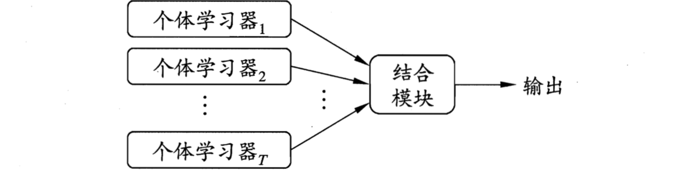
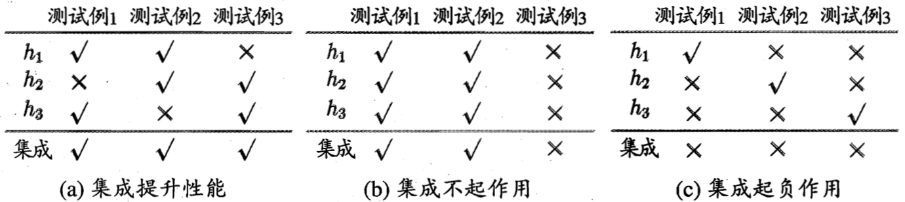

集成（ensemble）学习构建并结合多个分类器来完成学习任务，下图展示了其一般结构：先产生一组个体学习器（individual leaner），再用某种策略将它们结合起来。通常由一个现有的学习算法从训练数据产生，它们可以是同种类型即“同质（homogeneous）”，也可以是不同类型即“异质（heterogeneous）”。同质集成的个体学习器一般称为“基学习器”，相应的学习算法为“基学习算法”；异质集成中的个体学习器称为“组件学习器”。

集成学习通过将多个学习器进行结合，常可获得比单一学习器显著优越的泛化性能，这对“弱学习器”（泛化性能略优于随机猜测的学习器）尤为明显，因此集成学习的很多理论研究都是针对弱学习器进行，而基学习器有时亦被称为弱学习器；但实际中出于使用较少个体学习器、重用关于常见学习器等原因，人们往往会使用较强的学习器。集成学习的结果是通过投票即少数服从多数产生的，下图展示了不同情况下的集成，从中可以看出：要获得好的集成，个体学习器应“好而不同”，即个体学习器要有一定的“准确性”，至少不差于弱学习器，且要有“多样性”，即学习器之间有差异。

考虑二分类问题$y \in \{-1, +1\}$和真实函数$f$，假定弱分类器错误率为$\epsilon$，即对每个基分类器$h_i$有：
$$
P(h_i(\mathbf x)\neq f(\mathbf x)) = \epsilon
$$
若集成通过简单投票法结合$T$个基分类器，若有超过半数的基分类器正确则集成分类就正确：
$$
H(\mathbf x) = \text{sign}\left( \sum_{i=1}^T h_i(\mathbf x) \right)
$$
假设基分类器的错误率互相独立，则由Hoeffding不等式可知，集成错误率为：
$$
\begin{align}
P(H(\mathbf x) \neq f(\mathbf x)) &= \sum_{k=0}^{\left\lfloor T/2 \right\rfloor} {T \choose k}(1-\epsilon)^k\epsilon^{T-k}\\ &\le\exp\left( -\frac12T(1-2\epsilon)^2 \right)
\end{align}
$$
可见随着集成中个体分类器数目$T$的增大，集成的错误率将指数级下降，最终趋向于0。

然而上面的分析有一个关键假设：学习器的误差是相互独立的，但实际任务