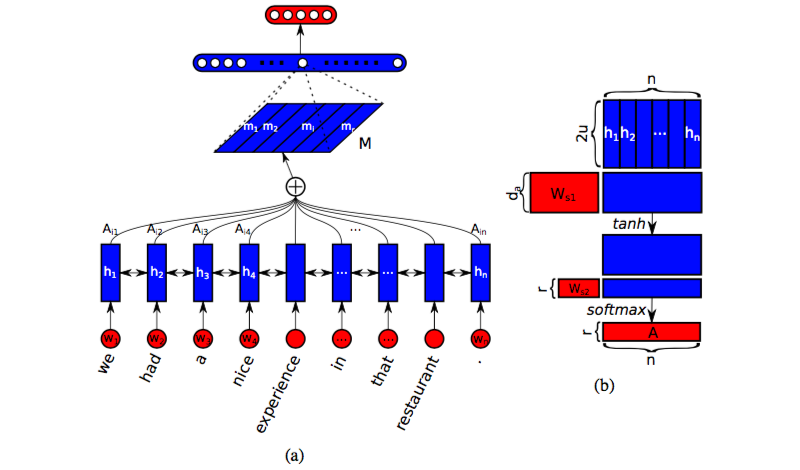
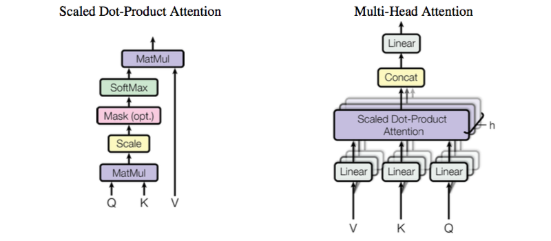
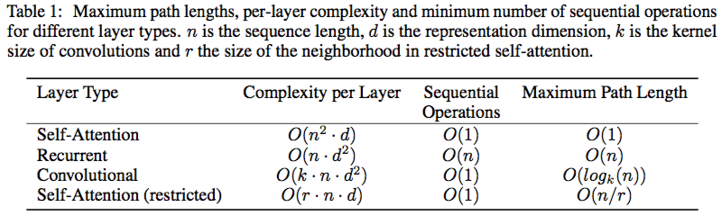

#### A Structured Self-Attentive Sentence Embedding

本文通过引入自注意力，提出一种新的提取可解释句子嵌入的模型。这里使用2维矩阵来表示嵌入，每一行关注句子的不同部分。本文也为模型提出了一种自注意力机制和特殊的正则化项，作为一种附带收益，这种嵌入提供了一种简单的可视化句子特定部分在其中的编码。

学习单词个体的语义意义的分布式表达已经取得了很大进展，这些方法通常落入两类：一种由通用句子嵌入组成，通常由无监督的方法训练，包括[SkipThought vector](https://papers.nips.cc/paper/5950-skip-thought-vectors.pdf)，[Paragraph Vector](https://cs.stanford.edu/~quocle/paragraph_vector.pdf)，递归自编码器、顺序去噪自编码器、[FastSent](http://www.aclweb.org/anthology/N16-1162)等；另一类则是明确为某类任务训练的模型，通常与下游应用结合并用有监督方法训练，且大多比通用句子嵌入表现更好，尽管后者能用于半监督的设定和发掘大型无标记语料库。

针对一些任务人们提出了CNN或LSTM模型之上的注意力机制来引入额外信息源以引导句子嵌入的抽取。但对其他一些任务比如情感分类就非直接可用，因为没有这样的额外信息：仅给模型单个句子为输入。这种情况下，最常用的就是在所有时间步增加max池化或平均步，或挑选出最后步的表达作为编码向量。

这些方法都包含使用RNN中最后一个隐状态或最大/平均池化RNN隐状态/卷积n元以创建一个向量表示，本文假定在循环模型中所有时间步都携带语义是困难且非必要的，并提出这些顺序模型的自注意力机制来替代最大池化或平均步。它在LSTM上操作，允许将句子的不同方面提取到多个向量表达中，这就使得在没有额外输入信息也能应用注意力机制。另外，因其到前面时间步隐状态的直接通道，它也缓解了LSTM的记忆负担。附带地，解释这些嵌入也十分简单和清楚。

##### 1.方法

**模型**：包含两部分，第一部分是双向LSTM，第二部分是自注意力机制，它提供了一些LSTM隐状态求和权值向量。这些求和权值向量与LSTM隐状态点乘，将产生的加权LSTM隐状态视为句子的嵌入。下图展示了这个句子嵌入模型与全连接层和softmax层结合应用于情感分析的例子。

假定一个句子有$n$个记号，在一个词向量中表示：
$$
S = (\mathbf{w_1, w_2, \cdots, w_n}) \tag{1}
$$
这里$w_i$是一个代表句中第$i$个词的$d$维向量，因此$S$就是表示为2-D矩阵的额序列，形状为$n\times d$。现在序列$S$中每个条目都是独立的，为获得单句中临接词间的依赖，使用一个双向LSTM来处理这句话：
$$
\begin{eqnarray}
\overrightarrow{h_t} &=& \overrightarrow{LSTM}(w_t, \overrightarrow{h_{t-1}})\tag{2}\\
\overleftarrow{h_t} &=& \overleftarrow{LSTM}(w_t, \overleftarrow{h_{t+1}})\tag{3}
\end{eqnarray}
$$
将每个$\overrightarrow{h_t}$与$\overleftarrow{h_t}$拼接起来获得隐状态$h_t$。令每个单向LSTM的隐单元数为$u$。为简化，将所有$n$个$h_t$记为$H$，因此其维度就是$n\times 2u$：
$$
H = (\mathbf{h_1,h_2,\cdots,h_n})\tag{4}
$$
目标是将一个变长句子编码为定长嵌入，为此选择这$n$个LSTM隐向量的线性组合，计算这样的线性组合需要自注意力机制，它将整个LSTM隐状态$H$作为输入，输出权值向量$\mathbf a$：
$$
\mathbf a = softmax\left( \mathbf{w_{s2}}tanh\left( W_{s1}H^T \right) \right)
$$
这里$W_{s1}$是一个形状为$d_a \times 2u$的权值矩阵，而$\mathbf{w_{s2}}$是大小为$d_a$的系数向量，其中$d_a$是任意设定的超参。因$H$大小为$n\times2u$，标记向量$a$的大小为$n$。$softmax()$确保了所有计算的权值和为1。然后基于$\mathbf a$提供的权值将LSTM隐状态$H$相加起来形成输入句子的向量表达$\mathbf m$。

这个向量表达通常关注句子的特定部分，就像一个特殊的相关词和短语集。因此它反映句子语义的一方面或一部分。然而可能有多部分一起形成了句子的完整语义，尤其是长句（例如由"and"连接起来的两个从句）。因此，为表示句子的整体语义，需要多个$\mathbf m$关注句子的不同部分。因此需要执行多次注意力。假定从句子中提取$r$个不同部分，因此将$\mathbf{W_{s2}}$扩展为一个$r\times d_a$的矩阵$W_{s2}$，产生的标记矩阵$A$：
$$
A = softmax\left( W_{s2}tanh\left( W_{s1}H^T \right) \right) \tag{6}
$$
这里$softmax()$沿第二维执行。可以认为公式(6)是一个无偏置的2层MLP，其隐层单元数为$d_a$，参数为$\{W_{s2}, W_{s1}\}$。嵌入向量此时就变为$r\times 2u$的嵌入矩阵$M$，这$r$个加权和是通过标记矩阵$A$乘以LSTM隐状态$H$而得，因此得到的句子嵌入矩阵就是：
$$
M = AH \tag{7}
$$
**惩罚项**：

#### Attention is All You Need

循环模型通常沿输入输出的符号位置分解计算，这种固有的顺序本质妨碍了样本训练的并行。注意力机制已成为序列和转换任务必不可少的部分，它允许输入输出序列任意距离位置依赖关系的建模。本文提出了Transformer，一个完全依赖注意力机制而引出全局依赖的模型架构。

ByteNet、ConvS2S也致力于减少顺序计算，它们以卷积神经网络作为基础构件，并行地为所有输入和输出计算隐式表达。而关联来自任意两个输入输出位置信号所需要的操作，随位置间的距离，ConvS2S为线性增长，ByteNet为对数增长。而在Transformer则中减为常数，尽管以由于平均注意力加权的位置而减少了有效分辨率。

自注意力(self-attention)，又称为内注意力(intra-attention)，是一种将三个序列的不同位置关联起来的注意力机制，已经在包括[阅读理解](http://arxiv.org/abs/1601.06733)、[抽象摘要](A decomposable attention model)、[文本蕴含](http://arxiv.org/abs/1705.04304)以及[任务无关的句子表达学习](http://arxiv.org/abs/1703.03130)等多种呢任务中获得成功；[端到端记忆网络](End-to-end memory networks)基于循环注意力机制，在单语言问答和语言建模上表现良好。

##### 1.模型结构

大多数有竞争的神经序列转换方法都有编码器-解码器结构。编码器将输入序列的符号表达$(x_1,\cdots,x_n)$映射为连续表达$\mathbb z=(z_1,\cdots,z_n)$；给定$\mathbb z$，解码器每次产生输出符号序列$(y_1,\cdots,y_m)$的一个元素。在每一步，模型都是自回归(auto-regressive)的，在产生下个元素时会前面产生的元素为额外的输入。Transformer遵循这样的总体结构，在编解码器上都使用堆叠自注意力和逐点、全连接层，分别入下图左右部分所示：

**1.1编码器和解码器栈**：

编码器由一堆$N=6$的同一层组成，每一层有两个子层，第一个是多头自注意力机制(multi-head self-attention mechanism)，第二个是简单逐位的全连接前向网络。每个子层周围都部署一个残差连接，其后跟随层正规化。也就是说每个子层的输出都是$\text{LayerNorm}(x+\text{SubLayer}(x))$。为此，模型中所有子层，包括嵌入(embedding)层，都产生$d_{\text{model}}=512$维的输出。

解码器也由一堆$N=6$的同一层构成，除编码器中的两个子层外，插入了第三个在编码器栈输出上执行多头注意力的子层。在每个子层5同样部署了残差连接跟随层正规化。同时修改自注意力子层来阻止位置注意后来的位置。这种掩蔽结合了输出嵌入是一个位置偏移的事实，确保了位置$i$的预测仅位置小于$i$的已知输出。

**1.2注意力**：

注意力函数可以描述为映射一个查询和一系列键-值对到一个输出，其中查询、键、值和输出都是向量。输出计算为这些值的加权和，而分配到每个值的权值则由用对应键的查询兼容性函数计算获得。

**调节点乘注意力**：如上图左部所示，模型中的特定注意力被称为“调节点乘注意力(Scaled Dot-Product Attention)”，输入由维度为$d_k$的查询和键、以及维度为$d_v$的值组成，用所有键来计算查询的点乘，用$\sqrt{d_k}$除每一个，并应用softmax函数来获得每个值上的权值。实践中，会在一系列打包进一个矩阵$Q$的查询上同时计算注意力函数，键和值也一起打包进矩阵$K$和$V$，然后计算输出矩阵：
$$
\text{Attention}(Q,K,V) = \text{softmax}\left( \frac{QK^T}{\sqrt{d_k}} \right)V \tag{1}
$$
两个最通用的注意力函数是加法注意力和点乘（乘法）注意力。点乘注意力除调节因子$\frac{1}{\sqrt{d_k}}$外等价于这里的算法；加法注意力仅使用一个单隐层前馈神经网络计算兼容性函数。尽管两者的理论复杂性相似，但因为可以使用高度优化的矩阵乘法代码，在实践中点乘注意力时间和空间效率都更高。虽然对小的$d_k$值两种机制表现相似，但当$d_k$很大且不进行调节时加法注意力更优，原因可能是点乘大小增加很大，将softmax函数推进一个梯度极小的空间。为抵消这个效应，因此用$\frac{1}{\sqrt{d_k}}$来调节了点乘。

**多头注意力**：相比于用$d_{\text{model}}$维键、值和查询单次执行注意力函数，将它们用不同的、学习到的投影分别线性投影$h$次到$d_k$、$d_k$和$d_v$维效果更好。然后在每个这些投影版的查询、键和值上并行执行注意力函数，产生$d_v$维输出值。将这些连结起来并再次投影，产生最终的结果，如上图右侧所示。多头注意力允许模型连带地关注来自不同位置不同表达子空间的信息。而单个注意头的平均则无法实现这个。
$$
\begin{eqnarray}
\text{MultiHead}(Q,K,V) &=& \text{Concat}(\text{head}_1,\dots,\text{head}_h)W^O\\
\text{where }\text{head}_i &=& \text{Attention}(QW_i^Q, KW_i^K,VW_i^V)
\end{eqnarray}
$$
其中投影就是系数矩阵$W_i^Q \in \mathbb R^{d_{\text{model}}\times d_k}$，$W_i^K \in \mathbb R^{d_{\text{model}}\times d_k}$，$W_i^V \in \mathbb R^{d_{\text{model}}\times d_v}$。本片文章部署了$h=8$个并行注意力层，即头。对这些中的每个使用$d_k=d_v=d_{\text{model}}/8=64$。由于每个头缩减的维度，总的计算代价与用满维的单头类似。

**模型中注意力的应用**：Transformer中以三种方式使用了多头注意力：

- 在“编码器-解码器注意力”层中，查询来自前个解码器层，记忆键和值则来自解码器的输出。这就使解码器的每个位置能关注输入序列的所有位置。这模仿了序列到序列模型中的经典编码-解码器注意力机制。
- 编码器中包含自注意力层。在自注意力层中所有所有的键、值和查询都来自相同的地方，这里就是编码器前一层的所有输出。 解码器中的每个位置都能关注前一层的所有位置；
- 同样，解码器中的自注意力层也允许每个位置关注到包含自身的位置。这里需要阻止解码器中左侧信息流保留自回归特征。这在调节点乘注意中通过将softmax输入中对应非法连结的所有值掩蔽出（设置为$-\infty$）实现。

**1.3逐位前向网络**

除注意力子层外，编码器和解码器的每一层都包含一个分别和等价应用到每个位置的全连接前向网络，它包含两个现行变换以及一个之间的ReLU：
$$
\text{FFN}(x) = \max(0, xW_1+b_1)W_2 + b_2
$$
虽然不同位置的先行变化相同，但层与层之间的系数不同。另一种描述这个的方式是核大小为1的两个卷积。输入和输出的维数是$d_{\text{model}}=512$，而内层拥有$d_{ff}=2048$的维度。

**1.4嵌入与Softmax**

类似于其他序列转换任务，这里也使用了学习得到的嵌入来将输入记号和输出记号转换为$d_{\text{model}}$维的向量，以及学习到的线性变换和softmax函数将解码器输出变换为预测的下个记号概率。模型中两个嵌入层间共享参数矩阵和预-softmax先行变化。在嵌入层将那些乘以$\sqrt{d_{\text{model}}}$。

**1.5位置编码**

因为模型中既没循环也没卷积，为使模型使用序列的顺序，必须注入关于记号相对或绝对位置的信息。为此，在编码器和解码器栈的底部增加了“位置嵌入”到输入嵌入中。位置嵌入又同样的维数$d_{\text{model}}$，因此这两者可以相加起来。又许多学到货修正的位置嵌入[选择](http://arxiv.org/abs/1705.03122)。这里使用不同频率的正弦和余弦函数：
$$
\begin{eqnarray}
PE_{(pos,2i)} &=& \sin\left( \frac{pos}{10000^{\frac{2i}{d_{\text{model}}}}} \right) \\
\\
PE_{(pos,2i+1)} &=& \cos\left( \frac{pos}{ 10000^{\frac{2i}{d_{\text{model}}}}} \right) 
\end{eqnarray}
$$
其中$pos$是位置，而$i$则是维度。也即位置编码的每一维对应一条正弦曲线，波长形成$2\pi$到$2000\pi$的几何级数。选择这个函数是因为假设其这个模型能够很简单地学会关注相对位置。因为对任意固定的便宜$k$，$PE_{pos+k}$可以表示为$PE_{pos}$的线性函数。本文也用学习到的位置编码替代进行了试验，但两个版本产生几乎等价的结果，之所以选择正弦曲线是它允许模型外推序列长度大于训练中碰到的。

**1.6自注意力**

这里多方面比较自注意力层与映射变长符号表达序列$(x_1,\cdots,x_n)$到另一等长$(z_1,\cdots,z_n)$中常用的卷积和循环层，其中$x_i,z_i\in\mathbb R^d$，主要有三个需求使自注意力脱颖而出：首先是每一层的计算复杂性。其次是能并行的计算量，以需要顺序操作的最小数量衡量。然后是网络中大范围依赖的路径长度，学习大范围依赖是许多序列转换任务的关键，而影响这种能力的一个关键因子就是信号在网络中前向和反向传递的长度，任意输入输出序列位置组合间的这种路径越短则越容易学习。如下表所示，

自注意力的一个附带好处是能产生更可解释的模型。不仅注意头个体清除地学习了执行不同的任务，许多都展示了与句子句法和语义相关的额行为。