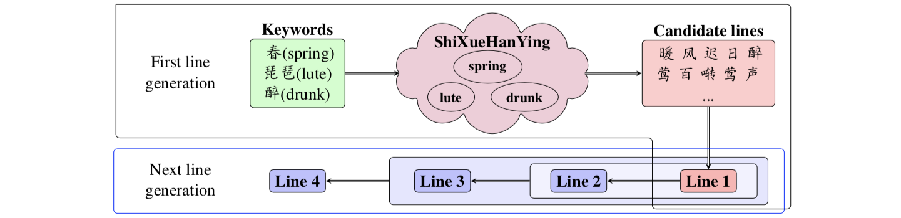
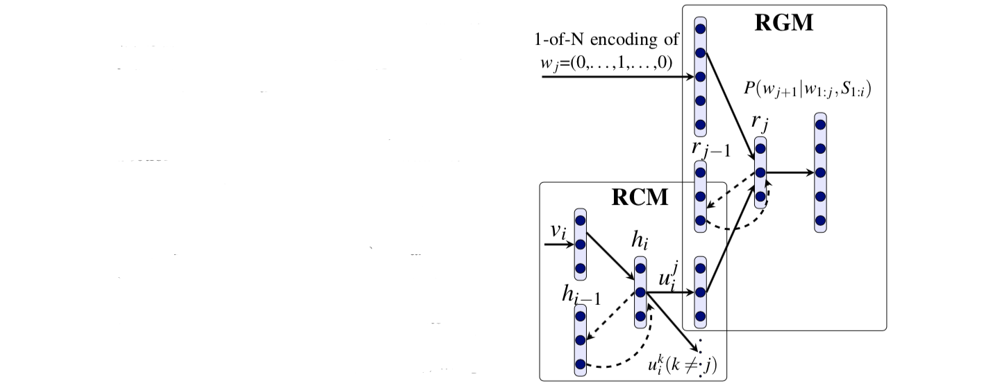
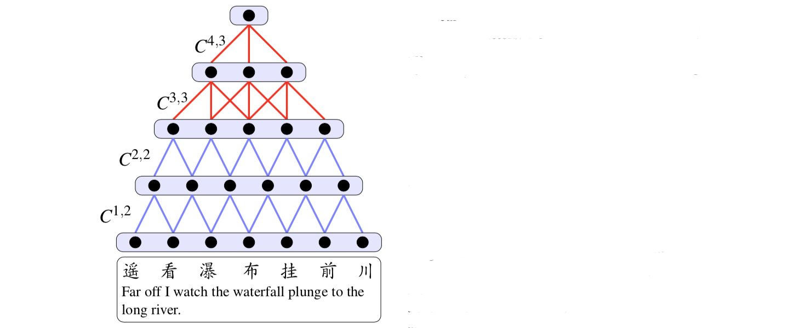

##### 1. Chinese Poetry Generation with Recurrent Neural Networks

这篇文章提出了一个使用循环神经网络获取诗歌内容和形式来生成诗歌的模型，通过学习单个字符和组合成一行或多行以及这些行如何互相补充和限制的表达，生成器同时执行内容选择（“说什么”）和形式实现（“怎么说”）。生成器是在交互语境下操作，用户提供关键词（比如春、琵琶、醉）来强调诗歌吟唱的主要概念。生成器会将这些关键词扩展为一些相关短语，如下图所示，并假定关键词在《诗学含英》诗歌短语分类中被验证，后者包含了1016个手工短语簇。每个簇都用一个关键词id描述诗歌相称的主题。生成器基于这些关键词创作诗歌的第一行，后面的行都依照音律和机构、在所有前面行的基础上生成。

为生成第一行，选择所有对应用户关键词的短语并产生所有满足音调模式（平仄律）的组合，然后使用一个语言模型给生成的候选排序，选择最好的作为诗歌的第一句。实现时使用内插Kneser-Ney三元组的基于字符循环神经网络语言模型并使用堆叠解码器来找到$n$-最优候选。然后再基于第一句生成第二句，基于前两句生成第三局等等。给定所有前面生成行$S_{1:i}(i\ge1)$，生成模型计算第$S_{i+1}=w_1,\cdots,w_n$行的概率为：
$$
P\left(S_{i+1} \mid S_{1:i}\right) = \prod_{j=1}^{m-1} P\left( w_{j+1} \mid w_{1:j},S_{1:i} \right) \tag{1}
$$
可以看出前面生成内容和当前生成字符都影响$P\left(S_{i+1} \mid S_{1:i}\right)$，而$P\left( w_{j+1} \mid w_{1:j},S_{1:i} \right)$的估计就是这个模型的核心。模型学习使用循环神经网络学习$S_{1:i}$的表达，输出作为第二个用于估计$P\left( w_{j+1} \mid w_{1:j},S_{1:i} \right)$循环神经网络的输入。下图展示了第$i+1$行$S_{i+1}$的第$j+1$字符生成的过程。首先，用CSM将$S_{1:i}$转换为向量$v_{1:i}$，然后将$v_{1:i}$输入RCM输出生成$w_{j+1} \in S_{i+1}$所需要的$u_i^j$，最后将$u_i^1,\cdots,u_i^j$和$S_{i+1}$行中前$j$个字符$w_{1:j}$输入到RGM估计出$P\left( w_{j+1} \mid w_{1:j},S_{1:i} \right)$，其中$k\in V$是$j+1$字符在词汇词上的分布。

更正式地说，公式(1)中的$P\left( w_{j+1} \mid w_{1:j},S_{1:i} \right)$的计算过程为：
$$
\begin{eqnarray}
v_i &=& \text{CSM}\left(S_i\right) \tag{2a}\\
u_i^j &=& \text{RCM}\left(v_{1:i}, j\right) \tag{2b}\\
P\left( w_{j+1} \mid w_{1:j},S_{1:i} \right) &=& \text{RGM}\left( w_{1:j+1},u_i^{1:j} \right) \tag{2c}
\end{eqnarray}
$$
将2c中的RGM运行$m-1$次，就获得了第$i+1$句的概率$P\left(S_{i+1} \mid S_{1:i}\right)$。

**卷积语句模型(convolutional sentence model, CSM)**：CSM将一行诗转换为一个向量，基于$n$-元并且不需要任何语法解析、词性标注或分词。通过循序合并临近向量，模型计算句子的连续表达（如下图）。

令$V$表示语料中的字符词汇，$L\in \mathbb R^{q\times\lvert V \rvert}$表示列对应字符向量的字符嵌入矩阵（$q$表示隐单元数），这样的向量可通过随机初始化或训练过程中获得，令$w$表示索引为$k$的字符，$e(w)\in\mathbb R^{\lvert V \rvert\times1}$为除$e(w)_k=1$都为0的向量；$T^l \in \mathbb R^{q\times N^l}$是第$l$层的句子表达，其中$N^l$是第$l$层的列数（顶层$N^l=1$）；$C^{l,n}\in \mathbb R^{q\times n}$是将第$l$层临近$n$列压缩为第$l+1$层一列的权值矩阵数组。给定一个句子$S=w_1,w_2,\cdots,w_m$，第一层表示为：
$$
\begin{aligned}
T^1 &= \left[ L\bullet e(w_1),L\bullet e(w_2),\cdots,L\bullet e(w_m) \right]\\
N^1 &= m
\end{aligned} \tag{3}
$$
则第$(l+1)$层的计算公式为：
$$
\begin{aligned}
T_{:,j}^{l+1} &= \sigma\left( \sum_{i=1}^n T_{:,j+i-1}^l \odot C_{:,i}^{l,n} \right)\\
N^{l+1} &= N^l - n + 1\\
1 &\le j\le N^{l+1}
\end{aligned} \tag{4}
$$
其中$\odot$是元素级向量乘积，$\sigma$是非线形函数。这里压缩了前两层的两个近邻向量和其余层的三个近邻向量。特别是七言绝句就使用$C^{1,2},C^{2,2},C^{3,3},C^{4,3}$来合并每层的向量，五言绝句就是$C^{1,2},C^{2,2},C^{3,3}$。

**循环语境模型(recurrent context model, RCM)**：RCM将现已生成$i$行诗的向量表达作为输入，然后缩减为单个语境向量并用于生成下个文字。模型将前$i$行压缩成1个向量（隐层），然后将压缩的向量解码到当前行不同文字的位置。因此输出层就包含相连的几个向量（每个位置一个）。这样，语境的不同方面就调整了不同字符的输出。令$v_1,\cdots,v_i,\left( v_i\in\mathbb R^{q\times1} \right)$表示前$i$行的向量，$h_i\in\mathbb R^{q\times1}$是用矩阵$M\in\mathbb R^{q\times2q}$获得的压缩表示（隐层）；矩阵$U_j$将$h_i$解码为第$(i+1)$行中的$u_i^j\in\mathbb R^{q\times 1}$。RCM中的计算过程为：
$$
\begin{aligned}
h_0 &= \mathbf 0\\
h_i &= \sigma\left( M\bullet \begin{bmatrix}v_i\\h_{i-1}\end{bmatrix} \right)\\
u_i^j &= \sigma\left( U_j\bullet h_i \right) \qquad\qquad 1\le j\le m-1
\end{aligned} \tag{5}
$$
$\sigma$是非线形比如sigmoid函数，$m$是行的长度，中中国经典诗歌中一般为5或7。因此，RCM的输出层仅需两个权值矩阵，参数个数也保持了有限。

**循环生成模型(recurrent generation model, RGM)**：