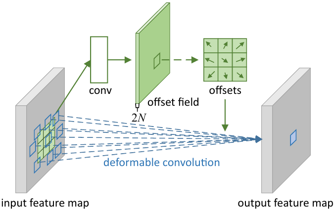
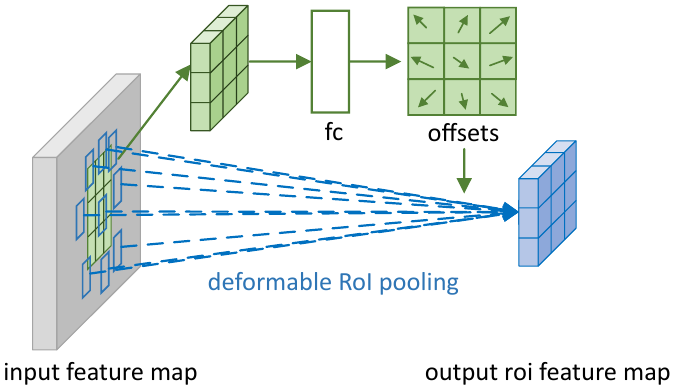

#### Deformable CNN

##### 可变形卷积

下图展示了$3\times3$可变形卷积的结构：

令网格$\mathcal R$定义感受野的大小和扩充(dilation)，$\mathcal R=\{(-1,-1),(-1,0),\dots,(0,1),(1,1)\}$就表示扩充为1的$3\times3$网格。输出特征图$\mathbf y$上的每个位置$\mathbf p_0$就有：
$$
\mathbf y(\mathbf p_0) = \sum_{\mathbf p_n \in \mathcal R}\mathbf w(\mathbf p_n)\bullet \mathbf x(\mathbf p_0 + \mathbf p_n) \tag{1}
$$

其中$\mathbf p_n$枚举$\mathcal R$中的每个位置，**输出特征图上每一点的值就是其上一层感受野上每一点与卷积核的内积**。在可变形卷积中普通网格通过偏移$\{\Delta\mathbf p_n \mid n=1,\dots,N, N=\vert\mathcal R\vert\}$增强。这样上式就变为
$$
\mathbf y(\mathbf p_0) = \sum_{\mathbf p_n \in \mathcal R}\mathbf w(\mathbf p_n)\bullet \mathbf x(\mathbf p_0 + \mathbf p_n + \Delta\mathbf p_n) \tag{2}
$$
这样采样就变成在非平凡和偏移位置$\mathbf p_n + \Delta\mathbf p_n$上的采样。因偏移$\Delta\mathbf p_n$通常是分数的，因此公式(2)就能通过双线性插值实现：
$$
\mathbf x(\mathbf p) = \sum_{\mathbf q} G(\mathbf q, \mathbf p)\bullet \mathbf x(\mathbf q) \tag{3}
$$
其中$\mathbf p$表示任意（分数）的位置($\mathbf p=\mathbf p_0 + \mathbf p_n + \Delta\mathbf p_n$)，$\mathbf q$枚举特征图$\mathbf x$上所有整数位置，$G(\dot\ ,\dot\ )$是双线性插值核，注意它是二维的，可分离为两个一维核为：
$$
G(\mathbf q,\mathbf p) = g(q_x,p_x) \dot\ g(q_y,p_y) \tag{4}
$$
其中$g(a,b) = \max(0, 1-|a-b|)$。因$G(\mathbf q,\mathbf p)$仅对少量$\mathbf q$非零，因此公式(3)能很快计算。如上图所示，**偏移是通过在相同的特征图上应用一个卷积层来获得的**。这个卷积与当前卷积层的空间分辨率和扩充相同，输出的偏移域则则与输入特征图有相同的空间分辨率，通道维数$2N$对应$N$个2D偏移，也即输出的偏移域某一位置上的所有通道组成的向量就是$N$个$(x,y)$偏移，而$N=|\mathcal R|$为感受野的大小。训练时产生输出特征与偏移的两种卷积核同时学习，在学习偏移时梯度通过双线性操作反向传播。

##### 可变形RoI池化

RoI池化将输入任意大小的四边形区域转换为固定大小的特征。

**RoI池化**：给定输入特征图$\mathbf x$和$w\times h$的RoI以及左上角点$\mathbf p_0$，RoI池化将RoI分为$k\times k$的单元，输出一个$k\times k$的特征映射$\mathbf y$。对第$(i,j)$个单元有：
$$
\mathbf y(i,j) = \sum_{\mathbf p \in bin(i,j)} \mathbf x(\mathbf p_0 + \mathbf p) / n_{ij} \tag{5}
$$
其中$n_{i,j}$是此单元中的像素数。与公式(2)类似，可变形RoI池化也将偏移集合$\{\Delta\mathbf p_{i,j} \mid 0 \le i,j \lt k\}$加到单元的位置。公式(5)就变成：
$$
\mathbf y(i,j) = \sum_{\mathbf p \in bin(i,j)} \mathbf x(\mathbf p_0 + \mathbf p + \Delta\mathbf p_{i,j}) / n_{ij} \tag{6}
$$
$\Delta\mathbf p_{i,j}$通常是分数。公式(6)也通过(3)和(4)用双线性插值实现。下图战展示了如何获得偏移：

- 首先RoI池化产生池化的特征图；
- 然后使用一个fc（全连接网络）产生正规化的偏移$\Delta\widehat{\mathbf p}_{i,j}$；
- 之后通过与RoI长度和宽度的逐元素相乘$\Delta\mathbf p_{i,j}=\gamma\dot\ \Delta\widehat{\mathbf p}_{i,j} \circ(w,h)$将$\Delta\widehat{\mathbf p}_{i,j}$转换为偏移$\Delta\mathbf p_{i,j}$，$\gamma$是预定义的控制偏移幅度的标量值，经验上设为0.1。

偏移正规化用于使偏移学习对RoI大小不变。fc层通过反向传播学习。

**位置敏感RoI池化**