#### ShuffleNet v1

因为高昂的密集$1\times1$卷积，当前最先进的基础架构，如Xception和ResNeXt等，在极端小的网络上开始失效。使为此，本文：

- 提出**逐点群组卷积(pointwise group convolution)**来减少$1\times1$卷积的计算复杂性；
- 又引入新的**通道洗牌**操作帮助信息在特征通道中流通，以克服群组卷积的副作用。

基于这两个技术构建的ShuffleNet，在给定的计算预算下允许更多的特征映射(feature map)通道，从而编码更多信息：

- 在40 MFLOPs层次，相对MobileNet在ImageNet分类试验中取得了显著更低的top-1错误率；
- 在现有基于ARM计算核心中，相比AlexNet在保持同等正确率时加速了13倍（理论18倍）。

##### 1 群组卷积的通道洗牌

当代CNN通常由重复相同结构的构件组成，其中Xception和ResNeXt引入高效的逐深度可分离(depthwise separable)卷积或群组卷积到构件中，以在表示能力和计算代价间追求完美的权衡。但都未充分考虑需要打力量计算的$1\times1$卷积（也称逐点卷积）。比如ResNeXt中仅$3\times3$层配备了群组卷积，使得每个残差块中逐点卷积占据了93.4%的乘加（cardinality=32）。

为此，直接的解决办法就是在$1\times1$层上也应用通道稀疏连结——比如群组卷积。通过保证每个卷积仅在对应输入群组操作，群组卷积就能大大减少计算代价。但若多个群组卷积堆叠起来，就会有一个副作用：来自特定通道的输出仅仅来自输入通道的一小部分（下图a）；这个特性阻塞了信息在通道群组间的流通，弱化了表达能力。

若允许群组卷积从不同的组获得输入（下图b），输入和输出就会是充分相关的。尤其是对来自前一群组层的特征映射，先将每个群组的通道分割到几个子群组中，然后用不同的子群组输入到下一层的每个群组。这可以通过**通道洗牌**操作有效而优雅地实现（下图c）。

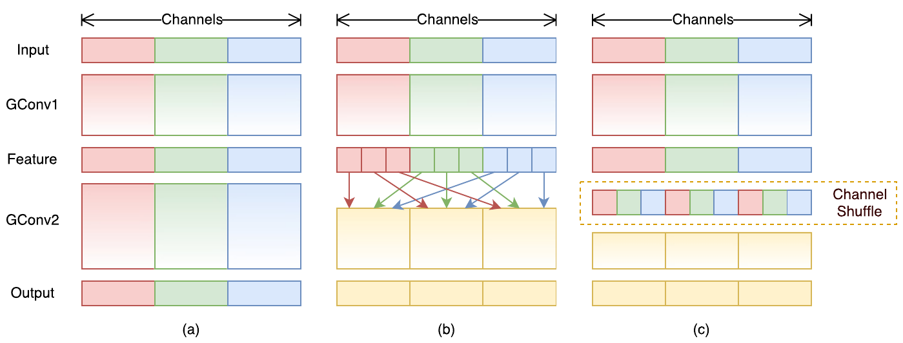

假定有$g$个群组的卷积层输出有$g\times n$的通道，首先将输出通道重塑为$(g, n)$，转置并铺展回作为下一层的输入。注意即便两个卷积群组数不同时这个操作依然有效，并且可导，这就意味着可以将其嵌入到端到端训练的网络结构。

##### 2 ShuffleNet单元

基于通道洗牌构建出shufflenet单元：

1. 以下图a的瓶颈(bottleneck)单元设计原则开始，它是一个残差块，在其残差分支上对$3\times3$层，在bottleneck特征映射上应用计算经济的$3\times3$ depthwise卷积；
2. 然后，将首个$1\times1$层替换为逐点群组卷积伴随一个频道洗牌操作形成的ShuffleNet单元，如下图b所示，第二个逐点群组卷积的作用是恢复频道维度以匹配短路通道，为简化其后未进行通道洗牌因结果可类似；
3. 在步长超过1的情况中做了两点修改（下图c）：
   - 在短路通道上添加了$3\times3$平均池化；
   - 将逐元素相加用通道拼接代替，使得能用少量额外计算更容易地扩大通道维度。

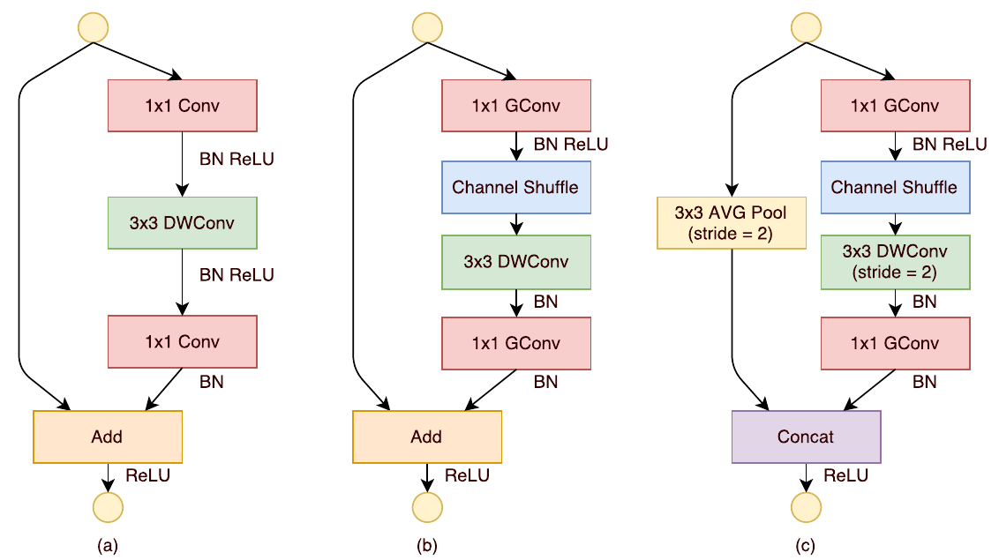

得益于带通道洗牌的群组卷积，ShuffleNet单元的所有部分计算都十分高效。若输入大小为$c \times h \times w$，bottleneck通道为$m$，则ResNet单元需要$hw(2cm+9m^2)$的FLOPs，ResNeXt单元需要$hw(2cm+9m^2/9)$的FLOPs，而ShuffleNet仅需$hw(2cm/9+9m)$的FLOPs。也即给定计算预算，ShuffleNet能使用更宽的特征映射。这在微小网络中十分重要，因其通常没有充分的通道数来处理信息。

另外ShuffleNet中depthwise卷积仅在bottleneck特征映射上执行以尽可能阻止超过费用。虽然其理论计算复杂性很低，但因糟糕的计算/存储获得(access)率，在低能量的移动设备上很难实现。

##### 3 网络结构

基于ShuffleNet单元，整个网络的结构如下表所示：

- 它主要由一堆分组到三阶段的单元组成；
- 每阶段的首个构件应用为2的步长，一阶段内的其他超参保持不变，为下个阶段输出的通道加倍；
- 将每个ShuffleNet单元的bottleneck通道数设为输出通道的1/4；
- 组数$g$控制逐点卷积的稀疏性，从下表可看出对给定的复杂性限制，组数越大：
  - 输出通道越多（卷积核也越多），编码的信息也越多；
  - 但由于相应输入通道的限制也会导致单个卷积核的退化；
- 为定制网络到要求的复杂性，可在通道数上应用一个放缩因子$s$，记下表的网络为$\text{ShuffleNet } 1\times$，则$\text{ShuffleNet } s\times$表示将网络中的filter数乘以$s$倍，因此总体复杂性大约是$s^2$倍。

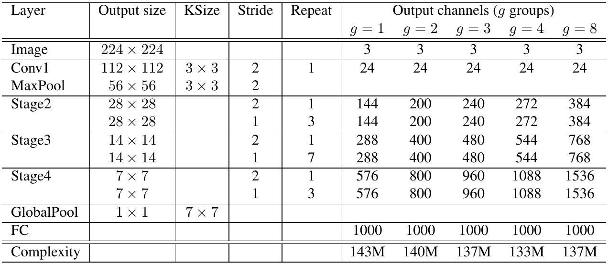

#### ShuffleNet v2

真是世界的任务通常是给定目标平台和应用场景，在有限的计算预算下，获得最优正确率。在衡量计算复杂性时通常使用的标准是浮点运算次数，即FLOPs；但这是一个间接标准，近似、但通常并不等价于直接标准如速度或延迟。主要有两个原因导致这种差异：

- 一是集中显著影响速度的因素在FLOPs中并未考虑，比如：
  - 访存代价(memory access cost, MAC)，在某些操作如群组卷积中这可能是算力强大设备如GPU的瓶颈；
  - 并行度(parallelism)，在同样的FLOPs下，高并行度模型会更快；;
- 二是有相同FLOPs的操作在不同平台上可能运行时间不同。

为此本文提出了在高效网络架构设计中应考虑的两个原则：

- 一是应使用直接标准（如速度）取代间接标准（如FLOPs）；
- 二是这样的标准应在目标平台上评估。

##### 1 高效网络设计实用指南

一些设置：

- 使用了两个广泛应用的带工业级CNN库优化的硬件平台：
  - GPU：单个NVIDIA GeForce 1080Ti，卷积库为CUDNN 7.0，激活了基准函数分别为不同选择最快算法；
  - ARM：单个高通骁龙810，使用一个高度优化的基于Neon的实现，使用了单线程进行评估。
- 打开了完全优化选项（比如张量融合，用于较少细微操作的数量）；
- 输入图像是$224 \times 224$；
- 每个网络随机初始化并评估100次，取平均运行时间；

分析了ShuffleNet v1和MobileNet v2的运行时间性能，其核心都是群组卷积和depthwise卷积。总的运行时间被分解为不同的操作，如下图所示：

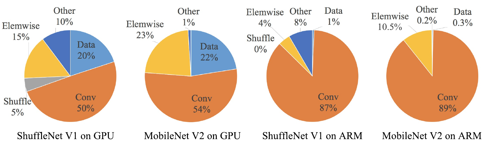

通过多方面的试验和分析，本文在获得了几条高效网络架构设计的实践指南：

***原则1：等宽通道最小化访存代价(MAC)***

当代网络通常采用*逐个深度可分离卷积(depthwise separable convolutions)*，其中逐点卷积（也即$1\times1$卷积）占了大多数的复杂度。$1\times1$卷积核的形状由输入通道数$c_1$和输出通道数$c_2$确定，若$w$和$h$为特征映射的空间尺寸，$1\times1$卷积的FLOPs为$B=hwc_1c_2$。假定计算设备缓存足够则访存代价——即访存操作次数为$\text{MAC}=hw(c_1+c_2)+c_1c_2$，公式两项分别对应特征映射输入/输出和核权值的访存。由均值不等式有：
$$
\text{MAC} \ge 2\sqrt{hwB} + \frac{B}{hw} \tag{1}
$$
因此MAC有一个FLOPs给定的下界，且当输入和输出通道数目相等时达到下界。当然这只是理论上的结论，实际可能会偏离，本文做了一些实验来验证这个结论，结果如下表：

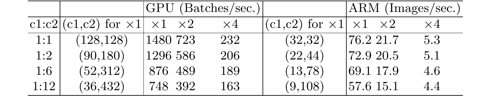

很清楚地可以看到当$c_1:c_2$接近$1:1$时，MAC变的越来越小，网络评估速度也越来越快。

***原则2：过量群组卷积增加访存代价(MAC)***

群组卷积通过将所有通道间的密集连接变为稀疏（仅通道内的组），减少了计算复杂度（FLOPs）。它：

- 一方面允许在给定的固定FLOPs中使用更多通道从而增加网络能力（因此准确率更好）；
- 但另一方面增加的通道数又会导致更多的MAC；

$1\times1$卷积的MAC和FLOPs之间关系为：
$$
\text{MAC} = hw(c_1+c_2) + \frac{c_1c_2}{g} = hwc_1 + \frac{Bg}{c_1} + \frac{B}{hw} \tag{2}
$$
其中$g$为群组数，$B=hwc_1c_2/g$为FLOPs。可见给定固定输入$c_1\times h\times w$和计算代价$B$，MAC随着$g$的变大而增加。下表展示了一些实验的结果：

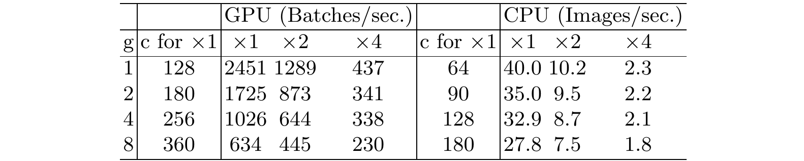

明显可见使用大的组数会明显显著降低运行速度。因此建议应该基于目标平台和任务审慎地选择组数$g$，因增加$g$带来的正确率提升会很容易使快速增加的计算代价超重。

***原则3：网络分片(fragmentation)降低并行性***

在Inceptions系列网络和自动生成的架构中都广泛在每个构件里采用了“多通道”结构，使用了大量细小算子（分片算子，在一个构建中单独卷积或池化的个数），尽管这样的分片结构不有益于准确率，但因不利于像GPU这样的强并行计算设备，因此可能会降低运行效率，另外它也会引入诸如投放内核和同步这样的额外开销。为量化分片对效率的影响本文进行了一系列实验，使用的网络构件架构如下图：

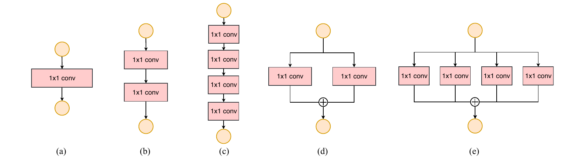

每个构件都由4个$1\times1$卷积构成，堆叠10个构成网络。其中(a)是1-分片，(b)是串行2-分片，(c)是串行4-分片，(d)是并行2-分片，(e)是并行4-分片。实验结果如下表：

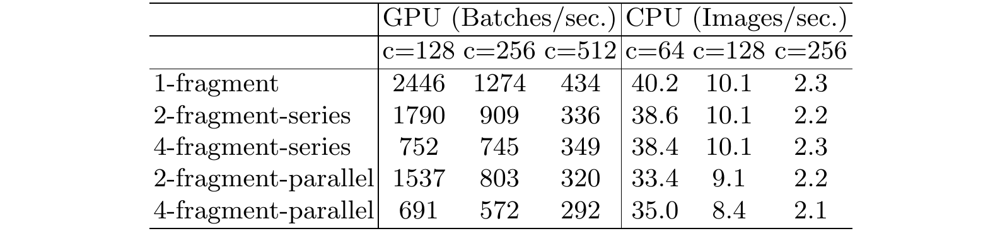

可以看出在分片显著降低了GPU上的速度，而ARM上的减少则相对较小。

***原则4：不可忽视逐元素(element-wise)操作***

如前面的图所示，在轻量网络中逐元素操作占据了大量时间，尤其是在GPU中。逐元素算子包括ReLU，AddTensor，AddBias等。它们的FLOPs很小但MAC相对较大。特别地，本文认为逐个深度卷积也是逐元素操作，因其也有很高的MAC/FLOPs比率。为进行验证使用了ResNet中的bottleneck单元（$1\times1$卷积后跟$3\times3$卷积后跟$1\times1$卷积，以及ReLU和短路连接）实验，分别去除了ReLU和短路连接，不同变体的运行时间如下表所示：

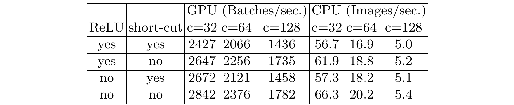

可以看出在去除ReLU和短路连接以后，在GPU和ARM上都有了20%的加速。

***讨论和结论***

从上面的指南和实证研究可以得到，一个高效的网络结构应该：

1. 使用平衡的卷积（想等的通道宽度）；
2. 注意使用群组卷积的代价；
3. 减少分片度；
4. 减少逐元素操作。

##### 2. ShuffleNet v2

由v1可知，轻量网络的主要难题是给定的计算预算(FLOPs)仅能支持有限的特征通道，为增加通道数的同时不显著增加FLOPs，v1采用了逐点群组卷积和类bottleneck结构，然后引入通道洗牌来沟通不同组间的信息从而改善准确率。其构件为下图中的(a)和(b)。

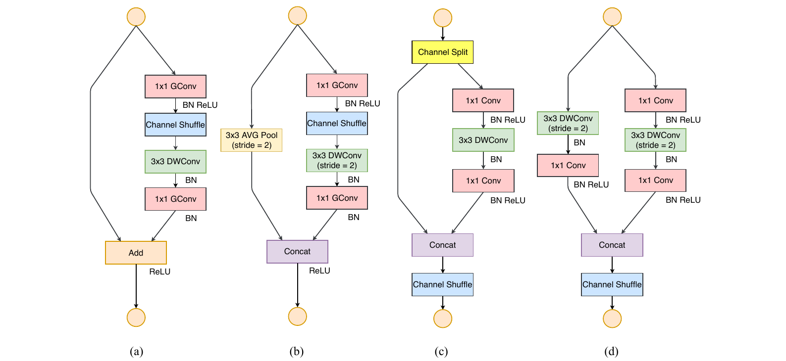

就像前面论述的，住点群组卷积和bottleneck结构都会增加MAC（G1和G2），同时太多的群组也违反G3，短路连接的逐元素“加”操作也不符合G4，因此获得高性能模型能力和效率的关键难题就在于，如何能既不密集连接也无太多群组地维持大量且等宽的通道。为此引入通道分割，如上图(c)所示：

- 在每个单元的开始将特征通道分为$c-c'$和$c'$两支；
- 基于G3，一支保持不变，另一支由输入和输出通道数相等的三个卷积组成以符合G1；
- 其中两个$1\times1$卷积不同于v1不再是群组卷积，这部分是要遵循G2部分是因为分割操作已经产生了两个群组；
- 卷积之后拼接两者，因此通道数保持不变（G1）；
- 之后执行与v1相同的通道洗牌来沟通信息；
- 注意已经没有v1中的加操作，而ReLU和逐个深度卷积这样的逐元素操作也仅存在于一支中；
- 三个连续的逐元素操作拼接、通道洗牌和通道分割合并为单个逐元素操作（G4）。

空间下采样的单元则稍微修改为上图(d)，去除了通道分割因此输入通道会加倍。重复堆叠这些构建组成了整个网络，为简洁可令$c'=c/2$，总体的网络结构总结为下表：

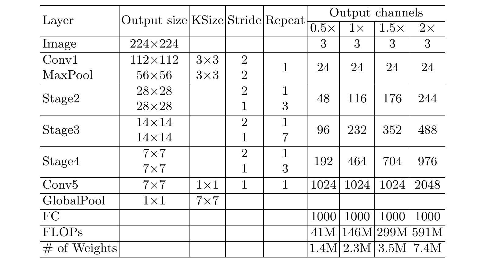

与v1相比仅有一处不同：在全局平均池化前添加了一个$1\times1$卷积来混合特征。同样也放缩了每个构件的通道数来产生不同复杂性的网络，记为$0.5\times$，$1\times$。

***网络正确率分析***

v2不仅高效并且精确，主要有两个原因：

- 一是每个构件的高效率使网络能使用更多特征通道和更大的网络容量(capacity)；
- 二是每个构件中有一半特征通道（$c'=c/2$时）直接加入下个构件，这是一种特征重用，类似DenseNet。

在DenseNet中要分析特征重用模式会绘制下图(a)，很明显临接层之间的连接强于其他，这表明所有层间的密集连接可能会引入冗余。在v2中很容易证明在第$i$和第$i+j$个构件间的直连的通道数是$r^jc$，其中$r=(1-c')/c$，也即构件间特征重用的量随距离指数下降，下图(b)展示了在$r=5$时类似的可视化：

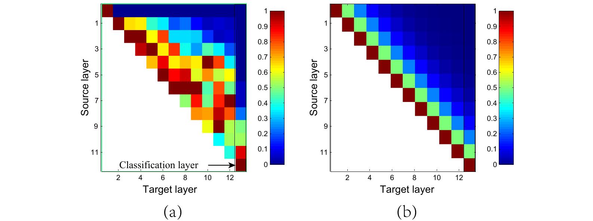

因此通过设计v2的结构实现了这种特征重用模式。

#### 附录

##### A: Group Convolution

假设输入特征映射的大小为$H \times W \times C$，同时有$k$个$h \times w$卷积，group convolution实质就是将卷积分为$g$个独立的组分别进行计算：

1. 将输入特征分为$g$组，每组大小为$H \times W \times (C/g)$；
2. 将kernel也分为$g$组，每组大小为$h \times w \times (k/g)$；
3. 按顺序将每组输入特征和kernel分别做卷积，输出$g$组$H' \times W' \times (k/g)$特征，共$H' \times W' \times k$。