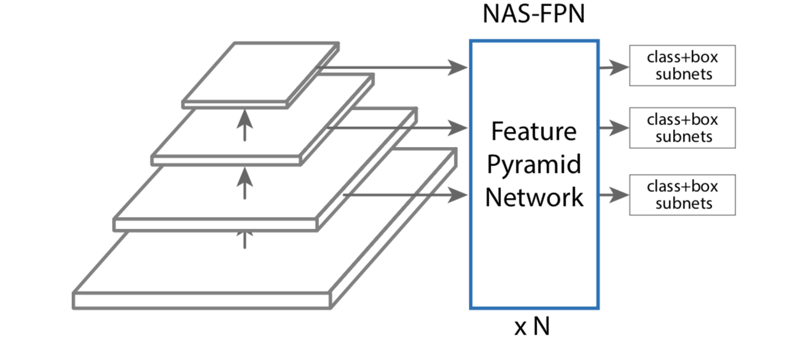
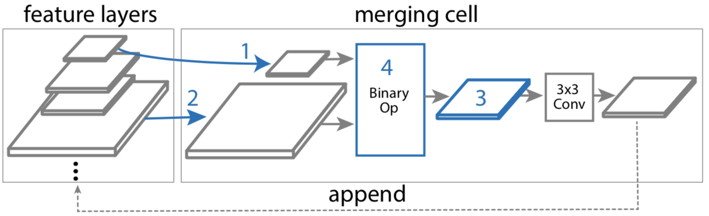
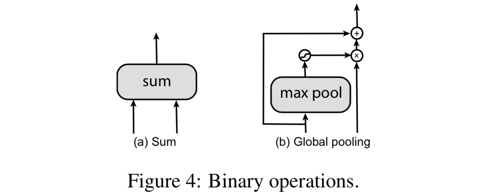
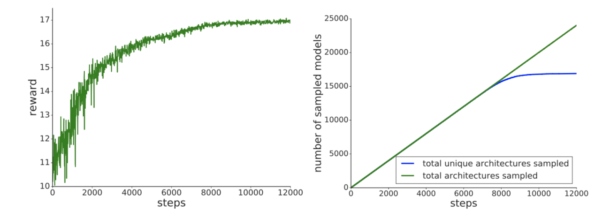
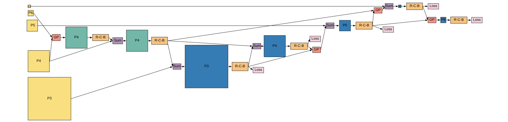

目标检测需要检测和定位不同大小不同位置的多个目标，而用多尺度特征层来表示图像的金字塔特征表达被广泛应用在现代检测器中。FPN就是生成用于目标检测的金字塔特征表达的一个代表模型，它采取一个主干网络，然后使用自顶向下和侧边连接顺序结合特征层级两个相邻层来生成特征金字塔。高层强语义但低分辨率的特征被上采样并与高分辨率特征结合来产生既高分辨率又强语义的特征表达。尽管简洁高效，但FPN可能并非最优结构设计，近来PANet就显示在FPN特征上额外增加一个自底向上旁路能够改善低分辨率特征的表达，其他一些工作也提出了多种跨尺度连接或组合特征产生金字塔特征表达的操作。

设计特征金字塔结构的挑战在于其巨大的设计空间，从不同尺度组合特征的可能连接随层数指数增长。而近来神经架构搜索（NAS）展示出在巨大搜索空间高效发现顶级性能的光明结果，受此启发本文提出了生成金字塔表达的可伸缩结构的搜索空间。它的关键贡献在于设计了包含所有可能跨尺度连接的搜索空间来产生多尺度特征表达。在搜索过程中，我们希望探索一个有等价输入和输出特征层次并能被反复使用的原子结构。模块化的搜索空间可以使搜索易于管控，且有随时目标检测的能力（早退出）。

所发现的被称为NAS-FPN的架构，在构建目标检测架构上提供了巨大的灵活性，且与多种主干模型都表现良好，无论是快速移动网络和还是精度网络都为其提供了更好的速度和精度的权衡。

#### 方法

本文方法基于RetinaNet框架因其十分简洁和高效。RetinaNet框架有两个成分：一个主干网络和一个特征金字塔网络（FPN）。本文方法的目标是为RetinaNet发掘一个更好的FPN架构。如下图所示，带有NAS-FPN的RetinaNet，FPN由神经架构搜索算法搜寻，主干模型分类回归预测则遵循RetinaNet的原始设计。

为搜寻更好的FPN，我们使用神经结构搜索，它训练一个控制器来在给定搜索空间中使用强化学习选择最优模型架构。控制器使用搜索空间中子模型的精度作为激励信号来更新其参数。因此通过试错，控制器随着时间过去学习生成更好的架构。就像很多工作反复确认的那样，搜索空间对架构搜索至关重要。在设计FPN的搜索空间时，为可扩展性（即一个FPN结构能能在RetinaNet中反复堆叠），训练期间我们也迫使FPN重复自身$N$次然后拼接到一个更大的结构中。

##### 结构搜索空间

在我们的搜索空间中，特征金字塔网络由一些为RetinaNet将若干输入层组合到表达的“归并单元”组成。

**特征金字塔网络**：一个FPN将多尺度的特征层作为输入，产生同一尺度的输出特征层，如上图所示。我们遵循RetinaNet的设计，使用每组特征层的最后一层作为第一个金字塔网络的输入。第一个金字塔网络的输出是下个金字塔网络的输入。我们使用对应特征跨度为$\{8, 16, 32, 64, 128\}$像素的5个尺度$\{C_3, C_4, C_5, C_6, C_7\}$作为输入特征。之后输入特征被传递到由一些引入跨尺度连接的归并单元组成的金字塔网络。之后金字塔网络输出加强的多尺度特征表达$\{P_3, P_4, P_5, P_6, P_7\}$。因为金字塔网络的输入和输出是在同一尺度的特征层，FPN结构能被重复堆叠来获得更好的精度。后面我们会看到控制金字塔网络数是一个简单的平衡速度和精度的方法。

**归并单元**：先前目标检测工作中的一个重要观察报告是有必要在不同尺度归并特征。跨尺度连接使模型能将强语义的高层次特征与高分辨率的低层次特征结合起来。我们提出归并单元，FPN的一个基础构件，来将任意两个输入特征层归并到一个输出特征层。在我们的实现中，每个归并单元输入任意两个输入特征层（可以来自不同尺度），应用处理操作，然后组合它们产生一个希望尺度的输出特征层。一个FPN由$N$个不同归并单元组成，其中$N$会在搜索时给定。在一个归并单元中，所有特征层都都有同样数目的滤波器。构建一个归并单元的过程如下图所示，一个归并单元需要4个预测步骤，注意输出特征层被推回到候选特征层栈，并能够被下个归并单元选取。

如何构建归并单元的决策由控制器RNN做出，RNN控制器选择任意两个候选特征层和一个二元操作来将它们组合进一个新的特征层，其中所有特征层可能有不同的分辨率。每个归并单元有4个由不同softmax分类器做出的预测步骤：

- **第1步**：从候选中选取一个特征层$h_i$；
- **第2步**：不放回地从候选中选取另一个特征层$h_j$；
- **第3步**：选择输出特征分辩率；
- **第4步**：选择一个二元操作来结合第一步和第二步选择的$h_i$和$h_j$，并以第三步所选分辨率产生特征层。

在第四步中，我们在搜索空间中设计了两个二元操作，相加和全局池化，因其简洁性和有效性，它们并不增加任何额外的训练参数，如下图所示。相加在组合特征中十分常用，全局池化的操作则是受PANet启发，我们遵循其设计除了卷积层。在应用二元操作前，输入特征层通过最近邻上采样或最大池化调整到输出分辨率。归并的特征层总是后接一个ReLU，一个$3\times3$卷积和一个批正规化层。

一个金字塔网络的输入特征层组成了一个归并单元输入候选的初始列表。在第5步，新生成的特征层添加到已有输入候选的列表并称为下个归并单元的新候选。在搜索时可以有多个候选特征共享同样的分辨率。为减少所发现特征的计算，在第3步我们使中间的归并单元避免选择步长为8的特征。最终，最后5个归并单元设计为输出特征金字塔$\{P_3, P_4, P_5, P_6, P_7\}$。输出特征层次的顺序由控制器预测。之后每个输出特征层通过重复步骤1，2，4生成，知道输出特征金字塔全部被生成。我们取所有未被连接到任何输出层的特征层，并将它们加到有对应分辨率的输出层。

##### 深度监督的任意时刻目标检测

用堆叠的金字塔网络来扩展NAS-FPN的一个好处是特征金子塔表达可以在任何给定的金字塔网络的输出获得。这个特性使得以早退出生成检测结果的任意时刻检测可行。我们可以将分类和回归头附加到所有中间金字塔网络之后，并使用深度监督训练。推理期间，模型无需完成所有金字塔网络的前向传播，可以在任何金字塔网络的输出中停止并产生检测结果。当计算资源或延迟关系重大时这可能是一个期待的特性，并提供一个能动态决定为生成检测分配多少资源的方案。

#### 实验

##### 实现细节

##### 搜寻NAS-FPN的架构

**代理任务**：为加速RNN控制器的的训练，我们需要一个训练时间更少并与实际任务关联的代理任务。在搜索中可以用这个代理任务确定一个好的FPN结构。我们发现可以简单地缩短目标的训练并将其用作代理任务。我们仅训练代理任务10个epoch，而非训练RetinaNet收敛的50个epoch。为进一步加速训练代理任务，我们使用一个小的输入为$512\times512$图像大小的ResNet-10主干架构。通过这些精简，一个代理在TPU上的训练时间为1个小时。我们将金字塔网络在代理任务上重复3次。

**控制器**：控制器是一个RNN并使用PPO（Proximal Policy Optimization）算法训练，控制器抽取不同架构子网络，这些架构在代理任务上使用一个作业池训练。实验的工作队列由100个TPU组成，留出验证集上的平均准确率（AP）用作激励来更新控制器。下图左侧展示了不同训练迭代采样架构的AP，可以看到随着时间推移控制器产生的架构越来越好；下图右侧展示了控制器总共抽取的架构数和独特的架构数，图特架构数在8000步以后逐渐收敛。

我们使用了AP最高的架构，它首先在8000步左右被抽取到，之后多次被抽取。下图展示了这个架构的细节：

**所发现的特征金字塔结构**：下图b-f展示了RL训练期间有渐进更高激励的NAS-FPN结构。我们发现RNN控制器能够在早期训练中快速挑出一些重要的跨尺度连接，比如它高分辨率输入和输出特征层之间的连接，而这对生成高分辨率特征来检测小物体至关重要。随着控制器收敛，控制器发现的结构既有自顶向下也有自底向上的连接，这与下图a中的原始FPN不同。我们也发现了控制器收敛时更好的特征复用，控制器学会了在新生成的层上构建连接来复用先前计算的特征表达，而非随机从候选池选择任意两个输入特征。