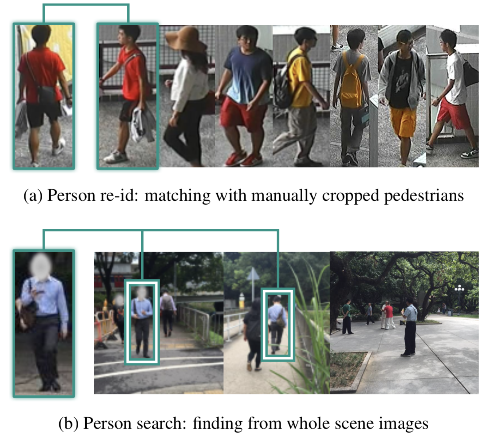
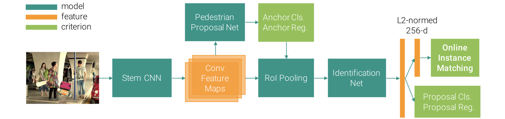

#### OIM (Joint Detection and Identification Feature Learning for Person Search)

行人重识别（Re-ID）致力于在大量行人图像中匹配出目标人物，其难点在于人体姿势的复杂变化、摄像头视角、光照、遮挡、分辨率、背景抖动等。尽管取得了巨大进展，但与实际应用仍有不小的鸿沟。大多数重识别测试基准其库中包含的是手工裁剪的行人图像，但实际应用的目标却是在全景图像中找到目标人物，如下图所示。因此大多数现有的重识别方法都假设了完美的行人检索。但实际应用中显然不存在这样的手工裁剪边框，因此现成的行人检测器不可避免会产生很多假触发、误检、不对齐等情况，这些都会严重伤害到最终的检索效果。

本文提出了一种人物检索的新深度学习框架。不同于传统方法将这个问题分成行人检索和行人重识别两个任务，我们在单个卷积网络中同时解决这两方面。这个卷积网络由两部分组成，给定整个搜索场景图像，行人提议（proposal）网络会产生候选人物的边界框，然后将它们输入到坚定（identification）网络提取特来为目标人物的比较提取特征。提议网络和鉴定网络在共同优化时互相调整。例如提议网络相比正确率会更关注召回率，因为假触发可以通过后面的特征匹配过程清除；同时，提议的不对齐也变得可接受，因其可以通过鉴定网络进一步调整。为提高整个系统的扩展性，我们鼓励这两个部分基础的卷积特征图，极大加速了推理进程。

传统的重识别特征学习主要使用逐对或三元距离损失函数，但每次仅有一些数据样本被比较，而潜在的输入组合却是$O(N^2)$的，并且不同的采样策略会显著影响收敛速度和质量，因此并不十分有效；另一个用于学习分类实体的是softmax损失函数，能够有效地同时比较所有样本，但随着类别数增加，训练大的softmax分类矩阵会变得十分缓慢甚至无法收敛。本文提出了新的在线实例匹配（Online Instance Matching，OIM）损失函数，从所有标记的实体中维护一个查询表或特征，并比较批次样本和所有注册实体的距离；另一方面许多未标记的实体可能会出现在场景图像中，就可以作为标记实体的负样本；因此我们也未对比发掘了一个循环=队列来存储其特征，这是人物检索问题设定带来的另一个优势。这个无参的OIM损失收敛得比softmax损失更快更好。

这个工作主要由三个贡献：一是提出了一种新的深度学习框架来从整个场景图中搜索目标人物，并在单个卷积网络中同时优化检测和重识别这两个任务以使它们更好地互相调整；二是提出了OIM损失函数来更有效地学习鉴定特征，使得这个框架能够扩展到含有海量实体的大数据集，伴随着更快的推理速度，我们的框架进一步满足了实际应用的要求；最后我们为人物检索收集并标注了大规模的基准测试数据集，包含了来自街道和电影快照中的数百个场景，数据集包含18184张图像、8432个实体、以及96143个行人边界框。

##### 方法

整个框架如下图所示。给定输入场景图像，我们首先使用主干卷积网络提取特征，再次之上构建一个提议网络来预测候选人物的边界框，然后再使用RoI池化来输入鉴定网络来为每个候选提取L2正规化的256维特征；在推理阶段，我们依据到目标人物的特征距离来排序候选人物；而训练阶段则在特征向量之上使用OIM损失函数来监督验证网络，伴随着其他几个损失函数来以多任务的形式训练提议网络。

**模型结构**：我们采用ResNet50作为基础卷积模型，在其前部有一个被命名为conv1的$7\times7$卷积层，随后是名字为conv2_x到conv5_x的四块，每块分别包含3、4、6、3个残差单元。我们将conv1到conv4_3作为主干部分，给定输入图像它会产生1024通道和1/16原始分辨率的特征图。

在这些特征图之上我们构建一个提议网络来检测行人候选，我们首先添加一个$512\times3\times3$的卷积层来为特地为行人转换特征，然后遵循faster-rcnn来为特征图的每个位置关联9个锚框，并使用softmax分类器来预测每个锚框是否是行人，以及一个线性回归来调整它们的位置。我们会在NMS之后保留128个经调整的边框作为最终的提议。

为在所有这些提议中找到目标人物，我们创建一个鉴定网络来提取每个提议的特征并与目标比较。我们首先开发一个ROI池化层来从主干网络特征图为每个提议池化一个$1024\times14\times14$的区域，然后将它们传递通过ResNet50剩余的conv_4到conv_3，之后应用一个全局平均池化层来将它们归结到一个2048维的特征向量。一方面，因为提议中不可避免会有一些假触发和不对齐，我们再一次使用siftmax分类和线性回归来拒绝非行人和提炼位置，另一方面我们将特征投射到一个L2正规化的256维子空间中（id特征），并在推理时使用它们与目标人物计算余弦相似度。在训练阶段，我们使用IOM损失函数监督这些id特征，与其他用于检测的损失函数一起，整个网络以多任务学习的形式共同训练。

**OIM损失**：模型中有三种提议：标记实体、未标记实体和杂乱背景，假定训练数据中有$L$个不同目标人物，当一个意义匹配一个目标人物则称其为标记实体的一个实例，并相应分配一个类id（从1到$L$）；也有很多提议正确地预测了行人，但不属于任何目标人物，这种情况称其为未标记实体，下图分别以蓝色和橙色框展示了一些标记和未标记实体；其他提议则仅是其他类别目标或背景区域的假触发。在所提出的损失函数中，仅考虑标记和未标记实体，而忽略其他提议。

因为我们的目标是区分不同的人，一个自然的目标就是最小化同一人实例的特征差异，同时最大化不同人的特征差异。为此需要记住所有人的特征，这可以通过在所有训练图像上做网络前向线下完成，但使用SGD优化时就不现实。为此我们选择一个在线近似方法。将批次内的一个标记实体的特征记为$x \in \mathbb R^D$，我们维护一个查询表（LUT）$V \in \mathbb R^{D\times L}$来存储所有标记实体的特征，如上图所示。在前向传播期间通过$V^Tx$计算批次样本和所有标记实体的余弦相似度；反响传播期间，若目标类别id是$t$，则通过$v_t \leftarrow \gamma v_t + (1-\gamma)x$更新LUT的第$t$列，然后放缩$v_t$使其有单位L2-norm。

除了标记实体，很多未标记实体对学习特征表达也十分有价值，可以作为所有标记样本的负样本安全使用。我们使用一个循环队列来存储在最近的批次中出现的未标记实体。记循环队列中的特征为$U \in \mathbb R^{D\times Q}$，可以使用$U^Tx$计算它们与批次样本的余弦相似度。在每次迭代后，将新的特征向量推入队列，同时弹出过时的来保持队列大小不变。

基于这两个数据结构，我们通过softmax函数定义$x$被识别为类别id为$i$的实体的概率为：
$$
p_i = \frac{\exp(v_i^Tx/\tau)}{\sum_{j=1}^L\exp(v_j^Tx/\tau)+\sum_{k=1}^Q\exp(u_k^Tx/\tau)}
$$
其中更高的温度$\tau$产生更松弛的概率分布；同样，被识别为循环队列中第$i$个未标记实体的概率为：
$$
q_i = \frac{\exp(u_i^Tx/\tau)}{\sum_{j=1}^L\exp(v_j^Tx/\tau)+\sum_{k=1}^Q\exp(u_k^Tx/\tau)}
$$
OIM的目标就是最大化期望对数似然：
$$
\mathcal L = E_x[\log p_t]
$$
其对应于$x$的梯度可以推导为：
$$
\frac{\partial\mathcal L}{\partial x} = \frac1\tau\left[ (1-p_t)v_t - \sum_{j=1\\j\neq t}^Lp_jv_j  - \sum_{k=1}^Q q_ku_k\right]
$$
可见OIM损失有效地将批次样本与所有标记和未标记实体做了比较，驱使底部的特征向量与目标相似，将其与其他推离。

