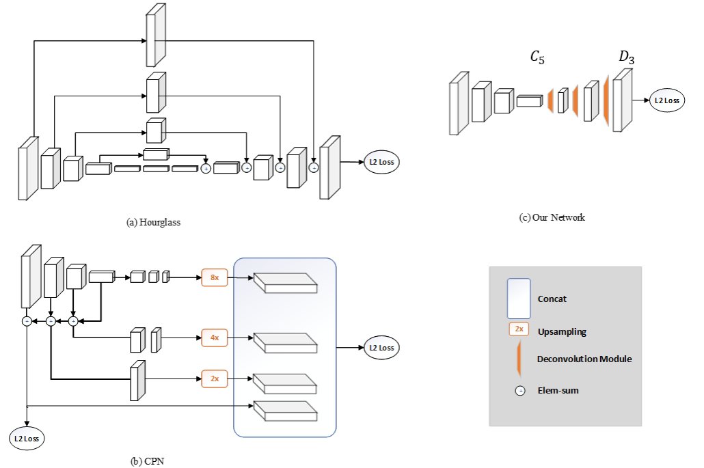

#### Simple Baseline(ECCV18)

虽然近来人体姿态识别和追踪取得了巨大进展，但网络结构和实验实践也愈发复杂，使得算法分析和对比愈发困难。本文旨在通过回答*一个简单方法能做到多好*来减轻这个问题，为姿态估计和追踪都提供了基线方法。

##### 基于逆卷积头网络的姿态估计

本文的姿态估计仅仅是在ResNet中最后卷积阶段上添加一些逆卷积网络来实现，这个结构可能是最简单的从深度和低分别率特征中获得热力图的方法。默认使用3个带批正规和ReLU激活的逆卷积层，每层有256个$4\times4$卷积核，步长为2，最后添加一个$1\times1$卷积层来产生所有$k$个关键点的热力图$\{H_1\dots H_k\}$。使用均方差(MSE)作为预测热力图和目标热力图间的损失。而目标热力图$\hat H_k$则通过应用以第$k$个关节的真实位置为中心的2D高斯获得。网络结构如下图(c)所示。

上图(a)是沙漏(hourglass)网络的结构，是MPII基准上的主流方法，特点是重复自底向上、自顶向下过程的多阶段结构，和跳跃层特征拼接；(b)是COCO2017关键点比赛优胜方法—级联金字塔网络(CPN)的机构，也包含跳跃层特征拼接和在线困难点挖掘的步骤。

- 本文方法与二者不同处在于高分辨率特征图的生成方法。前两者使用上采样来提高特征图分辨率并将卷积参数放在其他构件中，而本文则以更简方式将上采样和卷积参数组合进逆卷积层，且未使用跳跃连接；
- 三个方法的共同之处在于都使用了三个上采样步骤以及同样三个层次的非线性（就最深的特征而言）来获得高分辨率特征图和热力图。因此似乎至关重要的是获得高分辨率特征图，而非如何获得。

##### 基于光流的姿态追踪