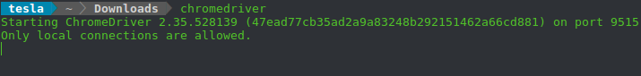
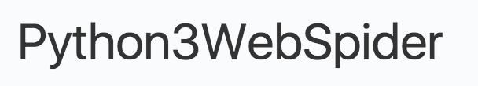

##### 1.安装请求库

**安装Requests**：

```bash
sudo pip install requests
```

**安装Selenium**：selenium 是一个自动化测试工具，利用它我们可以驱动浏览器执行特定的动作，如点击、下拉等等操作，对于一些 JavaScript 渲染的页面来说，此种抓取方式非常有效，

```bash
sudo pip install selenium
```

**安装ChromeDriver**：selenium需要浏览器来配合它使用，使用chrome则需要安装一个 ChromeDriver 才能驱动浏览器完成相应的操作。在chrome地址栏输入`chrome://help`查看版本，在[官网](https://sites.google.com/a/chromium.org/chromedriver/downloads)找到支持的版本，然后在[下载](https://chromedriver.storage.googleapis.com/index.html)页面获得相应压缩文件；解压缩后执行`sudo mv chromedriver /usr/bin`；检查安装在终端执行`chromedriver`得到结果：



然后在程序中测试，执行：

```python
from selenium import webdriver
browser = webdriver.Chrome()
```

运行之后会弹出一个空白的 Chrome 浏览器。如果没有弹出，请检查之前的每一步的配置。如果弹出之后闪退，则可能是 ChromeDriver 版本和 Chrome 版本不简容，请更换 ChromeDriver 版本。

**安装GeckoDriver**：要同样使用 Firefox 完成 Selenium 的对接，就需要安装另一个驱动 GeckoDriver。在其[下载](https://github.com/mozilla/geckodriver/releases)页获得其最新发行版，之后的操作与前面相同。在终端执行`geckodriver`的结果为：


测试的代码为：

```python
browser = webdriver.Firefox()
```

运行之后会弹出一个空白的 Firefox 浏览器。如果没有弹出，请检查之前的每一步的配置。

**安装PhantomJS**：PhantomJS 是一个无界面的，可脚本编程的 WebKit 浏览器引擎，原生支持多种 web 标准。Selenium 支持 PhantomJS，这样在运行的时候就不会再弹出一个浏览器了，而且其运行效率也是很高的，还支持各种参数配置。与前面同样的方式安装PhantomJS后测试：

```python
browser = webdriver.PhantomJS()
browser.get('https://dict.youdao.com')
print(browser.current_url)
```

**安装Aiohttp**：Requests 库是一个阻塞式 HTTP 请求库，当我们发出一个请求后，程序会一直等待服务器的响应。而 Aiohttp 是一个提供异步 Web 服务的库，会大大提高效率。安装方法为：

```bash
sudo pip install aiohttp cchardet aiodns
```

测试安装是否成功：

```python
import aiohttp
```


##### 2.安装解析库

**安装LXML**：是 Python 的一个解析库，支持 HTML 和 XML 的解析，支持 XPath 解析方式，而且效率非常高

```bash
sudo pip install lxml
```

**安装BeautifulSoup**：是 Python 的一个 HTML 或 XML 的解析库，可以用它来方便地从网页中提取数据，它拥有强大的 API 和多样的解析方式

```bash
sudo pip install beautifulsoup4
```

验证安装：

```python
from bs4 import BeautifulSoup
soup = BeautifulSoup('<p>Hello</p>', 'lxml')
print(soup.p.string)
```

**安装PyQuery**：是一个强大的网页解析工具，它提供了类似 jQuery 的语法解析 HTML 文档，支持 CSS 选择器

```bash
sudo pip install pyquery
```

**安装Tesserocr**：是 Python 的一个 OCR 识别库，其实是对 Tesseract 做的一层 Python API 封装，因此需先安装Tesseract：

```bash
sudo apt-get install -y tesseract-ocr libtesseract-dev libleptonica-dev
```

这样支持的语言很少，支持更多的语言还需安装语言包tessdata：

```bash
git clone https://github.com/tesseract-ocr/tessdata.git
sudo mv tessdata/* /usr/share/tesseract-ocr/tessdata
```

上面的过程视网速可能要下载一段时间。运行列出所有语言的命令：

```bash
tesseract --list-langs
```

其中的 chi_sim 代表简体中文。接下来再安装 Tesserocr：

```bash
sudo pip install tesserocr pillow
```

用下面文件名为`image.png`的图片，



用其来验证tesseract：

```bash
tesseract image.png result -l eng && cat result.txt
```

并运行代码验证tesserocr的安装：

```python
import tesserocr
print(tesserocr.file_to_text('image.png'))
```

若成功输出结果，则表示两者都成功安装。


##### 3.安装数据

**安装MySQL**：一个轻量级的关系型数据库，以表的形式来存储数据

```bash
sudo apt-get update
sudo apt-get install -y mysql-server mysql-client
```

这个过程会要求设置密码；安装完成后启动、关闭、重启 MySQL 服务命令：

```bash
sudo service mysql start
sudo service mysql stop
sudo service mysql restart
```

以根用户身份进入mysql：

```bash
mysql -uroot -p
```

由于 Linux 一般会作为服务器使用，为了使得 MySQL 可以被远程访问，我们需要修改 MySQL 的配置文件，配置文件路径一般为 /etc/mysql/my.cnf，取消此行的注释：

```conf
bind-address = 127.0.0.1
```

修改完成之后重启 MySQL 服务，这样 MySQL 就可以被远程访问了。

**安装MongoDB**：一个基于分布式文件存储的开源数据库系统，其内容存储形式类似 Json 对象，它的字段值可以包含其他文档，数组及文档数组，非常灵活。首先导入MongoDB的GPG Key：

```bash
sudo apt-key adv --keyserver hkp://keyserver.ubuntu.com:80 --recv 0C49F3730359A14518585931BC711F9BA15703C6
```

然后创建`apt-get`源列表，根据系统版本选择下面的一条命令执行：

```bash
# Ubuntu 12.04
echo "deb [ arch=amd64 ] http://repo.mongodb.org/apt/ubuntu precise/mongodb-org/3.4 multiverse" | sudo tee /etc/apt/sources.list.d/mongodb-org-3.4.list
# Ubuntu 14.04
echo "deb [ arch=amd64 ] http://repo.mongodb.org/apt/ubuntu trusty/mongodb-org/3.4 multiverse" | sudo tee /etc/apt/sources.list.d/mongodb-org-3.4.list
# Ubuntu 16.04
echo "deb [ arch=amd64,arm64 ] http://repo.mongodb.org/apt/ubuntu xenial/mongodb-org/3.4 multiverse" | sudo tee /etc/apt/sources.list.d/mongodb-org-3.4.list
```

随后更新源并安装MongoDB：

```bash
sudo apt-get update
sudo apt-get install -y mongodb-org
```

安装完成后可运行：

```bash
mongod --port 27017 --dbpath /data/db
```

在 Linux 上配置 MongoDB 都是为了远程连接使用的，所以在这里还需要配置一下 MongoDB 的远程连接和用户名密码。进入到 MongoDB 命令行：

```bash
mongo --port 27017
```

进入到 MongoDB 的命令行交互模式下了，在此模式下运行如下命令：

```bash
> use admin
switched to db admin
> db.createUser({user: 'admin', pwd: 'admin123', roles: [{role: 'root', db: 'admin'}]})
Successfully added user: {
        "user" : "admin",
        "roles" : [
                {
                        "role" : "root",
                        "db" : "admin"
                }
        ]
}
```

这样我们就创建了一个用户名为 admin，密码为 admin123 的用户，赋予最高权限。随后修改配置文件`/etc/mongod.conf`中的`net`部分为：

```bash
net:
  port: 27017
  bindIp: 0.0.0.0
```

另外还需要添加如下权限认证配置，直接添加如下内容到配置文件：

```bash
security:
 authorization: enabled
```

配置完成之后我们需要重新启动 MongoDB 服务，命令如下：

```bash
sudo service mongod restart
```

这样远程连接和权限认证就配置完成了。

**安装Redis**：Redis 是一个基于内存的高效的非关系型数据库

```bash
sudo apt-get -y install redis-server
```

然后输入 redis-cli 即可进入 Redis 命令行模式。但是现在 Redis 还是无法远程连接的，依然需要修改配置文件，配置文件路径为`/etc/redis/redis.conf`。注释这一行：

```bash
bind 127.0.0.1
```

另外推荐给 Redis 设置密码，取消注释这一行：

```bash
requirepass foobared
```

foobared 即当前密码，可以自行修改。然后重启 Redis 服务，使用如下命令：

```bash
sudo /etc/init.d/redis-server restart
```

现在就可以使用密码远程连接 Redis 了。另外停止和启动 Redis 服务的命令如下：

```bash
sudo /etc/init.d/redis-server stop
sudo /etc/init.d/redis-server start
```


##### 4.安装存储库

**安装PyMySQL**：

```bash
sudo pip install pymysql
```

验证安装：

```python
import pymysql
print(pymysql.VERSION)
```

**安装PyMongo**：

```bash
sudo pip install pymongo
```

验证安装

```python
import pymongo
print(pymongo.version)
```

**安装RedisPy**：

```bash
sudo pip install redis
```

验证安装：

```python
import redis
print(redis.VERSION)
```

**安装RedisDump**：一个用于 Redis 数据导入导出的工具，基于 Ruby 实现的，需要先安装ruby，之后运行：

```bash
gem install redis-dump
```

验证安装执行命令：

```bash
redis-dump
redis-load
```

