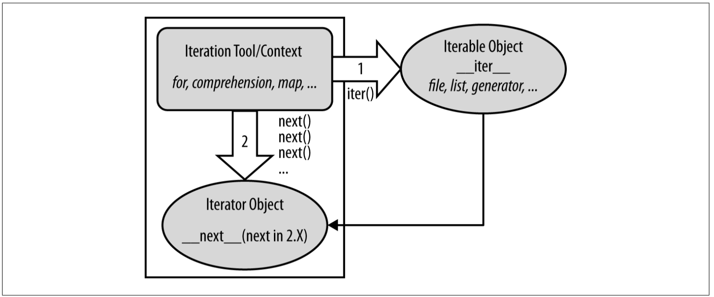
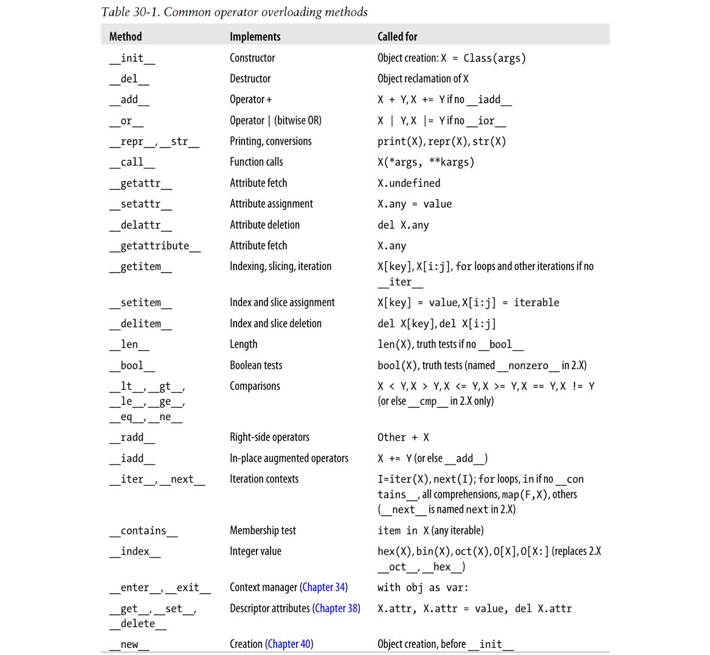

#### 1. 初识迭代

在python中，`for`循环可以像下面一样作用在任意序列类型中，包括列表、元组和字串：

```python
for x in sequence:
    print(x)
```

事实上，它在任意**可迭代对象**上都有效；而任意从做向右扫描的迭代工具，包括`for`循环、列表推导式、`in`成员测试、`map`内建函数等。而可迭代对象，既可以是物理存储的序列，也可以是在一个迭代工具语境中一次产生一个结果的对象，就如`for`循环，即既包含物理序列也包含按需计算的虚拟序列。

##### 1.1 迭代协议初步

内置的文件类型就是一个迭代器，打开的文件对象有一个`readline`方法，每次都从文件中读取一行；知道文件末尾返回空串；而实际上，文件也有一个`__next__`（python2中是`next`）方法有几乎等家的作用，唯一显著的区别就是在文件末尾返回一个内置的`StopIteration`异常。

```python
f = open('filename')
print(f.__next__)
```

这个接口差不多就是python中的迭代协议：任何有一个`__next__`方法来进行下一个结果、并在结果序列结尾处引发一个`StopIteration`异常的就是迭代器。在Python中读取文件的最好方法是逐行读取而非一次读取，即允许`for`循环在每次迭代时自动调用`__next__`来推进到下个结果：

```python
for line in open('filename'):
    print(line.u0pper(), end='')
```

`readline`依然有效，但在内存使用上效率你不高，因其一次加载整个文件；而因一次读取一行，基于迭代器的方法则没有内存爆炸的问题；使用`while`循环也可以逐行读取文件：

```python
f = open(filename)
while True:
    line = readline()
    if not line: break
    print(line.upper(), end='')
```

但这种方式运行缓慢，因`while`循环在python虚拟机上运行字节码，而迭代器方法则运行内部的C语言。

##### 1.2 手动迭代

为简化手动迭代，python中提供了`next`内置方法来自动调用`__next__`方法；给定一个迭代器X，`next(X)`的调用就等价于`X.__next__()`（python2中是`X.next()`）。从技术上讲，当`for`循环开始时，迭代协议首先将自身`iter`内置函数来获得一个迭代器；而`iter`返回的对象转而有要求的`next`方法，`iter`函数内部运行`__iter__`方法，十分类似`next`和`__next__`。

##### 1.3 完整迭代协议

下图展示了完整的迭代协议，被应用在所有的python迭代工具中，并被很多对象类型支持。实际上它基于来两个对象，分别被迭代协议应用在两个不同步骤中：

- 对迭代有请求的可迭代对象，其`__iter__`被`iter`运行；
- 可迭代对象但返回的迭代器，在迭代中产生值，其`__next__`被`next`调用，并在结束时引起`StopIteration`异常。



在实际代码中，查看`for`循环内部如何处理内建序列类型时，协议的第一步就很明显：

```python
L = range(10)
I = iter(L)
I.__next__()
```

- 初始步在文件中并不需要，因文件对象的迭代器是其自身，因它们仅支持单迭代（无法往回搜寻以支持多次活跃的扫描），文件有其自己的`__next__`方法，无需返回一个不同的对象。
- 列表以及其他一些内建对象则并非自己本身的迭代器，因其支持多打开迭代：比如可能在嵌入的循环中在不同位置多次迭代。这样的对象必须调用`iter`来开始迭代。

尽迭代工具自动调用这些函数，也可以手动应用迭代协议：

```python
I = iter(L)									|for X in L:
while:										|    print(X, end='')
    try: X = next(I)
    except StopIteration: break
    print(X, end='')
```

##### 1.4 其他内建可迭代类

除文件和物理序列如列表，其他一些类型也有迭代器，比如字典：

```python
D = {'a':1, 'b':2, 'c':3}
I = iter(D)									|for key in D:
next(I)										|    print(key, D[key])
```

此外，其他python对象类型shelve（一种键读取的python文件系统）和`os.popen`（一种读取命令行输出的工具）支持迭代协议：

```python
import os
P = os.popen('dir')
P.__next__()
```

注意`popen`对象不支持内建`next(P)`，但经`for`或其他迭代语境使用完整迭代协议时——顶层调用`iter`（这在内部执行了需要的步骤，也支持`next`）——可以正确地作用：

```python
P = os.popen('dir')
I = iter(P)
next(I)
```

同样在系统领域，标准目录游走，`os.walk`，也同样可迭代；迭代协议也是需要用`list`包装一些结果来一次查看其值的原因。


#### 2. 生成器函数与表达式

从上面可见，python已十分支持推延——提供工具仅在需要的时候产生结果；尤其还有两个语言构造在用户定义的操作中无论何时都能推迟结果创建：

- 生成器函数：用正式的`def`语句编码，但用`yield`语句一次返回一个结果，在此期间挂起并恢复其状态；
- 生成器表达式：与列表推导类似，但返回一个按需产生结果的对象。

因都不一次产生所有结果，它们能节省内存空间并允许结果按照结果要求分割计算时间。两者都通过实现迭代协议执行其延迟结果。

##### 2.1 生成器函数：`yield`与`return`

生成器函数与普通函数很多方面都相同，只是当创建后，它们被特定编译进一个支持迭代协议的对象，当调用时，它们返回一个能在任意迭代语境中出现的生成器。

**状态挂起**：不同于普通函数返回值并退出，迭代器函数自动挂起并重用生成值点周围的执行和状态，因此它是预先计算整个序列值和手动保存并重载类中状态的有用替代。生成器保存的状态包括代码地址和整个的局部作用域。生成器函数与普通函数主要的编码不同在于生成器`yield`一个值，而非返回。`yield`语句挂起函数并送回调用者一个值，但保留足够的状态使函数能从离开的地方继续。在继续时，函数立即在上个`yield`运行后继续执行。

**迭代协议集成**：生成器函数与迭代协议概念紧密相关，任何支持迭代接口的对象都能在所有迭代工具中运行。为支持迭代协议，生成器函数被特地编译为生成器，返回一个带迭代协议方法的对象。当后面调用时，它们返回一个有自动创建的`__next__`方法来开始或继续的支持迭代接口的生成对象。生成器函数也可以有`return`语句，伴随着`def`块的结束，仅终结值的生成，通过在任意普通函数退出行为之后引发`StopItetation`异常来实现。从调用者角度就是生成器的`__next__`方法继函数并运行直到返回下个`yield`的值或引发`StopIteration`异常。最终的结果就是生成器函数自动支持了迭代协议，因此能用在任意迭代语境中来随时间和按需求产生结果。

**实战生成器函数**：下面的代码定义一个生成器函数：

```python
def gensquare(N):
    for i in range(N)
    yield i ** 2
```

要结束值的生成，函数既可以使用没有值的`return`语句，也可以仅让函数体结束来控制。

```python
x = gensquare(5)
print(x)
print(next(x))  # 0
x.__next__()    # 1
print(list(x))  # [4, 9, 16] 
```

注意这里并不需要迭代协议顶层的`iter`调用，生成器是其自身的迭代器，仅支持一个活跃迭代扫描，换言之生成器为`iter`返回自身：

```python
y = gensquare(5)
iter(y) is y 	# True
```

**为何需要生成器函数**：在python中，迭代器在大程序的内存使用和表现上都更好，它们避免了函数在一开始就完成所有工作，将计算所需的时间沿循环迭代进行了分配，这在结果列表很大或需要话费大量计算来获得每个值时十分有用；另外，生成器提供了手动保存类对象迭代间状态的更简选择。

**生成器函数协议扩展：`send`与`next`**：`send`函数像`__next__`一样进展到结果序列的下一项，但为调用者提供了一种与生成器交流或影响其操作的方式。技术上，`yield`现在是一个将传递的项返回到`send`的表达式形式（尽管两种方式都可以调用如——`yield X`或`A = (yield X)`），表达式必须被括号包围，除非赋值语句的右边只有它一项（比如`X = yield Y`或`X = (yield Y) + 2`）。当使用这个额外的协议时，值通过调用`G.send(value)`送入到生成器G中，然后继续生成器代码，生成器中的`yield`表达式返回传递到`send`的值，若提前调用普通的`G.__next__()`方法，则`yield`返回`None`：

```python
def gen():
    for i in range(10):
        X = yield i
        print(X)

# 交互环境
>>> G = gen()
>>> next(G)		# 必须先调用next方法来提前启动生成器
0
>>> G.send(77)	# 发送值到yield表达式
77
1
>>> G.send(88)
88
2
>>> next(G)		# next()和X.__next__()方法返回None
None
3
```

可以用`send`来编码一个函数，是调用者能通过发送终结码来结束、或者传递一个新位置来重定向生成器内部正在处理的数据。此外，python还支持`throw(type)`方法来在生成器内在最近的`yield`引起一个异常，或者一个`close`方法引起一个特殊的`GenetationExit`异常来完全终结迭代。


#### 3. 重载迭代对象

运算符重载表示拦截类内方法，在类的实例出现在内建运算符时python自动调用用户定义的方法：

- 运算符重载可以让类拦截正常的python调用；
- 类能重载所有python表达式操作符；
- 类也能重载内建操作；
- 重载使类实例表现得更像内建类型；
- 重载通过在类内提供特殊的方法命实现。

下面是一些通用的操作符重载方法：



##### 3.1通过`__getitem__`迭代

`__getitem__`是一种重载迭代的方法，若定义了这种方法，`for`循环就能每次调用类的`__getitem__`方法。

```python
class StepperIndex:
    def __getitem__(self, i):
        return self.dataset[i]

X = StepperIndex()
X.data = 'Spam'
for item in X:
    print(item, end='')
```

实践中，任何支持`for`循环的类自动支持所有的迭代语境，包括`in`成员测试，列表推导式，`map`内建函数，列表和元组赋值和类型构建器。实践中，这种方技术能用于创建提供一个序列接口的对象以及添加逻辑到内建序列类型操作。

##### 3.2 可迭代对象：`__iter__`和`__next__`

尽管有`__getitem__`技术，但实际只是迭代的备选，python中所有的迭代语境都会先尝试`__iter__`方法，即更偏好于前面的迭代协议，仅当对象不支持迭代协议时才尝试索引。从技术而言，迭代语境通过向调用`__iter__`的内建`iter`函数传递一个可迭代对象，函数返回一个迭代器对象，然后python不断调用对象的`__next__`方法产生下个条目直到引发一个`StopIteration`异常。

**用户定义可迭代对象**：在`__iter__`模式中，类通过实现前述的迭代协议来实现用户定义迭代对象：

```python
# File squares.py

class Squares:
    def __init__(self, start, stop):	# 创建时保存状态
        self.value = start - 1
        self.stop = stop
    def __iter__(self):					# 在iter中获得迭代对象
        return self
    def __next__(self):
        if self.value == self.stop:
            raise StopIteration
        self.value += 1
        return self.value ** 2
```

当引入后，它的实例就能像内建的一样出现在迭代语境语境中：

```python
%python
>>> from squares import Squares
>>> for i in Squares(1, 5):		# for调用iter，iter调用__iter__
    	print(i, end=' ')
        
1 4 9 16 25
```

这里，`__iter__`返回的迭代器对象就是实例`self`，因为`__next__`方法是此类本身的一部分。在更复杂的场景中，迭代器对象可能定义为有自己状态信息的分离的类和对象来支持相同数据上的多个活跃调用。迭代结束的信号由python的`raise`语句发出。手动调用也同样对用户定义迭代对象有效：

```python
>>> X = Squares(1, 5)
>>> I = iter(X)
>>> next(I)
```

相对于实现这样迭代对象的`__getitem__`方法，`__iter__`模式的实现更加自然，也能实现更复杂更非功能性的迭代对象，实际上它们也不会重载索引表达式：

```python 
>>> X = Squares(1, 5)
>>> X[1]
Type Error: 'Squares' object does not support indexing
>>> list(X[1])
4
```

**单个与多个扫描**：`__iter__`模式也是所有其他迭代语境的实现，如`in`成员测试、类型构建器、序列赋值等。同时也要注意类的`__iter__`可能只是为单个而非许多遍历设计的，类会在代码中中明确地选择扫描行为。比如前面的`Squares`类的`__iter__`总是返回有迭代状态单个副本的`self`，就是单射迭代，一旦迭代过此类的一个实例，它就是空的了，在同个实例上再次调用`__iter__`再次返回`self`，可能处在任意的状态中。通常每次迭代都需要产生一个新的可迭代实例：

```python
>>> X = Squares(1, 5)
>>> [n for n in X]
[1, 4, 9, 16, 25]
>>> [n for n in X]
[]
>>> [n for n in Squares(1, 5)]
```

**类与生成器**：前面的例子用生成器函数或表达式编码会更简洁，因其自动产生对象并在迭代间保存局部状态：

```python
>>> def gensquares(start, stop):
    	for i in range(start, stop+1):
        	yield i ** 2
            
>>> for i in gensquare(1, 5):
    	print(i, end=' ')
        
1 4 9 16 25
>>> for i in (x**2 for x in range(1, 6)):
    	print(x, end=' ')
        
1 4 9 16 25
```

不同于类，生成器函数和表达式暗含地保存状态并创建遵循迭代协议需要的方法，在代码简洁性上优势明显；类有更明显的属性和方法、额外的结构、继承层级、并支持多个行为，可能更适合应用丰富的案例，更适于复杂的迭代，尤其当其受益于类普遍意义上的优点时。

**单个对象上的多迭代器**：考虑一个在内建类型如字串上步进的例子：

```python
>>> S = 'ace'
>>> for x in S:
    	for y in S:
            print(x+y, end='')

aa ac ae ca cc ce ea ec ee
```

这里外层的循环通过调用`iter`从字串获得迭代器，嵌入的循环同样获得了独立的迭代器，每个活跃的迭代器都有自己的状态信息，每个循环能维护自己在字串中的位置而不用考虑其他活跃的循环，也不需要每次新建一个字串或将其转换为列表。前面涉及过一些相关的例子，比如生成器函数与表达式，就像内建`map`和`zip`一样，是单迭代对象，只支持单个活跃扫描；相反，内建的`range`和列表等，支持多个有地理位置的活跃迭代器。当用类编码用户定义迭代对象时，要实现多个迭代，只需要`__iter__`为迭代器定义一个新的有状态对象。下面的代码中，每次迭代其迭代器都从提供的类中重新创建迭代器对象：

```python
# File skipper.py

class SkipObject:
    def __init__(self, wrapped):
        self.wrapped = wrapped
    def __iter__(self):
        return SkipIteration(self.wrapped)
    
class SkipIterator:
    def __init__(self, wrapped):
        self.wrapped = wrapped
        self.offset = 0
    def __next__(self):
        if self.offset > len(self.warpped):
            raise StopIteration
        else:
            item = self.wrapped[self.offset]
            self.offset += 2
            return item
        
if __name__ == '__main__':
    alpha = 'abcdef'
    skipper = SkipObject(alpha)
    I = iter(skipper)
    print(next(I), next(I), next(I))
    
    for x in skipper:
        for y in skipper:
            print(x+y, end=' ')
```

可移植性注意：上面代码仅适用于python3，要与2兼容，引入3.X的打印函数并使用`next`或化名这两个名字：

```python
#! python
from __future__ import print_function
...
class SkipIterator:
    ...
    def __next__(self):
        ...
    next = __next__
```

每个活跃的循环都有自己在字串中的位置，因每个都获得了独立的记录自身状态信息的迭代器对象。

**编程选项：__iter__+yield**：在一些应用中，可以结合`__iter__`方法和`yield`生成器函数语句来简化用户定义迭代对象的编码。因生成器函数自动保存局部变量状态并创建所需迭代器方法，很适合这个作用，且能补足从类中获得的状态保留和其他功能。当被调用时，生成器函数会自动创建返回自身的`__iter__`方法，并自动创建启动或继续此函数的`__next__`方法。当出现在名为`__init__`的方法中时，这些特性依然成立；且编码在类中时还有能访问保存在实例属性和局部域变量中的状态的红利：

```python
# File squares_yield.py

class Squares:
    def __init__(self, start, stop):
        self.start = start
        self.stop = stop
    def __iter__(self):
        for value in range(self.start, self.stop+1):
            yield value**2
```

这里就无需将`__next__`别名为`next`来兼容python2，因为通过`yield`自动化和隐含了。像前面一样，`for`和其他迭代工具自动迭代这个类的实例：

```python
% python
>>> from squares_yield import Squares
>>> for i in Squares(1, 5): print(i, end='')
1 4 9 16 25
```

通过`iter`运行类实例依然获得调用`__iter__`的结果，但结果是与调用含`yiled`相同的有自动创建的`__next__`的生成器对象，唯一的区别是生成器函数在`iter`被自动调用了；还有一个值得注意的点是可以将生成器方法命名为其他并手动调用来迭代：

```python
# File squares_manual

class Squares:
    def __init__(...):
        ...
    def gen(self):
        for value in range(self.start, self.stop+1):
            yield value**2
```

与之相比，使用`__iter__`被迭代工具自动调用仅仅跳过了一个手动属性获取和调用的步骤：

```python
% python
>>> from squares_manual import Squares
>>> for i in Squares(1, 5).gen(): print(i, end='')
1 4 9 16 25
>>> S = Squares(1, 5)
>>> I = iter(S.gen())
>>> next(I)
...
```

两种方法为每个迭代都新建一个迭代对象：

- 有`__iter__`，迭代出发`__iter__`，返回一个有`__next__`的迭代器；
- 无`__iter__`，手动调用来获得一个为`__iter__`返回自身的迭代器；

**带yield的多迭代器**：除了代码简洁性，基于`_iter__/yield`组合还自动支持多个活跃迭代器，它天然地遵循了每次对`__iter__`的调用是是一次对生成器函数的调用，会返回一个新的为状态保留自带局部域副本的生成器：

```python
>>> S = Squares(1, 3)
>>> for i in S:
    	for j in S:
            print('%s:%s' % (i, j), end='')
```

尽管生成器函数是单扫描迭代的，但在迭代语境中隐含的对`__iter__`的调用产生新的生成器支持新的独立扫描。