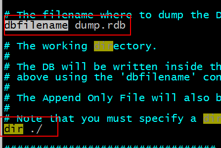
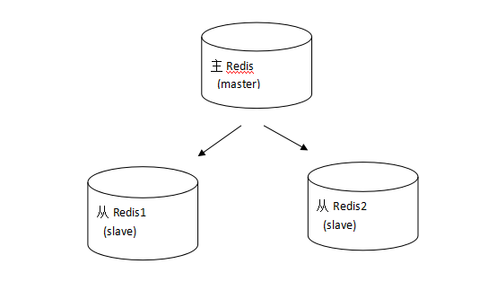
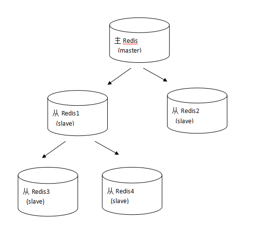
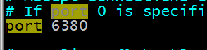

**常用命令**

keys 返回满足给定pattern 的所有key：

```bash
redis 127.0.0.1:6379> keys mylist*
1) "mylist"
2) "mylist5"
3) "mylist6"
4) "mylist7"
5) "mylist8"
```


exists 确认一个key 是否存在 示例：从结果来看，数据库中不存在HongWan 这个key，但是age 这个key 是存在的。

```bash
redis 127.0.0.1:6379> exists HongWan
(integer) 0
redis 127.0.0.1:6379> exists age
(integer) 1
```


del 删除一个key。

```bash
redis 127.0.0.1:6379> del age
(integer) 1
redis 127.0.0.1:6379> exists age
(integer) 0
```


rename 重命名key 示例：age 成功的被我们改名为age_new 了。

```bash
redis 127.0.0.1:6379> keys *
1) "age"
redis 127.0.0.1:6379> rename age age_new
OK
redis 127.0.0.1:6379> keys *
1) "age_new"
```


type 返回值的类型 ，这个方法可以非常简单的判断出值的类型。

```bash
redis 127.0.0.1:6379> type addr
string
redis 127.0.0.1:6379> type myzset2
zset
redis 127.0.0.1:6379> type mylist
list
```


##### 设置key的生存时间

Redis在实际使用过程中更多的用作缓存，然而缓存的数据一般都是需要设置生存时间的，即：到期后数据销毁。

设置key的生存时间：`EXPIRE key seconds`。

```bash
192.168.101.3:7002> set test 1        # 设置test的值为1
OK
192.168.101.3:7002> get test          # 获取test的值
"1"
192.168.101.3:7002> EXPIRE test 5     # 设置test的生存时间为5秒
(integer) 1
```

查看key的生存时间：`TTL key`。

```bash
192.168.101.3:7002> TTL test           # 查看test的生于生成时间还有1秒删除
(integer) 1
192.168.101.3:7002> TTL test
(integer) -2
192.168.101.3:7002> get test            获取test的值，已经删除
(nil)
```

清除生存时间：`PERSIST key`。

生存时间设置单位为毫秒：`PEXPIRE key milliseconds`。


##### 持久化方案

**Rdb方式**

Redis 默认的方式，redis 通过快照方式将数据持久化到磁盘中。

- 可在 redis.conf 中修改持久化快照的条件；

  

- 在 redis.conf 中可以指定持久化文件的存储目录。

  

Rdb的问题在于一旦redis非法关闭，那么会丢失最后一次持久化之后的数据。如果数据不重要，则不必要关心。 如果数据不能允许丢失，那么要使用 aof 方式。

**Aof方式**

Redis 默认是不使用该方式持久化的。Aof 方式的持久化，是操作一次 redis 数据库，则将操作的记录存储到 aof 持久化文件中。

- 第一步：开启 aof 方式持久化方案。 将redis.conf中的appendonly改为yes，即开启aof方式的持久化方案。

  

- Aof文件存储的目录和rdb方式的一样。 Aof文件存储的名称

  

在使用aof和rdb方式时，如果redis重启，则数据从aof文件加载。


##### 主从复制

持久化保证了即使redis服务重启也不会丢失数据，因为redis服务重启后会将硬盘上持久化的数据恢复到内存中，但是当redis服务器的硬盘损坏了可能会导致数据丢失，如果通过redis的主从复制机制就可以避免这种单点故障，如下图：



说明：

- 主redis中的数据有两个副本（replication）即从redis1和从redis2，即使一台redis服务器宕机其它两台redis服务也可以继续提供服务。

- 主redis中的数据和从redis上的数据保持实时同步，当主redis写入数据时通过主从复制机制会复制到两个从redis服务上。

- 只有一个主redis，可以有多个从redis。

- 主从复制不会阻塞master，在同步数据时，master 可以继续处理client 请求

- 一个redis可以即是主又是从，如下图：

  

**主机配置**：无需配置。

**从机配置**：

- 第一步：复制出一个从机 `cp bin/ bin2 -r`；

- 第二步：修改从机的 redis.conf 语法：`slaveof masterip masterport slaveof 192.168.242.137 6379`；

  

- 第三步：修改从机的 port 地址为 6380；

  

- 第四步：清除从机的持久化文件 `rm -rf appendonly.aof dump.rdb`

- 第五步：启动从机 `./redis-server redis.conf`

- 第六步：启动6380的客户端 `./redis-cli -p 6380`

*注意：* 主机一旦发生增删改操作，那么从机会将数据同步到从机中 从机不能执行写操作。