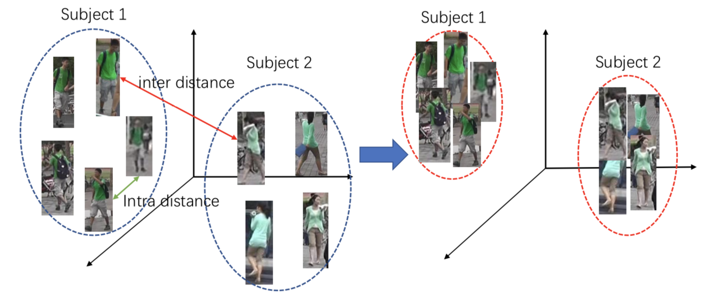

行人重识别要在不同的摄像头间重新识别出相同的人，从技术上讲一个用于视频监控的重识别系统需要由三部分组成：包括行人检测、行人追踪和行人检索。因前两个是独立的计算机视觉任务，所以大多数行人重识别系统研究关注于第三部分。

OIM是第一个引入端到端深度学习框架来同时解决来自检测和重识别两方面的挑战。其中，重识别特征学习发掘了一个改良的softmax损失，早期研究表明这种识别任务极利于特征学习；同时识别任务通过拖开从不同实体分别提取的特征增加了人际间的差异，而验证任务则通过拉拢从相同实体提取的特征减少了个人内的差异。受此启发，softmax损失和对比（contrastive）损失同时被用来特征学习，使得效果比单独使用softmax更好。但是我们无法直接将验证任务引入到OIM中使用的人物搜索FasterRCNN框架，因为出现在每张图像中的行人是随机的、稀疏的、不平衡的，很难在FasterRCNN中组织同样数量的正负行人对。

为解决这个关键问题，我们提出一个新的个体聚合网络（IAN），不仅能准确地定位行人而且能最小化个人变化的特征表达。尤其是IAN构建于最好的目标检测网络如FasterRCNN之上，因此能够为人物搜索以在线的方式产生高质量的行人区域提议。另外，为缓解由同一个体不同视觉外观所引起的负面作用，引入了能够增加特征表达类内紧密度的中心损失。中心表达鼓励从同一类别学到的行人特征共享相似的特征特性。IAN模型能够嵌入到任何基于CNN的人物搜索框架来改善性能。

特别是中心损失无需聚合正负验证样本就能提高类内特征的紧密度。中心损失追踪所有类别的特征中心，并且这些特征中心不断地基于最新观测到的样本进行更新。同时，它设法将样本特征拉向所属类别的中心，如下图所示，左侧是没有中心损失的特征距离，右侧是使用中心损失的特征距离。在模型开发过程中我们发现dropout与中心损失并不兼容，这也是我们的贡献之一。

最终，IAN在CUHK-SYSU人物搜索数据集上达到了77.23%的mAP和80.45%的top-1准确率。