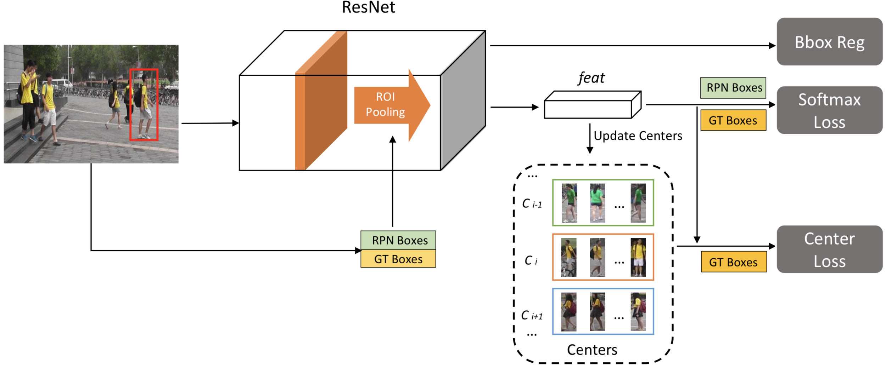

#### 简介

行人重识别要在不同的摄像头间重新识别出相同的人，从技术上讲一个用于视频监控的重识别系统需要由三部分组成：包括行人检测、行人追踪和行人检索。因前两个是独立的计算机视觉任务，所以大多数行人重识别系统研究关注于第三部分。

E2E-PS是第一个引入端到端深度学习框架来同时解决来自检测和重识别两方面的挑战。其中，重识别特征学习发掘了一个改良的softmax损失，早期研究表明这种识别任务极利于特征学习；同时识别任务通过拖开从不同实体分别提取的特征增加了人际间的差异，而验证任务则通过拉拢从相同实体提取的特征减少了个人内的差异。受此启发，softmax损失和对比（contrastive）损失同时被用来特征学习，使得效果比单独使用softmax更好。但是我们无法直接将验证任务引入到E2E-PS中使用的人物搜索FasterRCNN框架，因为出现在每张图像中的行人是随机的、稀疏的、不平衡的，很难在FasterRCNN中组织同样数量的正负行人对。

为解决这个关键问题，我们提出一个新的个体聚合网络（IAN），不仅能准确地定位行人而且能最小化个人变化的特征表达。尤其是IAN构建于最好的目标检测网络如FasterRCNN之上，因此能够为人物搜索以在线的方式产生高质量的行人区域提议。另外，为缓解由同一个体不同视觉外观所引起的负面作用，引入了能够增加特征表达类内紧密度的中心损失。中心表达鼓励从同一类别学到的行人特征共享相似的特征特性。IAN模型能够嵌入到任何基于CNN的人物搜索框架来改善性能。

特别是中心损失无需聚合正负验证样本就能提高类内特征的紧密度。中心损失追踪所有类别的特征中心，并且这些特征中心不断地基于最新观测到的样本进行更新。同时，它设法将样本特征拉向所属类别的中心，如下图所示，左侧是没有中心损失的特征距离，右侧是使用中心损失的特征距离。在模型开发过程中我们发现dropout与中心损失并不兼容，这也是我们的贡献之一。

最终，IAN在CUHK-SYSU人物搜索数据集上达到了77.23%的mAP和80.45%的top-1准确率。

#### 个体聚集网络（IAN）

实际的人物搜索应用中并无法获得行人边界框，因此目标人物需要从整个图像中寻找。面对这个问题，IAN基于最先进的目标检测框架如FasterRCNN，因此能够为人物搜索以在线的形式产生合理的行人区域提议，其框架如下图所示，可以描述为：

1. 在训练阶段，将任意大小带行人真实边界框和和身份的图像输入到残差网络的第一部分。残差网络被分为两个部分，比如对于ResNet101，层Conv1-Res4b构成了第一部分，而层Res5a-Res5c是第二部分；
2. 在第一比分网络产生的特征图之上构建区域提议网络构（RPN）来预测行人边界框（RPN框），RPN通过两个损失层，即锚框分类和锚框回归，使用真实行人边框（GT框）来训练；
3. 所有的候选框（训练时RPN+GT框，测试时RPN框）都被应用ROI池化来为每个候选框产生特征向量，这些特征又被残差网络的第二部分卷积；
4. 分别应用两个分支，一个用于产生最终的特征向量feat来计算特征距离，另一个则产生边界框位置。在训练时，所有候选（RPN+GT）框的特征向量都被输入到softmax损失层，而只有真实（GT）框的特征向量输入到中心损失层。训练使用softmax的变体随机采样softmax（RSS）。

总而言之，与E2E-PS相比，IAN产生更具判别性的特征表达，在FasterRCNN中同时使用softmax损失和中心损失产生比单独的softmax更好的特征表达；同时，E2E-PS中使用的VGGNet包含与中心损失本质无法兼容的dropout层，因此用残差网络来代替也能以更低的计算损失提供更好的判别能力。

**Softmax+中心损失**：紧凑的类内变化和显著的类间差异对判别性特征都是必不可少的。但softmax仅鼓励特征的可分离性；为图像对和三元组构造损失的函数的对比损失和三元损失都可能鼓励类内差异的紧密性，但对比损失需要数量相等的正负样本对，而三元损失则需要三元组的两张图像属于同一类别而最后一张属于不同类别，但基于FasterRCNN的人物搜索框架在输入的批次内构造这样的图像或三元组并不容易，因为一张图像内的行人身份都步相同，每张图像内出现的行人也是随机的、稀疏的、不平衡的；在FasterRCNN的批次内，构造数量平衡的正样本对和负样本对十分困难。

另一方面，应用中心损失能够避免聚集正负样本对，IAN中中心损失与softmax损失一起应用来产生特征表达，中心损失定义为：
$$
\mathcal L_c = \frac12\sum_{i=1}^m \Vert x_i - c_{y_i}\Vert^2
$$
其中$x_i \in \mathbb R^d$是类别属于$y_i$的行人框$i$的特征向量，而$c_{y_i} \in \mathbb R^d$是第$y_i$类别的特征中心。Softmax迫使不同类别的特征疏远，中心损失使相同的特征向中心集聚，因此极大地提升了特征的判别能力，这样整个网络的损失函数为：
$$
\mathcal L = \mathcal L_4 + \mathcal L_c
$$
其中$\mathcal L_4$是FasterRCNN的4个损失函数之和，包含了人物身份分类。理想而言，$c_{y_i}$应该随着网络参数的更新而持续不断更新，也就是说需要考虑整个训练集并在每次迭代中平均每个类别的特征，但这既不高效也不实际。实际上，我们会学习每个每个类别的特征中心。在训练阶段同时更新中心和最小化特征和其对应类别中心的距离。

中心$c_{y_i}$基于每个批次更新，在每个迭代中，中心通过平均对应类别的中心来计算，同时为避免少量误标记样本产生很大扰动，使用一个学习率来控制中心的学习速度。$\mathcal L_c$对应于$x_i$的梯度和$c_{y_i}$的更新公式就是：
$$
\frac{\partial\mathcal L_c}{\partial x_i} = x_i - c_{y_i}\\
\Delta c_j = \frac{\sum_{i=1}^m\delta(y_i=j)\cdot(c_j-x_i)}{1+\sum_{i=1}^m\delta(y_i=j)}
$$
其中条件满足时$\delta(\cdot)=1$，否则为0。

**为何避免dropout**：