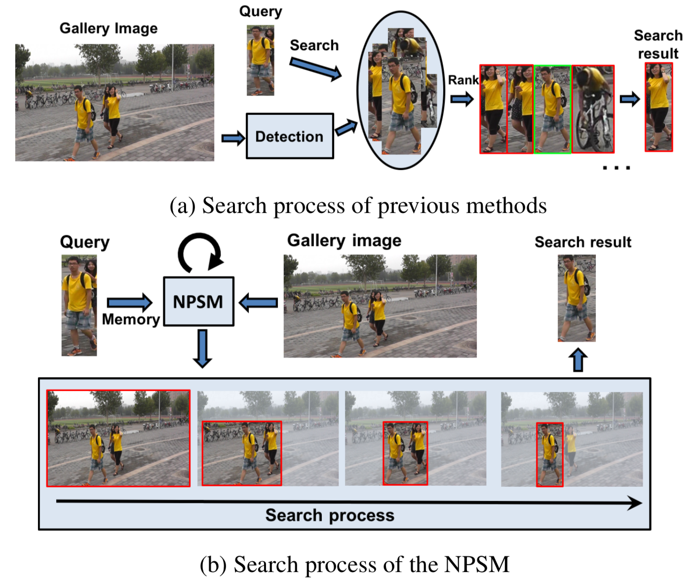

当前所有的人物搜索方法都基于这样一种简单的两阶段搜索策略：首先检测出图像中所有的候选人物，然后详尽对比所有可能的查询和候选对来输出派在第一位的搜索结果。这个流程有几个缺点，首先若目标人物周围有影响因素，比如另一个人同样外观的人，搜索准确率就会受影响；其次两个隔离的网络，即检测和重识别框架会引入额外的误差；如下图a所示：

对于人物搜索，通常可以假定一张图像内目标人物仅出现在一个位置，这样实例层次的排他线索表明与其测试所有可能的人，更有效的策略是以一种由粗到细的方式仅搜索可能包含目标人物的区域。这与人类处理复杂视觉信息的神经系统相似，即在看到并记住目标人物的外观后，我们通常将搜索区域从一个大视野收缩到一个小的区域，并在这个小区域内耗费更多精力来与记忆详细比对。

受此启发，我们提出一个新的更有效人物搜索策略并开发出神经行人搜索机（Neural Person Search Machine，NPSM）。与前面的方法相比，NPSM（如上图b）输入查询人物为记忆来递归地引导模型收缩搜索区域并当前区域是否包含目标人物。这个过程会包含更多对人物搜索有益的上下文线索。为建模这样的人物搜索过程，我们需要解决下面两个难题：1)将查询人物信息作为记忆集成到搜索过程中来排除不可能候选的推理；2)在由粗到细搜索的每个递归步中由记忆引导判断应该关注那个子区域。

要在一个正确并充分发掘上下文信息的序列中定位出目标人物，我们提出一个神经搜索结构来有选择地关注输入区域的一个有效子区域，同时从干扰区域中忽略其他接收的信息，如上图b中NPSM会强调左侧真实匹配的人物而忽略右侧的相似人物。考虑到LSTM部分允许或拒绝信息流入或流出存储成分的独特能力，我们在卷积LSTM（Conv-LSTM）单元上构建神经搜索网络（Neural Search Network，NSN），它能够从空间-时间序列中保存空间信息。

不同与原始Conv-LSTM，我们通过一个包含查询外观信息并帮助在粗层次确认候选区域和忽略无关区域的外部原始存储来强化NSN。这个外部存储因此就能使查询包含在人物搜索的特征学习以及区域收缩的递归搜索过程中。

总体来说我们提出了一个新的基于Conv-LSTM的人物搜索方法NPSM，它包含每个人的上下文信息并应用关于查询人物的外部存储来引导模型关注正确的区域。对人物搜索做出了下面这样的贡献：

1. 重定义人物搜索过程为一个递归关注正确区域的无检测过程；
2. 创造了一个新的受益于上下文信息对干扰信息更稳健的方法；
3. 提出一个能将查询人物信息集成到原始外部存储来引导模型递归关注有效区域的新神经搜索模型。

#### PPSM

模型的整体架构如下图所示，它包含两部分：原始存储和神经搜索网络。我们提出通过递归地从整张图像收缩搜索区域到兴趣人物的精确边框来搜索人物，并且收缩过程中的每个区域都包含最终搜索结果的上下文信息。除了递归使用上下文线索，NPSM提供了从其他

